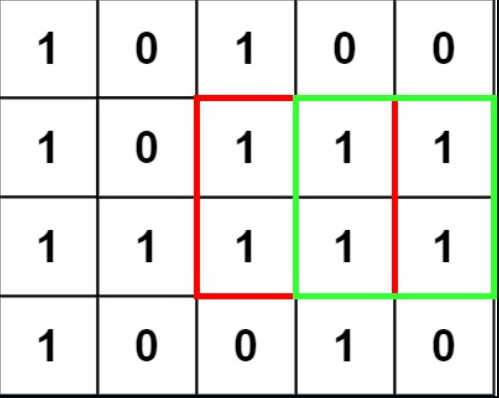
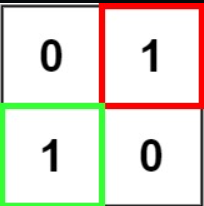
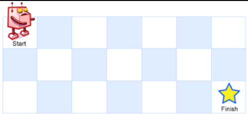
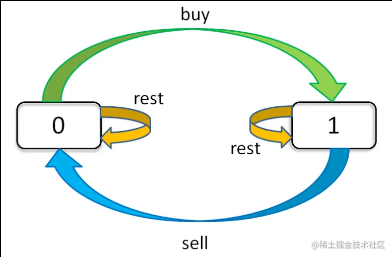
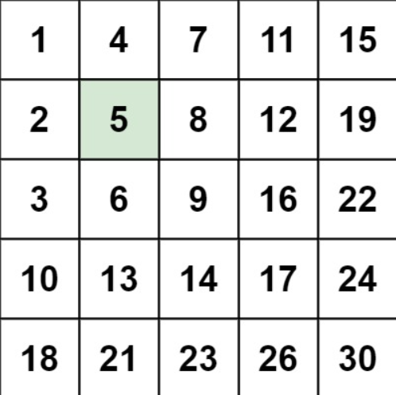
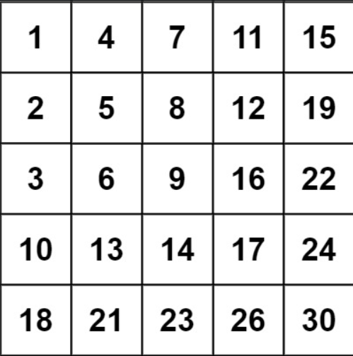

## DP
>找到递推式
>
>步骤基本是： 寻找状态转移方程 => 建立合适的数据结构表 => 填表

### 爬楼梯（简单）
>假设你正在爬楼梯。需要 n 阶你才能到达楼顶。
>
>每次你可以爬 1 或 2 个台阶。你有多少种不同的方法可以爬到楼顶呢？
>
>**示例 1：**
>	输入：n = 2
>	输出：2
>	解释：有两种方法可以爬到楼顶。
>	1. 1 阶 + 1 阶
>	2. 2 阶
>**示例 2：**
>	输入：n = 3
>	输出：3
>	解释：有三种方法可以爬到楼顶。
>	1. 1 阶 + 1 阶 + 1 阶
>	2. 1 阶 + 2 阶
>	3. 2 阶 + 1 阶
>**提示：**
>	1 <= n <= 45

思路：
dp[0] = 0 dp[1] = 1 dp[2] = 2
dp[n] = dp[n-1] + dp[n-2]   // 到达第n阶楼梯有从n-1阶走一步和从第n-2阶走两步两种情况

```js
/**
 * @param {number} n
 * @return {number}
 */
var climbStairs = function(n) {
    let dp = [];
    dp[0] = 0,dp[1] = 1,dp[2] = 2;
    for(let i=3;i <= n;i++){
        dp[i] = dp[i-2] + dp[i-1];
    }
    return dp[n];
};
```

### 打家劫舍（中等）
>你是一个专业的小偷，计划偷窃沿街的房屋。每间房内都藏有一定的现金，影响你偷窃的唯一制约因素就是相邻的房屋装有相互连通的防盗系统，如果两间相邻的房屋在同一晚上被小偷闯入，系统会自动报警。
>
>给定一个代表每个房屋存放金额的非负整数数组，计算你 不触动警报装置的情况下 ，一夜之内能够偷窃到的最高金额。
>
>**示例 1：**
>	输入：[1,2,3,1]
>	输出：4
>	解释：偷窃 1 号房屋 (金额 = 1) ，然后偷窃 3 号房屋 (金额 = 3)。
>	     偷窃到的最高金额 = 1 + 3 = 4 。
>**示例 2：**
>	输入：[2,7,9,3,1]
>	输出：12
>	解释：偷窃 1 号房屋 (金额 = 2), 偷窃 3 号房屋 (金额 = 9)，接着偷窃 5 号房屋 (金额 = 1)。
>	     偷窃到的最高金额 = 2 + 9 + 1 = 12 。
>**提示：**
>	1 <= nums.length <= 100
>	0 <= nums[i] <= 400

```js
/**
 * @param {number[]} nums
 * @return {number}
 */
var rob = function(nums) {
	if(nums.length === 0) return 0;
    if(nums.length === 1) return nums[0];
    if(nums.length === 2) return Math.max(nums[0],nums[1]);
    let dp = [nums[0],Math.max(nums[0],nums[1])];
    for(let i = 2;i < nums.length;i++){
        dp[i] = Math.max(dp[i-1],dp[i-2]+nums[i]);
    }
    return Math.max(dp[nums.length-1],dp[nums.length-2]);
};
```

### 最大正方形（中等）
>在一个由 '0' 和 '1' 组成的二维矩阵内，找到只包含 '1' 的最大正方形，并返回其面积。
>
>**示例1**
>
>输入：matrix = [["1","0","1","0","0"],["1","0","1","1","1"],["1","1","1","1","1"],["1","0","0","1","0"]]
>输出：4
>**示例2**
>
>输入：matrix = [["0","1"],["1","0"]]
>输出：1
>**示例3**
>输入：matrix = [["0"]]
>输出：0
>**提示**
>* m == matrix.length
>* n == matrix[i].length
>* 1 <= m, n <= 300
>* matrix\[i][j] 为 '0' 或 '1'

```js
/** DP 
 * 题目要求最大正方形面积，面积 = 边长 * 边长，也就是求最大正方形的边长
 * 所以也就变成了，在矩阵中找最大正方形，矩阵中只有0｜1两种值，全部为1的才是正方形
 * 如何知道矩阵中哪里是1，哪里是0，只能穷举，但要聪明的穷举，这不就是动态规划的本质嘛！
 * 动态规划第一步，先假象我们创建了一个二维数组dp，用来存储「这个点为右下角的最大正方形的边长」
 * 下面开始找 状态转换方程
 * 思路：假设有如下矩阵
 * 1 0 1 1 1
 * 1 1 1 1 1
 * 1 1 1 1 1
 * 1 0 0 1 1
 * 随便找一个点，直观地，我们先找最右下角的点，设该点的最大正方形边长为 dp[i][j], 我们用肉眼看一下，dp[i][j] 应该等于 2
 * 为什么等于2，是因为我们看了 dp[i-1][j], dp[i-1][j-1], dp[i][j-1] 这三个点都为1，而又因为dp[i][j-2] 为0，所以
 * 我们知道dp[i][j]最大就为2了。也就是我们不能只看dp[i][j]相邻的三个点，而应该看「这三个相邻点为正方形右下角」的边长情况，
 * 取最小边长进行求解 dp[i][j] 的最大正方形边长。（看，我们找到了重叠子问题和最优子结构）
 * 所以，状态转换方程为：dp[i][j] = Math.min(dp[i-1][j], dp[i-1][j-1], dp[i][j-1]) + 1
 * 下一步，需要根据矩阵数据，进行选择和明确 base case 即可
 */
 /**
 * @param {character[][]} matrix
 * @return {number}
 */
var maximalSquare = function(matrix) {
if (!matrix.length) return 0
  
  let maxsqlen = 0
  let rowLength = matrix.length, colLength = matrix[0].length
  for (let row = 0; row < rowLength; row++) {
    for (let col = 0; col < colLength; col++) {
      if (matrix[row][col] === '1') {
        matrix[row][col] = Number(matrix[row][col])
        if (row != 0 && col != 0) {
          matrix[row][col] = Math.min(matrix[row-1][col], matrix[row-1][col-1], matrix[row][col-1]) + 1
        }
        maxsqlen = Math.max(maxsqlen, matrix[row][col])
      } 
    }
  }
  return maxsqlen**2;
};
```

### 零钱兑换（中等）
>给你一个整数数组 coins ，表示不同面额的硬币；以及一个整数 amount ，表示总金额。
>
>计算并返回可以凑成总金额所需的 最少的硬币个数 。如果没有任何一种硬币组合能组成总金额，返回 -1 。
>
>你可以认为每种硬币的数量是无限的。
>**示例 1：**
>
>	输入：coins = [1, 2, 5], amount = 11
>	输出：3 
>	解释：11 = 5 + 5 + 1
>**示例 2：**
>
>	输入：coins = [2], amount = 3
>	输出：-1
>**示例 3：**
>
>	输入：coins = [1], amount = 0
>	输出：0
>**提示：**
>	
>	1 <= coins.length <= 12
>	1 <= coins[i] <= 231 - 1
>	0 <= amount <= 104

```js
//给定不同面额的硬币 coins 和一个总金额 amount。编写一个函数来计算可以凑成总金额所需的最少的硬币个数。如果没有任何一种硬币组合能组成总金额，返回 -1
// dp[0] = 0 金额为零时不需要硬币
// dp[n] = min(dp[n],dp[n-coin1] + 1，dp[n-coin2],...)  金额为n时，硬币数等于(n-coin)+1中所需硬币最少的组合
var coinChange = function(coins, amount) {
    //先新建数组并将里面的数填充成正无穷
    let dp = new Array(amount+1).fill(Infinity);
    dp[0] = 0;
    for(let i=1;i<=amount;i++){
        for(let coin of coins){
            if(i - coin >= 0){
                dp[i] = Math.min(dp[i],dp[i-coin]+1);
            }
        }
    }
    return dp[amount] === Infinity ? -1 : dp[amount];
};
```

### 不同路径（中等）（二维数组创建）
>一个机器人位于一个 m x n 网格的左上角 （起始点在下图中标记为 “Start” ）。
>机器人每次只能向下或者向右移动一步。机器人试图达到网格的右下角（在下图中标记为 “Finish” ）。
>问总共有多少条不同的路径？
>**示例1**
>
>
>	输入：m = 3, n = 7
>	输出：28
>**示例2**
>	输入：m = 3, n = 2
>	输出：3
>	解释：
>	从左上角开始，总共有 3 条路径可以到达右下角。
>	1. 向右 -> 向下 -> 向下
>	2. 向下 -> 向下 -> 向右
>	3. 向下 -> 向右 -> 向下
>**示例 3：**
>
>	输入：m = 7, n = 3
>	输出：28
>**示例 4：**
>
>	输入：m = 3, n = 3
>	输出：6
>**提示：**
>
>	* 1 <= m, n <= 100
>	* 题目数据保证答案小于等于 2 * 109

```js
var uniquePaths = function(m, n) {
    //a[i][j]的的长度等于a[i-1][j]+a[i][j-1]
    if(m===1||n===1) return 1;
    //创建二维数组
    let dp = [],rows = [0];
    for(let i = 0;i < n-1;i++){
        rows.push(1);
    }
    dp.push(rows);
    //[ [ 0, 1, 1 ] ]
    for(let i = 0;i < m-1;i++){
        dp.push([1]);
        //[ [ 0, 1, 1 ] ]
		//[ [ 0, 1, 1 ], [ 1 ] ]
		//[ [ 0, 1, 1 ], [ 1 ], [ 1 ] ]
		//[ [ 0, 1, 1 ], [ 1 ], [ 1 ], [ 1 ] ]
		//[ [ 0, 1, 1 ], [ 1 ], [ 1 ], [ 1 ], [ 1 ] ]
		//[ [ 0, 1, 1 ], [ 1 ], [ 1 ], [ 1 ], [ 1 ], [ 1 ] ]
		//[ [ 0, 1, 1 ], [ 1 ], [ 1 ], [ 1 ], [ 1 ], [ 1 ], [ 1 ] ]
    }
    // dp[1][1]=1;
    for(let i=1;i<m;i++){
        for(let j=1;j<n;j++){
                dp[i][j] = dp[i-1][j]+dp[i][j-1];
        }
    }
    return dp[m-1][n-1];
};
```

### dp解题模板：投票状态机
本文就来告诉你这个框架，然后带着你一道一道秒杀。

这 6 道股票买卖问题是有共性的，我们通过对第四题（限制最大交易次数为 k）的分析一道一道解决。因为第四题是一个最泛化的形式，其他的问题都是这个形式的简化。

第一题是只进行一次交易，相当于 k = 1；第二题是不限交易次数，相当于 k = +infinity（正无穷）；第三题是只进行 2 次交易，相当于 k = 2；剩下两道也是不限次数，但是加了交易「冷冻期」和「手续费」的额外条件，其实就是第二题的变种，都很容易处理。

#### 穷举框架
首先，还是一样的思路：如何穷举？这里的穷举思路和上篇文章递归的思想不太一样。

递归其实是符合我们思考的逻辑的，一步步推进，遇到无法解决的就丢给递归，一不小心就做出来了，可读性还很好。缺点就是一旦出错，你也不容易找到错误出现的原因。比如上篇文章的递归解法，肯定还有计算冗余，但确实不容易找到。

而这里，我们不用递归思想进行穷举，而是利用「状态」进行穷举。我们具体到每一天，看看总共有几种可能的「状态」，再找出每个「状态」对应的「选择」。我们要穷举所有「状态」，穷举的目的是根据对应的「选择」更新状态。听起来抽象，你只要记住「状态」和「选择」两个词就行，下面实操一下就很容易明白了。
```js
for 状态1 in 状态1的所有取值：
    for 状态2 in 状态2的所有取值：
        for ...
            dp[状态1][状态2][...] = 择优(选择1，选择2...)
```
比如说这个问题，**每天都有三种「选择」**：买入、卖出、无操作，我们用 buy, sell, rest 表示这三种选择。但问题是，并不是每天都可以任意选择这三种选择的，因为 sell 必须在 buy 之后，buy 必须在 sell 之后。那么 rest 操作还应该分两种状态，一种是 buy 之后的 rest（持有了股票），一种是 sell 之后的 rest（没有持有股票）。而且别忘了，我们还有交易次数 k 的限制，就是说你 buy 还只能在 k > 0 的前提下操作。

很复杂对吧，不要怕，我们现在的目的只是穷举，你有再多的状态，老夫要做的就是一把梭全部列举出来。**这个问题的「状态」有三个**，第一个是天数，第二个是允许交易的最大次数，第三个是当前的持有状态（即之前说的 rest 的状态，我们不妨用 1 表示持有，0 表示没有持有）。然后我们用一个三维数组就可以装下这几种状态的全部组合：
```js
dp[i][k][0 or 1]
0 <= i <= n-1, 1 <= k <= K
n 为天数，大 K 为最多交易数
此问题共 n × K × 2 种状态，全部穷举就能搞定。

for 0 <= i < n:
    for 1 <= k <= K:
        for s in {0, 1}:
            dp[i][k][s] = max(buy, sell, rest)
```
而且我们可以用自然语言描述出每一个状态的含义，比如说 dp[3][2][1] 的含义就是：今天是第三天，我现在手上持有着股票，至今最多进行 2 次交易。再比如 dp[2][3][0] 的含义：今天是第二天，我现在手上没有持有股票，至今最多进行 3 次交易。很容易理解，对吧？

我们想求的最终答案是 dp[n - 1][K][0]，即最后一天，最多允许 K 次交易，最多获得多少利润。读者可能问为什么不是 dp[n - 1][K][1]？因为 [1] 代表手上还持有股票，[0] 表示手上的股票已经卖出去了，很显然后者得到的利润一定大于前者。

记住如何解释「状态」，一旦你觉得哪里不好理解，把它翻译成自然语言就容易理解了。
#### 状态转移框架
现在，我们完成了「状态」的穷举，我们开始思考每种「状态」有哪些「选择」，应该如何更新「状态」。只看「持有状态」，可以画个状态转移图。

通过这个图可以很清楚地看到，每种状态（0 和 1）是如何转移而来的。根据这个图，我们来写一下状态转移方程：
```js
dp[i][k][0] = max(dp[i-1][k][0], dp[i-1][k][1] + prices[i])
              max(   选择 rest  ,           选择 sell      )

解释：今天我没有持有股票，有两种可能：
要么是我昨天就没有持有，然后今天选择 rest，所以我今天还是没有持有；
要么是我昨天持有股票，但是今天我 sell 了，所以我今天没有持有股票了。

dp[i][k][1] = max(dp[i-1][k][1], dp[i-1][k-1][0] - prices[i])
              max(   选择 rest  ,           选择 buy         )

解释：今天我持有着股票，有两种可能：
要么我昨天就持有着股票，然后今天选择 rest，所以我今天还持有着股票；
要么我昨天本没有持有，但今天我选择 buy，所以今天我就持有股票了。
```
这个解释应该很清楚了，如果 buy，就要从利润中减去 prices[i]，如果 sell，就要给利润增加 prices[i]。今天的最大利润就是这两种可能选择中较大的那个。而且注意 k 的限制，我们在选择 buy 的时候，把 k 减小了 1，很好理解吧，当然你也可以在 sell 的时候减 1，一样的。

现在，我们已经完成了动态规划中最困难的一步：状态转移方程。**如果之前的内容你都可以理解，那么你已经可以秒杀所有问题了，只要套这个框架就行了**。不过还差最后一点点，就是定义 base case，即最简单的情况。

**如果你最多只允许完成一笔交易（即买入和卖出一支股票一次），设计一个算法来计算你所能获取的最大利润。**
```js
var maxProfit = function(prices) {
    let dp_i_0 = 0,dp_i_1 = -Infinity;
    for(let i = 0;i < prices.length;i++){
        dp_i_0 = Math.max(dp_i_0,dp_i_1+prices[i]);
        dp_i_1 = Math.max(dp_i_1,-prices[i]);
    }
    return dp_i_0;
};
```
#### 买卖股票的最佳时机 II
```js
1. 只要股票价格上涨，上涨的部分就是我的利润，可以理解为上涨期间第一天买入，然后一直持有到上涨最后一天即下跌前一天再卖出
2. 只要股票价格下跌，那我肯定在下跌前一天卖了，而且下跌期间永远不会买入
var maxProfit = function(prices) {
  let profit = 0;
  for (let i = 0; i < prices.length - 1; i++) {
    if (prices[i + 1] > prices[i]) profit += prices[i + 1] - prices[i];
  }
  return profit;
};
```
## 贪心
>在对问题求解时，总是做出在当前看来是最好的选择。也就是说，不从整体最优上加以考虑，他所做出的是在某种意义上的局部最优解最优解

### 剪绳子（中等）
>给你一根长度为 n 的绳子，请把绳子剪成整数长度的 m 段（m、n都是整数，n>1并且m>1），每段绳子的长度记为 k[0],k[1]...k[m-1] 。请问 k[0]*k[1]*...*k[m-1] 可能的最大乘积是多少？例如，当绳子的长度是8时，我们把它剪成长度分别为2、3、3的三段，此时得到的最大乘积是18。
>
>**示例 1：**
>	
>	输入: 2
>	输出: 1
>	解释: 2 = 1 + 1, 1 × 1 = 1
>**示例 2:**
>	
>	输入: 10
>	输出: 36
>	解释: 10 = 3 + 3 + 4, 3 × 3 × 4 = 36
>**提示：**
>	
>	2 <= n <= 58

```js
整除四舍五入: X=Math.round(A/B)      
整除向上取整: X=Math.ceil(A/B)
整除向下取整: X=Math.floor(A/B)
小数点后保留n位: X=X.toFixed(n)
/**
 * @param {number} n
 * @return {number}
 */
var cuttingRope = function(n) {
   let maxmulti = 1;
    if(n === 2 || n === 3) 
        return n - 1;
    for(let i=2;i<=n/2;i++){
        let k = Math.round(n/i);
        kmulti = (k**(i-1))*(n-k*(i-1));
        if(kmulti>maxmulti)
            maxmulti = kmulti;
    }
    return maxmulti;
};
```

### 跳跃游戏（中等）
>给定一个非负整数数组 nums ，你最初位于数组的 第一个下标 。
>数组中的每个元素代表你在该位置可以跳跃的最大长度。
>判断你是否能够到达最后一个下标。
>	
>**示例 **1：
>	
>	输入：nums = [2,3,1,1,4]
>	输出：true
>	解释：可以先跳 1 步，从下标 0 到达下标 1, 然后再从下标 1 跳 3 步到达最后一个下标。
>**示例 **2：
>	
>	输入：nums = [3,2,1,0,4]
>	输出：false
>	解释：无论怎样，总会到达下标为 3 的位置。但该下标的最大跳跃长度是 0 ， 所以永远不可能到达最后一个下标。
>**提示：**
>	
>	1 <= nums.length <= 3 * 104
>	0 <= nums[i] <= 105

```js
1. 使用一个变量保存当前可到达的最大位置
2. 时刻更新最大位置
3. 可达位置小于数组长度返回false，反之即反
var canJump = function(nums) {
    let k = 0;
    for(let i = 0;i < nums.length;i++){
        if(i > k) return false;
        k = Math.max(k,i + nums[i]);
    }
    return true;
};
```
### 加油站(中等)
>在一条环路上有 n 个加油站，其中第 i 个加油站有汽油 gas[i] 升。
>
>你有一辆油箱容量无限的的汽车，从第 i 个加油站开往第 i+1 个加油站需要消耗汽油 cost[i] 升。你从其中的一个加油站出发，开始时油箱为空。
>
>给定两个整数数组 gas 和 cost ，如果你可以绕环路行驶一周，则返回出发时加油站的编号，否则返回 -1 。如果存在解，则 保证 它是 唯一 的。
>
>**示例 1:**
>
>	输入: gas = [1,2,3,4,5], cost = [3,4,5,1,2]
>	输出: 3
>	解释:
>	从 3 号加油站(索引为 3 处)出发，可获得 4 升汽油。此时油箱有 = 0 + 4 = 4 升汽油
>	开往 4 号加油站，此时油箱有 4 - 1 + 5 = 8 升汽油
>	开往 0 号加油站，此时油箱有 8 - 2 + 1 = 7 升汽油
>	开往 1 号加油站，此时油箱有 7 - 3 + 2 = 6 升汽油
>	开往 2 号加油站，此时油箱有 6 - 4 + 3 = 5 升汽油
>	开往 3 号加油站，你需要消耗 5 升汽油，正好足够你返回到 3 号加油站。
>	因此，3 可为起始索引。
>**示例 2:**
>
>	输入: gas = [2,3,4], cost = [3,4,3]
>	输出: -1
>	解释:
>	你不能从 0 号或 1 号加油站出发，因为没有足够的汽油可以让你行驶到下一个加油站。
>	我们从 2 号加油站出发，可以获得 4 升汽油。 此时油箱有 = 0 + 4 = 4 升汽油
>	开往 0 号加油站，此时油箱有 4 - 3 + 2 = 3 升汽油
>	开往 1 号加油站，此时油箱有 3 - 3 + 3 = 3 升汽油
>	你无法返回 2 号加油站，因为返程需要消耗 4 升汽油，但是你的油箱只有 3 升汽油。
>	因此，无论怎样，你都不可能绕环路行驶一周。
>**提示:**
>
>	gas.length == n
>	cost.length == n
>	1 <= n <= 105
>	0 <= gas[i], cost[i] <= 104
```js
1. gas - cost >= 0才能绕场一周，以此思想判断能否行驶一周
2. 从正确初始位置开始，拥有的汽油总是比消耗的汽油多,以此思想寻找初始位置
var canCompleteCircuit = function(gas, cost) {
    let cur = 0,total = 0,start = 0;
    for(let i = 0;i < gas.length;i++){
        total += gas[i] - cost[i];
        if(cur < 0){
            cur = gas[i] - cost[i];
            start = i;
        }else cur += gas[i] - cost[i];
    }
    return total >= 0 ? start : -1;
};
```

## 二分
>针对有序数列进行查找时，优先考虑二分

### 输入一个非递减排序的数组的一个旋转，输出旋转数组的最小元素
```js
// 例如数组{3,4,5,1,2}为{1,2,3,4,5}的一个旋转，该数组的最小值为1。
// NOTE：给出的所有元素都大于0，若数组大小为0，请返回0。
//把一个数组最开始的若干个元素搬到数组的末尾，我们称之为数组的旋转。
//10111

1. 原数据为旋转数组，所以分界点前后都是有序的
2. 进行二分查找，注意因为找最小值，high赋值时应该从mid开始取，mid可能是最小值
function minNumberInRotateArray(rotateArray)
{
    if(!rotateArray.length) return 0;
    let left = 0,right = rotateArray.length-1;
    while(left < right){
        let mid = Math.floor((right+left) >> 1);
        if(rotateArray[left] <= rotateArray[right]){
            return rotateArray[left];
        }
        if(rotateArray[left] < rotateArray[mid]){
            left = mid + 1;
        }else if(rotateArray[right] > rotateArray[mid]){
            right = mid;
        }else{
            left++;
        }
    }
}
```

### 统计一个数字在排序数组中出现的次数
```js
//找到第一个相等的数，分别往左和往右找。
function GetNumberOfK(data, k)
{
    let low = 0,high = data.length-1;
    let pos,count = 0;
    while(low < high){
        let mid = Math.floor((low+high)>>1);
        if(data[mid] === k){
            pos = mid;
            break;
        }else if(data[mid] < k){
            low = mid + 1;
        }else{
            high = mid-1;
        }
    }
    if(pos !== undefined){
        count++;
        let left = pos,right = pos;
        while(left--){
            if(data[left] === k){
                count++;
            }else{
                break;
            }
        }
        while(right++){
            if(data[right] === k){
                count++;
            }else{
                break;
            }
        }
        return count;
    }else return 0;
}
```
###　0～n-1中缺失的数字
>一个长度为n-1的递增排序数组中的所有数字都是唯一的，并且每个数字都在范围0～n-1之内。在范围0～n-1内的n个数字中有且只有一个数字不在该数组中，请找出这个数字。
>**示例 1:**
>	
>	输入: [0,1,3]
>	输出: 2
>**示例 2:**
>	
>	输入: [0,1,2,3,4,5,6,7,9]
>	输出: 8
>**限制：**
>	
>	1 <= 数组长度 <= 10000

```js
var missingNumber = function(nums) {
    let left = 0,right = nums.length-1;
    while (left <= right) {
        let mid = Math.floor((left + right) / 2);
        if (mid === nums[mid]) {
            left = mid + 1;
        } else if (mid < nums[mid]) {
            right = mid - 1;
        }
    }
    return left;
};
```
### 最长上升子序列
>给你一个整数数组 nums ，找到其中最长严格递增子序列的长度。
>
>子序列 是由数组派生而来的序列，删除（或不删除）数组中的元素而不改变其余元素的顺序。>例如，[3,6,2,7] 是数组 [0,3,1,6,2,2,7] 的子序列。
>**示例 1：**
>	
>	输入：nums = [10,9,2,5,3,7,101,18]
>	输出：4
>	解释：最长递增子序列是 [2,3,7,101]，因此长度为 4 。
>**示例 2：**
>	
>	输入：nums = [0,1,0,3,2,3]
>	输出：4
>**示例 3：**
>	
>	输入：nums = [7,7,7,7,7,7,7]
>	输出：1
>**提示：**
>	
>	1 <= nums.length <= 2500
>	-104 <= nums[i] <= 104
>**进阶：**
>	
>	你能将算法的时间复杂度降低到 O(n log(n)) 吗?

```js
1. 维护一个子序列存放当前的上升序列
2. 将当前数与子序列最大值比较，如果比最大值大之间加入队尾，如果更新则找一个合适的位置替换当前位置的元素
var lengthOfLIS = function(nums) {
    let n = nums.length;
    if(n == 1){
        return n;
    }
    let tail = [nums[0]];
    for(let i = 0;i < n;i++){
        if(nums[i] > tail[tail.length-1]){
            tail.push(nums[i]);
        }else{
            let left = 0;
            let right = tail.length-1;
            while(left < right){
                let mid = (left + right) >> 1;
                if(tail[mid] < nums[i]){
                    left = mid + 1;
                }else{
                    right = mid;
                }
            }
            tail[left] = nums[i];
        }
    }
    return tail.length;
};
```

### 搜索二维矩阵 II
>编写一个高效的算法来搜索 m x n 矩阵 matrix 中的一个目标值 target 。该矩阵具有以下特性：
>	* 每行的元素从左到右升序排列。
>	* 每列的元素从上到下升序排列。
>**示例1：**
>
>输入：matrix = [[1,4,7,11,15],[2,5,8,12,19],[3,6,9,16,22],[10,13,14,17,24],[18,21,23,26,30]], target = 5
>输出：true
>**示例2**
>
>输入：matrix = [[1,4,7,11,15],[2,5,8,12,19],[3,6,9,16,22],[10,13,14,17,24],[18,21,23,26,30]], target = 20
>输出：false
>**提示：**
>	
>	* m == matrix.length
>	* n == matrix[i].length
>	* 1 <= n, m <= 300
>	* -109 <= matrix[i][j] <= 109
>	* 每行的所有元素从左到右升序排列
>	* 每列的所有元素从上到下升序排列
>	* -109 <= target <= 109

```js
输入这样的一个二维数组和一个整数，判断数组中是否含有该整数。
1. 选取左下角的值作为初始值key
2. 如果目标值大于key，因为是最左边的值（最小），所以col++
3. 如果目标值小于，那么更小的值只可能是上一行，所以row--
var searchMatrix = function(matrix, target) {
    let rows = matrix.length;
    if(rows <= 0) return false;
    let cols = matrix[0].length;
    if(cols <= 0) return false;
    let row = rows - 1;
    let col = 0;
    while(row >= 0 && col < cols){
        if(matrix[row][col] > target){
            row--;
        }else if(matrix[row][col] < target){
            col++;
        }else{
            return true;
        }
    }
    return false;
};
```

### Pow(x, n)
>实现 pow(x, n) ，即计算 x 的整数 n 次幂函数（即，xn ）。
>**示例 1：**
>	
>	输入：x = 2.00000, n = 10
>	输出：1024.00000
>**示例 2：**
>	
>	输入：x = 2.10000, n = 3
>	输出：9.26100
>**示例 3：**
>	
>	输入：x = 2.00000, n = -2
>	输出：0.25000
>	解释：2-2 = 1/22 = 1/4 = 0.25
>**提示：**
>	
>	* -100.0 < x < 100.0
>	* -231 <= n <= 231-1
>	* n 是一个整数
>	* -104 <= xn <= 104

```js
var myPow = function(x, n) {
    if (!x) return 0;
    if (x === 1) return 1;
    if (x === -1) return (n & 1) ? -1 : 1;
    if (n == 2147483647) return 0;
    if (n == -2147483648) return x === 2 ? 0 : 1;
    if (n < 0) {
        x = 1 / x;
        n = -n;
    }
    let res = 1;
    while(n) {
        if (n & 1) res *= x;
        x *= x;
        n >>= 1;
    }
    return res;
};
```

### 求交集
```js
function intersection(...args){
	if(!args.length) return [];
    let res = [],left = args[0][0],right = args[0][1];
    for(let i = 1;i < args.length;i++){
       if(right >= args[i][0] || left <= args[i][1]){
         left = Math.max(left,args[i][0]);
         right = Math.min(right,args[i][1]);
         res = [left,right];
       }else{
        return [];
       }
     }
   return res;
}
```

## 回溯
>思路：
>1. 全局变量：保存结果
>2. 参数：递归函数的参数选择，通常是两种参数。
>	* 状态变量： result需要保存的值
>	* 条件变量： 判断搜索是否完毕以及搜索是否合法
>3. 完成条件： 完成条件是决定状态变量和条件变量取何值时可以判断整个搜索流程结束。整个搜索流程结束有两个含义：搜索成功并保存结果何搜索失败并返回上一次状态。
>4. 递归过程： 传递当前状态给下一次递归进行搜索。

```js
//模板
let res = [];   //存储结果

function backtrack(path,condition,...){
    if(judge(condition)){  //满足条件
        res.push(path);
        return;
    }
    for(let select of selectList){
        if(剪枝条件) break;
        path.push(select);  // 走某条路
        backtrack(path,newSelectList);
        path.pop(); //返回上一个十字路口
    }
}

```

适用场景:
1. 排列，组合
2. 数组，字符串，给定一个特定的规则，尝试找到某个解
3. 二维数组下的DFS搜索

怎么套用模板:
我筛选了leetCode中hot和面试常考题库中关于回溯的题目，题目由易到难，覆盖每个使用场景。

### 子集（中等）
>给你一个整数数组 nums ，数组中的元素 互不相同 。返回该数组所有可能的子集（幂集）。
>	解集 不能 包含重复的子集。你可以按 任意顺序 返回解集。
>**示例 1：**
>	
>	输入：nums = [1,2,3]
>	输出：[[],[1],[2],[1,2],[3],[1,3],[2,3],[1,2,3]]
>**示例 2：**
>	
>	输入：nums = [0]
>	输出：[[],[0]]
>**提示：**
>	
>	1 <= nums.length <= 10
>	-10 <= nums[i] <= 10
>	nums 中的所有元素 互不相同

```JS
1. 定义res数组存储结果
2. 每个子集为状态变量，集合的元素个数为条件变量
3. 子集的元素数量小于等于集合的元素数量为限制条件，满足条件时添加到结果数组，否则回退到上一步
4. 下一层搜索的集合需要去掉已添加到状态变量中的元素

var subsets = function(nums) {
    let res = [];
    let n = nums.length;
    function back(path,i){
        if(i <= n){
            res.push(path);
        }
        for(let j = i;j < n;j++){
            path.push(nums[j]);
            back(path.slice(0),j+1);//slice(0)对原始数组做一个深拷贝，防止sort等函数修改到原数组
            path.pop();
        }
    }
    back([],0);
    return res;
};
```

### 全排列（中等）
>给定一个不含重复数字的数组 nums ，返回其 所有可能的全排列 。你可以 按任意顺序 返回答案。
>**示例 1：**
>	
>	输入：nums = [1,2,3]
>	输出：[[1,2,3],[1,3,2],[2,1,3],[2,3,1],[3,1,2],[3,2,1]]
>	示例 2：
>				
>	输入：nums = [0,1]
>	输出：[[0,1],[1,0]]
>**示例 3：**
>	
>	输入：nums = [1]
>	输出：[[1]]
>**提示：**
>	
>	1 <= nums.length <= 6
>	-10 <= nums[i] <= 10
>	nums 中的所有整数 互不相同

```js
var permute = function(nums) {
    let len = nums.length;
    let res = [];
    function back(path){
        if(path.length===len){
            res.push(path);
            return;
        }
        for(let i=0;i < len;i++){
            if(path.indexOf(nums[i]) === -1){	//这里的判断很精髓
                path.push(nums[i]);
                back(path.slice(0));
                path.pop();
            }
        }
    }
    back([]);
    return res;
};
```
### 组合总和
>给你一个 无重复元素 的整数数组 candidates 和一个目标整数 target ，找出 candidates 中可以使数字和为目标数 target 的 所有 不同组合 ，并以列表形式返回。你可以按 任意顺序 返回这些组合。
>
>candidates 中的 同一个 数字可以 无限制重复被选取 。如果至少一个数字的被选数量不同，则两种组合是不同的。 
>
>对于给定的输入，保证和为 target 的不同组合数少于 150 个。
>**示例 1：**
>	
>	输入：candidates = [2,3,6,7], target = 7
>	输出：[[2,2,3],[7]]
>	解释：
>	2 和 3 可以形成一组候选，2 + 2 + 3 = 7 。注意 2 可以使用多次。
>	7 也是一个候选， 7 = 7 。
>	仅有这两种组合。
>**示例 2：**
>	
>	输入: candidates = [2,3,5], target = 8
>	输出: [[2,2,2,2],[2,3,3],[3,5]]
>**示例 3：**
>	
>	输入: candidates = [2], target = 1
>	输出: []
>**提示：**
>	
>	1 <= candidates.length <= 30
>	2 <= candidates[i] <= 40
>	candidates 的所有元素 互不相同
>	1 <= target <= 40

```js
var combinationSum = function(candidates, target) {
    let res = [];
    let len = candidates.length;
    //这里排序是为了防止在for循环if判断时直接跳出了，比如这样的样例[8,7,4,3],11
    candidates.sort((x,y) => x-y);
    function back(path,i,tar){
        if(tar === 0){
            res.push(path);
            return;
        }
        for(let j = i;j < len;j++){
            //判断是否当前的路口都是通向死路
            if(tar < candidates[j]) break;          
            path.push(candidates[j]);
            back(path.slice(),j,tar-candidates[j]);
            path.pop();
        }
    }
    back([],0,target);
 
    return res;
};
```
