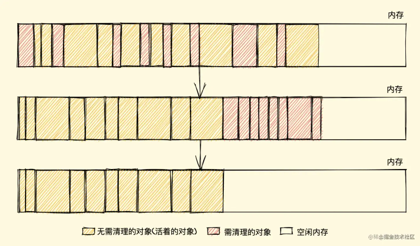
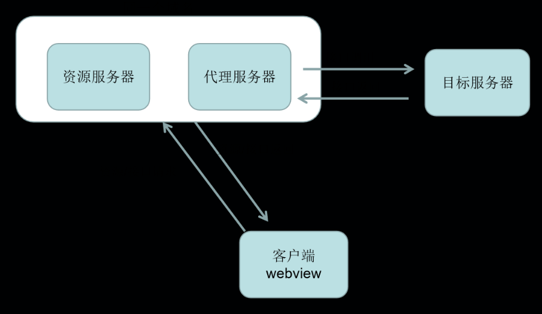
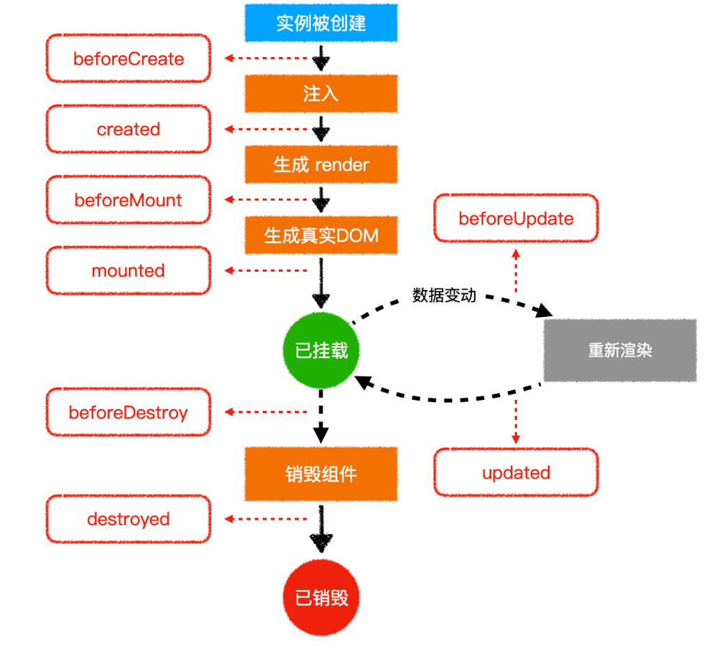
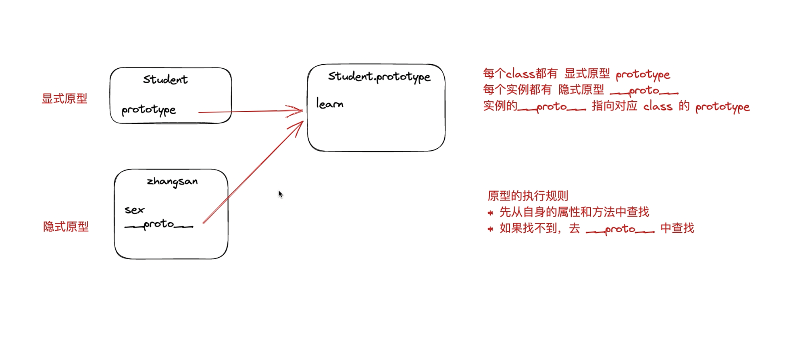

## 1. HTML面试题

### 1.1 如何理解html语义化
* 让人更容易读懂（增加代码可读性）。
* 让搜索引擎更容易读懂，有助于爬虫抓取更多的有效信息，爬虫依赖于标签来确定上下文和各个关键字的权重（SEO）。
* 在没有 CSS 样式下，页面也能呈现出很好地内容结构、代码结构。

### 1.2 script 标签中 defer 和 async 的区别？
* script ：会阻碍 HTML 解析，只有下载好并执行完脚本才会继续解析 HTML。
* async script ：解析 HTML 过程中进行脚本的异步下载，下载成功立马执行，有可能会阻断 HTML 的解析。
* defer script：完全不会阻碍 HTML 的解析，解析完成之后再按照顺序执行脚本。

下图清晰地展示了三种 script 的过程：


### 1.3 从浏览器地址栏输入 url 到请求返回发生了什么
1. 输入 URL 后解析出协议、主机、端口、路径等信息，并构造一个 HTTP 请求。
	* 强缓存。
	* 协商缓存。
2. DNS 域名解析。
3. TCP连接
>总是要问：为什么需要三次握手，两次不行吗？其实这是由 TCP 的自身特点可靠传输决定的。客户端和服务端要进行可靠传输，那么就需要确认双方的接收和发送能力。第一次握手可以确认客服端的发送能力，第二次握手，确认了服务端的发送能力和接收能力，所以第三次握手才可以确认客户端的接收能力。不然容易出现丢包的现象。

4. http 请求。
5. 服务器处理请求并返回 HTTP 报文。
6. 浏览器渲染页面。

## 2. CSS面试题
### 2.1 盒模型介绍
CSS3 中的盒模型有以下两种：标准盒模型、IE（替代）盒模型。
两种盒子模型都是由 content + padding + border + margin 构成，其大小都是由 content + padding + border 决定的，但是盒子内容宽/高度（即 width/height）的计算范围根据盒模型的不同会有所不同：
* 标准盒模型：只包含 content 。
* IE（替代）盒模型：content + padding + border 。

可以通过 box-sizing 来改变元素的盒模型：
* box-sizing: content-box ：标准盒模型（默认值）。
* box-sizing: border-box ：IE（替代）盒模型。

### 2.2 css 选择器和优先级
常规来说，大家都知道样式的优先级一般为 !important > style > id > class > 标签 ，但是涉及多类选择器作用于同一个元素时候怎么判断优先级呢？相信我，你在改一些第三方库（比如 antd 😂）样式时，理解这个会帮助很大！

优先级是由 A 、B、C、D 的值来决定的，其中它们的值计算规则如下：
1. 如果存在内联样式，那么 A = 1, 否则 A = 0;
2. B 的值等于 ID选择器（#id） 出现的次数;
3. C 的值等于 类选择器（.class） 和 属性选择器（a[href="https://example.org"]） 和 伪类（:first-child） 出现的总次数;
4. D 的值等于 标签选择器（h1,a,div） 和 伪元素（::before,::after） 出现的总次数 。

从左至右比较，如果是样式优先级相等，取后面出现的样式。

### 2.3 重排（reflow）和重绘（repaint）的理解
简单地总结下两者的概念：
* 重排：无论通过什么方式影响了元素的几何信息(元素在视口内的位置和尺寸大小)，浏览器需要重新计算元素在视口内的几何属性，这个过程叫做重排。
* 重绘：通过构造渲染树和重排（回流）阶段，我们知道了哪些节点是可见的，以及可见节点的样式和具体的几何信息(元素在视口内的位置和尺寸大小)，接下来就可以将渲染树的每个节点都转换为屏幕上的实际像素，这个阶段就叫做重绘。

如何减少重排和重绘？
* 最小化重绘和重排，比如样式集中改变，使用添加新样式类名 .class 或 cssText 。
批量操作 DOM，比如读取某元素 offsetWidth 属性存到一个临时变量，再去使用，而不是频* 繁使用这个计算属性；又比如利用 document.createDocumentFragment() 来添加要被添加的节点，处理完之后再插入到实际 DOM 中。
* 使用 **absolute** 或 **fixed** 使元素脱离文档流，这在制作复杂的动画时对性能的影响比较明显。
* 开启 GPU 加速，利用 css 属性 transform 、will-change 等，比如改变元素位置，我们使用 translate 会比使用绝对定位改变其 left 、top 等来的高效，因为它不会触发重排或重绘，transform 使浏览器为元素创建⼀个 GPU 图层，这使得动画元素在一个独立的层中进行渲染。当元素的内容没有发生改变，就没有必要进行重绘。

1. 渲染过程：DOM树（HTML）& CSSOM （CSS） 结合生成渲染树；回流（Layout）得到节点的几何信息（大小和位置）；重绘（Painting）得到节点的绝对像素，将渲染树的每个节点都转换为屏幕上的实际像素；展示。
2. 渲染树只包含可见节点， 一些不会渲染输出的节点，比如 script、meta、link 等 和 设置 display:none 的节点不会出现在渲染树中。但是利用 visibility 和 opacity 隐藏的节点会显示在渲染树上。
3. 当页面布局和几何信息发生变化的时候，就需要回流。如新增 DOM，元素尺寸变化，窗口大小变化等。回流一定会触发重绘，而重绘不一定会回流。
4. 大多数浏览器都会通过队列化修改并批量执行来优化重排过程。当你获取布局信息的操作的时候，会强制队列刷新。
5. 减少回流和重绘：1）修改样式的时候通过 css 类名修改或通过 cssText 修改。2）DOM 元素离线修改—>隐藏元素，应用修改，重新显示。（浏览器本身也会有优化）3）避免触发同步布局事件，如获取 offsetWidth 等属性值，因为会强制浏览器刷新队列。4）使用绝对定位让复杂动画脱离文档流减少父元素以及后续元素频繁的回流。5）使用css3硬件加速，可以让 transform、opacity、filters、will-change 这些动画不会引起回流重绘 （会提高内存占用）。

### 2.4 对 BFC 的理解
BFC（Block Formatting Contexts） 即块级格式上下文，根据盒模型可知，每个元素都被定义为一个矩形盒子，然而盒子的布局会受到尺寸，定位，盒子的子元素或兄弟元素，视口的尺寸等因素决定，所以这里有一个浏览器计算的过程，计算的规则就是由一个叫做视觉格式化模型的东西所定义的，BFC 就是来自这个概念，它是 CSS 视觉渲染的一部分，用于决定块级盒的布局及浮动相互影响范围的一个区域。

BFC 具有一些特性：
1. 块级元素会在垂直方向一个接一个的排列，和文档流的排列方式一致。
2. 在 BFC 中上下相邻的两个容器的 margin  会重叠，创建新的 BFC 可以避免外边距重叠。
3. 计算 BFC 的高度时，需要计算浮动元素的高度。
4. BFC 区域不会与浮动的容器发生重叠。
5. BFC 是独立的容器，容器内部元素不会影响外部元素。
6. 每个元素的左 margin  值和容器的左 border  相接触。

利用这些特性，我们可以解决以下问题：
* 利用 4  和 6 ，我们可以实现三栏（或两栏）自适应布局。
* 利用 2 ，我们可以避免 margin  重叠问题。
* 利用 3 ，我们可以避免高度塌陷。

创建 BFC 的方式：
* 绝对定位元素（position 为 absolute 或 fixed ）。
* 行内块元素，即 display 为 inline-block 。
* overflow 的值不为 visible 。

* 根元素（\<html>）
* 浮动元素（float 不为 none）
* 绝对定位元素（position 为 absolute 或 fixed）
* 表格的标题和单元格（display 为 table-caption，table-cell）
* 匿名表格单元格元素（display 为 table 或 inline-table）
* 行内块元素（display 为 inline-block）
* overflow 的值不为 visible 的元素
* 弹性元素（display 为 flex 或 inline-flex 的元素的直接子元素）
* 网格元素（display 为 grid 或 inline-grid 的元素的直接子元素）


### 2.5 实现两栏布局（左侧固定 + 右侧自适应布局）
现在有以下 DOM 结构：
```html
<div class="outer">
  <div class="left">左侧</div>
  <div class="right">右侧</div>
</div>
```
1. 利用浮动，左边元素宽度固定 ，设置向左浮动。将右边元素的 margin-left 设为固定宽度 。注意，因为右边元素的 width 默认为 auto ，所以会自动撑满父元素。
```css
.outer {
  height: 100px;
}
.left {
  float: left;
  width: 200px;
  height: 100%;
  background: lightcoral;
}
.right {
  margin-left: 200px;
  height: 100%;
  background: lightseagreen;
}
```
2. 同样利用浮动，左边元素宽度固定 ，设置向左浮动。右侧元素设置 overflow: hidden; 这样右边就触发了 BFC ，BFC 的区域不会与浮动元素发生重叠，所以两侧就不会发生重叠。
```css
.outer {
  height: 100px;
}
.left {
  float: left;
  width: 200px;
  height: 100%;
  background: lightcoral;
}
.right {
  overflow: auto;
  height: 100%;
  background: lightseagreen;
}
```
3. 利用 flex 布局，左边元素固定宽度，右边的元素设置 flex: 1 。
```css
.outer {
  display: flex;
  height: 100px;
}
.left {
  width: 200px;
  height: 100%;
  background: lightcoral;
}
.right {
  flex: 1;
  height: 100%;
  background: lightseagreen;
}
```
4. 利用绝对定位，父级元素设为相对定位。左边元素 absolute  定位，宽度固定。右边元素的 margin-left  的值设为左边元素的宽度值。
```css
.outer {
  position: relative;
  height: 100px;
}
.left {
  position: absolute;
  width: 200px;
  height: 100%;
  background: lightcoral;
}
.right {
  margin-left: 200px;
  height: 100%;
  background: lightseagreen;
}
```
5. 利用绝对定位，父级元素设为相对定位。左边元素宽度固定，右边元素 absolute  定位， left  为宽度大小，其余方向定位为 0 。
```css
.outer {
  position: relative;
  height: 100px;
}
.left {
  width: 200px;
  height: 100%;
  background: lightcoral;
}
.right {
  position: absolute;
  left: 200px;
  top: 0;
  right: 0;
  bottom: 0;
  height: 100%;
  background: lightseagreen;
}
```
### 2.6 实现圣杯布局和双飞翼布局（经典三分栏布局）
圣杯布局和双飞翼布局的目的：
* 三栏布局，中间一栏最先加载和渲染（内容最重要，这就是为什么还需要了解这种布局的原因）。
* 两侧内容固定，中间内容随着宽度自适应。
* 一般用于 PC 网页。

圣杯布局和双飞翼布局的技术总结：
* 使用 float  布局。
* 两侧使用 margin 负值，以便和中间内容横向重叠。
* 防止中间内容被两侧覆盖，圣杯布局用 padding ，双飞翼布局用 margin 。

圣杯布局： HTML 结构：
```html
<div id="container" class="clearfix">
  <p class="center">我是中间</p>
  <p class="left">我是左边</p>
  <p class="right">我是右边</p>
</div>
```
CSS 样式：
```css
#container {
  padding-left: 200px;
  padding-right: 150px;
  overflow: auto;
}
#container p {
  float: left;
}
.center {
  width: 100%;
  background-color: lightcoral;
}
.left {
  width: 200px;
  position: relative;
  left: -200px;
  margin-left: -100%;
  background-color: lightcyan;
}
.right {
  width: 150px;
  margin-right: -150px;
  background-color: lightgreen;
}
.clearfix:after {
  content: "";
  display: table;
  clear: both;
}
```
双飞翼布局： HTML 结构：
```html
<div id="main" class="float">
  <div id="main-wrap">main</div>
</div>
<div id="left" class="float">left</div>
<div id="right" class="float">right</div>
```
CSS 样式：
```css
.float {
  float: left;
}
#main {
  width: 100%;
  height: 200px;
  background-color: lightpink;
}
#main-wrap {
  margin: 0 190px 0 190px;
}
#left {
  width: 190px;
  height: 200px;
  background-color: lightsalmon;
  margin-left: -100%;
}
#right {
  width: 190px;
  height: 200px;
  background-color: lightskyblue;
  margin-left: -190px;
}
```

tips：上述代码中 margin-left: -100%  相对的是父元素的 content  宽度，即不包含 paddig 、 border  的宽度。

其实以上问题需要掌握  [Marin负值问题](https://zhuanlan.zhihu.com/p/25892372) 即可很好理解。

### 2.7 水平垂直居中多种实现方式
1. 利用绝对定位，设置 left: 50%  和 top: 50%  现将子元素左上角移到父元素中心位置，然后再通过 translate  来调整子元素的中心点到父元素的中心。该方法可以不定宽高。
```css
.father {
  position: relative;
}
.son {
  position: absolute;
  left: 50%;
  top: 50%;
  transform: translate(-50%, -50%);
}
```
2. 利用绝对定位，子元素所有方向都为 0 ，将 margin  设置为 auto ，由于宽高固定，对应方向实现平分，该方法必须盒子有宽高。
```css
.father {
  position: relative;
}
.son {
  position: absolute;
  top: 0;
  left: 0;
  right: 0;
  bottom: 0px;
  margin: auto;
  height: 100px;
  width: 100px;
}
```
3. 利用绝对定位，设置 left: 50% 和 top: 50% 现将子元素左上角移到父元素中心位置，然后再通过 margin-left  和 margin-top  以子元素自己的一半宽高进行负值赋值。该方法必须定宽高。
```css
.father {
  position: relative;
}
.son {
  position: absolute;
  left: 50%;
  top: 50%;
  width: 200px;
  height: 200px;
  margin-left: -100px;
  margin-top: -100px;
}
```
4. 利用 flex ，最经典最方便的一种了，不用解释，定不定宽高无所谓的。
```css
.father {
  display: flex;
  justify-content: center;
  align-items: center;
}
```
其实还有很多方法，比如 display: grid  或 display: table-cell  来做.

### 2.8 flex 布局
这一块内容看 Flex 布局教程 就够了。

这里有个小问题，很多时候我们会用到 flex: 1 ，它具体包含了以下的意思：

* flex-grow: 1 ：该属性默认为 0 ，如果存在剩余空间，元素也不放大。设置为 1  代表会放大。
* flex-shrink: 1 ：该属性默认为 1 ，如果空间不足，元素缩小。
* flex-basis: 0% ：该属性定义在分配多余空间之前，元素占据的主轴空间。浏览器就是根据这个属性来计算是否有多余空间的。默认值为 auto ，即项目本身大小。设置为 0%  之后，因为有 flex-grow  和 flex-shrink  的设置会自动放大或缩小。在做两栏布局时，如果右边的自适应元素 flex-basis  设为 auto  的话，其本身大小将会是 0 。

### 2.9 line-height 如何继承？
* 父元素的 line-height 写了具体数值，比如 30px，则子元素 line-height 继承该值。
* 父元素的 line-height 写了比例，比如 1.5 或 2，则子元素 line-height 也是继承该比例。
* 父元素的 line-height 写了百分比，比如 200%，则子元素 line-height 继承的是父元素 font-size * 200% 计算出来的值。

## JS基础
js 的考察其实来回就那些东西，不过就我自己而已学习的时候理解是真的理解了，但是忘也确实会忘（大家都说理解了一定不会忘，但是要答全的话还是需要理解+背）。
### 1. 数据类型
以下是比较重要的几个 js 变量要掌握的点。
#### 1.1 基本的数据类型介绍，及值类型和引用类型的理解
在 JS 中共有 8  种基础的数据类型，分别为： Undefined 、 Null 、 Boolean 、 Number 、 String 、 Object 、 Symbol 、 BigInt 。

其中 Symbol  和 BigInt  是 ES6 新增的数据类型，可能会被单独问：
* Symbol 代表独一无二的值，最大的用法是用来定义对象的唯一属性名。
* BigInt 可以表示任意大小的整数。

值类型的赋值变动过程如下：
```js
let a = 100;
let b = a;
a = 200;
console.log(b); // 100
```


值类型是直接存储在**栈（stack）**中的简单数据段，占据空间小、大小固定，属于被频繁使用数据，所以放入栈中存储；

引用类型的赋值变动过程如下：
```js
let a = { age: 20 };
let b = a;
b.age = 30;
console.log(a.age); // 30
```

引用类型存储在**堆（heap）**中的对象，占据空间大、大小不固定。如果存储在栈中，将会影响程序运行的性能；

#### 1.2 数据类型的判断
* typeof：能判断所有值类型，函数。不可对 null、对象、数组进行精确判断，因为都返回 object 。
```js
console.log(typeof undefined); // undefined
console.log(typeof 2); // number
console.log(typeof true); // boolean
console.log(typeof "str"); // string
console.log(typeof Symbol("foo")); // symbol
console.log(typeof 2172141653n); // bigint
console.log(typeof function () {}); // function
// 不能判别
console.log(typeof []); // object
console.log(typeof {}); // object
console.log(typeof null); // object
```
* instanceof：能判断对象类型，不能判断基本数据类型，其内部运行机制是判断在其原型链中能否找到该类型的原型。比如考虑以下代码：
```js
class People {}
class Student extends People {}

const vortesnail = new Student();

console.log(vortesnail instanceof People); // true
console.log(vortesnail instanceof Student); // true
```
其实现就是顺着原型链去找，如果能找到对应的 Xxxxx.prototype  即为 true 。比如这里的 vortesnail  作为实例，顺着原型链能找到 Student.prototype  及 People.prototype ，所以都为 true 。
* Object.prototype.toString.call()：所有原始数据类型都是能判断的，还有 Error 对象，Date 对象等。
```js
Object.prototype.toString.call(2); // "[object Number]"
Object.prototype.toString.call(""); // "[object String]"
Object.prototype.toString.call(true); // "[object Boolean]"
Object.prototype.toString.call(undefined); // "[object Undefined]"
Object.prototype.toString.call(null); // "[object Null]"
Object.prototype.toString.call(Math); // "[object Math]"
Object.prototype.toString.call({}); // "[object Object]"
Object.prototype.toString.call([]); // "[object Array]"
Object.prototype.toString.call(function () {}); // "[object Function]"
```
在面试中有一个经常被问的问题就是：如何判断变量是否为数组？
```js
Array.isArray(arr); // true
arr.__proto__ === Array.prototype; // true
arr instanceof Array; // true
Object.prototype.toString.call(arr); // "[object Array]"
```
一道经典的面试题，如何让：a == 1 && a == 2 && a == 3。

根据上面的拆箱转换，以及==的隐式转换，我们可以轻松写出答案：
```js
const a = {
   value:[3,2,1],
   valueOf: function () {return this.value.pop(); },
} 
```
#### 1.3 手写[深拷贝](https://juejin.cn/post/6844903929705136141)（一定要会！）
值传递和引用传递  [2.5节](https://juejin.cn/post/6844903854882947080#heading-7)

* 你真的理解什么是深拷贝吗？
* 在面试官眼里，什么样的深拷贝才算合格？
* 什么样的深拷贝能让面试官感到惊艳？

我们来明确一下深拷贝和浅拷贝的定义：

浅拷贝：


>创建一个新对象，这个对象有着原始对象属性值的一份精确拷贝。如果属性是基本类型，拷贝的就是基本类型的值，如果属性是引用类型，拷贝的就是内存地址 ，所以如果其中一个对象改变了这个地址，就会影响到另一个对象。

深拷贝：
>将一个对象从内存中完整的拷贝一份出来,从堆内存中开辟一个新的区域存放新对象,且修改新对象不会影响原对象

##### 乞丐版
在不使用第三方库的情况下，我们想要深拷贝一个对象，用的最多的就是下面这个方法。
```js
JSON.parse(JSON.stringify());
```
这种写法非常简单，而且可以应对大部分的应用场景，但是它还是有很大缺陷的，比如拷贝其他引用类型、拷贝函数、循环引用等情况。
显然，面试时你只说出这样的方法是一定不会合格的。
接下来，我们一起来手动实现一个深拷贝方法。

##### 基础版本
如果是浅拷贝的话，我们可以很容易写出下面的代码：
```js
function clone(target) {
    let cloneTarget = {};
    for (const key in target) {
        cloneTarget[key] = target[key];
    }
    return cloneTarget;
};
```
创建一个新的对象，遍历需要克隆的对象，将需要克隆对象的属性依次添加到新对象上，返回。

如果是深拷贝的话，考虑到我们要拷贝的对象是不知道有多少层深度的，我们可以用递归来解决问题，稍微改写上面的代码：

* 如果是原始类型，无需继续拷贝，直接返回
* 如果是引用类型，创建一个新的对象，遍历需要克隆的对象，将需要克隆对象的属性执行深拷贝后依次添加到新对象上。

很容易理解，如果有更深层次的对象可以继续递归直到属性为原始类型，这样我们就完成了一个最简单的深拷贝：
```js
function clone(target) {
    if (typeof target === 'object') {
        let cloneTarget = {};
        for (const key in target) {
            cloneTarget[key] = clone(target[key]);
        }
        return cloneTarget;
    } else {
        return target;
    }
};
```
这是一个最基础版本的深拷贝，这段代码可以让你向面试官展示你可以用递归解决问题，但是显然，他还有非常多的缺陷，比如，还没有考虑数组。
##### 考虑数组
在上面的版本中，我们的初始化结果只考虑了普通的object，下面我们只需要把初始化代码稍微一变，就可以兼容数组了：
```js
module.exports = function clone(target) {
    if (typeof target === 'object') {
        let cloneTarget = Array.isArray(target) ? [] : {};
        for (const key in target) {
            cloneTarget[key] = clone(target[key]);
        }
        return cloneTarget;
    } else {
        return target;
    }
};
```
##### 循环引用
我们执行下面这样一个测试用例：
```js
const target = {
    field1: 1,
    field2: undefined,
    field3: {
        child: 'child'
    },
    field4: [2, 4, 8]
};
target.target = target;
```
可以看到下面的结果：

很明显，因为递归进入死循环导致栈内存溢出了。

原因就是上面的对象存在循环引用的情况，即对象的属性间接或直接的引用了自身的情况：

解决循环引用问题，我们可以额外开辟一个存储空间，来存储当前对象和拷贝对象的对应关系，当需要拷贝当前对象时，先去存储空间中找，有没有拷贝过这个对象，如果有的话直接返回，如果没有的话继续拷贝，这样就巧妙化解的循环引用的问题。

这个存储空间，需要可以存储key-value形式的数据，且key可以是一个引用类型，我们可以选择Map这种数据结构：
* 检查map中有无克隆过的对象
* 有 - 直接返回
* 没有 - 将当前对象作为key，克隆对象作为value进行存储
* 继续克隆
```js
function clone(target, map = new Map()) {
    if (typeof target === 'object') {
        let cloneTarget = Array.isArray(target) ? [] : {};
        if (map.get(target)) {
            return map.get(target);
        }
        map.set(target, cloneTarget);
        for (const key in target) {
            cloneTarget[key] = clone(target[key], map);
        }
        return cloneTarget;
    } else {
        return target;
    }
};
```

##### 常规
```js
/**
 * 深拷贝
 * @param {Object} obj 要拷贝的对象
 * @param {Map} map 用于存储循环引用对象的地址
 */

function deepClone(obj = {}, map = new Map()) {
  if (typeof obj !== "object") {
    return obj;
  }
  if (map.get(obj)) {
    return map.get(obj);
  }

  let result = {};
  // 初始化返回结果
  if (
    obj instanceof Array ||
    // 加 || 的原因是为了防止 Array 的 prototype 被重写，Array.isArray 也是如此
    Object.prototype.toString(obj) === "[object Array]"
  ) {
    result = [];
  }
  // 防止循环引用
  map.set(obj, result);
  for (const key in obj) {
    // 保证 key 不是原型属性
    if (obj.hasOwnProperty(key)) {
      // 递归调用
      result[key] = deepClone(obj[key], map);
    }
  }

  // 返回结果
  return result;
}
```
#### 1.4 根据 0.1+0.2 ! == 0.3，讲讲 IEEE 754 ，如何让其相等？
原因总结：
* 进制转换 ：js 在做数字计算的时候，0.1 和 0.2 都会被转成二进制后无限循环 ，但是 js 采用的 IEEE 754 二进制浮点运算，最大可以存储 53 位有效数字，于是大于 53 位后面的会全部截掉，将导致精度丢失。
* 对阶运算 ：由于指数位数不相同，运算时需要对阶运算，阶小的尾数要根据阶差来右移（0舍1入），尾数位移时可能会发生数丢失的情况，影响精度。

解决办法：

1. 转为整数（大数）运算。
```js
function add(a, b) {
  const maxLen = Math.max(
    a.toString().split(".")[1].length,
    b.toString().split(".")[1].length
  );
  const base = 10 ** maxLen;
  const bigA = BigInt(base * a);
  const bigB = BigInt(base * b);
  const bigRes = (bigA + bigB) / BigInt(base); // 如果是 (1n + 2n) / 10n 是等于 0n的。。。
  return Number(bigRes);
}
```
这里代码是有问题的，因为最后计算 bigRes 的大数相除（即 /）是会把小数部分截掉的，所以我很疑惑为什么网络上很多文章都说可以通过先转为整数运算再除回去，为了防止转为的整数超出 js 表示范围，还可以运用到 ES6 新增的大数类型，我真的很疑惑，希望有好心人能解答下。

2. 使用 Number.EPSILON 误差范围。
```js
function isEqual(a, b) {
  return Math.abs(a - b) < Number.EPSILON;
}

console.log(isEqual(0.1 + 0.2, 0.3)); // true
```
Number.EPSILON 的实质是一个可以接受的最小误差范围，一般来说为 Math.pow(2, -52) 。

3. 转成字符串，对字符串做加法运算。
```js
// 字符串数字相加
var addStrings = function (num1, num2) {
  let i = num1.length - 1;
  let j = num2.length - 1;
  const res = [];
  let carry = 0;
  while (i >= 0 || j >= 0) {
    const n1 = i >= 0 ? Number(num1[i]) : 0;
    const n2 = j >= 0 ? Number(num2[j]) : 0;
    const sum = n1 + n2 + carry;
    res.unshift(sum % 10);
    carry = Math.floor(sum / 10);
    i--;
    j--;
  }
  if (carry) {
    res.unshift(carry);
  }
  return res.join("");
};

function isEqual(a, b, sum) {
  const [intStr1, deciStr1] = a.toString().split(".");
  const [intStr2, deciStr2] = b.toString().split(".");
  const inteSum = addStrings(intStr1, intStr2); // 获取整数相加部分
  const deciSum = addStrings(deciStr1, deciStr2); // 获取小数相加部分
  return inteSum + "." + deciSum === String(sum);
}

console.log(isEqual(0.1, 0.2, 0.3)); // true
```

### 2. 原型和原型链
可以说这部分每家面试官都会问了。。首先理解的话，其实一张图即可，一段代码即可。
```js
function Foo() {}

let f1 = new Foo();
let f2 = new Foo();
```
千万别畏惧下面这张图，特别有用，一定要搞懂，熟到提笔就能默画出来。


总结：

* 原型：每一个 JavaScript 对象（null 除外）在创建的时候就会与之关联另一个对象，这个对象就是我们所说的原型，每一个对象都会从原型"继承"属性，其实就是 prototype 对象。
* 原型链：由相互关联的原型组成的链状结构就是原型链。

//1. Person.prototype.constructor == Person // **准则1：原型对象（即Person.prototype）的constructor指向构造函数本身**
//2. person01.__proto__ == Person.prototype // **准则2：实例（即person01）的__proto__和原型对象指向同一个地方**

先说出总结的话，再举例子说明如何顺着原型链找到某个属性。

### 3. 作用域与作用域链
* 作用域：规定了如何查找变量，也就是确定当前执行代码对变量的访问权限。换句话说，作用域决定了代码区块中变量和其他资源的可见性。（全局作用域、函数作用域、块级作用域）
* 作用域链：从当前作用域开始一层层往上找某个变量，如果找到全局作用域还没找到，就放弃寻找 。这种层级关系就是作用域链。（由多个执行上下文的变量对象构成的链表就叫做作用域链，学习下面的内容之后再考虑这句话）
需要注意的是，js 采用的是静态作用域，所以函数的作用域在函数定义时就确定了。

全局作用域、函数作用域
块级作用域：块级作用域可通过新增命令let和const声明，所声明的变量在指定块的作用域外无法被访问。块级作用域在如下情况被创建：
1. 在一个函数内部
2. 在一个代码块（由一对花括号包裹）内部

执行上下文在运行时确定，随时可能改变；作用域在定义时就确定，并且不会改变。

### 4. 执行上下文
总结：当 JavaScript 代码执行一段可执行代码时，会创建对应的执行上下文。对于每个执行上下文，都有三个重要属性：

* 变量对象（Variable object，VO）；
* 作用域链（Scope chain）；
* this。
#### this
学懂 JavaScript 语言，一个标志就是理解下面两种写法，可能有不一样的结果。
```js
var obj = {
  foo: function () {}
};

var foo = obj.foo;
// 写法一
obj.foo()
// 写法二
foo()
```
上面代码中，虽然obj.foo和foo指向同一个函数，但是执行结果可能不一样。请看下面的例子。
```js
var obj = {
  foo: function () { console.log(this.bar) },
  bar: 1
};

var foo = obj.foo;
var bar = 2;

obj.foo() // 1
foo() // 2
```
这种差异的原因，就在于函数体内部使用了this关键字。很多教科书会告诉你，this指的是函数运行时所在的环境。对于obj.foo()来说，foo运行在obj环境，所以this指向obj；对于foo()来说，foo运行在全局环境，所以this指向全局环境。所以，两者的运行结果不一样。

这种解释没错，但是教科书往往不告诉你，为什么会这样？也就是说，函数的运行环境到底是怎么决定的？举例来说，为什么obj.foo()就是在obj环境执行，而一旦var foo = obj.foo，foo()就变成在全局环境执行？

本文就来解释 JavaScript 这样处理的原理。理解了这一点，你就会彻底理解this的作用。

JavaScript 语言之所以有this的设计，跟内存里面的数据结构有关系。
```js
var obj = { foo:  5 };
```
上面的代码将一个对象赋值给变量obj。JavaScript 引擎会先在内存里面，生成一个对象{ foo: 5 }，然后把这个对象的内存地址赋值给变量obj。
也就是说，变量obj是一个地址（reference）。后面如果要读取obj.foo，引擎先从obj拿到内存地址，然后再从该地址读出原始的对象，返回它的foo属性。

原始的对象以字典结构保存，每一个属性名都对应一个属性描述对象。举例来说，上面例子的foo属性，实际上是以下面的形式保存的。

```js
{
  foo: {
    [[value]]: 5
    [[writable]]: true
    [[enumerable]]: true
    [[configurable]]: true
  }
}
```
注意，foo属性的值保存在属性描述对象的value属性里面。

这样的结构是很清晰的，问题在于属性的值可能是一个函数。
```js
var obj = { foo: function () {} };
```
这时，引擎会将函数单独保存在内存中，然后再将函数的地址赋值给foo属性的value属性。
```js
{
  foo: {
    [[value]]: 函数的地址
    ...
  }
}
```
由于函数是一个单独的值，所以它可以在不同的环境（上下文）执行。
```js
var f = function () {};
var obj = { f: f };

// 单独执行
f()

// obj 环境执行
obj.f()
```

JavaScript 允许在函数体内部，引用当前环境的其他变量。
```js
var f = function () {
  console.log(x);
};
```
上面代码中，函数体里面使用了变量x。该变量由运行环境提供。

现在问题就来了，由于函数可以在不同的运行环境执行，所以需要有一种机制，能够在函数体内部获得当前的运行环境（context）。所以，this就出现了，它的设计目的就是在函数体内部，指代函数当前的运行环境。
```js
var f = function () {
  console.log(this.x);
}
```
上面代码中，函数体里面的this.x就是指当前运行环境的x。
```js
var f = function () {
  console.log(this.x);
}

var x = 1;
var obj = {
  f: f,
  x: 2,
};

// 单独执行
f() // 1

// obj 环境执行
obj.f() // 2
```
上面代码中，函数f在全局环境执行，this.x指向全局环境的x。
在obj环境执行，this.x指向obj.x。
回到本文开头提出的问题，obj.foo()是通过obj找到foo，所以就是在obj环境执行。一旦var foo = obj.foo，变量foo就直接指向函数本身，所以foo()就变成在全局环境执行。

#### 顺序
好啦，现在我们已经了解了执行上下文栈是如何处理执行上下文的，所以让我们看看上篇文章《JavaScript深入之词法作用域和动态作用域》最后的问题：
```js
var scope = "global scope";
function checkscope(){
    var scope = "local scope";
    function f(){
        return scope;
    }
    return f();
}
checkscope();
var scope = "global scope";
function checkscope(){
    var scope = "local scope";
    function f(){
        return scope;
    }
    return f;
}
checkscope()();
```
两段代码执行的结果一样，但是两段代码究竟有哪些不同呢？

答案就是执行上下文栈的变化不一样。

让我们模拟第一段代码：
```js
ECStack.push(<checkscope> functionContext);
ECStack.push(<f> functionContext);
ECStack.pop();
ECStack.pop();
```
让我们模拟第二段代码：
```js
ECStack.push(<checkscope> functionContext);
ECStack.pop();
ECStack.push(<f> functionContext);
ECStack.pop();
```
是不是有些不同呢？

当然了，这样概括的回答执行上下文栈的变化不同，是不是依然有一种意犹未尽的感觉呢，为了更详细讲解两个函数执行上的区别，我们需要探究一下执行上下文到底包含了哪些内容，所以欢迎阅读下一篇《JavaScript深入之变量对象》。

#### 变量对象
#### 作用域链

### 闭包
根据 MDN 中文的定义，闭包的定义如下：
>在 JavaScript 中，每当创建一个函数，闭包就会在函数创建的同时被创建出来。可以在一个内层函数中访问到其外层函数的作用域。

也可以这样说：
>闭包是指那些能够访问自由变量的函数。 自由变量是指在函数中使用的，但既不是函数参数也不是函数的局部变量的变量。 闭包 = 函数 + 函数能够访问的自由变量。

ECMAScript中，闭包指的是：

1. 从理论角度：所有的函数。因为它们都在创建的时候就将上层上下文的数据保存起来了。哪怕是简单的全局变量也是如此，因为函数中访问全局变量就相当于是在访问自由变量，这个时候使用最外层的作用域。
2. 从实践角度：以下函数才算是闭包：
	* 即使创建它的上下文已经销毁，它仍然存在（比如，内部函数从父函数中返回）
	* 在代码中引用了自由变量

在经过上一小节“执行上下文”的学习，再来阅读这篇文章：JavaScript 深入之闭包，你会对闭包的实质有一定的了解。在回答时，我们这样答：

在某个内部函数的执行上下文创建时，会将父级函数的活动对象加到内部函数的 [[scope]] 中，形成作用域链，所以即使父级函数的执行上下文销毁（即执行上下文栈弹出父级函数的执行上下文），但是因为其活动对象还是实际存储在内存中可被内部函数访问到的，从而实现了闭包。

闭包应用： 函数作为参数被传递：
```js
function print(fn) {
  const a = 200;
  fn();
}

const a = 100;
function fn() {
  console.log(a);
}

print(fn); // 100
```
函数作为返回值被返回：
```js
function create() {
  const a = 100;

  return function () {
    console.log(a);
  };
}

const fn = create();
const a = 200;
fn(); // 100
```

**闭包：自由变量的查找，是在函数定义的地方，向上级作用域查找。不是在执行的地方。**
应用实例：比如缓存工具，隐藏数据，只提供 API 。
```js
function createCache() {
  const data = {}; // 闭包中被隐藏的数据，不被外界访问
  return {
    set: function (key, val) {
      data[key] = val;
    },
    get: function (key) {
      return data[key];
    },
  };
}

const c = createCache();
c.set("a", 100);
console.log(c.get("a")); // 100
```

#### 必刷题
```js
var data = [];

for (var i = 0; i < 3; i++) {
  data[i] = function () {
    console.log(i);
  };
}

data[0]();
data[1]();
data[2]();
```
答案是都是 3，让我们分析一下原因：

当执行到 data[0] 函数之前，此时全局上下文的 VO 为：

```js
globalContext = {
    VO: {
        data: [...],
        i: 3
    }
}
```
当执行 data[0] 函数的时候，data[0] 函数的作用域链为：
```js
data[0]Context = {
    Scope: [AO, globalContext.VO]
}
```
data[0]Context 的 AO 并没有 i 值，所以会从 globalContext.VO 中查找，i 为 3，所以打印的结果就是 3。

data[1] 和 data[2] 是一样的道理。

所以让我们改成闭包看看：
```js
var data = [];

for (var i = 0; i < 3; i++) {
  data[i] = (function (i) {
        return function(){
            console.log(i);
        }
  })(i);
}

data[0]();
data[1]();
data[2]();
```
当执行到 data[0] 函数之前，此时全局上下文的 VO 为：
```js
globalContext = {
    VO: {
        data: [...],
        i: 3
    }
}
```
跟没改之前一模一样。

当执行 data[0] 函数的时候，data[0] 函数的作用域链发生了改变：
```js
data[0]Context = {
    Scope: [AO, 匿名函数Context.AO globalContext.VO]
}
```
匿名函数执行上下文的AO为：
```js
匿名函数Context = {
    AO: {
        arguments: {
            0: 0,
            length: 1
        },
        i: 0
    }
}
```
data[0]Context 的 AO 并没有 i 值，所以会沿着作用域链从匿名函数 Context.AO 中查找，这时候就会找 i 为 0，找到了就不会往 globalContext.VO 中查找了，即使 globalContext.VO 也有 i 的值(值为3)，所以打印的结果就是0。

data[1] 和 data[2] 是一样的道理。
### 6、 call、apply、bind 实现
#### call
call() 方法在使用一个指定的 this 值和若干个指定的参数值的前提下调用某个函数或方法。

举个例子：
```js
var obj = {
  value: "vortesnail",
};

function fn() {
  console.log(this.value);
}

fn.call(obj); // vortesnail
```
通过 call 方法我们做到了以下两点：
* call 改变了 this 的指向，指向到 obj 。
* fn 函数执行了。
那么如果我们自己写 call 方法的话，可以怎么做呢？我们先考虑改造 obj 。
```js
var obj = {
  value: "vortesnail",
  fn: function () {
    console.log(this.value);
  },
};

obj.fn(); // vortesnail
```
这时候 this 就指向了 obj ，但是这样做我们手动给 obj 增加了一个 fn 属性，这显然是不行的，不用担心，我们执行完再使用对象属性的删除方法（delete）不就行了？
```js
obj.fn = fn;
obj.fn();
delete obj.fn;
```
根据这个思路，我们就可以写出来了：
```js
Function.prototype.myCall = function (context) {
  // 判断调用对象
  if (typeof this !== "function") {
    throw new Error("Type error");
  }
  // 首先获取参数
  let args = [...arguments].slice(1);
  let result = null;
  // 判断 context 是否传入，如果没有传就设置为 window
  context = context || window;
  // 将被调用的方法设置为 context 的属性
  // this 即为我们要调用的方法
  context.fn = this;
  // 执行要被调用的方法
  result = context.fn(...args);
  // 删除手动增加的属性方法
  delete context.fn;
  // 将执行结果返回
  return result;
};
```
#### apply
我们会了 call 的实现之后，apply 就变得很简单了，他们没有任何区别，除了传参方式。
```js
Function.prototype.myApply = function (context) {
  if (typeof this !== "function") {
    throw new Error("Type error");
  }
  let result = null;
  context = context || window;
  // 与上面代码相比，我们使用 Symbol 来保证属性唯一
  // 也就是保证不会重写用户自己原来定义在 context 中的同名属性
  const fnSymbol = Symbol();
  context[fnSymbol] = this;
  // 执行要被调用的方法
  if (arguments[1]) {
    result = context[fnSymbol](...arguments[1]);
  } else {
    result = context[fnSymbol]();
  }
  delete context[fnSymbol];
  return result;
};
```

#### bind
bind 返回的是一个函数，这个地方可以详细阅读这篇文章，讲的非常清楚：解析 bind 原理，并手写 bind 实现。
```js
Function.prototype.myBind = function (context) {
  // 判断调用对象是否为函数
  if (typeof this !== "function") {
    throw new Error("Type error");
  }
  // 获取参数
  const args = [...arguments].slice(1),
  const fn = this;
  return function Fn() {
    return fn.apply(
      this instanceof Fn ? this : context,
      // 当前的这个 arguments 是指 Fn 的参数
      args.concat(...arguments)
    );
  };
};
```
### new的实现
1. 首先创一个新的空对象。
2. 根据原型链，设置空对象的 __proto__ 为构造函数的 prototype 。
3. 构造函数的 this 指向这个对象，执行构造函数的代码（为这个新对象添加属性）。
4. 判断函数的返回值类型，如果是引用类型，就返回这个引用类型的对象。

```js
function myNew(context) {
  const obj = new Object();
  obj.__proto__ = context.prototype;
  const res = context.apply(obj, [...arguments].slice(1));//去掉第一个context参数
  return typeof res === "object" ? res : obj;
}
```
### 异步（未完成）
这部分着重要理解 Promise、async awiat、event loop 等。
#### event loop、宏任务和微任务
事件循环，宏任务，微任务的关系如图所示：


简单的例子：
```js
console.log("Hi");

setTimeout(function cb() {
  console.log("cb"); // cb 即 callback
}, 5000);

console.log("Bye");
```
Web APIs 会创建对应的线程，比如 setTimeout 会创建定时器线程，ajax 请求会创建 http 线程。。。这是由 js 的运行环境决定的，比如浏览器。

**注意：1.Call Stack 调用栈空闲 -> 2.尝试 DOM 渲染 -> 触发 Event loop。**

- 每次 Call Stack 清空（即每次轮询结束），即同步任务执行完。
- 都是 DOM 重新渲染的机会，DOM 结构有改变则重新渲染。
- 然后再去触发下一次 Event loop。
- 宏任务：setTimeout，setInterval，Ajax，DOM 事件。 微任务：Promise async/await。

两者区别：

- 宏任务：DOM 渲染后触发，如 setTimeout 、setInterval 、DOM 事件 、script 。
- 微任务：DOM 渲染前触发，如 Promise.then 、MutationObserver 、Node 环境下的 process.nextTick 。

**从 event loop 解释，为何微任务执行更早？**

- 微任务是 ES6 语法规定的（被压入 micro task queue）。
- 宏任务是由浏览器规定的（通过 Web APIs 压入 Callback queue）。
- 宏任务执行时间一般比较长。
- 每一次宏任务开始之前一定是伴随着一次 event loop 结束的，而微任务是在一次 event loop 结束前执行的。

##### 示例
```js
console.log('1');

setTimeout(function() {
    console.log('2');
    process.nextTick(function() {
        console.log('3');
    })
    new Promise(function(resolve) {
        console.log('4');
        resolve();
    }).then(function() {
        console.log('5')
    })
})
process.nextTick(function() {
    console.log('6');
})
new Promise(function(resolve) {
    console.log('7');
    resolve();
}).then(function() {
    console.log('8')
})

setTimeout(function() {
    console.log('9');
    process.nextTick(function() {
        console.log('10');
    })
    new Promise(function(resolve) {
        console.log('11');
        resolve();
    }).then(function() {
        console.log('12')
    })
})
//main->微任务(DOM 渲染前触发，如 Promise.then 、MutationObserver 、Node 环境下的 process.nextTick 。)->宏任务(DOM 渲染后触发，如 setTimeout 、setInterval 、DOM 事件 、script 。)
```

#### Promise
源码解析：https://juejin.cn/post/6945319439772434469#heading-0
面试题：https://juejin.cn/post/6844904077537574919
#### async/await 和 Promise 的关系
- async/await 是消灭异步回调的终极武器。
- 但和 Promise 并不互斥，反而，两者相辅相成。
- 执行 async 函数，返回的一定是 Promise 对象。
- await 相当于 Promise 的 then。
- try...catch 可捕获异常，代替了 Promise 的 catch。


### 浏览器垃圾回收机制GC(Garbage Collection)
https://juejin.cn/post/6981588276356317214
有两种垃圾回收策略：

- 标记清除：标记阶段即为所有活动对象做上标记，清除阶段则把没有标记（也就是非活动对象）销毁。
- 引用计数：它把对象是否不再需要简化定义为对象有没有其他对象引用到它。如果没有引用指向该对象（引用计数为 0），对象将被垃圾回收机制回收。

标记清除的缺点：

- 内存碎片化，空闲内存块是不连续的，容易出现很多空闲内存块，还可能会出现分配所需内存过大的对象时找不到合适的块。
- 分配速度慢，因为即便是使用 First-fit 策略，其操作仍是一个 O(n) 的操作，最坏情况是每次都要遍历到最后，同时因为碎片化，大对象的分配效率会更慢。

解决以上的缺点可以使用 **标记整理（Mark-Compact）算法 **，标记结束后，标记整理算法会将活着的对象（即不需要清理的对象）向内存的一端移动，最后清理掉边界的内存（如下图）



引用计数的缺点：

- 需要一个计数器，所占内存空间大，因为我们也不知道被引用数量的上限。
- 解决不了循环引用导致的无法回收问题。

V8 的垃圾回收机制也是基于标记清除算法，不过对其做了一些优化。

- 针对新生区采用并行回收。
- 针对老生区采用增量标记与惰性回收。


### 实现一个 EventMitter 类（发布订阅模式典型应用）之后研究
```js
export class EventEmitter {
  private _events: Record<string, Array<Function>>;

  constructor() {
    this._events = Object.create(null);
  }

  emit(evt: string, ...args: any[]) {
    if (!this._events[evt]) return false;

    const fns = [...this._events[evt]];
    fns.forEach((fn) => {
      fn.apply(this, args);
    });

    return true;
  }

  on(evt: string, fn: Function) {
    if (typeof fn !== "function") {
      throw new TypeError("The evet-triggered callback must be a function");
    }
    if (!this._events[evt]) {
      this._events[evt] = [fn];
    } else {
      this._events[evt].push(fn);
    }
  }

  once(evt: string, fn: Function) {
    const execFn = () => {
      fn.apply(this);
      this.off(evt, execFn);
    };
    this.on(evt, execFn);
  }

  off(evt: string, fn?: Function) {
    if (!this._events[evt]) return;
    if (!fn) {
      this._events[evt] && (this._events[evt].length = 0);
    }

    let cb;
    const cbLen = this._events[evt].length;
    for (let i = 0; i < cbLen; i++) {
      cb = this._events[evt][i];
      if (cb === fn) {
        this._events[evt].splice(i, 1);
        break;
      }
    }
  }

  removeAllListeners(evt?: string) {
    if (evt) {
      this._events[evt] && (this._events[evt].length = 0);
    } else {
      this._events = Object.create(null);
    }
  }
}
```


## web 存储

要掌握 cookie，localStorage 和 sessionStorage。
### 1、cookie
- 本身用于浏览器和 server 通讯。
- 被“借用”到本地存储来的。
- 可用 document.cookie = '...' 来修改。

其缺点：

- 存储大小限制为 4KB。
- http 请求时需要发送到服务端，增加请求数量。
- 只能用 document.cookie = '...' 来修改，太过简陋。

### 2、localStorage 和 sessionStorage

- HTML5 专门为存储来设计的，最大可存 5M。
- API 简单易用， setItem getItem。
- 不会随着 http 请求被发送到服务端。

它们的区别：

- localStorage 数据会永久存储，除非代码删除或手动删除。
- sessionStorage 数据只存在于当前会话，浏览器关闭则清空。
- 一般用 localStorage 会多一些。


## HTTP
### 1. HTTP状态码
#### 1.1 状态码分类
- 1xx - 服务器收到请求。
- 2xx - 请求成功，如 200。
- 3xx - 重定向，如 302。
- 4xx - 客户端错误，如 404。
- 5xx - 服务端错误，如 500。

#### 1.2 常见状态码
- 200 - 成功。
- 301 - 永久重定向（配合 location，浏览器自动处理）。
- 302 - 临时重定向（配合 location，浏览器自动处理）。
- 304 - 资源未被修改。
- 403 - 没权限。
- 404 - 资源未找到。
- 500 - 服务器错误。
- 504 - 网关超时。

#### 1.3 关于协议和规范
- 状态码都是约定出来的。
- 要求大家都跟着执行。
- 不要违反规范，例如 IE 浏览器。

### 2、http 缓存
- 关于缓存的介绍。
- http 缓存策略（强制缓存 + 协商缓存）。
- 刷新操作方式，对缓存的影响。

#### 2.1 关于缓存
- 什么是缓存？ 把一些不需要重新获取的内容再重新获取一次
- 为什么需要缓存？ 网络请求相比于 CPU 的计算和页面渲染是非常非常慢的。
- 哪些资源可以被缓存？ 静态资源，比如 js css img。

#### 2.2 强制缓存


Cache-Control：

- 在 Response Headers 中。
- 控制强制缓存的逻辑。
- 例如 Cache-Control: max-age=3153600（单位是秒）

Cache-Control 有哪些值：

- max-age：缓存最大过期时间。
- no-cache：可以在客户端存储资源，每次都必须去服务端做新鲜度校验，来决定从服务端获取新的资源（200）还是使用客户端缓存（304）。
- no-store：永远都不要在客户端存储资源，永远都去原始服务器去获取资源。

#### 2.3 协商缓存（对比缓存）
- 服务端缓存策略。
- 服务端判断客户端资源，是否和服务端资源一样。
- 一致则返回 304，否则返回 200 和最新的资源。


资源标识：

- 在 Response Headers 中，有两种。
- Last-Modified：资源的最后修改时间。
- Etag：资源的唯一标识（一个字符串，类似于人类的指纹）。

**Last-Modified：**


服务端拿到 if-Modified-Since 之后拿这个时间去和服务端资源最后修改时间做比较，如果一致则返回 304 ，不一致（也就是资源已经更新了）就返回 200 和新的资源及新的 Last-Modified。

**Etag：**


其实 Etag 和 Last-Modified 一样的，只不过 Etag 是服务端对资源按照一定方式（比如 contenthash）计算出来的唯一标识，就像人类指纹一样，传给客户端之后，客户端再传过来时候，服务端会将其与现在的资源计算出来的唯一标识做比较，一致则返回 304，不一致就返回 200 和新的资源及新的 Etag。

**两者比较：**

- 优先使用 Etag。
- Last-Modified 只能精确到秒级。
- 如果资源被重复生成，而内容不变，则 Etag 更精确。


#### 2.4 综述


#### 2.5 三种刷新操作对 http 缓存的影响
- 正常操作：地址栏输入 url，跳转链接，前进后退等。
- 手动刷新：f5，点击刷新按钮，右键菜单刷新。
- 强制刷新：ctrl + f5，shift+command+r。

正常操作：强制缓存有效，协商缓存有效。 
手动刷新：强制缓存失效，协商缓存有效。 
强制刷新：强制缓存失效，协商缓存失效。

### 3. 面试
#### GET 和 POST 的区别。
- 从缓存的角度，GET 请求会被浏览器主动缓存下来，留下历史记录，而 POST 默认不会。
- 从编码的角度，GET 只能进行 URL 编码，只能接收 ASCII 字符，而 POST 没有限制。
- 从参数的角度，GET 一般放在 URL 中，因此不安全，POST 放在请求体中，更适合传输敏感信息。
- 从幂等性的角度，GET 是幂等的，而 POST 不是。(幂等表示执行相同的操作，结果也是相同的)
- 从 TCP 的角度，GET 请求会把请求报文一次性发出去，而 POST 会分为两个 TCP 数据包，首先发 header 部分，如果服务器响应 100(continue)， 然后发 body 部分。(火狐浏览器除外，它的 POST 请求只发一个 TCP 包)

#### HTTP/2 有哪些改进？（很大可能问原理）

- 头部压缩。
- 多路复用。
- 服务器推送。

#### HTTPS原理


#### 跨域

##### 跨域是什么
跨域，是指浏览器不能执行其它网站的脚本。它是由浏览器的同源策略造成的，是浏览器对javascript实施的安全限制。

简单来讲，就是从地址A加载的页面，不能访问地址B的服务（如上图）。此时地址A与地址B不同源。

**所谓同源，就是域名、协议、端口均相同。**举个例子：

```
http://www.123.com/index.html 调用 http://www.123.com/abc.do （非跨域）
http://www.123.com/index.html 调用 http://www.456.com/abc.do （主域名不同:123/456，跨域）
http://abc.123.com/index.html 调用 http://def.123.com/server.do （子域名不同:abc/def，跨域）
http://www.123.com:8080/index.html 调用 http://www.123.com:8081/server.do（端口不同:8080/8081，跨域）
http://www.123.com/index.html 调用 https://www.123.com/server.do （协议不同:http/https，跨域）
```
如上所述，由于合作方的域名与我方的域名不同，从合作方加载的页面，调用我方接口的时候，就会出现跨域的报错。

是否有办法可以解决这个问题呢，需要从CORS说起。

##### CORS
随着互联网的发展，同源策略严重影响了项目之间的连接，尤其是大项目，需要多个域名配合完成，因此W3C推出了CORS，即Cross-origin resource sharing（跨来源资源共享）。CORS的基本思想就是使用额外的HTTP头部让浏览器与服务器进行沟通，从而决定是否接受跨域请求。

CORS需要浏览器和服务器同时支持，目前，所有浏览器都支持该功能。对于开发者来说，CORS通信与同源的AJAX通信没有区别，代码完全一样。浏览器在跨域访问时，会自动添加HTTP头信息，或者发起预检请求，用户对此毫无感知。因此是否支持跨域请求，关键在于服务器是否做了CORS配置，允许跨域访问。

浏览器将跨域请求分为两类：简单请求和非简单请求。

同时满足以下两大条件的，就属于简单请求：

- 请求方法是以下3种之一：
	- GET
	- POST
	- HEAD
- HTTP头信息不超出以下字段：
	- Accept
	- Accept-Language
	- Content-Language
	- Last-Event-ID
	- Content-Type：仅限于三个值application/x-www-form-urlencoded、multipart/form-data、text/plain

凡是不满足以上条件的，就属于非简单请求。如我们常用的json格式请求，由于其Content-Type的值为application/json，因此属于非简单请求。

对于这两种请求，浏览器的处理方式是不一样的。
##### 简单请求
对于简单请求，浏览器采用先请求后判断的方式，即浏览器直接发出CORS请求，即在请求头中增加Origin字段，如图：


Origin字段用来向服务器说明，本次请求来自于哪个源（协议+域名+端口），服务器决定是否允许这个源的访问。

服务器判断该源如果不在自己允许的范围内，就返回一个正常的HTTP响应。浏览器判断响应头中是否包含Access-Control-Allow-Origin字段，如果没有，浏览器就知道服务器是不允许跨域访问的，就会抛出错误。

如果Origin在服务器允许的范围内，服务器的HTTP响应中，就会包含如下字段：

**Access-Control-Allow-Origin**

它的值要么是请求时Origin字段的值，要么是一个*（表示接受任意域名的请求）。

**Access-Control-Allow-Credentials**

它的值是一个布尔值，表示是否允许发送Cookie。默认情况下，Cookie不包括在CORS请求之中。设为true，即表示服务器明确许可，Cookie可以包含在请求中，一起发给服务器。

**Access-Control-Allow-Headers**

允许浏览器在CORS中发送的头信息。

**Access-Control-Allow-Methods**

允许浏览器在CORS中使用的方法。

浏览器收到服务器返回的HTTP响应后，即可知道什么样的CORS请求是被允许的。

##### 非简单请求
对于非简单请求，浏览器采用预检请求，询问服务器是否支持跨域请求。在正式的请求之前，浏览器会预先发送一个额外的OPTIONS请求，询问服务器当前网页所在的域名是否在服务器的许可名单之中，以及可以使用哪些HTTP方法和头字段。只有得到肯定答复，浏览器才会发出正式的XMLHttpRequest请求，否则就报错。如图：


HTTP正式请求的方法是POST，并且发送一个头信息content-type（本例中使用content-type=application/json，因此是非简单请求）。

服务器收到预检请求之后，检查Origin、Access-Control-Request-Method和Access-Control-Request-Headers字段，并做出响应，如下图：


##### 跨域的解决办法
遇到跨域的报错，可以分别从客户端和服务端去解决。
###### 客户端
通过上面的分析可以知道，跨域的判断是在浏览器进行的，服务器只是根据客户端的请求做出正常的响应，服务端不对跨域做任何判断。因此如果禁用了浏览器的跨域检查，使浏览器不再对比Origin是否被服务器允许，即可发出正常的请求。

该方式需要所有客户都修改浏览器的设置，显然是不现实的，因此只在开发调试的过程中使用，如给chrome浏览器设置--disable-web-security参数。
###### 服务端
服务端又有两种解决方式：代理转发和配置CORS。

####### 代理转发



增加代理服务器，和H5资源服务器放在同一个域名下，接口请求全走代理服务器，这样就变成了同源访问，不存在跨域访问，因此就不会存在跨域的问题。

该方式中，所有发往目标服务器的数据，都会经过代理服务器，适用于同一个公司内部不同域名之间相互访问的情况。但对于我们这个项目，由SDK发往我方服务器的数据是敏感数据，需客户端直接发往我方服务器上，不能由合作方做代理转发，因此不能使用此种方式。

使用此方式还需注意一点，应关注代理服务器的性能，代理服务器的性能应与后端的目标服务器的性能相匹配，否则代理服务器会成为整个系统的性能瓶颈。

####### 配置CORS
在目标服务器上配置CORS响应头，这样浏览器经过对比判断之后，就可以发起正常的访问。

目标服务一般是由软负载和应用服务组成（如常见的apache+jboss，nginx+tomcat等组合），在软负载和应用上都可添加CORS响应头。

如在apache的httpd.conf中添加如下配置：
```conf
Header set Access-Control-Allow-Origin *
//或者Header set Access-Control-Allow-Origin http://xxx.com
Header set Access-Control-Allow-Methods POST,GET
Header set Access-Control-Allow-Headers *
```
或者nginx的配置中增加如下配置：
```js
location / {  
 add_header Access-Control-Allow-Origin *;
 add_header Access-Control-Allow-Methods 'GET, POST, OPTIONS';
 add_header Access-Control-Allow-Headers 'DNT,X-Mx-ReqToken,Keep-Alive,User-Agent,X-Requested-With,If-Modified-Since,Cache-Control,Content-Type,Authorization';
 if ($request_method = 'OPTIONS') {
 return 204;
    }
}
```
此方式的优点是不用修改应用代码，缺点是不能做细粒度的编程，从而做到细粒度的控制，如根据请求参数的不同而返回不同的结果。

另一种方式，就是修改应用代码。通常是在服务器代码中增加filter，在filter中在HTTP响应头添加相应的字段，如下：
```java
public void doFilter(ServletRequest servletRequest, ServletResponse servletResponse, FilterChain filterChain)
            throws IOException, ServletException {
        logger.debug("CorsFilter ----> doFilter");
        HttpServletResponse res = (HttpServletResponse) servletResponse;
        HttpServletRequest req = (HttpServletRequest) servletRequest;

        //只允许 http 或 https 开头域名的请求
        String origin = req.getHeader("Origin");
        if (StringUtils.isNotEmpty(origin) && (origin.toLowerCase(Locale.ENGLISH).startsWith("http")
                || origin.toLowerCase(Locale.ENGLISH).startsWith("https"))) {
            res.addHeader("Access-Control-Allow-Origin", origin);
        }
        res.addHeader("Access-Control-Allow-Methods", ALLOWED_METHODS);
        res.addHeader("Access-Control-Allow-Headers",ALLOWED_HEADERS);
        res.addHeader("Access-Control-Allow-Credentials", "true");

        if(((HttpServletRequest) servletRequest).getMethod().equals(HttpMethod.OPTIONS.name())){
            res.addHeader("Access-Control-Max-Age", "3600");
            ((HttpServletResponse) servletResponse).setStatus(200);
            return ;
        }
        filterChain.doFilter(servletRequest, servletResponse);
    }
```
由于是通过代码控制，因此可以实现细粒度的控制，在解决跨域问题的同时，可以满足复杂的业务需求。

##### 总结
- 跨域是由浏览器的同源策略造成的，所谓同源，即域名、协议、端口均相同。

- CORS（跨来源资源共享），通过添加HTTP头信息，使浏览器判断是否可以发起跨域访问。
- 浏览器将跨域请求分为两类：简单请求和非简单请求。简单请求采取先请求后判断的方式，非简单请求采取预检请求的方式判断是否允许跨域访问。
- 解决跨域通常采用服务端代理转发和配置CORS两种方式。

## 性能优化
**代码层面：**

- 防抖和节流（resize，scroll，input）。
- 减少回流（重排）和重绘。
- 事件委托。
- css 放 ，js 脚本放 最底部。
- 减少 DOM 操作。
- 按需加载，比如 React 中使用 React.lazy 和 React.Suspense ，通常需要与 webpack 中的 splitChunks 配合。

**构建方面：**

- 压缩代码文件，在 webpack 中使用 terser-webpack-plugin 压缩 Javascript 代码；使用 css-minimizer-webpack-plugin 压缩 CSS 代码；使用 html-webpack-plugin 压缩 html 代码。
- 开启 gzip 压缩，webpack 中使用 compression-webpack-plugin ，node 作为服务器也要开启，使用 compression。
- 常用的第三方库使用 CDN 服务，在 webpack 中我们要配置 externals，将比如 React， Vue 这种包不打倒最终生成的文件中。而是采用 CDN 服务。

**其它：**

- 使用 http2。因为解析速度快，头部压缩，多路复用，服务器推送静态资源。
- 使用服务端渲染。
- 图片压缩。
- 使用 http 缓存，比如服务端的响应中添加 Cache-Control / Expires 。


## VUE面试题

### VUE的生命周期

#### 创建 vue 实例和创建组件的流程基本一致
1. 首先做一些初始化的操作，主要是设置一些私有属性到实例中
2. 运行生命周期钩子函数beforeCreate
3. 进入注入流程：处理属性、computed、methods、data、provide、inject，最后使用代理模式将它们挂载到实例中

data 为例：
```js
function Vue(options) {
  var data = options.data();
  observe(data); // 变成响应式数据
  var methods = options.methods; //直接赋值
  Object.defineProperty(this, "a", {
    get() {
      return data.a;
    },
    set(val) {
      data.a = val;
    },
  });

  Object.entries(methods).forEach(([methodName, fn]) => {
    this[methodName] = fn.bind(this); //拿到每一个methods
    // bind绑定，使得在vue里，this始终指向vue实例
  });

  var updateComponent = () => {
    this._update(this._render());
  };

  new Watcher(updateComponent);
}

new Vue(vnode.componentOptions);
```
4. 运行生命周期钩子函数created
5. 渲染：生成render函数：如果有配置，直接使用配置的render，如果没有，使用运行时编译器，把模板编译为render
6. 运行生命周期钩子函数beforeMount
7. 创建一个Watcher，传入一个函数updateComponent，该函数会运行render，把得到的vnode再传入_update函数执行。 在执行render函数的过程中，会收集所有依赖，将来依赖变化时会重新运行updateComponent函数 在执行_update函数的过程中，触发patch函数，由于目前没有旧树，因此直接为当前的虚拟 dom 树的每一个普通节点生成 elm 属性，即真实 dom。 如果遇到创建一个组件的 vnode，则会进入组件实例化流程，该流程和创建 vue 实例流程基本相同，递归，最终会把创建好的组件实例挂载 vnode 的componentInstance属性中，以便复用。
8. 运行生命周期钩子函数mounted

**VUE父子组件挂在顺序**


#### 重渲染？
1. 数据变化后，所有依赖该数据的Watcher均会重新运行，这里仅考虑updateComponent函数对应的Watcher
2. Watcher会被调度器放到nextTick中运行，也就是微队列中，这样是为了避免多个依赖的数据同时改变后被多次执行
3. 运行生命周期钩子函数beforeUpdate
4. updateComponent函数重新执行
* 在执行render函数的过程中，会去掉之前的依赖，重新收集所有依赖，将来依赖变化时会重新运行updateComponent函数
* 在执行_update函数的过程中，触发patch函数。
* 新旧两棵树进行对比。
* 普通html节点的对比会导致真实节点被创建、删除、移动、更新
* 组件节点的对比会导致组件被创建、删除、移动、更新
* 当新组件需要创建时，进入实例化流程
* 当旧组件需要删除时，会调用旧组件的$destroy方法删除组件，该方法会先触发生命周期钩子函数beforeDestroy，然后递归调用子组件的$destroy方法，然后触发生命周期钩子函数- destroyed
* 当组件属性更新时，相当于组件的updateComponent函数被重新触发执行，进入重渲染流程，和本节相同。
5. 运行生命周期钩子函数updated

Vue 父子组件重新渲染顺序


#### 总体流程


#### 解释一下对 Vue 生命周期的理解
##### 什么是 vue 生命周期
对于 vue 来讲，生命周期就是一个 vue 实例从创建到销毁的过程。
##### vue 生命周期的作用是什么
在生命周期的过程中会运行着一些叫做生命周期的函数，给予了开发者在不同的生命周期阶段添加业务代码的能力。

其实和回调是一个概念，当系统执行到某处时，检查是否有 hook(钩子)，有的话就会执行回调。

通俗的说，hook 就是在程序运行中，在某个特定的位置，框架的开发者设计好了一个钩子来告诉我们当前程序已经运行到特定的位置了，会触发一个回调函数，并提供给我们，让我们可以在生命周期的特定阶段进行相关业务代码的编写。
##### vue 生命周期有几个阶段
它可以总共分为 8 个阶段：创建前/后, 载入前/后,更新前/后,销毁前/销毁后。
* beforeCreate：是 new Vue( ) 之后触发的第一个钩子，在当前阶段 data、methods、computed 以及 watch 上的数据和方法都不能被访问。
* created：在实例创建完成后发生，当前阶段已经完成了数据观测，也就是可以使用数据，更改数据，在这里更改数据不会触发 updated 函数。可以做一些初始数据的获取，在当前阶段无法与 DOM 进行交互，如果非要想，可以通过 vm.$nextTick 来访问 DOM 。
* beforeMount：发生在挂载之前，在这之前 template 模板已导入渲染函数编译。而当前阶段虚拟 DOM 已经创建完成，即将开始渲染。在此时也可以对数据进行更改，不会触发 updated。
* mounted：在挂载完成后发生，在当前阶段，真实的 DOM 挂载完毕，数据完成双向绑定，可以访问到 DOM 节点，使用 $refs 属性对 DOM 进行操作。
* beforeUpdate：发生在更新之前，也就是响应式数据发生更新，虚拟 DOM 重新渲染之前被触发，你可以在当前阶段进行更改数据，不会造成重渲染。
* updated：发生在更新完成之后，当前阶段组件 DOM 已完成更新。要注意的是避免在此期间更改数据，因为这可能会导致无限循环的更新。
* beforeDestroy：发生在实例销毁之前，在当前阶段实例完全可以被使用，我们可以在这时进行善后收尾工作，比如清除计时器。
* destroyed：发生在实例销毁之后，这个时候只剩下了 DOM 空壳。组件已被拆解，数据绑定被卸除，监听被移出，子实例也统统被销毁。
* activated keep-alive 专属，组件被激活时调用
* deactivated keep-alive 专属，组件被销毁时调用

##### 第一次页面加载会触发哪几个钩子
会触发 4 个钩子，分别是：beforeCreate、created、beforeMount、mounted
###### DOM 渲染在哪个周期就已经完成
DOM 渲染是在 mounted 阶段完成，此阶段真实的 DOM 挂载完毕，数据完成双向绑定，可以访问到 DOM 节点。

##### 多组件（父子组件）中生命周期的调用顺序说一下
组件的调用顺序都是先父后子，渲染完成的顺序是先子后父。组件的销毁操作是先父后子，销毁完成的顺序是先子后父。

加载渲染过程：父beforeCreate->父created->父beforeMount->子beforeCreate->子created->子beforeMount- >子mounted->父mounted
* 子组件更新过程：父beforeUpdate->子beforeUpdate->子updated->父updated
* 父组件更新过程：父 beforeUpdate -> 父 updated
* 销毁过程：父beforeDestroy->子beforeDestroy->子destroyed->父 destroyed

##### 你的接口请求一般放在哪个生命周期中？为什么要这样做？
接口请求可以放在钩子函数 created、beforeMount、mounted 中进行调用，因为在这三个钩子函数中，data 已经创建，可以将服务端端返回的数据进行赋值。

但是推荐在 created 钩子函数中调用异步请求，因为在 created 钩子函数中调用异步请求有以下优点：
* 能更快获取到服务端数据，减少页面 loading 时间
* SSR（Server Side Render） 不支持 beforeMount 、mounted 钩子函数，所以放在 created 中有助于代码的一致性
* created 是在模板渲染成 html 前调用，即通常初始化某些属性值，然后再渲染成视图。如果在 mounted 钩子函数中请求数据可能导致页面闪屏（在请求没回来之前，页面已经挂载好了，显示的是data里的原始数据（或者空数据），当请求回来后替换掉data的内容，就会有个内容切换的情况出现，也就是闪屏）问题

建议在mounted生命周期中发请求（组件完全挂载到dom上之后）
* 服务端渲染的时候会进行beforecreate和created两个生命周期，服务端先拿到数据再渲染组件，如果在created发送请求可能会产生冲突。

-------------------------------------------------
**如果是单单的一个父级组件，放哪里都无所谓。**

**但是如果涉及到了要控制子父组件先后显示正确内容的时候，就可以考虑下父组件的请求要放在哪个钩子里了。想要子组件先拿到数据渲染就放在mounted中，想要父组件先拿到数据就放在created中。**

-------------------------------------------------
1. 对于作为子组件被调用的组件里，异步请求应当在mounted里调用，因为这个时候子组件可能需要涉及到对dom的操作；
2. 对于页面级组件，当我们需要使用ssr（服务端渲染）的时候，只有created是可用的，所以这个时候请求数据只能用它；
3. 对于页面级组件， 当我们做异步操作时，涉及到要访问dom的操作，我们仍旧只能使用mounted;
4. 对于一般情况，created和mounted都是可以的；

-------------------------------------------------

感觉没有讲到精髓上。我来补充一下。
首先给出结论：created 和 mounted 中发起 ajax 请求是一样的，没有区别。
为啥没有区别：created 和 mounted 是在同一个 tick（一次时间循环） 中执行的，而ajax 请求的时间一定会超过一个 tick。所以即便ajax的请求耗时是 0ms， 那么也是在 nextTick 中更新数据到 DOM 中。所以说在不依赖 DOM 节点的情况下一点区别都没有。
如果说真要区分好坏，那就是http请求非常块，放在created里可能会避免页面的抖动（重绘）
function created(){
ajax()//异步
}
function mounted(){}

created跟mounted是同步调用的。ajax是异步的，会经历一次EventLoop才能到ajax的回调。

##### Vue 子组件和父组件执行顺序
加载渲染过程：

1. 父组件 beforeCreate
2. 父组件 created
3. 父组件 beforeMount
4. 子组件 beforeCreate
5. 子组件 created
6. 子组件 beforeMount
7. 子组件 mounted
8. 父组件 mounted
更新过程：

1. 父组件 beforeUpdate
2. 子组件 beforeUpdate
3. 子组件 updated
4. 父组件 updated
销毁过程：

1. 父组件 beforeDestroy
2. 子组件 beforeDestroy
3. 子组件 destroyed
4. 父组件 destoryed

##### created 和 mounted 的区别
* created:在模板渲染成 html 前调用，即通常初始化某些属性值，然后再渲染成视图。
* mounted:在模板渲染成 html 后调用，通常是初始化页面完成后，再对 html 的 dom 节点进行一些需要的操作。

##### 一般在哪个生命周期请求异步数据
我们可以在钩子函数 created、beforeMount、mounted 中进行调用，因为在这三个钩子函数中，data 已经创建，可以将服务端端返回的数据进行赋值。

推荐在 created 钩子函数中调用异步请求，因为在 created 钩子函数中调用异步请求有以下优点：
* 能更快获取到服务端数据，减少页面加载时间，用户体验更好；
* SSR 不支持 beforeMount 、mounted 钩子函数，放在 created 中有助于一致性。
### [MVC、MVP、MVVM模式的概念与区别](https://www.cnblogs.com/ranyonsue/p/12090647.html)
#### MVC框架(model-view-controller)
框架模式图：


**MVC 模式同时提供了对 HTML、CSS 和 JavaScript 的完全控制。**

Model（模型）是应用程序中用于处理应用程序数据逻辑的部分。
　　通常模型对象负责在数据库中存取数据。

View（视图）是应用程序中处理数据显示的部分。
　　通常视图是依据模型数据创建的。

Controller（控制器）是应用程序中处理用户交互的部分。
　　通常控制器负责从视图读取数据，控制用户输入，并向模型发送数据。
##### 优点
1. 耦合性低
	* 视图层和业务层分离，这样就允许更改视图层代码而不用重新编译模型和控制器代码，同样，一个应用的业务流程或者业务规则的改变只需要改动MVC的模型层即可。因为模型与控制器和视图相分离，所以很容易改变应用程序的数据层和业务规则。
	* 模型是自包含的，并且与控制器和视图相分离，所以很容易改变应用程序的数据层和业务规则。如果把数据库从MySQL移植到Oracle，或者改变基于RDBMS数据源到LDAP，只需改变模型即可。一旦正确的实现了模型，不管数据来自数据库或是LDAP服务器，视图将会正确的显示它们。由于运用MVC的应用程序的三个部件是相互独立，改变其中一个不会影响其它两个，所以依据这种设计思想能构造良好的松耦合
2. 重用性高
	* 随着技术的不断进步，需要用越来越多的方式来访问应用程序。MVC模式允许使用各种不同样式的视图来访问同一个服务器端的代码，因为多个视图能共享一个模型，它包括任何WEB（HTTP）浏览器或者无线浏览器（wap），比如，用户可以通过电脑也可通过手机来订购某样产品，虽然订购的方式不一样，但处理订购产品的方式是一样的。由于模型返回的数据没有进行格式化，所以同样的构件能被不同的界面使用。例如，很多数据可能用HTML来表示，但是也有可能用WAP来表示，而这些表示所需要的命令是改变视图层的实现方式，而控制层和模型层无需做任何改变。由于已经将数据和业务规则从表示层分开，所以可以最大化的重用代码了。模型也有状态管理和数据持久性处理的功能，例如，基于会话的购物车和电子商务过程也能被Flash网站或者无线联网的应用程序所重用。
3. 生命周期成本低
	* MVC使开发和维护用户接口的技术含量降低。
4. 部署快
	* 使用MVC模式使开发时间得到相当大的缩减，它使程序员（Java开发人员）集中精力于业务逻辑，界面程序员（HTML和JSP开发人员）集中精力于表现形式上。
5. 可维护性高
	* 分离视图层和业务逻辑层也使得WEB应用更易于维护和修改。
6. 有利软件工程化管理
	* 由于不同的层各司其职，每一层不同的应用具有某些相同的特征，有利于通过工程化、工具化管理程序代码。控制器也提供了一个好处，就是可以使用控制器来联接不同的模型和视图去完成用户的需求，这样控制器可以为构造应用程序提供强有力的手段。给定一些可重用的模型和视图，控制器可以根据用户的需求选择模型进行处理，然后选择视图将处理结果显示给用户。

##### 缺点
1. 没有明确的定义
	* 完全理解MVC并不是很容易。使用MVC需要精心的计划，由于它的内部原理比较复杂，所以需要花费一些时间去思考。同时由于模型和视图要严格的分离，这样也给调试应用程序带来了一定的困难。每个构件在使用之前都需要经过彻底的测试。
2. 不适合小型，中等规模的应用程序
	* 花费大量时间将MVC应用到规模并不是很大的应用程序通常会得不偿失。
3. 增加系统结构和实现的复杂性
	* 对于简单的界面，严格遵循MVC，使模型、视图与控制器分离，会增加结构的复杂性，并可能产生过多的更新操作，降低运行效率。
4. 视图与控制器间的过于紧密的连接
	* 视图与控制器是相互分离，但却是联系紧密的部件，视图没有控制器的存在，其应用是很有限的，反之亦然，这样就妨碍了他们的独立重用。
5. 视图对模型数据的低效率访问
	* 依据模型操作接口的不同，视图可能需要多次调用才能获得足够的显示数据。对未变化数据的不必要的频繁访问，也将损害操作性能。
6. 一般高级的界面工具或构造器不支持模式
	* 改造这些工具以适应MVC需要和建立分离的部件的代价是很高的，会造成MVC使用的困难。

#### MVP模式
全称：Model-View-Presenter ；MVP 是从经典的模式MVC演变而来，它们的基本思想有相通的地方Controller/Presenter负责逻辑的处理，Model提供数据，View负责显示。

MVP 模式与 MVC 唯一不同的在于 Presenter 和 Controller。在 MVC 模式中使用观察者模式，来实现当 Model 层数据发生变化的时候，通知 View 层的更新。这样 View 层和 Model 层耦合在一起，当项目逻辑变得复杂的时候，可能会造成代码的混乱，并且可能会对代码的复用性造成一些问题。MVP 的模式通过使用 Presenter 来实现对 View 层和 Model 层的解耦。MVC 中的 Controller 只知道 Model 的接口，因此它没有办法控制 View 层的更新，MVP 模式中，View 层的接口暴露给了 Presenter 因此可以在 Presenter 中将 Model 的变化和 View 的变化绑定在一起，以此来实现 View 和 Model 的同步更新。这样就实现了对 View 和 Model 的解耦，Presenter 还包含了其他的响应逻辑。

 MVP框架模式图：


优点

1. 模型与视图完全分离，我们可以修改视图而不影响模型
2. 可以更高效地使用模型，因为所有的交互都发生在一个地方——Presenter内部
3. 我们可以将一个Presenter用于多个视图，而不需要改变Presenter的逻辑。这个特性非常的有用，因为视图的变化总是比模型的变化频繁。
4. 如果我们把逻辑放在Presenter中，那么我们就可以脱离用户接口来测试这些逻辑（单元测试）

缺点

由于对视图的渲染放在了Presenter中，所以视图和Presenter的交互会过于频繁。还有一点需要明白，如果Presenter过多地渲染了视图，往往会使得它与特定的视图的联系过于紧密。一旦视图需要变更，那么Presenter也需要变更了。比如说，原本用来呈现Html的Presenter现在也需要用于呈现Pdf了，那么视图很有可能也需要变更。

##### MVP与MVC区别
1. 作为一种新的模式，MVP与MVC有着一个重大的区别：在MVP中View并不直接使用Model，它们之间的通信是通过Presenter (MVC中的Controller)来进行的，所有的交互都发生在Presenter内部，而在MVC中View会直接从Model中读取数据而不是通过 Controller。
2. 在MVC里，View是可以直接访问Model的！从而，View里会包含Model信息，不可避免的还要包括一些业务逻辑。 在MVC模型里，更关注的Model的改变，而同时有多个对Model的不同显示，即View。所以，在MVC模型里，Model不依赖于View，但是View是依赖于Model的。不仅如此，因为有一些业务逻辑在View里实现了，导致要更改View也是比较困难的，至少那些业务逻辑是无法重用的。
3. 虽然 MVC 中的 View 的确“可以”访问 Model，但是我们不建议在 View 中依赖 Model，而是要求尽可能把所有业务逻辑都放在 Controller 中处理，而 View 只和 Controller 交互。

#### MVVM框架
MVVM 分为 Model、View、ViewModel：

* Model 代表数据模型，数据和业务逻辑都在 Model 层中定义；
* View 代表 UI 视图，负责数据的展示；
* ViewModel 负责监听 Model 中数据的改变并且控制视图的更新，处理用户交互操作；
Model 和 View 并无直接关联，而是通过 ViewModel 来进行联系的，Model 和 ViewModel 之间有着双向数据绑定的联系。因此当 Model 中的数据改变时会触发 View 层的刷新，View 中由于用户交互操作而改变的数据也会在 Model 中同步。

这种模式实现了 Model 和 View 的数据自动同步，因此开发者只需要专注于数据的维护操作即可，而不需要自己操作 DOM。
模式图：


##### MVVM的优缺点?
###### 优点
* 分离视图（View）和模型（Model），降低代码耦合，提⾼视图或者逻辑的重⽤性: ⽐如视图（View）可以独⽴于 Model 变化和修改，⼀个 ViewModel 可以绑定不同的"View"上，当 View 变化的时候 Model 不可以不变，当 Model 变化的时候 View 也可以不变。你可以把⼀些视图逻辑放在⼀个 ViewModel ⾥⾯，让很多 view 重⽤这段视图逻辑
* 提⾼可测试性: ViewModel 的存在可以帮助开发者更好地编写测试代码
* ⾃动更新 dom: 利⽤双向绑定,数据更新后视图⾃动更新,让开发者从繁琐的⼿动 dom 中解放

###### 缺点
* Bug 很难被调试: 因为使⽤双向绑定的模式，当你看到界⾯异常了，有可能是你 View 的代码有 Bug，也可能是 Model 的代码有问题。数据绑定使得⼀个位置的 Bug 被快速传递到别的位置，要定位原始出问题的地⽅就变得不那么容易了。另外，数据绑定的声明是指令式地写在 View 的模版当中的，这些内容是没办法去打断点 debug 的
* ⼀个⼤的模块中 model 也会很⼤，虽然使⽤⽅便了也很容易保证了数据的⼀致性，当时⻓期持有，不释放内存就造成了花费更多的内存
* 对于⼤型的图形应⽤程序，视图状态较多，ViewModel 的构建和维护的成本都会⽐较⾼。

##### 对MVVM的理解
* MVVM 是 Model-View-ViewModel 的缩写。MVVM 是一种设计思想。
* Model 层代表数据模型，也可以在 Model 中定义数据修改和操作的业务逻辑;
* View 代表 UI 组件，它负责将数据模型转化成 UI 展现出来，View 是一个同步 View 和 Model 的对象
* 在 MVVM 架构下，View 和 Model 之间并没有直接的联系，而是通过 ViewModel 进行交互， Model 和 ViewModel 之间的交互是双向的， 因此 View 数据的变化会同步到 Model 中，而 Model 数据的变化也会立即反应到 View 上。
* 对 ViewModel 通过双向数据绑定把 View 层和 Model 层连接了起来，而 View 和 Model 之间的 同步工作完全是自动的，无需人为干涉，因此开发者只需关注业务逻辑，不需要手动操作 DOM，不需要关注数据状态的同步问题，复杂的数据状态维护完全由 MVVM 来统一管理。

### v2 v3 的差别
>(https://worktile.com/kb/ask/19553.html)
>vue2和vue3的区别有以下8点：1、双向数据绑定原理不同；2、是否支持碎片；3、API类型不同；4、定义数据变量和方法不同；5、生命周期钩子函数不同；6、父子传参不同；7、指令与插槽不同；8、main.js文件不同。
>
>1. 双向数据绑定原理不同
>>vue2：vue2的双向数据绑定是利用ES5的一个APIObject.definePropert() 对数据进行劫持，结合发布订阅模式的方式来实现的。
>>vue3：vue3中使用了ES6的Proxy API对数据代理。相比vue2.x，使用proxy的优势如下：
>>
>>* defineProperty只能监听某个属性，不能对全对象监听
>>* 可以省去for in，闭包等内容来提升效率(直接绑定整个对象即可)
>>* 可以监听数组，不用再去单独的对数组做特异性操作vue3.x可以检测到数组内部数据的变化。
>
>2. 是否支持碎片
>>vue2：vue2不支持碎片。
>>vue3：vue3支持碎片（Fragments），就是说可以拥有多个根节点。
>
>3. API类型不同
>>vue2：vue2使用选项类型api，选项型api在代码里分割了不同的属性：data,computed,methods等。
>>vue3：vue3使用合成型api，新的合成型api能让我们使用方法来分割，相比于旧的api使用属性来分组，这样代码会更加简便和整洁。
>
>4. 定义数据变量和方法不同
>>vue2：vue2是把数据放入data中，在vue2中定义数据变量是data(){}，创建的方法要在methods:{}中。
>>vue3：，vue3就需要使用一个新的setup()方法，此方法在组件初始化构造的时候触发。使用以下三个步骤来建立反应性数据： 
>>* 从vue引入reactive；
>>* 使用reactive() 方法来声明数据为响应性数据；
>>* 使用setup()方法来返回我们的响应性数据，从而template可以获取这些响应性数据。
>
>5. 生命周期钩子函数不同
>>vue2：vue2中的生命周期：
>>* beforeCreate 组件创建之前
>>* created 组件创建之后
>>* beforeMount 组价挂载到页面之前执行
>>* mounted 组件挂载到页面之后执行
>>* beforeUpdate 组件更新之前
>>* updated 组件更新之后
>
>>vue3：vue3中的生命周期：
>>* setup 开始创建组件
>>* onBeforeMount 组价挂载到页面之前执行
>>* onMounted 组件挂载到页面之后执行
>>* onBeforeUpdate 组件更新之前
>>* onUpdated 组件更新之后
>
>>而且vue3.x 生命周期在调用前需要先进行引入。除了这些钩子函数外，vue3.x还增加了onRenderTracked 和onRenderTriggered函数。
>
>6. 父子传参不同
>>vue2：父传子，用props,子传父用事件 Emitting Events。在vue2中，会调用this$emit然后传入事件名和对象。
>>vue3：父传子，用props,子传父用事件 Emitting Events。在vue3中的setup()中的第二个参数content对象中就有emit，那么我们只要在setup()接收第二个参数中使用分解对象法取出emit就可以在setup方法中随意使用了。
>
>7. 指令与插槽不同
>>vue2：vue2中使用slot可以直接使用slot；v-for与v-if在vue2中优先级高的是v-for指令，而且不建议一起使用。
>>vue3：vue3中必须使用v-slot的形式；vue3中v-for与v-if,只会把当前v-if当做v-for中的一个判断语句，不会相互冲突；vue3中移除keyCode作为v-on的修饰符，当然也不支持config.keyCodes；vue3中移除v-on.native修饰符；vue3中移除过滤器filter。
>
>8. main.js文件不同
>>vue2：vue2中我们可以使用pototype(原型)的形式去进行操作，引入的是构造函数。
>>vue3：vue3中需要使 用结构的形式进行操作，引入的是工厂函数；vue3中app组件中可以没有根标签。

### 被问烂的面试题
#### v-if\v-show

v-if:前端只展示一个，通过是否取消挂载来控制显隐
v-show:通过display:none控制显隐

- 编译条件 v-if   是惰性的，如果初始条件为假，则什么也不做。只有在条件第一次变为真时才开始局部编译 v-show 是在任何条件下(首次条件是否为真)都被编译，然后被缓存，而且 DOM 元素保留
- 性能消耗 v-if   有更高的切换消耗 v-show 有更高的初始渲染消耗
- 使用场景 v-if   适合运营条件不大可能改变 v-show 适合频繁切换

#### 计算属性惰性求值

⼤部分时候，我们在模版也就是 html 中写表达式会让模版变得复杂，所以我们可以通过计算属性来简化我们的模版。
但⼤多数时候，我们也可以通过定义⽅法的形式来直接在表达式内调⽤函数。不过计算属性也可以模拟出使⽤参数的形式。

函数无论是否绑定这个属性都会调用，

计算属性只有绑定会重新计算，计算属性没办法传值（如果返回函数的话可以，但是不建议，因为这样就丧失了惰性求值的机制）

#### 如何让 CSS 值在当前的组件中起作用
>在 vue 文件中的 style 标签上，有一个特殊的属性：scoped。当一个 style 标签拥有 scoped 属性时，它的 CSS 样式就只能作用于当前的组件，也就是说，该样式只能适用于当前组件元素。通过该属性，可以使得组件之间的样式不互相污染。如果一个项目中的所有 style 标签全部加上了 scoped，相当于实现了样式的模块化。
>
>scoped 的实现原理
>
>vue 中的 scoped 属性的效果主要通过 PostCSS 转译实现的。PostCSS 给一个组件中的所有 DOM 添加了一个独一无二的动态属性，然后，给 CSS 选择器额外添加一个对应的属性选择器来选择该组件中 DOM，这种做法使得样式只作用于含有该属性的 DOM，即组件内部 DOM。
>
>例如：
>
>转译前
```vue
<template>
  <div class="example">hi</div>
</template>

<style scoped>
.example {
  color: red;
}
</style>
```
>转译后
```vue
<template>
  <div class="example" data-v-5558831a>hi</div>
</template>

<style>
.example[data-v-5558831a] {
  color: red;
}
</style>
```

#### Vue 中如何进行组件的使用？Vue 如何实现全局组件的注册？
要使用组件，首先需要使用 import 来引入组件，然后在 components 属性中注册组件，之后就可以在模板中使用组件了。

可以使用 Vue.component 方法来实现全局组件的注册。

#### Vue 组件的 data 为什么必须是函数
组件中的 data 写成一个函数，数据以函数返回值形式定义。这样每复用一次组件，就会返回一份新的 data，类似于给每个组件实例创建一个私有的数据空间，**让各个组件实例维护各自的数据**。而单纯的写成对象形式，就使得所有组件实例共用了一份 data，就会造成一个变了全都会变的结果。

#### vue 如何快速定位那个组件出现性能问题的
⽤ timeline ⼯具。 通过 timeline 来查看每个函数的调⽤时常，定位出哪个函数的问题，从⽽能判断哪个组件出了问题。

#### scoped 是如何实现样式穿透的？
>首先说一下什么场景下需要 scoped 样式穿透。
>
>在很多项目中，会出现这么一种情况，即：引用了第三方组件，需要在组件中局部修改第三方组件的样式，而又不想去除 scoped 属性造成组件之间的样式污染。此时只能通过特殊的方式，穿透 scoped。
>
>有三种常用的方法来实现样式穿透。
>
>方法一
>
>使用 ::v-deep 操作符( >>> 的别名)
>
>如果希望 scoped 样式中的一个选择器能够作用得“更深”，例如影响子组件，可以使用 >>> 操作符：
>
>上述代码将会编译成：
>
>后面的类名没有 data 属性，所以能选到子组件里面的类名。
>
>有些像 Sass 之类的预处理器无法正确解析 >>>，所以需要使用 ::v-deep 操作符来代替。
>
>方法二
>
>定义一个含有 scoped 属性的 style 标签之外，再定义一个不含有 scoped 属性的 style 标签，即在一个 vue 组件中定义一个全局的 style 标签，一个含有作用域的 style 标签：
>
>此时，我们只需要将修改第三方样式的 css 写在第一个 style 中即可。
>
>方法三
>
>上面的方法一需要单独书写一个不含有 scoped 属性的 style 标签，可能会造成全局样式的污染。
>
>更推荐的方式是在组件的外层 DOM 上添加唯一的 class 来区分不同组件，在书写样式时就可以正常针对针对这部分 DOM 书写样式。

```html
<style scoped>.a >>> .b {/* ... */}</style>

.a[data-v-f3f3eg9] .b { /* ... */ }

<style>
/* global styles */
</style>

<style scoped>
/* local styles */
</style>
```

#### 说一下 ref 的作用是什么？
ref 的作用是被用来给元素或子组件注册引用信息。引用信息将会注册在父组件的 $refs 对象上。其特点是：

- 如果在普通的 DOM 元素上使用，引用指向的就是 DOM 元素
- 如果用在子组件上，引用就指向组件实例

**所以常见的使用场景有：**

1. 基本用法，本页面获取 DOM 元素
2. 获取子组件中的 data
3. 调用子组件中的方法

#### 说一下你知道的 vue 修饰符都有哪些？
在 vue 中修饰符可以分为 3 类：

- 事件修饰符
- 按键修饰符
- 表单修饰符

**事件修饰符**

在事件处理程序中调用 event.preventDefault 或 event.stopPropagation 方法是非常常见的需求。尽管可以在 methods 中轻松实现这点，但更好的方式是：methods 只有纯粹的数据逻辑，而不是去处理 DOM 事件细节。

为了解决这个问题，vue 为 v-on 提供了事件修饰符。通过由点 . 表示的指令后缀来调用修饰符。

常见的事件修饰符如下：

- .stop：阻止冒泡。
- .prevent：阻止默认事件。
- .capture：使用事件捕获模式。
- .self：只在当前元素本身触发。
- .once：只触发一次。
- .passive：默认行为将会立即触发。

**按键修饰符**

除了事件修饰符以外，在 vue 中还提供了有鼠标修饰符，键值修饰符，系统修饰符等功能。

- .left：左键
- .right：右键
- .middle：滚轮
- .enter：回车
- .tab：制表键
- .delete：捕获 “删除” 和 “退格” 键
- .esc：返回
- .space：空格
- .up：上
- .down：下
- .left：左
- .right：右
- .ctrl：ctrl 键
- .alt：alt 键
- .shift：shift 键
- .meta：meta 键

**表单修饰符**

vue 同样也为表单控件也提供了修饰符，常见的有 .lazy、.number 和 .trim。

- .lazy：在文本框失去焦点时才会渲染
- .number：将文本框中所输入的内容转换为 number 类型
- .trim：可以自动过滤输入首尾的空格

#### Vue.extend 和 Vue.component 的区别是什么？
Vue.extend 用于创建一个基于 Vue 构造函数的“子类”，其参数应为一个包含组件选项的对象。

Vue.component 用来注册全局组件。

#### 移动端如何实现一个比较友好的 header 组件
Header 一般分为左、中、右三个部分，分为三个区域来设计，中间为主标题，每个页面的标题肯定不同，所以可以通过 vue props的方式做成可配置对外进行暴露，左侧大部分页面可能都是回退按钮，但是样式和内容不尽相同，右侧一般都是具有功能性的操作按钮，所以左右两侧可以通过 vue slot 插槽的方式对外暴露以实现多样化，同时也可以提供 default slot 默认插槽来统一页面风格。

## 常见手写
### 防抖和节流
在前端开发中会遇到一些频繁的事件触发，比如：
1. window 的 resize、scroll
2. mousedown、mousemove
3. keyup、keydown

为此，我们举个示例代码来了解事件如何频繁的触发：
我们写个 index.html 文件：
```html
<!DOCTYPE html>
<html lang="zh-cmn-Hans">

<head>
    <meta charset="utf-8">
    <meta http-equiv="x-ua-compatible" content="IE=edge, chrome=1">
    <title>debounce</title>
    <style>
        #container{
            width: 100%; height: 200px; line-height: 200px; text-align: center; color: #fff; background-color: #444; font-size: 30px;
        }
    </style>
</head>

<body>
    <div id="container"></div>
    <script src="debounce.js"></script>
</body>

</html>
```
debounce.js 文件的代码如下：
```js
var count = 1;
var container = document.getElementById('container');

function getUserAction() {
    container.innerHTML = count++;
};

container.onmousemove = getUserAction;
```
来看看效果：


从左边滑到右边就触发了 165 次 getUserAction 函数！

因为这个例子很简单，所以浏览器完全反应的过来，可是如果是复杂的回调函数或是 ajax 请求呢？假设 1 秒触发了 60 次，每个回调就必须在 1000 / 60 = 16.67ms 内完成，否则就会有卡顿出现。

为了解决这个问题，一般有两种解决方案：
1. debounce 防抖
2. throttle 节流

#### 防抖
防抖的原理就是：你尽管触发事件，但是我一定在事件触发 n 秒后才执行，如果你在一个事件触发的 n 秒内又触发了这个事件，那我就以新的事件的时间为准，n 秒后才执行，总之，就是要等你触发完事件 n 秒内不再触发事件，我才执行。

##### 第一版
根据这段表述，我们可以写第一版的代码：
```js
// 第一版
function debounce(func, wait) {
    var timeout;
    return function () {
        clearTimeout(timeout)
        timeout = setTimeout(func, wait);
    }
}
```
如果我们要使用它，以最一开始的例子为例：
```js
container.onmousemove = debounce(getUserAction, 1000);
```
现在随你怎么移动，反正你移动完 1000ms 内不再触发，我才执行事件。看看使用效果：


顿时就从 165 次降低成了 1 次!

棒棒哒，我们接着完善它。
##### this
如果我们在 getUserAction 函数中 console.log(this)，在不使用 debounce 函数的时候，this 的值为：
```html
<div id="container"></div>
```
但是如果使用我们的 debounce 函数，this 就会指向 Window 对象！

所以我们需要将 this 指向正确的对象。

我们修改下代码：
```js
// 第二版
function debounce(func, wait) {
    var timeout;

    return function () {
        var context = this;

        clearTimeout(timeout)
        timeout = setTimeout(function(){
            func.apply(context)
        }, wait);
    }
}
```
现在 this 已经可以正确指向了。让我们看下个问题：

##### event对象
JavaScript 在事件处理函数中会提供事件对象 event，我们修改下 getUserAction 函数：
```js
function getUserAction(e) {
    console.log(e);
    container.innerHTML = count++;
};
```
如果我们不使用 debouce 函数，这里会打印 MouseEvent 对象，如图所示：


但是在我们实现的 debounce 函数中，却只会打印 undefined!

所以我们再修改一下代码：
```js
// 第三版
function debounce(func, wait) {
    var timeout;

    return function () {
        var context = this;
        var args = arguments;

        clearTimeout(timeout)
        timeout = setTimeout(function(){
            func.apply(context, args)
        }, wait);
    }
}
```
到此为止，我们修复了两个小问题：
- this 指向
- event 对象

##### 立即执行
这个时候，代码已经很是完善了，但是为了让这个函数更加完善，我们接下来思考一个新的需求。

这个需求就是：

我不希望非要等到事件停止触发后才执行，我希望立刻执行函数，然后等到停止触发 n 秒后，才可以重新触发执行。

想想这个需求也是很有道理的嘛，那我们加个 immediate 参数判断是否是立刻执行。
```js
// 第四版
function debounce(func, wait, immediate) {

    var timeout;

    return function () {
        var context = this;
        var args = arguments;

        if (timeout) clearTimeout(timeout);
        if (immediate) {
            // 如果已经执行过，不再执行
            var callNow = !timeout;
            timeout = setTimeout(function(){
                timeout = null;
            }, wait)
            if (callNow) func.apply(context, args)
        }
        else {
            timeout = setTimeout(function(){
                func.apply(context, args)
            }, wait);
        }
    }
}
```
#####  返回值
此时注意一点，就是 getUserAction 函数可能是有返回值的，所以我们也要返回函数的执行结果，但是当 immediate 为 false 的时候，因为使用了 setTimeout ，我们将 func.apply(context, args) 的返回值赋给变量，最后再 return 的时候，值将会一直是 undefined，所以我们只在 immediate 为 true 的时候返回函数的执行结果。
```js
// 第五版
function debounce(func, wait, immediate) {

    var timeout, result;

    return function () {
        var context = this;
        var args = arguments;

        if (timeout) clearTimeout(timeout);
        if (immediate) {
            // 如果已经执行过，不再执行
            var callNow = !timeout;
            timeout = setTimeout(function(){
                timeout = null;
            }, wait)
            if (callNow) result = func.apply(context, args)
        }
        else {
            timeout = setTimeout(function(){
                func.apply(context, args)
            }, wait);
        }
        return result;
    }
}
```
##### 取消
最后我们再思考一个小需求，我希望能取消 debounce 函数，比如说我 debounce 的时间间隔是 10 秒钟，immediate 为 true，这样的话，我只有等 10 秒后才能重新触发事件，现在我希望有一个按钮，点击后，取消防抖，这样我再去触发，就可以又立刻执行啦，是不是很开心？

为了这个需求，我们写最后一版的代码：
```js
// 第六版
function debounce(func, wait, immediate) {

    var timeout, result;

    var debounced = function () {
        var context = this;
        var args = arguments;

        if (timeout) clearTimeout(timeout);
        if (immediate) {
            // 如果已经执行过，不再执行
            var callNow = !timeout;
            timeout = setTimeout(function(){
                timeout = null;
            }, wait)
            if (callNow) result = func.apply(context, args)
        }
        else {
            timeout = setTimeout(function(){
                func.apply(context, args)
            }, wait);
        }
        return result;
    };

    debounced.cancel = function() {
        clearTimeout(timeout);
        timeout = null;
    };

    return debounced;
}
```

那么该如何使用这个 cancel 函数呢？依然是以上面的 demo 为例：
```js
var count = 1;
var container = document.getElementById('container');

function getUserAction(e) {
    container.innerHTML = count++;
};

var setUseAction = debounce(getUserAction, 10000, true);

container.onmousemove = setUseAction;

document.getElementById("button").addEventListener('click', function(){
    setUseAction.cancel();
})
```


## LINUX相关
### 硬链接(Hard Link)和软链接(Soft Link)
**硬链接：新建的文件是已经存在的文件的一个别名，当原文件删除时，新建的文件仍然可以使用.**

**软链接：也称为符号链接，新建的文件以“路径”的形式来表示另一个文件，和Windows的快捷方式十分相似，新建的软链接可以指向不存在的文件.**

----------------------
不可以对  文件夹/目录  建立硬连接的，我们通常用的还是软连接比较多。    
    
eg:
    ln -s source dist        # 建立软连接
    ln source dist            # 建立硬连接

----------------------

下面详细介绍一下硬链接和软连接之间的区别：
1. 硬链接和原来的文件没有什么区别，而且共享一个 inode 号（文件在文件系统上的唯一标识）；而软链接不共享 inode，也可以说是个特殊的 inode，所以和原来的 inode 有区别。
2. 若原文件删除了，则该软连接则不可以访问，而硬连接则是可以的。
3. 由于符号链接的特性，导致其可以跨越磁盘分区，但硬链接不具备这个特性.

### ps(Process Status)命令
显示进程：
#### 使用实例
##### 显示所有进程信息
命令：
ps -A
输出：
```shell
[root@localhost test6]# ps -A

  PID TTY          TIME CMD

    1 ?        00:00:00 init

    2 ?        00:00:01 migration/0

    3 ?        00:00:00 ksoftirqd/0

    4 ?        00:00:01 migration/1

    5 ?        00:00:00 ksoftirqd/1

    6 ?        00:29:57 events/0

    7 ?        00:00:00 events/1

    8 ?        00:00:00 khelper

   49 ?        00:00:00 kthread

   54 ?        00:00:00 kblockd/0

   55 ?        00:00:00 kblockd/1

   56 ?        00:00:00 kacpid

  217 ?        00:00:00 cqueue/0

  ……省略部分结果
```

##### 显示指定用户信息
命令：
ps -u root
输出：
```shell
[root@localhost test6]# ps -u root

  PID TTY          TIME CMD

    1 ?        00:00:00 init

    2 ?        00:00:01 migration/0

    3 ?        00:00:00 ksoftirqd/0

    4 ?        00:00:01 migration/1

    5 ?        00:00:00 ksoftirqd/1

    6 ?        00:29:57 events/0

    7 ?        00:00:00 events/1

    8 ?        00:00:00 khelper

   49 ?        00:00:00 kthread

   54 ?        00:00:00 kblockd/0

   55 ?        00:00:00 kblockd/1

   56 ?        00:00:00 kacpid

    ……省略部分结果
```
##### 显示所有进程，连同命令行
命令：
ps -ef
输出：
```shell
[root@localhost test6]# ps -ef

UID        PID  PPID  C STIME TTY          TIME CMD

root         1     0  0 Nov02 ?        00:00:00 init [3]                  

root         2     1  0 Nov02 ?        00:00:01 [migration/0]

root         3     1  0 Nov02 ?        00:00:00 [ksoftirqd/0]

root         4     1  0 Nov02 ?        00:00:01 [migration/1]

root         5     1  0 Nov02 ?        00:00:00 [ksoftirqd/1]

root         6     1  0 Nov02 ?        00:29:57 [events/0]

root         7     1  0 Nov02 ?        00:00:00 [events/1]

root         8     1  0 Nov02 ?        00:00:00 [khelper]

root        49     1  0 Nov02 ?        00:00:00 [kthread]

root        54    49  0 Nov02 ?        00:00:00 [kblockd/0]

root        55    49  0 Nov02 ?        00:00:00 [kblockd/1]

root        56    49  0 Nov02 ?        00:00:00 [kacpid]

……省略部分结果
```
##### ps 与grep 常用组合用法，查找特定进程
命令：
ps -ef|grep ssh
输出：
```shell
[root@localhost test6]# ps -ef|grep ssh

root      2720     1  0 Nov02 ?        00:00:00 /usr/sbin/sshd

root     17394  2720  0 14:58 ?        00:00:00 sshd: root@pts/0 

root     17465 17398  0 15:57 pts/0    00:00:00 grep ssh
```
##### 将目前属于您自己这次登入的 PID 与相关信息列示出来
命令：
ps -l
输出：
```shell
[root@localhost test6]# ps -l

F S   UID   PID  PPID  C PRI  NI ADDR SZ WCHAN  TTY          TIME CMD

4 S     0 17398 17394  0  75   0 - 16543 wait   pts/0    00:00:00 bash

4 R     0 17469 17398  0  77   0 - 15877 -      pts/0    00:00:00 ps
```
##### 列出目前所有的正在内存当中的程序
命令：
ps aux
输出：
```shell
[root@localhost test6]# ps aux

USER       PID %CPU %MEM    VSZ   RSS TTY      STAT START   TIME COMMAND

root         1  0.0  0.0  10368   676 ?        Ss   Nov02   0:00 init [3]                  

root         2  0.0  0.0      0     0 ?        S<   Nov02   0:01 [migration/0]

root         3  0.0  0.0      0     0 ?        SN   Nov02   0:00 [ksoftirqd/0]

root         4  0.0  0.0      0     0 ?        S<   Nov02   0:01 [migration/1]

root         5  0.0  0.0      0     0 ?        SN   Nov02   0:00 [ksoftirqd/1]

root         6  0.0  0.0      0     0 ?        S<   Nov02  29:57 [events/0]

root         7  0.0  0.0      0     0 ?        S<   Nov02   0:00 [events/1]

root         8  0.0  0.0      0     0 ?        S<   Nov02   0:00 [khelper]

root        49  0.0  0.0      0     0 ?        S<   Nov02   0:00 [kthread]

root        54  0.0  0.0      0     0 ?        S<   Nov02   0:00 [kblockd/0]

root        55  0.0  0.0      0     0 ?        S<   Nov02   0:00 [kblockd/1]

root        56  0.0  0.0      0     0 ?        S<   Nov02   0:00 [kacpid]

……省略部分结果
```

##### 列出类似程序树的程序显示
命令：
ps -axjf
输出：
```shell
[root@localhost test6]# ps -axjf

Warning: bad syntax, perhaps a bogus '-'? See /usr/share/doc/procps-3.2.7/FAQ

 PPID   PID  PGID   SID TTY      TPGID STAT   UID   TIME COMMAND

    0     1     1     1 ?           -1 Ss       0   0:00 init [3]                  

    1     2     1     1 ?           -1 S<       0   0:01 [migration/0]

    1     3     1     1 ?           -1 SN       0   0:00 [ksoftirqd/0]

    1     4     1     1 ?           -1 S<       0   0:01 [migration/1]

    1     5     1     1 ?           -1 SN       0   0:00 [ksoftirqd/1]

    1     6     1     1 ?           -1 S<       0  29:58 [events/0]

    1     7     1     1 ?           -1 S<       0   0:00 [events/1]

    1     8     1     1 ?           -1 S<       0   0:00 [khelper]

    1    49     1     1 ?           -1 S<       0   0:00 [kthread]

   49    54     1     1 ?           -1 S<       0   0:00  \_ [kblockd/0]

   49    55     1     1 ?           -1 S<       0   0:00  \_ [kblockd/1]

   49    56     1     1 ?           -1 S<       0   0:00  \_ [kacpid]
```

##### 找出与 cron 与 syslog 这两个服务有关的 PID 号码
```shell
[root@localhost test6]# ps aux | egrep '(cron|syslog)'

root      2682  0.0  0.0  83384  2000 ?        Sl   Nov02   0:00 /sbin/rsyslogd -i /var/run/syslogd.pid -c 5

root      2735  0.0  0.0  74812  1140 ?        Ss   Nov02   0:00 crond

root     17475  0.0  0.0  61180   832 pts/0    S+   16:27   0:00 egrep (cron|syslog)

[root@localhost test6]#
```

##### 其他
1. 可以用 | 管道和 more 连接起来分页查看
命令：
ps -aux |more

2. 把所有进程显示出来，并输出到ps001.txt文件
命令：
ps -aux > ps001.txt

3. 输出指定的字段
命令：
 ps -o pid,ppid,pgrp,session,tpgid,comm

### Linux | 管道
利用Linux所提供的管道符“|”将两个命令隔开，管道符左边命令的输出就会作为管道符右边命令的输入。连续使用管道意味着第一个命令的输出会作为 第二个命令的输入，第二个命令的输出又会作为第三个命令的输入，依此类推。下面来看看管道是如何在构造一条Linux命令中得到应用的。
1.利用一个管道
```shell
# rpm -qa|grep licq
```
这条命令使用一个管道符“|”建立了一个管道。管道将rpm -qa命令的输出（包括系统中所有安装的RPM包）作为grep命令的输入，从而列出带有licq字符的RPM包来。
4.利用多个管道
```shell
# cat /etc/passwd | grep /bin/bash | wc -l
```
这条命令使用了两个管道，利用第一个管道将cat命令（显示passwd文件的内容）的输出送给grep命令，grep命令找出含有“/bin /bash”的所有行；第二个管道将grep的输出送给wc命令，wc命令统计出输入中的行数。这个命令的功能在于找出系统中有多少个用户使用bash。

### 常见命令
#### 重要

##### top 查看内存/显示系统当前进程信息
##### df -h 查看磁盘储存状况
##### iotop 查看IO读写（yum install iotop安装）
##### netstat -tunlp | grep 端口号：查看端口号占用情况（1）
##### lsof -i:端口号：查看端口号占用情况（2）
##### uptime：查看报告系统运行时长及平均负载
##### ps aux：查看进程

#### 基础
##### 查看目录与文件：ls
- ls -la：显示当前目录下所有文件的详细信息

##### 切换目录 cd
- cd /home 进入 ‘/ home’ 目录
- cd … 返回上一级目录
- cd …/… 返回上两级目录

##### 显示当前目录：pwd

##### 创建空文件：touch
- touch desc.txt：在当前目录下创建文件desc.txt


##### 创建目录：mkdir
- mkdir test：在当前目录下创建test目录
- mkdir -p /opt/test/img：在/opt/test目录下创建目录img，若无test目录，先创建test目录

##### 查看文件内容：cat
- cat desc.txt：查看desc.txt的内容


##### 分页查看文件内容：more

##### 查看文件尾内容：tail
- tail -100 desc.txt：查看desc.txt的最后100行内容


##### 拷贝：cp
- cp desc.txt /mnt/：拷贝desc.txt到/mnt目录下

- cp -r test /mnt/：拷贝test目录到/mnt目录下

##### 剪切或改名：mv
- mv desc.txt /mnt/：剪切文件desc.txt到目录/mnt下

- mv 原名 新名

##### 删除：rm
- rm -rf test：删除test目录，-r递归删除，-f强制删除。危险操作，务必小心，切记！


##### 搜索文件：find
- find /opt -name ‘*.txt’：在opt目录下查找以.txt结尾的文件


##### 显示或配置网络设备：ifconfig
- ifconfig：显示网络设备情况


##### 显示网络相关信息：netstat
- netstat -a：列出所有端口

- netstat -tunlp | grep 端口号：查看进程端口号

##### 显示进程状态：ps
- ps -ef：显示当前所有进程

- ps-ef | grep java：显示当前所有java相关进程

##### 查看目录使用情况：du
- du -h /opt/test：查看/opt/test目录的磁盘使用情况


##### 查看磁盘空间使用情况：df
- df -h：查看磁盘空间使用情况


##### 显示系统当前进程信息：top
- top：显示系统当前进程信息


##### 杀死进程：kill
- kill -s 9 27810：杀死进程号为27810的进程，强制终止，系统资源无法回收


##### 压缩和解压：tar
- tar -zcvf test.tar.gz ./test：打包test目录为test.tar.gz文件，-z表示用gzip压缩

- tar -zxvf test.tar.gz：解压test.tar.gz文件

##### 改变文件或目录的拥有者和组：chown
- chown nginx:nginx desc.txt：变更文件desc.txt的拥有者为nginx，用户组为nginx

- chown -R nginx:nginx test：变更test及目录下所有文件的拥有者为nginx，用户组为nginx

##### 改变文件或目录的访问权限：chmod
- chmod u+x test.sh：权限范围：u(拥有者)g(郡组)o(其它用户)， 权限代号：r(读权限/4)w(写权限/2)x(执行权限/1)#给文件拥有者增加test.sh的执行权限

- chmod u+x -R test：给文件拥有者增加test目录及其下所有文件的执行权限

##### 文本编辑：vim
- vim三种模式：命令模式，插入模式，编辑模式。使用ESC或i或：来切换模式。

- 命令模式下:q退出 :q!强制退出 :wq!保存退出 :set number显示行号 /java在文档中查找java yy复制 p粘贴
- vim desc.txt：编辑desc.txt文件

##### 关机或重启：shutdown
- shutdown -h now：立刻关机

- shutdown -r -t 60：60秒后重启
- shutdown -r now：重启(1)
- reboot：重启(2)

##### 帮助命令：man
- man ls：查看ls命令的帮助文档
- help

## 补充
### js
#### 防抖与节流的区别，手写防抖与节流
##### 防抖

```js
function debounce(fn){
	let timer = null;
	return function(){
		if(timer) clearTimeOut(timer);
		timer = setTimeOut(() => {
			fn.call(this,args);
			timer = null;
		},1000);//1000ms加上中途调用的时间之后触发
		
	};
}
```
##### 节流


```js
function throttle(fn){
	let timer = null;
	return function(){
		if(timer) return;//与防抖不同，防抖只执行最后一步，所以要清空，节流是减少次数
		timer = setTimeOut(() => {
			fn.call(this,args);
			timer = null;
		},100);//100ms后触发
		
	};
}
```

##### 异同

|	| 共同点 | 差别 | 适用场景 |
| ---- | ---- | ---- | ---- |
| 防抖（debounce)	| 在事件频繁被触发时 | 只执行最后一次 | input输入 |
| 节流（throttle)	| 减少事件执行次数 | 有规律的执行 | 拖拽，scoroll |

#### eventloop
1. 同步代码，一行一行放在 Call Stack 中执行

2. 遇到异步，会先“记录”下代码，等待执行时机 (setTimeout、Ajax)。时机到了，将之前“记录”的代码放入Callback Queue
3. 当 Call Stack 为空(同步代码执行完)，Event Loop 开始工作
4. Event Loop 轮询查找 Callback Queue 中是否有可执行的代码。如果有，将代码移动到 Call Stack 中执行
5. Event Loop 如果没有找到可以执行代码，则会继续轮询查找


#### 宏任务，微任务，什么区别？
微任务: Promise、async await
宏任务: setTiemout、setlnterval、Ajax、DOM事件

##### 区别
微任务先于宏任务执行

##### 总结
1. Call Stack 清空，触发Event Loop
2. 执行微任务
3. DOM渲染
4. 执行宏任务

执行顺序：同步代码 => 微任务 => 渲染DOM => 宏任务


#### 手写Promise加载图片
##### 出题目的
- 考察 Image 对象
- 考察 Promise
- 考察 async await

```js
//写法1
const op = new Promise((resolve， reject) => {
        const oImg = new Image();
        oImg.src = src;
        oImg.onload = () => [resolve(oImg);
        oImg.onerror = () => [reject("图片加载失败");
});
op.then((oImg) => {
    document.body.appendChild(oImg);
)}.catch((errMsg) =>{
    console.log(errMsg);
)};

//写法2
function loadImg(src) {
    return new Promise((resolve， reject) => {
        const oImg = new Image();
        oImg.src = src;
        oImg.onload = () => [resolve(oImg);
        oImg.onerror = () => [reject("图片加载失败");
    });
}

loadImg("https://robohash.org/1").then((oImg) => {
    document.body.appendChild(oImg);
    return loadImg("https://robohash.org/1")
}).then((oImg) => {
    document.body.appendChild(oImg);
    return loadImg("https://robohash.org/2")
}).catch((errMsg) =>{
    console.log(errMsg);
});

//async和await配合promise
(async function() {
	try{
		const oImg = await loadImg("https://robohash.org/1")
		document.body.appendChild(oImg);//相当于then的操作
		
		const oImg2 = await loadImg("https://robohash.org/2")
		document.body.appendChild(oImg2);//要加载第二张图片
	}catch(err){//相当于catch的操作
		console.lig(err);
	}
})();

```

##### 总结
**Img对象**

- new Image()-声明一个Image对象
- onload-当图片加载成功时执行
- onerror -当图片加载失败时执行
- .src-设置图片路径

**Promise**

作用：解决回调地狱

#### promise代码阅读
- JS 执行顺序:自上而下、先同步再异步、先微任务后宏任务。
- new Promise() -> Promise.resolve()
- then 和 catch 内部没有 throw new Error 相当于resolve
- async function 相当于返回 Promise.resolve()
- await 后面的代码都是异步的

```js
async function fn1(){//相当于promise.resolve()
	console.log("fn1 start")
	await fn2();//await 后面的代码都是异步的
	console.log("fn1 end");//异步
}
async function fn2(){
	console.log("fn2 start");
}

console.log("start");
fn1();
console.log("end");

//start
//fn1 start
//fn2 start 
//end
//fn1 end
```

#### for..in与for..of的区别
| for...in | 遍历得到key | 可枚举的数据：数组、字符串、对象 |
|--- |--- | --- |
| for...of | 遍历得到value | 可迭代的数据：数组、字符串、Map、Set |

是否可枚举: Object.getOwnPropertyDescriptors(obj) -> enumerable: true
是否可迭代: arr[Symbol.iterator]() -> next()

#### for await ... of作用
用于遍历一组promise
promise.all

```js
const p1 = getPromise(10);
const p2 = getPromise(20);
const p3 = getPromise(30);
const list = [p1, p2, p3];
(async function () {
	for await (let res of list) {
		console.log(res);//可以把单独的结果给出来10 20 30
	}
})();
Promise.all(list).then((res) => {
	console.log(res);//[10,20,30]，给出数组
});
```

一条一条输出
```js
(async function () {
	const data = [10,20,30]
	//const res1 = await getPromise(data[0]);
	//console.log(res1)
	//const res2 = await getPromise(data[0]);
	//console.log(res2)
	//const res3 = await getPromise(data[0]);
	//console.log(res3)
	for (let val of data){
		const res = await getPromise(val);
		console.log(res);
	}
})();
```

#### var,let和const有什么区别
1. 块级作用域
2. 变量提升
3. 重名

##### 变量提升
var会将变量提升到最开始声明，但不会赋值

const和let不会提升

##### 暂时性死区
let/const会被先创建出来，但未被绑定值，所以不能用。

好习惯：不要再let/const声明前使用变量，用了就触发暂时性死区。

```js
a = 100;//触发暂时性死区
let a = 20;
```
let声明的变量可以改变，值和类型都可以改变；const声明的常量不可以改变，这意味着，const一旦声明，就必须立即初始化，不能以后再赋值
**数组和对象等复合类型的变量，变量名不指向数据，而是指向数据所在的地址。const只保证变量名指向的地址不变，并不保证该地址的数据不变，所以将一个复合类型的变量声明为常量必须非常小心。**

#### 原型和原型链
##### class的基础语法
* class
* construct
* extends
* super
* instanceof

```js
//声明类
class Persob {
	constructor(name,age){
		this,name = name;
		this,age = age;
	}
	sayHello(){
		console.log(`您好${this.name}`)
	}
}
//实例化
let zhangsan = new Person("zahngsan",18);
zhangsan.sayHello();

//子类 继承
class Student extends Person{
	constructor(name,age,sex){
		super(name,age);
		this.sex = sex;
	}
	learn(){
		console.log(`您好${this.name}，今年${this.sex}`)
	}
}

//实例化
const zhangsan = new Student("zahngsan",18,"男");
zhangsan.sayHello();
zhangsan.learn();

//instanceof
console.log(zhangsan instanceof Student);//true
console.log(zhangsan instanceof Person);//true
console.log(zhangsan instanceof Object);//true
console.log(zhangsan instanceof Array);//false

//原型 原型链
console.log(zhangsan._proto_);//隐式原型 Person{constructor:f,learn:f}
console.log(Student.prototype);//显式原型 Person{constructor:f,learn:f}
console.log(Student.prototype === zhangsan._proto_);//true
```




#### 手写instanceof

instanceof运算符用于检测构造函数的prototype实例是否在某个实例对象的原型链上

```js
function myInstanceof(obj1,obj2){
	//if(obj1._proto_ === obj2.prototype){
	//	return true;
	//}
	//if(obj1._proto_._proto_ === obj2.prototype){
	//	return true;
	//}
	//if(obj1._proto_._proto_._proto_ === obj2.prototype){
	//	return true;
	//}
	let obj1Proto = obj1._proto_;
	while(true){
		if(obj1Proto === null){
        	return false;
        }
        
		if(obj1Proto === obj2.prototype){
        	return true;
        }
        
        obj1Proto = obj1Proto._proto;
	}
}
```

#### 手写bind函数
```js
Function.prototype.myBind = function(){
	const fn = this;
	
	const _this = arguments[0];
	const arg = Array.prototype.slice.call(arguments);//类数组变为真正的数组
	const _this = arg.shift();//[1,2,3]=>[1](_this) [2,3](arg)
	
	return function(){
		return fn.apply(_this,arg);
	}
}
```

#### this的不同场景，如何取值
this的易混场景

1， 普通函数下的this
	- 非严格模式 this -> window
	- 严格模式下 this -> undedined
2. call apply bind 中的this
	- 情况1：this -> window
		- a.call();
		- a.call(null)
		- a.call(undefined)
	- 情况2：传什么，this就是什么
3. 定时器中的this
	- 定时器+function this -> window
	- 定时器+箭头函数 this -> 上层作用域的this
4. 箭头函数中的this
	- 有function作用域的，this是上层作用域的this
	- 没有function作用域的，this是window

#### 值类型和引用类型区别
值类型：String、number、boolean、symbol
引用类型：json、array、null


#### 手写深拷贝
拷贝出来的对象不影响原对象

```js
function deepclone(obj){
	//return JSON.parse(JSON.stringify(obj));//function、正则、事件对象等很多东西都不会复制
	if(typeof obj !== "object" || obj == null){
		return obj;
	}
	let res = obj instanceof Array ? [] : ();
	
	for(let key in obj){
		if(obj.hasOwnProperty(key)){
			res[key] = deepClone(obj[key]);//递归调用，清除循环引用
		}
	}
	return res;
}
```

#### 何时用== 何时用===
只有 obj == null 可以用双等号 <=> obj===null || obj===undefined

#### truely变量和falsely变量

* truely变量：!!val === true
* falsely变量：!!val === false

除了falsely变量，都是truely变量
* 数字0
* Nah
* 空字符串
* null
* undefined

#### 谈谈闭包和闭包的使用场景

自由变量：不在自己作用域里面的变量

产生闭包的情况
```js
//情况1：函数当作返回值被返回
function fn(){
	const a = 1;
	return function(){
		console.log(a);
	};
}
const a = 5;
const cb = fn();
cb();//1

//情况2：函数当作参数传递
function fn(cb){
	const a = 100;
	cb();
}

const a = 500;
fn(function(){
	console.log(a);
});//500，定义的外层是500，与函数调用的位置无关

//情况3：自执行匿名函数
(function(index){
	console.log(index);
})(10);//10
```

##### 应用场景
1. 
```js
//用户点击
const aBtn = document.getElementByTagName("button");
for(var i = 0;i<aBtn.length;i++){
	aBtn[i].onclick = function(){
		console.log(i);//无论按那个都弹五，因为网页全部加载完，for都执行完，用户才点击这个按钮，所以都是5
	};
}

//使用闭包
const aBtn = document.getElementByTagName("button");
for(var i = 0;i<aBtn.length;i++){
	(function(index){
        aBtn[i].onclick = function(){
            console.log(i);
        };
	})(i);
}

//或者把var改为let，就是在里面单独创造一个作用域
```
2. 
```js
//隐藏变量
function fn(){
	const data = {};
	return {
		set: function(key,val){
			data[key] = val
		},
		get: function(val){
			return data[val];
		},
	};
}

const json = fn();
json.set("age",18);
console.log(json.get（"age");//只能在fn里面用，不能在外面直接调用data
```

##### 总结

- 什么是闭包
	- 概念:闭包是作用域的一种特殊应用
- 触发闭包的情况
	- 1、函数当做返回值被返回
	- 2、函数当做参数被传递
	- 3、自执行名函数
- 闭包的应用
	- 1、变量
	- 2、解决 for i 的问题
- 作用域
	- 全局作用域、局部作用域
- 自由变量
	- 不在自己作用域里的变量，就是自由变量
	- 自由变量的值:在函数定义的地方向上层作用域查找。与函数调用位置无关


#### 求数组最大值
- Array.sort
- Array.reduce
- Math.max

```js
const arr = [100,5,20,3,200,6];
console.log(getMax(arr));

function getMax(arr){
	//return Math.max(...arr)//打散
	return Math.max.apply(null,arr);
}

function getMax(arr){
	arr.sort((n1,n2)=>{
		return n2-n1;
	});
	return arr[0];
}

function getMax(arr){
	return arr.reduce((n1,n2)=>{
		return n1>n2 ? n1 : n2;
	});
}
```

#### 数组去重
set的使用

```js
const arr= [10,20,20,30,50,50,60];
console.log(unique(arr));

function unique(arr){
	const res=[];
	arr.foreach((item) => {
		if(res.indexOf(item) === -1){
			res.push(item);
		}
	});
	
	return res;
}

function unique(arr){
	const set = new Set(arr);//自动去重
	return [...set];//解构
}
```

#### 手写flat方法拍平数组
```js
const arr = [1,2,[3,4]];
console.log(arr.flat());//[1,2,3,4]

function flat(arr){
	const hasDeep = arr.some((item) => item instanceof Array);
	if(!hasDeep){
		return arr;
	}

	//return Array.prototype.concat.apply([],arr);//打散 参数[] 1 2 [3,4]，但是只能处理嵌套一层的情况
	
	const res = Array.prototype.concat.apply([],arr);
	return flat(res);//递归
}

function flat(arr){
	while(arr.some((item) => item instanceof Array)){
		arr = Array.prototype.concat.apply([],arr);
	}
	
	return arr;
}

let arr = [[0, 1], [2, 3], [4,[5,6,7]]]
const flat2 = function(arr){
   return arr.reduce((pre,cur)=>pre.concat(Array.isArray(cur)?flat2(cur):cur),[])
}
console.log(newArr(arr)); //[0, 1, 2, 3, 4, 5, 6, 7]
```