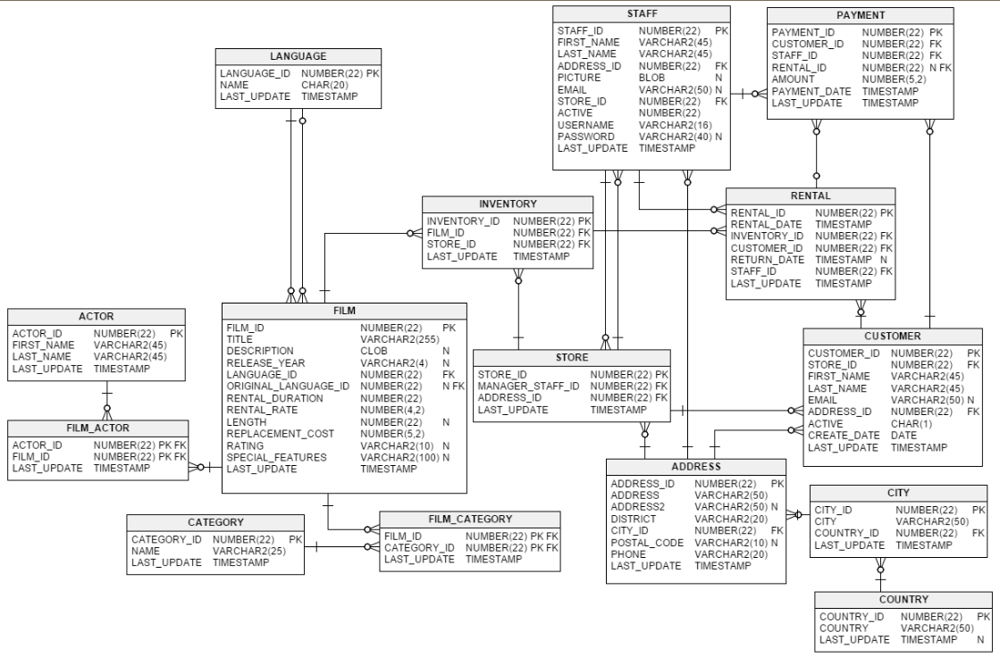

## sakila数据库查询

关系图：


### 题目1：创建视图，返回最近一个月，被租借最多前五名的电影DVD信息；
```sql
create VIEW hym_topfilm
as 
select * from film
where film_id in (
	select film_id from
	(
		select film_id from(
		 select film_id, count(film_id) as filmcount
		 from (
			select rental_date,inventory.inventory_id,film_id 
			from rental,inventory
			where rental.inventory_id=inventory.inventory_id and datediff('2006-01-01 00:00:00', rental_date)<365
			) as filmct
		 group by film_id
		 ORDER BY filmcount DESC
		) as idcat
		LIMIT 5) as idtt
)
```

### 题目2：创建视图，返回最近一年，租借DVD用户排名，并按照所在国家、城市进行分组排序；
```sql
create VIEW hym_custorank
as select customer_id, count(customer_id) as custercount,ID,customer_list.`name`,customer_list.country,customer_list.city
from rental,customer_list
WHERE customer_list.ID=rental.customer_id and datediff('2006-01-01 00:00:00',rental_date)<365
group by country,city,customer_id
ORDER BY country,city,custercount DESC
```

### 题目3：创建视图，返回最近一年，被租借DVD电影类型排名，显示租赁的次数；
```sql

```