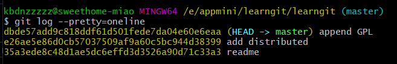
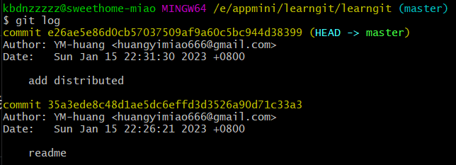
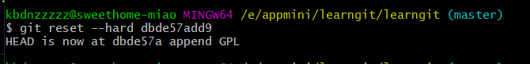
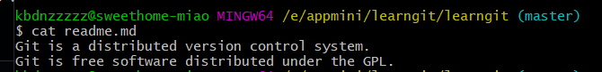
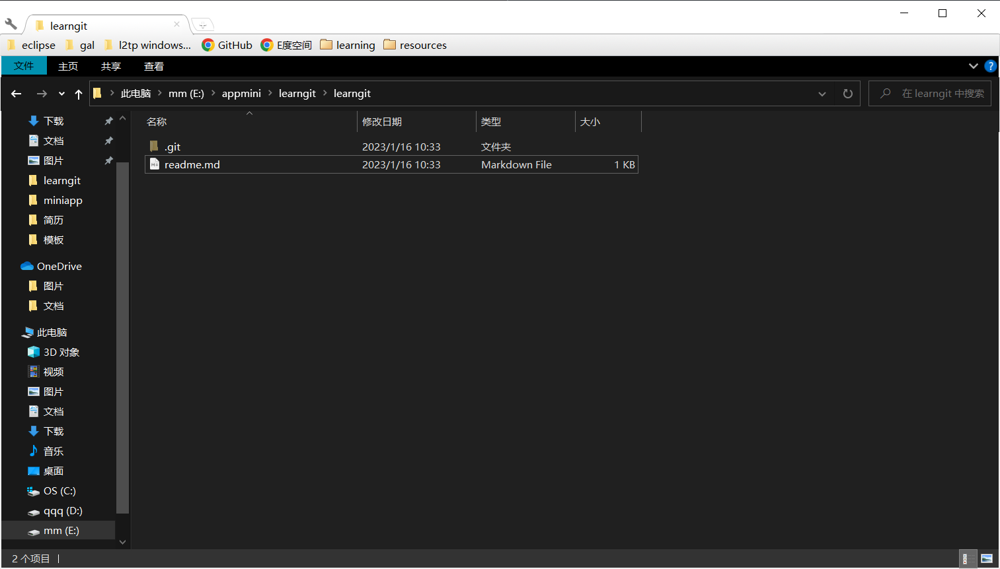
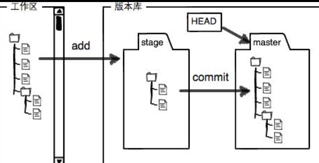
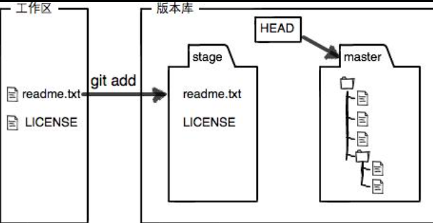
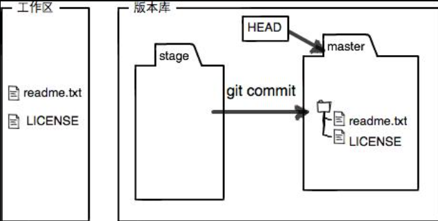

# Git使用
## 安装

## 创建版本库
什么是版本库呢？版本库又名仓库，英文名repository，你可以简单理解成一个目录，这个目录里面的所有文件都可以被Git管理起来，每个文件的修改、删除，Git都能跟踪，以便任何时刻都可以追踪历史，或者在将来某个时刻可以“还原”。

所以，创建一个版本库非常简单，首先，选择一个合适的地方，创建一个空目录：
```shell
$ mkdir learngit
$ cd learngit
$ pwd
/Users/michael/learngit
```
pwd命令用于显示当前目录。

第二步，通过git init命令把这个目录变成Git可以管理的仓库：
```shell
$ git init
Initialized empty Git repository in /Users/michael/learngit/.git/
```
瞬间Git就把仓库建好了，而且告诉你是一个空的仓库（empty Git repository），细心的读者可以发现当前目录下多了一个.git的目录，这个目录是Git来跟踪管理版本库的，没事千万不要手动修改这个目录里面的文件，不然改乱了，就把Git仓库给破坏了。

如果你没有看到.git目录，那是因为这个目录默认是隐藏的，用ls -ah命令就可以看见。
### 把文件添加到版本库
首先这里再明确一下，所有的版本控制系统，其实只能跟踪文本文件的改动，比如TXT文件，网页，所有的程序代码等等，Git也不例外。版本控制系统可以告诉你每次的改动，比如在第5行加了一个单词“Linux”，在第8行删了一个单词“Windows”。而图片、视频这些二进制文件，虽然也能由版本控制系统管理，但没法跟踪文件的变化，只能把二进制文件每次改动串起来，也就是只知道图片从100KB改成了120KB，但到底改了啥，版本控制系统不知道，也没法知道。

不幸的是，Microsoft的Word格式是二进制格式，因此，版本控制系统是没法跟踪Word文件的改动的，前面我们举的例子只是为了演示，如果要真正使用版本控制系统，就要以纯文本方式编写文件。

因为文本是有编码的，比如中文有常用的GBK编码，日文有Shift_JIS编码，如果没有历史遗留问题，强烈建议使用标准的UTF-8编码，所有语言使用同一种编码，既没有冲突，又被所有平台所支持。

千万不要使用**Windows自带的记事本**编辑任何文本文件。原因是Microsoft开发记事本的团队使用了一个非常弱智的行为来保存UTF-8编码的文件，他们自作聪明地在每个文件开头添加了0xefbbbf（十六进制）的字符，你会遇到很多不可思议的问题，比如，网页第一行可能会显示一个“?”，明明正确的程序一编译就报语法错误，等等，都是由记事本的弱智行为带来的。建议你下载Visual Studio Code代替记事本，不但功能强大，而且免费！

言归正传，现在我们编写一个readme.txt文件，内容如下：
```
Git is a version control system.
Git is free software.
```
一定要放到learngit目录下（子目录也行），因为这是一个Git仓库，放到其他地方Git再厉害也找不到这个文件。

和把大象放到冰箱需要3步相比，把一个文件放到Git仓库只需要两步。

第一步，用命令git add告诉Git，把文件添加到仓库：
```shell
$ git add readme.txt
```
执行上面的命令，没有任何显示，这就对了，Unix的哲学是“没有消息就是好消息”，说明添加成功。

第二步，用命令git commit告诉Git，把文件提交到仓库：
```shell
$ git commit -m "wrote a readme file"
[master (root-commit) eaadf4e] wrote a readme file
 1 file changed, 2 insertions(+)
 create mode 100644 readme.txt
```
简单解释一下git commit命令，-m后面输入的是本次提交的说明，可以输入任意内容，当然最好是有意义的，这样你就能从历史记录里方便地找到改动记录。

嫌麻烦不想输入-m "xxx"行不行？确实有办法可以这么干，但是强烈不建议你这么干，因为输入说明对自己对别人阅读都很重要。实在不想输入说明的童鞋请自行Google，我不告诉你这个参数。

git commit命令执行成功后会告诉你，1 file changed：1个文件被改动（我们新添加的readme.txt文件）；2 insertions：插入了两行内容（readme.txt有两行内容）。

为什么Git添加文件需要add，commit一共两步呢？因为commit可以一次提交很多文件，所以你可以多次add不同的文件，比如：
```shell
$ git add file1.txt
$ git add file2.txt file3.txt
$ git commit -m "add 3 files."
```
## 时光机穿梭
>* 要随时掌握工作区的状态，使用git status命令。
>* 如果git status告诉你有文件被修改过，用git diff可以查看修改内容。

我们已经成功地添加并提交了一个readme.txt文件，现在，是时候继续工作了，于是，我们继续修改readme.txt文件，改成如下内容：
```
Git is a distributed version control system.
Git is free software.
```
现在，运行git status命令看看结果：
```shell
$ git status
On branch master
Changes not staged for commit:
  (use "git add <file>..." to update what will be committed)
  (use "git checkout -- <file>..." to discard changes in working directory)

	modified:   readme.txt

no changes added to commit (use "git add" and/or "git commit -a")
```
git status命令可以让我们时刻掌握仓库当前的状态，上面的命令输出告诉我们，readme.txt被修改过了，但还没有准备提交的修改。

虽然Git告诉我们readme.txt被修改了，但如果能看看具体修改了什么内容，自然是很好的。比如你休假两周从国外回来，第一天上班时，已经记不清上次怎么修改的readme.txt，所以，需要用git diff这个命令看看：
```shell
$ git diff readme.txt 
diff --git a/readme.txt b/readme.txt
index 46d49bf..9247db6 100644
--- a/readme.txt
+++ b/readme.txt
@@ -1,2 +1,2 @@
-Git is a version control system.
+Git is a distributed version control system.
 Git is free software.
```
git diff顾名思义就是查看difference，显示的格式正是Unix通用的diff格式，可以从上面的命令输出看到，我们在第一行添加了一个distributed单词。

知道了对readme.txt作了什么修改后，再把它提交到仓库就放心多了，提交修改和提交新文件是一样的两步，第一步是git add：
```shell
$ git add readme.txt
```
同样没有任何输出。在执行第二步git commit之前，我们再运行git status看看当前仓库的状态：
```shell
$ git status
On branch master
Changes to be committed:
  (use "git reset HEAD <file>..." to unstage)

	modified:   readme.txt
```
git status告诉我们，将要被提交的修改包括readme.txt，下一步，就可以放心地提交了：
```shell
$ git commit -m "add distributed"
[master e475afc] add distributed
 1 file changed, 1 insertion(+), 1 deletion(-)
```
提交后，我们再用git status命令看看仓库的当前状态：
```shell
$ git status
On branch master
nothing to commit, working tree clean
```
Git告诉我们当前没有需要提交的修改，而且，工作目录是干净（working tree clean）的。

### 版本回退

>* HEAD指向的版本就是当前版本，因此，Git允许我们在版本的历史之间穿梭，使用命令git reset --hard commit_id。
>* 穿梭前，用git log可以查看提交历史，以便确定要回退到哪个版本。
>* 要重返未来，用git reflog查看命令历史，以便确定要回到未来的哪个版本。

现在，你已经学会了修改文件，然后把修改提交到Git版本库，现在，再练习一次，修改readme.txt文件如下：
```
Git is a distributed version control system.
Git is free software distributed under the GPL.
```
然后尝试提交：
```
$ git add readme.txt
$ git commit -m "append GPL"
[master 1094adb] append GPL
 1 file changed, 1 insertion(+), 1 deletion(-)
```
像这样，你不断对文件进行修改，然后不断提交修改到版本库里，就好比玩RPG游戏时，每通过一关就会自动把游戏状态存盘，如果某一关没过去，你还可以选择读取前一关的状态。有些时候，在打Boss之前，你会手动存盘，以便万一打Boss失败了，可以从最近的地方重新开始。Git也是一样，每当你觉得文件修改到一定程度的时候，就可以“保存一个快照”，这个快照在Git中被称为commit。一旦你把文件改乱了，或者误删了文件，还可以从最近的一个commit恢复，然后继续工作，而不是把几个月的工作成果全部丢失。

现在，我们回顾一下readme.txt文件一共有几个版本被提交到Git仓库里了：

版本1：wrote a readme file
```
Git is a version control system.
Git is free software.
```
版本2：add distributed
```
Git is a distributed version control system.
Git is free software.
```
版本3：append GPL
```
Git is a distributed version control system.
Git is free software distributed under the GPL.
```
当然了，在实际工作中，我们脑子里怎么可能记得一个几千行的文件每次都改了什么内容，不然要版本控制系统干什么。版本控制系统肯定有某个命令可以告诉我们历史记录，在Git中，我们用git log命令查看：
```shell
$ git log
commit dbde57add9c818ddf61d501fede7da04e60e6eaa (HEAD -> master)
Author: YM-huang <huangyimiao666@gmail.com>
Date:   Mon Jan 16 10:04:44 2023 +0800

    append GPL

commit e26ae5e86d0cb57037509af9a60c5bc944d38399
Author: YM-huang <huangyimiao666@gmail.com>
Date:   Sun Jan 15 22:31:30 2023 +0800

    add distributed

commit 35a3ede8c48d1ae5dc6effd3d3526a90d71c33a3
Author: YM-huang <huangyimiao666@gmail.com>
Date:   Sun Jan 15 22:26:21 2023 +0800

    readme

```
git log命令显示从最近到最远的提交日志，我们可以看到3次提交，最近的一次是append GPL，上一次是add distributed，最早的一次是wrote a readme file。

如果嫌输出信息太多，看得眼花缭乱的，可以试试加上--pretty=oneline参数：
```shell
$ git log --pretty=oneline
dbde57add9c818ddf61d501fede7da04e60e6eaa (HEAD -> master) append GPL
e26ae5e86d0cb57037509af9a60c5bc944d38399 add distributed
35a3ede8c48d1ae5dc6effd3d3526a90d71c33a3 readme

```


需要友情提示的是，你看到的一大串类似1094adb...的是commit id（版本号），和SVN不一样，Git的commit id不是1，2，3……递增的数字，而是一个SHA1计算出来的一个非常大的数字，用十六进制表示，而且你看到的commit id和我的肯定不一样，以你自己的为准。为什么commit id需要用这么一大串数字表示呢？因为Git是分布式的版本控制系统，后面我们还要研究多人在同一个版本库里工作，如果大家都用1，2，3……作为版本号，那肯定就冲突了。

每提交一个新版本，实际上Git就会把它们自动串成一条时间线。如果使用可视化工具查看Git历史，就可以更清楚地看到提交历史的时间线：

**如何进行版本回退： **
首先，Git必须知道当前版本是哪个版本，在Git中，用HEAD表示当前版本，也就是最新的提交1094adb...（注意我的提交ID和你的肯定不一样），**上一个版本就是HEAD^，上上一个版本就是HEAD^^，当然往上100个版本写100个^比较容易数不过来，所以写成HEAD~100。**

现在，我们要把当前版本append GPL回退到上一个版本add distributed，就可以使用git reset命令：
```shell
$ git reset --hard HEAD^  千万不要忘了^
HEAD is now at e26ae5e add distributed
```
--hard参数有啥意义？这个后面再讲，现在你先放心使用。

看看readme.txt的内容是不是版本add distributed：
```shell
$ cat readme.md
Git is a distributed version control system.
Git is free software.
```
果然被还原了。

还可以继续回退到上一个版本wrote a readme file，不过且慢，让我们用git log再看看现在版本库的状态：


最新的那个版本append GPL已经看不到了！好比你从21世纪坐时光穿梭机来到了19世纪，想再回去已经回不去了，肿么办？

办法其实还是有的，只要上面的命令行窗口还没有被关掉，你就可以顺着往上找啊找啊，找到那个append GPL的commit id是1094adb...，于是就可以指定回到未来的某个版本：
版本号没必要写全，前几位就可以了，Git会自动去找。当然也不能只写前一两位，因为Git可能会找到多个版本号，就无法确定是哪一个了。

再小心翼翼地看看readme.txt的内容：

都回来了。
Git的版本回退速度非常快，因为Git在内部有个指向当前版本的HEAD指针，当你回退版本的时候，Git仅仅是把HEAD从指向append GPL：

┌────┐
│HEAD│
└────┘
   │
   └──▶ ○ append GPL
        │
        ○ add distributed
        │
        ○ wrote a readme file
改为指向add distributed：

┌────┐
│HEAD│
└────┘
   │
   │    ○ append GPL
   │    │
   └──▶ ○ add distributed
        │
        ○ wrote a readme file
然后顺便把工作区的文件更新了。所以你让HEAD指向哪个版本号，你就把当前版本定位在哪。

现在，你回退到了某个版本，关掉了电脑，第二天早上就后悔了，想恢复到新版本怎么办？找不到新版本的commit id怎么办？

在Git中，总是有后悔药可以吃的。当你用$ git reset --hard HEAD^回退到add distributed版本时，再想恢复到append GPL，就必须找到append GPL的commit id。Git提供了一个命令git reflog用来记录你的每一次命令：
```shell
$ git reflog
dbde57a (HEAD -> master) HEAD@{0}: reset: moving to dbde57add9
e26ae5e HEAD@{1}: reset: moving to HEAD^
dbde57a (HEAD -> master) HEAD@{2}: reset: moving to HEAD
dbde57a (HEAD -> master) HEAD@{3}: reset: moving to HEAD
dbde57a (HEAD -> master) HEAD@{4}: commit: append GPL
e26ae5e HEAD@{5}: commit: add distributed
35a3ede HEAD@{6}: commit (initial): readme
```
终于舒了口气，从输出可知，append GPL的commit id是dbde57a，现在，你又可以乘坐时光机回到未来了。
### 工作区和暂存区
Git和其他版本控制系统如SVN的一个不同之处就是有暂存区的概念。

先来看名词解释。
#### 工作区
就是你在电脑里能看到的目录，比如我的learngit文件夹就是一个工作区：


#### 版本库（Repository）
工作区有一个隐藏目录.git，这个不算工作区，而是Git的版本库。

Git的版本库里存了很多东西，其中最重要的就是称为stage（或者叫index）的暂存区，还有Git为我们自动创建的第一个分支master，以及指向master的一个指针叫HEAD。

分支和HEAD的概念我们以后再讲。

前面讲了我们把文件往Git版本库里添加的时候，是分两步执行的：

第一步是用git add把文件添加进去，实际上就是把文件修改添加到暂存区；

第二步是用git commit提交更改，实际上就是把暂存区的所有内容提交到当前分支。

因为我们创建Git版本库时，Git自动为我们创建了唯一一个master分支，所以，现在，git commit就是往master分支上提交更改。

你可以简单理解为，需要提交的文件修改通通放到暂存区，然后，一次性提交暂存区的所有修改。

俗话说，实践出真知。现在，我们再练习一遍，先对readme.txt做个修改，比如加上一行内容：
```
Git is a distributed version control system.
Git is free software distributed under the GPL.
Git has a mutable index called stage.
```
然后，在工作区新增一个LICENSE文本文件（内容随便写）。

先用git status查看一下状态：
```shell
$ git status
On branch master
Changes not staged for commit:
  (use "git add <file>..." to update what will be committed)
  (use "git restore <file>..." to discard changes in working directory)
        modified:   readme.md

Untracked files:
  (use "git add <file>..." to include in what will be committed)
        LICENCE

no changes added to commit (use "git add" and/or "git commit -a")

```
Git非常清楚地告诉我们，readme.txt被修改了，而LICENSE还从来没有被添加过，所以它的状态是Untracked。

现在，使用两次命令git add，把readme.txt和LICENSE都添加后，用git status再查看一下：
```shell
$ git status
On branch master
Changes to be committed:
  (use "git restore --staged <file>..." to unstage)
        new file:   LICENCE
        modified:   readme.md

```
现在，暂存区的状态就变成这样了：


所以，git add命令实际上就是把要提交的所有修改放到暂存区（Stage），然后，执行git commit就可以一次性把暂存区的所有修改提交到分支。
```shell
$ git commit -m "understand how stage works"
[master 1a0a901] understand how stage works
 2 files changed, 2 insertions(+), 1 deletion(-)
 create mode 100644 LICENCE
```
一旦提交后，如果你又没有对工作区做任何修改，那么工作区就是“干净”的：
```shell
$ git status
On branch master
nothing to commit, working tree clean
```
现在版本库变成了这样，暂存区就没有任何内容了：


### 管理修改
