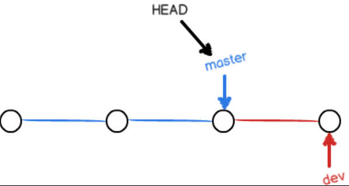
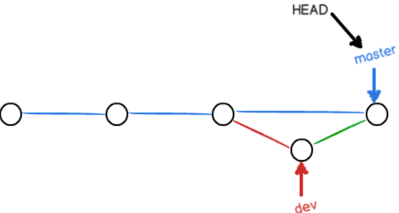
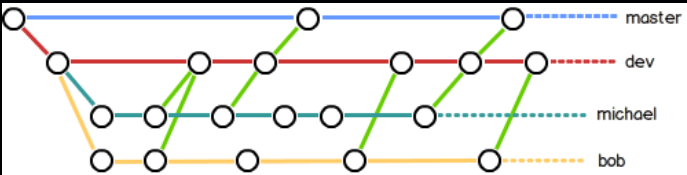

# Git使用
## 安装

## 创建版本库
什么是版本库呢？版本库又名仓库，英文名repository，你可以简单理解成一个目录，这个目录里面的所有文件都可以被Git管理起来，每个文件的修改、删除，Git都能跟踪，以便任何时刻都可以追踪历史，或者在将来某个时刻可以“还原”。

所以，创建一个版本库非常简单，首先，选择一个合适的地方，创建一个空目录：
```shell
$ mkdir learngit
$ cd learngit
$ pwd
/Users/michael/learngit
```
pwd命令用于显示当前目录。

第二步，通过git init命令把这个目录变成Git可以管理的仓库：
```shell
$ git init
Initialized empty Git repository in /Users/michael/learngit/.git/
```
瞬间Git就把仓库建好了，而且告诉你是一个空的仓库（empty Git repository），细心的读者可以发现当前目录下多了一个.git的目录，这个目录是Git来跟踪管理版本库的，没事千万不要手动修改这个目录里面的文件，不然改乱了，就把Git仓库给破坏了。

如果你没有看到.git目录，那是因为这个目录默认是隐藏的，用ls -ah命令就可以看见。
### 把文件添加到版本库
首先这里再明确一下，所有的版本控制系统，其实只能跟踪文本文件的改动，比如TXT文件，网页，所有的程序代码等等，Git也不例外。版本控制系统可以告诉你每次的改动，比如在第5行加了一个单词“Linux”，在第8行删了一个单词“Windows”。而图片、视频这些二进制文件，虽然也能由版本控制系统管理，但没法跟踪文件的变化，只能把二进制文件每次改动串起来，也就是只知道图片从100KB改成了120KB，但到底改了啥，版本控制系统不知道，也没法知道。

不幸的是，Microsoft的Word格式是二进制格式，因此，版本控制系统是没法跟踪Word文件的改动的，前面我们举的例子只是为了演示，如果要真正使用版本控制系统，就要以纯文本方式编写文件。

因为文本是有编码的，比如中文有常用的GBK编码，日文有Shift_JIS编码，如果没有历史遗留问题，强烈建议使用标准的UTF-8编码，所有语言使用同一种编码，既没有冲突，又被所有平台所支持。

千万不要使用**Windows自带的记事本**编辑任何文本文件。原因是Microsoft开发记事本的团队使用了一个非常弱智的行为来保存UTF-8编码的文件，他们自作聪明地在每个文件开头添加了0xefbbbf（十六进制）的字符，你会遇到很多不可思议的问题，比如，网页第一行可能会显示一个“?”，明明正确的程序一编译就报语法错误，等等，都是由记事本的弱智行为带来的。建议你下载Visual Studio Code代替记事本，不但功能强大，而且免费！

言归正传，现在我们编写一个readme.txt文件，内容如下：
```
Git is a version control system.
Git is free software.
```
一定要放到learngit目录下（子目录也行），因为这是一个Git仓库，放到其他地方Git再厉害也找不到这个文件。

和把大象放到冰箱需要3步相比，把一个文件放到Git仓库只需要两步。

第一步，用命令git add告诉Git，把文件添加到仓库：
```shell
$ git add readme.txt
```
执行上面的命令，没有任何显示，这就对了，Unix的哲学是“没有消息就是好消息”，说明添加成功。

第二步，用命令git commit告诉Git，把文件提交到仓库：
```shell
$ git commit -m "wrote a readme file"
[master (root-commit) eaadf4e] wrote a readme file
 1 file changed, 2 insertions(+)
 create mode 100644 readme.txt
```
简单解释一下git commit命令，-m后面输入的是本次提交的说明，可以输入任意内容，当然最好是有意义的，这样你就能从历史记录里方便地找到改动记录。

嫌麻烦不想输入-m "xxx"行不行？确实有办法可以这么干，但是强烈不建议你这么干，因为输入说明对自己对别人阅读都很重要。实在不想输入说明的童鞋请自行Google，我不告诉你这个参数。

git commit命令执行成功后会告诉你，1 file changed：1个文件被改动（我们新添加的readme.txt文件）；2 insertions：插入了两行内容（readme.txt有两行内容）。

为什么Git添加文件需要add，commit一共两步呢？因为commit可以一次提交很多文件，所以你可以多次add不同的文件，比如：
```shell
$ git add file1.txt
$ git add file2.txt file3.txt
$ git commit -m "add 3 files."
```
## 时光机穿梭
>* 要随时掌握工作区的状态，使用git status命令。
>* 如果git status告诉你有文件被修改过，用git diff可以查看修改内容。

我们已经成功地添加并提交了一个readme.txt文件，现在，是时候继续工作了，于是，我们继续修改readme.txt文件，改成如下内容：
```
Git is a distributed version control system.
Git is free software.
```
现在，运行git status命令看看结果：
```shell
$ git status
On branch master
Changes not staged for commit:
  (use "git add <file>..." to update what will be committed)
  (use "git checkout -- <file>..." to discard changes in working directory)

	modified:   readme.txt

no changes added to commit (use "git add" and/or "git commit -a")
```
git status命令可以让我们时刻掌握仓库当前的状态，上面的命令输出告诉我们，readme.txt被修改过了，但还没有准备提交的修改。

虽然Git告诉我们readme.txt被修改了，但如果能看看具体修改了什么内容，自然是很好的。比如你休假两周从国外回来，第一天上班时，已经记不清上次怎么修改的readme.txt，所以，需要用git diff这个命令看看：
```shell
$ git diff readme.txt 
diff --git a/readme.txt b/readme.txt
index 46d49bf..9247db6 100644
--- a/readme.txt
+++ b/readme.txt
@@ -1,2 +1,2 @@
-Git is a version control system.
+Git is a distributed version control system.
 Git is free software.
```
git diff顾名思义就是查看difference，显示的格式正是Unix通用的diff格式，可以从上面的命令输出看到，我们在第一行添加了一个distributed单词。

知道了对readme.txt作了什么修改后，再把它提交到仓库就放心多了，提交修改和提交新文件是一样的两步，第一步是git add：
```shell
$ git add readme.txt
```
同样没有任何输出。在执行第二步git commit之前，我们再运行git status看看当前仓库的状态：
```shell
$ git status
On branch master
Changes to be committed:
  (use "git reset HEAD <file>..." to unstage)

	modified:   readme.txt
```
git status告诉我们，将要被提交的修改包括readme.txt，下一步，就可以放心地提交了：
```shell
$ git commit -m "add distributed"
[master e475afc] add distributed
 1 file changed, 1 insertion(+), 1 deletion(-)
```
提交后，我们再用git status命令看看仓库的当前状态：
```shell
$ git status
On branch master
nothing to commit, working tree clean
```
Git告诉我们当前没有需要提交的修改，而且，工作目录是干净（working tree clean）的。

### 版本回退

>* HEAD指向的版本就是当前版本，因此，Git允许我们在版本的历史之间穿梭，使用命令git reset --hard commit_id。
>* 穿梭前，用git log可以查看提交历史，以便确定要回退到哪个版本。
>* 要重返未来，用git reflog查看命令历史，以便确定要回到未来的哪个版本。

现在，你已经学会了修改文件，然后把修改提交到Git版本库，现在，再练习一次，修改readme.txt文件如下：
```
Git is a distributed version control system.
Git is free software distributed under the GPL.
```
然后尝试提交：
```
$ git add readme.txt
$ git commit -m "append GPL"
[master 1094adb] append GPL
 1 file changed, 1 insertion(+), 1 deletion(-)
```
像这样，你不断对文件进行修改，然后不断提交修改到版本库里，就好比玩RPG游戏时，每通过一关就会自动把游戏状态存盘，如果某一关没过去，你还可以选择读取前一关的状态。有些时候，在打Boss之前，你会手动存盘，以便万一打Boss失败了，可以从最近的地方重新开始。Git也是一样，每当你觉得文件修改到一定程度的时候，就可以“保存一个快照”，这个快照在Git中被称为commit。一旦你把文件改乱了，或者误删了文件，还可以从最近的一个commit恢复，然后继续工作，而不是把几个月的工作成果全部丢失。

现在，我们回顾一下readme.txt文件一共有几个版本被提交到Git仓库里了：

版本1：wrote a readme file
```
Git is a version control system.
Git is free software.
```
版本2：add distributed
```
Git is a distributed version control system.
Git is free software.
```
版本3：append GPL
```
Git is a distributed version control system.
Git is free software distributed under the GPL.
```
当然了，在实际工作中，我们脑子里怎么可能记得一个几千行的文件每次都改了什么内容，不然要版本控制系统干什么。版本控制系统肯定有某个命令可以告诉我们历史记录，在Git中，我们用git log命令查看：
```shell
$ git log
commit dbde57add9c818ddf61d501fede7da04e60e6eaa (HEAD -> master)
Author: YM-huang <huangyimiao666@gmail.com>
Date:   Mon Jan 16 10:04:44 2023 +0800

    append GPL

commit e26ae5e86d0cb57037509af9a60c5bc944d38399
Author: YM-huang <huangyimiao666@gmail.com>
Date:   Sun Jan 15 22:31:30 2023 +0800

    add distributed

commit 35a3ede8c48d1ae5dc6effd3d3526a90d71c33a3
Author: YM-huang <huangyimiao666@gmail.com>
Date:   Sun Jan 15 22:26:21 2023 +0800

    readme

```
git log命令显示从最近到最远的提交日志，我们可以看到3次提交，最近的一次是append GPL，上一次是add distributed，最早的一次是wrote a readme file。

如果嫌输出信息太多，看得眼花缭乱的，可以试试加上--pretty=oneline参数：
```shell
$ git log --pretty=oneline
dbde57add9c818ddf61d501fede7da04e60e6eaa (HEAD -> master) append GPL
e26ae5e86d0cb57037509af9a60c5bc944d38399 add distributed
35a3ede8c48d1ae5dc6effd3d3526a90d71c33a3 readme

```


需要友情提示的是，你看到的一大串类似1094adb...的是commit id（版本号），和SVN不一样，Git的commit id不是1，2，3……递增的数字，而是一个SHA1计算出来的一个非常大的数字，用十六进制表示，而且你看到的commit id和我的肯定不一样，以你自己的为准。为什么commit id需要用这么一大串数字表示呢？因为Git是分布式的版本控制系统，后面我们还要研究多人在同一个版本库里工作，如果大家都用1，2，3……作为版本号，那肯定就冲突了。

每提交一个新版本，实际上Git就会把它们自动串成一条时间线。如果使用可视化工具查看Git历史，就可以更清楚地看到提交历史的时间线：

**如何进行版本回退： **
首先，Git必须知道当前版本是哪个版本，在Git中，用HEAD表示当前版本，也就是最新的提交1094adb...（注意我的提交ID和你的肯定不一样），**上一个版本就是HEAD^，上上一个版本就是HEAD^^，当然往上100个版本写100个^比较容易数不过来，所以写成HEAD~100。**

现在，我们要把当前版本append GPL回退到上一个版本add distributed，就可以使用git reset命令：
```shell
$ git reset --hard HEAD^  千万不要忘了^
HEAD is now at e26ae5e add distributed
```
--hard参数有啥意义？这个后面再讲，现在你先放心使用。

看看readme.txt的内容是不是版本add distributed：
```shell
$ cat readme.md
Git is a distributed version control system.
Git is free software.
```
果然被还原了。

还可以继续回退到上一个版本wrote a readme file，不过且慢，让我们用git log再看看现在版本库的状态：


最新的那个版本append GPL已经看不到了！好比你从21世纪坐时光穿梭机来到了19世纪，想再回去已经回不去了，肿么办？

办法其实还是有的，只要上面的命令行窗口还没有被关掉，你就可以顺着往上找啊找啊，找到那个append GPL的commit id是1094adb...，于是就可以指定回到未来的某个版本：
版本号没必要写全，前几位就可以了，Git会自动去找。当然也不能只写前一两位，因为Git可能会找到多个版本号，就无法确定是哪一个了。

再小心翼翼地看看readme.txt的内容：

都回来了。
Git的版本回退速度非常快，因为Git在内部有个指向当前版本的HEAD指针，当你回退版本的时候，Git仅仅是把HEAD从指向append GPL：

┌────┐
│HEAD│
└────┘
   │
   └──▶ ○ append GPL
        │
        ○ add distributed
        │
        ○ wrote a readme file
改为指向add distributed：

┌────┐
│HEAD│
└────┘
   │
   │    ○ append GPL
   │    │
   └──▶ ○ add distributed
        │
        ○ wrote a readme file
然后顺便把工作区的文件更新了。所以你让HEAD指向哪个版本号，你就把当前版本定位在哪。

现在，你回退到了某个版本，关掉了电脑，第二天早上就后悔了，想恢复到新版本怎么办？找不到新版本的commit id怎么办？

在Git中，总是有后悔药可以吃的。当你用$ git reset --hard HEAD^回退到add distributed版本时，再想恢复到append GPL，就必须找到append GPL的commit id。Git提供了一个命令git reflog用来记录你的每一次命令：
```shell
$ git reflog
dbde57a (HEAD -> master) HEAD@{0}: reset: moving to dbde57add9
e26ae5e HEAD@{1}: reset: moving to HEAD^
dbde57a (HEAD -> master) HEAD@{2}: reset: moving to HEAD
dbde57a (HEAD -> master) HEAD@{3}: reset: moving to HEAD
dbde57a (HEAD -> master) HEAD@{4}: commit: append GPL
e26ae5e HEAD@{5}: commit: add distributed
35a3ede HEAD@{6}: commit (initial): readme
```
终于舒了口气，从输出可知，append GPL的commit id是dbde57a，现在，你又可以乘坐时光机回到未来了。
### 工作区和暂存区
Git和其他版本控制系统如SVN的一个不同之处就是有暂存区的概念。

先来看名词解释。
#### 工作区
就是你在电脑里能看到的目录，比如我的learngit文件夹就是一个工作区：


#### 版本库（Repository）
工作区有一个隐藏目录.git，这个不算工作区，而是Git的版本库。

Git的版本库里存了很多东西，其中最重要的就是称为stage（或者叫index）的暂存区，还有Git为我们自动创建的第一个分支master，以及指向master的一个指针叫HEAD。

分支和HEAD的概念我们以后再讲。

前面讲了我们把文件往Git版本库里添加的时候，是分两步执行的：

第一步是用git add把文件添加进去，实际上就是把文件修改添加到暂存区；

第二步是用git commit提交更改，实际上就是把暂存区的所有内容提交到当前分支。

因为我们创建Git版本库时，Git自动为我们创建了唯一一个master分支，所以，现在，git commit就是往master分支上提交更改。

你可以简单理解为，需要提交的文件修改通通放到暂存区，然后，一次性提交暂存区的所有修改。

俗话说，实践出真知。现在，我们再练习一遍，先对readme.txt做个修改，比如加上一行内容：
```
Git is a distributed version control system.
Git is free software distributed under the GPL.
Git has a mutable index called stage.
```
然后，在工作区新增一个LICENSE文本文件（内容随便写）。

先用git status查看一下状态：
```shell
$ git status
On branch master
Changes not staged for commit:
  (use "git add <file>..." to update what will be committed)
  (use "git restore <file>..." to discard changes in working directory)
        modified:   readme.md

Untracked files:
  (use "git add <file>..." to include in what will be committed)
        LICENCE

no changes added to commit (use "git add" and/or "git commit -a")

```
Git非常清楚地告诉我们，readme.txt被修改了，而LICENSE还从来没有被添加过，所以它的状态是Untracked。

现在，使用两次命令git add，把readme.txt和LICENSE都添加后，用git status再查看一下：
```shell
$ git status
On branch master
Changes to be committed:
  (use "git restore --staged <file>..." to unstage)
        new file:   LICENCE
        modified:   readme.md

```
现在，暂存区的状态就变成这样了：


所以，git add命令实际上就是把要提交的所有修改放到暂存区（Stage），然后，执行git commit就可以一次性把暂存区的所有修改提交到分支。
```shell
$ git commit -m "understand how stage works"
[master 1a0a901] understand how stage works
 2 files changed, 2 insertions(+), 1 deletion(-)
 create mode 100644 LICENCE
```
一旦提交后，如果你又没有对工作区做任何修改，那么工作区就是“干净”的：
```shell
$ git status
On branch master
nothing to commit, working tree clean
```
现在版本库变成了这样，暂存区就没有任何内容了：


### 管理修改
>每次修改，如果不用git add到暂存区，那就不会加入到commit中。

现在，假定你已经完全掌握了暂存区的概念。下面，我们要讨论的就是，为什么Git比其他版本控制系统设计得优秀，因为Git跟踪并管理的是修改，而非文件。

你会问，什么是修改？比如你新增了一行，这就是一个修改，删除了一行，也是一个修改，更改了某些字符，也是一个修改，删了一些又加了一些，也是一个修改，甚至创建一个新文件，也算一个修改。

为什么说Git管理的是修改，而不是文件呢？我们还是做实验。第一步，对readme.txt做一个修改，比如加一行内容：
```shell
$ cat readme.txt
Git is a distributed version control system.
Git is free software distributed under the GPL.
Git has a mutable index called stage.
Git tracks changes.
```
然后，添加：
```shell
$ git status
On branch master
Changes to be committed:
  (use "git restore --staged <file>..." to unstage)
        modified:   readme.md
```
然后，再修改readme.md:
```shell
$ cat readme.txt 
Git is a distributed version control system.
Git is free software distributed under the GPL.
Git has a mutable index called stage.
Git tracks changes of files.
```
提交：
```shell
$ git commit -m "git tracks changes"
[master b6f4e57] git tracks changes
 1 file changed, 2 insertions(+), 1 deletion(-)
```
提交后，再看看状态：
```shell
$ git status
On branch master
Changes not staged for commit:
  (use "git add <file>..." to update what will be committed)
  (use "git restore <file>..." to discard changes in working directory)
        modified:   readme.md

no changes added to commit (use "git add" and/or "git commit -a")
```
咦，怎么第二次的修改没有被提交？

别激动，我们回顾一下操作过程：

第一次修改 -> git add -> 第二次修改 -> git commit

你看，我们前面讲了，Git管理的是修改，当你用git add命令后，在工作区的第一次修改被放入暂存区，准备提交，但是，在工作区的第二次修改并没有放入暂存区，所以，git commit只负责把暂存区的修改提交了，也就是第一次的修改被提交了，第二次的修改不会被提交。

提交后，用git diff HEAD -- readme.txt命令可以查看工作区和版本库里面最新版本的区别：
```shell
$ git diff HEAD -- readme.md
diff --git a/readme.md b/readme.md
index db28b2c..9a8b341 100644
--- a/readme.md
+++ b/readme.md
@@ -1,4 +1,4 @@
 Git is a distributed version control system.
 Git is free software distributed under the GPL.
 Git has a mutable index called stage.
-Git tracks changes.
\ No newline at end of file
+Git tracks changes of files.
\ No newline at end of file
```
可见，第二次修改确实没有被提交。

那怎么提交第二次修改呢？你可以继续git add再git commit，也可以别着急提交第一次修改，先git add第二次修改，再git commit，就相当于把两次修改合并后一块提交了：

第一次修改 -> git add -> 第二次修改 -> git add -> git commit

好，现在，把第二次修改提交了。

### 撤销修改
>* 从暂存区恢复工作区:git resotre --worktree readme.txt
>* 从master恢复暂存区:git restore --staged readme.txt
>* 从master同时恢复工作区和暂存区:git restore --source=HEAD --staged --worktree readme.txt
>* 原来的git checkout 可以使用 git restore 代替
>* 原来的git reset HEAD 可以使用 git restore --staged 代替

自然，你是不会犯错的。不过现在是凌晨两点，你正在赶一份工作报告，你在readme.txt中添加了一行：
```shell
$ cat readme.txt
Git is a distributed version control system.
Git is free software distributed under the GPL.
Git has a mutable index called stage.
Git tracks changes of files.
My stupid boss still prefers SVN.
```
在你准备提交前，一杯咖啡起了作用，你猛然发现了stupid boss可能会让你丢掉这个月的奖金！

既然错误发现得很及时，就可以很容易地纠正它。你可以删掉最后一行，手动把文件恢复到上一个版本的状态。如果用git status查看一下：
```shell
$ git status
On branch master
Changes not staged for commit:
  (use "git add <file>..." to update what will be committed)
  (use "git restore <file>..." to discard changes in working directory)
        modified:   readme.md
```
你可以发现，Git会告诉你，git restore \<file>...可以丢弃工作区的修改：

命令git restore \<file>...意思就是，把readme.txt文件在工作区的修改全部撤销，这里有两种情况：

一种是readme.txt自修改后还没有被放到暂存区，现在，撤销修改就回到和版本库一模一样的状态；

一种是readme.txt已经添加到暂存区后，又作了修改，现在，撤销修改就回到添加到暂存区后的状态。

总之，就是让这个文件回到最近一次git commit或git add时的状态。

现在，看看readme.txt的文件内容：
```shell
$ cat readme.md
Git is a distributed version control system.
Git is free software distributed under the GPL.
Git has a mutable index called stage.
Git tracks changes of files.
```
文件内容果然复原了。
### 删除文件
>命令git rm用于删除一个文件。如果一个文件已经被提交到版本库，那么你永远不用担心误删，但是要小心，你只能恢复文件到最新版本，你会丢失最近一次提交后你修改的内容。
>在Git中，删除也是一个修改操作，我们实战一下，先添加一个新文件test.txt到Git并且提交：

```shell
$ git add test.txt

$ git commit -m "add test.txt"
[master fe43d2a] add test.txt
 1 file changed, 0 insertions(+), 0 deletions(-)
 create mode 100644 test.txt
```
一般情况下，你通常直接在文件管理器中把没用的文件删了，或者用rm命令删了：
```shell
$ rm test.txt
```
这个时候，Git知道你删除了文件，因此，工作区和版本库就不一致了，git status命令会立刻告诉你哪些文件被删除了：
```shell
$ git status
On branch master
Changes not staged for commit:
  (use "git add/rm <file>..." to update what will be committed)
  (use "git restore <file>..." to discard changes in working directory)
        deleted:    test.txt

no changes added to commit (use "git add" and/or "git commit -a")

```
现在你有两个选择，一是确实要从版本库中删除该文件，那就用命令git rm删掉，并且git commit：
```shell
$ git rm test.txt
rm 'test.txt'

$ git commit -m "remove test.txt"
[master 572e20f] remove test.txt
 1 file changed, 0 insertions(+), 0 deletions(-)
 delete mode 100644 test.txt

```
现在，文件就从版本库中被删除了。

另一种情况是删错了，因为版本库里还有呢，所以可以很轻松地把误删的文件恢复到最新版本：
```shell
$ git checkout -- test.txt
```
git checkout其实是用版本库里的版本替换工作区的版本，无论工作区是修改还是删除，都可以“一键还原”。

注意：从来没有被添加到版本库就被删除的文件，是无法恢复的！
## 远程仓库

### 添加远程库
>* 要关联一个远程库，使用命令git remote add origin git@server-name:path/repo-name.git；
>* 关联一个远程库时必须给远程库指定一个名字，origin是默认习惯命名；
>* 关联后，使用命令git push -u origin master第一次推送master分支的所有内容；
>* 此后，每次本地提交后，只要有必要，就可以使用命令git push origin master推送最新修改；
>* 分布式版本系统的最大好处之一是在本地工作完全不需要考虑远程库的存在，也就是有没有联网都可以正常工作，而SVN在没有联网的时候是拒绝干活的！当有网络的时候，再把本地提交推送一下就完成了同步，真是太方便了！

把本地库的内容推送到远程，用git push命令，实际上是把当前分支master推送到远程。

由于远程库是空的，我们第一次推送master分支时，加上了-u参数，Git不但会把本地的master分支内容推送的远程新的master分支，还会把本地的master分支和远程的master分支关联起来，在以后的推送或者拉取时就可以简化命令。
```shell
$ git push origin master
```
#### SSH警告
当你第一次使用Git的clone或者push命令连接GitHub时，会得到一个警告：
```shell
The authenticity of host 'github.com (xx.xx.xx.xx)' can't be established.
RSA key fingerprint is xx.xx.xx.xx.xx.
Are you sure you want to continue connecting (yes/no)?
```
### 从远程库克隆
git clone

## 分支管理
分支就是科幻电影里面的平行宇宙，当你正在电脑前努力学习Git的时候，另一个你正在另一个平行宇宙里努力学习SVN。

如果两个平行宇宙互不干扰，那对现在的你也没啥影响。不过，在某个时间点，两个平行宇宙合并了，结果，你既学会了Git又学会了SVN！


分支在实际中有什么用呢？假设你准备开发一个新功能，但是需要两周才能完成，第一周你写了50%的代码，如果立刻提交，由于代码还没写完，不完整的代码库会导致别人不能干活了。如果等代码全部写完再一次提交，又存在丢失每天进度的巨大风险。

现在有了分支，就不用怕了。你创建了一个属于你自己的分支，别人看不到，还继续在原来的分支上正常工作，而你在自己的分支上干活，想提交就提交，直到开发完毕后，再一次性合并到原来的分支上，这样，既安全，又不影响别人工作。

其他版本控制系统如SVN等都有分支管理，但是用过之后你会发现，这些版本控制系统创建和切换分支比蜗牛还慢，简直让人无法忍受，结果分支功能成了摆设，大家都不去用。

但Git的分支是与众不同的，无论创建、切换和删除分支，Git在1秒钟之内就能完成！无论你的版本库是1个文件还是1万个文件。

### 创建合并分支
>Git鼓励大量使用分支：
>* 查看分支：git branch
>* 创建分支：git branch \<name>
>* 切换分支：git checkout \<name>或者git switch \<name>
>* 创建+切换分支：git checkout -b \<name>或者git switch -c \<name>
>* 合并某分支到当前分支：git merge \<name>
>* 删除分支：git branch -d \<name>

在版本回退里，你已经知道，每次提交，Git都把它们串成一条时间线，这条时间线就是一个分支。截止到目前，只有一条时间线，在Git里，这个分支叫主分支，即master分支。HEAD严格来说不是指向提交，而是指向master，master才是指向提交的，所以，HEAD指向的就是当前分支。

一开始的时候，master分支是一条线，Git用master指向最新的提交，再用HEAD指向master，就能确定当前分支，以及当前分支的提交点：

                  HEAD
                    │
                    │
                    ▼
                 master
                    │
                    │
                    ▼
┌───┐    ┌───┐    ┌───┐
│   │───▶│   │───▶│   │
└───┘    └───┘    └───┘
每次提交，master分支都会向前移动一步，这样，随着你不断提交，master分支的线也越来越长。

当我们创建新的分支，例如dev时，Git新建了一个指针叫dev，指向master相同的提交，再把HEAD指向dev，就表示当前分支在dev上：

                 master
                    │
                    │
                    ▼
┌───┐    ┌───┐    ┌───┐
│   │───▶│   │───▶│   │
└───┘    └───┘    └───┘
                    ▲
                    │
                    │
                   dev
                    ▲
                    │
                    │
                  HEAD
你看，Git创建一个分支很快，因为除了增加一个dev指针，改改HEAD的指向，工作区的文件都没有任何变化！

不过，从现在开始，对工作区的修改和提交就是针对dev分支了，比如新提交一次后，dev指针往前移动一步，而master指针不变：

                 master
                    │
                    │
                    ▼
┌───┐    ┌───┐    ┌───┐    ┌───┐
│   │───▶│   │───▶│   │───▶│   │
└───┘    └───┘    └───┘    └───┘
                             ▲
                             │
                             │
                            dev
                             ▲
                             │
                             │
                           HEAD
假如我们在dev上的工作完成了，就可以把dev合并到master上。Git怎么合并呢？最简单的方法，就是直接把master指向dev的当前提交，就完成了合并：

                           HEAD
                             │
                             │
                             ▼
                          master
                             │
                             │
                             ▼
┌───┐    ┌───┐    ┌───┐    ┌───┐
│   │───▶│   │───▶│   │───▶│   │
└───┘    └───┘    └───┘    └───┘
                             ▲
                             │
                             │
                            dev
所以Git合并分支也很快！就改改指针，工作区内容也不变！

合并完分支后，甚至可以删除dev分支。删除dev分支就是把dev指针给删掉，删掉后，我们就剩下了一条master分支：

                           HEAD
                             │
                             │
                             ▼
                          master
                             │
                             │
                             ▼
┌───┐    ┌───┐    ┌───┐    ┌───┐
│   │───▶│   │───▶│   │───▶│   │
└───┘    └───┘    └───┘    └───┘
真是太神奇了，你看得出来有些提交是通过分支完成的吗？

实战：
首先，我们创建dev分支，然后切换到dev分支：
```shell
$ git checkout -b dev
Switched to a new branch 'dev'
```
git checkout命令加上-b参数表示创建并切换，相当于以下两条命令：
```shell
$ git branch dev
$ git checkout dev
Switched to branch 'dev'
```
然后，用git branch命令查看当前分支：
```shell
$ git branch
* dev
  master
```
git branch命令会列出所有分支，当前分支前面会标一个*号。

然后，我们就可以在dev分支上正常提交，比如对readme.txt做个修改，加上一行：
```
Creating a new branch is quick.
```
然后提交
```shell
$ git add readme.md
$ git commit -m "branch test"
[dev a129230] branch test
 1 file changed, 2 insertions(+), 1 deletion(-)
```
现在，dev分支的工作完成，我们就可以切换回master分支：
```shell
$ git checkout master
Switched to branch 'master'
```
切换回master分支后，再查看一个readme.txt文件，刚才添加的内容不见了！因为那个提交是在dev分支上，而master分支此刻的提交点并没有变：

现在，我们把dev分支的工作成果合并到master分支上：
```shell
$ git merge dev
Updating 572e20f..a129230
Fast-forward
 readme.md | 3 ++-
 1 file changed, 2 insertions(+), 1 deletion(-)
```
git merge命令用于合并指定分支到当前分支。合并后，再查看readme.txt的内容，就可以看到，和dev分支的最新提交是完全一样的。

注意到上面的Fast-forward信息，Git告诉我们，这次合并是“快进模式”，也就是直接把master指向dev的当前提交，所以合并速度非常快。

当然，也不是每次合并都能Fast-forward，我们后面会讲其他方式的合并。

合并完成后，就可以放心地删除dev分支了：
```shell
$ git branch -d dev
Deleted branch dev (was a129230).
```
删除后，查看branch，就只剩下master分支了：
```shell
$ git branch
* master
```
因为创建、合并和删除分支非常快，所以Git鼓励你使用分支完成某个任务，合并后再删掉分支，这和直接在master分支上工作效果是一样的，但过程更安全。
#### Switch
我们注意到切换分支使用git checkout \<branch>，而前面讲过的撤销修改则是git checkout -- \<file>，同一个命令，有两种作用，确实有点令人迷惑。

实际上，切换分支这个动作，用switch更科学。因此，最新版本的Git提供了新的git switch命令来切换分支：

创建并切换到新的dev分支，可以使用：
```shell
$ git switch -c dev
```
直接切换到已有的master分支，可以使用：
```shell
$ git switch master
```
使用新的git switch命令，比git checkout要更容易理解。
### 解决冲突
>* 当Git无法自动合并分支时，就必须首先解决冲突。解决冲突后，再提交，合并完成。
>* 解决冲突就是把Git合并失败的文件手动编辑为我们希望的内容，再提交。
>* 用git log --graph命令可以看到分支合并图。

人生不如意之事十之八九，合并分支往往也不是一帆风顺的。

准备新的feature1分支，继续我们的新分支开发：
```shell
$ git switch -c feature1
Switched to a new branch 'feature1'
```
修改readme.txt最后一行，改为：
```shell
Creating a new branch is quick AND simple.
```
在feature1分支上提交：
```shell
$ git commit -m "AND simple"
[feature1 5d3fa09] AND simple
 1 file changed, 2 insertions(+), 1 deletion(-)
```
切换到master分支：
```shell
$ git switch master
Switched to branch 'master'
```
在master分支上把readme.txt文件的最后一行改为：
```shell
Creating a new branch is quick & simple.
```
提交：
```shell
$ git commit -m "& simple"
[master ac5ab43] & simple
 1 file changed, 2 insertions(+), 1 deletion(-)
```
现在，master分支和feature1分支各自都分别有新的提交，变成了这样：

                            HEAD
                              │
                              │
                              ▼
                           master
                              │
                              │
                              ▼
                            ┌───┐
                         ┌─▶│   │
┌───┐    ┌───┐    ┌───┐  │  └───┘
│   │───▶│   │───▶│   │──┤
└───┘    └───┘    └───┘  │  ┌───┐
                         └─▶│   │
                            └───┘
                              ▲
                              │
                              │
                          feature1
这种情况下，Git无法执行“快速合并”，只能试图把各自的修改合并起来，但这种合并就可能会有冲突，我们试试看：
```shell
$ git merge feature1
Auto-merging readme.md
CONFLICT (content): Merge conflict in readme.md
Automatic merge failed; fix conflicts and then commit the result.
```
果然冲突了！Git告诉我们，readme.txt文件存在冲突，必须手动解决冲突后再提交。git status也可以告诉我们冲突的文件：
```shell
$ git status
On branch master
You have unmerged paths.
  (fix conflicts and run "git commit")
  (use "git merge --abort" to abort the merge)

Unmerged paths:
  (use "git add <file>..." to mark resolution)
        both modified:   readme.md

no changes added to commit (use "git add" and/or "git commit -a")
```
我们可以直接查看readme.txt的内容：
```shell
Git is a distributed version control system.
Git is free software distributed under the GPL.
Git has a mutable index called stage.
Git tracks changes of files.
Creating a new branch is quick.
<<<<<<< HEAD
Creating a new branch is quick & simple.
=======
Creating a new branch is quick AND simple.
>>>>>>> feature1
```
Git用<<<<<<<，=======，>>>>>>>标记出不同分支的内容，我们修改如下后保存：
```shell
Creating a new branch is quick and simple.
```
再提交：
```shell
$ git commit -m "conflit fixed"
[master 602f175] conflit fixed
```
现在，master分支和feature1分支变成了下图所示：

                                     HEAD
                                       │
                                       │
                                       ▼
                                    master
                                       │
                                       │
                                       ▼
                            ┌───┐    ┌───┐
                         ┌─▶│   │───▶│   │
┌───┐    ┌───┐    ┌───┐  │  └───┘    └───┘
│   │───▶│   │───▶│   │──┤             ▲
└───┘    └───┘    └───┘  │  ┌───┐      │
                         └─▶│   │──────┘
                            └───┘
                              ▲
                              │
                              │
                          feature1
用带参数的git log也可以看到分支的合并情况：
```shell
$ git log --graph --pretty=oneline --abbrev-commit
*   602f175 (HEAD -> master) conflit fixed
|\
| * 5d3fa09 (feature1) AND simple
* | ac5ab43 & simple
|/
* a129230 branch test
* 572e20f remove test.txt
* fe43d2a add test.txt
* d40ad5d git tracks changes
* b6f4e57 git tracks changes
* 1a0a901 understand how stage works
* dbde57a append GPL
* e26ae5e add distributed
* 35a3ede readme
```
最后，删除feature1分支：
```shell
$ git branch -d feature1
Deleted branch feature1 (was 5d3fa09).
```
工作完成。
### 分支管理策略
>* Git分支十分强大，在团队开发中应该充分应用。
>* 合并分支时，加上--no-ff参数就可以用普通模式合并，合并后的历史有分支，能看出来曾经做过合并，而fast forward合并就看不出来曾经做过合并。

通常，合并分支时，如果可能，Git会用Fast forward模式，但这种模式下，删除分支后，会丢掉分支信息。

如果要强制禁用Fast forward模式，Git就会在merge时生成一个新的commit，这样，从分支历史上就可以看出分支信息。

下面我们实战一下--no-ff方式的git merge：

首先，仍然创建并切换dev分支：
```shell
$ git switch -c dev
Switched to a new branch 'dev'
```
修改readme.txt文件，并提交一个新的commit：
```shell
$ git commit -m "add merge"
[dev 2c6c0da] add merge
 1 file changed, 1 insertion(+)
```
现在，我们切换回master：
```shell
$ git switch master
Switched to branch 'master'
```
准备合并dev分支，请注意--no-ff参数，表示禁用Fast forward：
```shell
$ git merge --no-ff -m "merge with no-ff" dev
Merge made by the 'recursive' strategy.
 readme.md | 1 +
 1 file changed, 1 insertion(+)
```
因为本次合并要创建一个新的commit，所以加上-m参数，把commit描述写进去。

合并后，我们用git log看看分支历史：
```shell
$ git log --graph --pretty=oneline --abbrev-commit
*   7fa3714 (HEAD -> master) merge with no-ff
|\
| * 2c6c0da (dev) add merge
|/
*   602f175 conflit fixed
|\
| * 5d3fa09 AND simple
* | ac5ab43 & simple
|/
* a129230 branch test
* 572e20f remove test.txt
* fe43d2a add test.txt
* d40ad5d git tracks changes
* b6f4e57 git tracks changes
* 1a0a901 understand how stage works
* dbde57a append GPL
* e26ae5e add distributed
* 35a3ede readme
```
可以看到，不使用Fast forward模式，merge后就像这样：



#### 分支策略
在实际开发中，我们应该按照几个基本原则进行分支管理：

首先，**master分支应该是非常稳定的，也就是仅用来发布新版本，平时不能在上面干活；**

那在哪干活呢？干活都在dev分支上，也就是说，dev分支是不稳定的，到某个时候，比如1.0版本发布时，再把dev分支合并到master上，在master分支发布1.0版本；

你和你的小伙伴们每个人都在dev分支上干活，每个人都有自己的分支，时不时地往dev分支上合并就可以了。

所以，团队合作的分支看起来就像这样:



### BUG分支
>* 修复bug时，我们会通过创建新的bug分支进行修复，然后合并，最后删除；
>* 当手头工作没有完成时，先把工作现场git stash一下，然后去修复bug，修复后，再git stash pop，回到工作现场；
>* 在master分支上修复的bug，想要合并到当前dev分支，可以用git cherry-pick \<commit>命令，把bug提交的修改“复制”到当前分支，避免重复劳动。

软件开发中，bug就像家常便饭一样。有了bug就需要修复，在Git中，由于分支是如此的强大，所以，每个bug都可以通过一个新的临时分支来修复，修复后，合并分支，然后将临时分支删除。

当你接到一个修复一个代号101的bug的任务时，很自然地，你想创建一个分支issue-101来修复它，但是，等等，当前正在dev上进行的工作还没有提交：
```shell
$ git status
On branch dev
Changes to be committed:
  (use "git reset HEAD <file>..." to unstage)

	new file:   hello.py

Changes not staged for commit:
  (use "git add <file>..." to update what will be committed)
  (use "git checkout -- <file>..." to discard changes in working directory)

	modified:   readme.txt
```
并不是你不想提交，而是工作只进行到一半，还没法提交，预计完成还需1天时间。但是，必须在两个小时内修复该bug，怎么办？

幸好，Git还提供了一个stash功能，可以把当前工作现场“储藏”起来，等以后恢复现场后继续工作：
```shell
$ git stash
Saved working directory and index state WIP on dev: f52c633 add merge
```
现在，用git status查看工作区，就是干净的（除非有没有被Git管理的文件），因此可以放心地创建分支来修复bug。

首先确定要在哪个分支上修复bug，假定需要在master分支上修复，就从master创建临时分支：
```shell
$ git checkout master
Switched to branch 'master'
Your branch is ahead of 'origin/master' by 6 commits.
  (use "git push" to publish your local commits)

$ git checkout -b issue-101
Switched to a new branch 'issue-101'
```
现在修复bug，需要把“Git is free software ...”改为“Git is a free software ...”，然后提交：
```shell
$ git add readme.txt 
$ git commit -m "fix bug 101"
[issue-101 4c805e2] fix bug 101
 1 file changed, 1 insertion(+), 1 deletion(-)
```
修复完成后，切换到master分支，并完成合并，最后删除issue-101分支：
```shell
$ git switch master
Switched to branch 'master'
Your branch is ahead of 'origin/master' by 6 commits.
  (use "git push" to publish your local commits)

$ git merge --no-ff -m "merged bug fix 101" issue-101
Merge made by the 'recursive' strategy.
 readme.txt | 2 +-
 1 file changed, 1 insertion(+), 1 deletion(-)
```
太棒了，原计划两个小时的bug修复只花了5分钟！现在，是时候接着回到dev分支干活了！
```shell
$ git switch dev
Switched to branch 'dev'

$ git status
On branch dev
nothing to commit, working tree clean
```
工作区是干净的，刚才的工作现场存到哪去了？用git stash list命令看看：
```shell
$ git stash list
stash@{0}: WIP on dev: f52c633 add merge
```
工作现场还在，Git把stash内容存在某个地方了，但是需要恢复一下，有两个办法：

一是用git stash apply恢复，但是恢复后，stash内容并不删除，你需要用git stash drop来删除；

另一种方式是用git stash pop，恢复的同时把stash内容也删了：
```shell
$ git stash pop
On branch dev
Changes to be committed:
  (use "git reset HEAD <file>..." to unstage)

	new file:   hello.py

Changes not staged for commit:
  (use "git add <file>..." to update what will be committed)
  (use "git checkout -- <file>..." to discard changes in working directory)

	modified:   readme.txt

Dropped refs/stash@{0} (5d677e2ee266f39ea296182fb2354265b91b3b2a)
```
再用git stash list查看，就看不到任何stash内容了：
```shell
$ git stash list
```
你可以多次stash，恢复的时候，先用git stash list查看，然后恢复指定的stash，用命令：
```shell
$ git stash apply stash@{0}
```
在master分支上修复了bug后，我们要想一想，dev分支是早期从master分支分出来的，所以，这个bug其实在当前dev分支上也存在。

那怎么在dev分支上修复同样的bug？重复操作一次，提交不就行了？

有木有更简单的方法？

有！

同样的bug，要在dev上修复，我们只需要把4c805e2 fix bug 101这个提交所做的修改“复制”到dev分支。注意：我们只想复制4c805e2 fix bug 101这个提交所做的修改，并不是把整个master分支merge过来。

为了方便操作，Git专门提供了一个cherry-pick命令，让我们能复制一个特定的提交到当前分支：
```shell
$ git branch
* dev
  master
$ git cherry-pick 4c805e2
[master 1d4b803] fix bug 101
 1 file changed, 1 insertion(+), 1 deletion(-)
```
Git自动给dev分支做了一次提交，注意这次提交的commit是1d4b803，它并不同于master的4c805e2，因为这两个commit只是改动相同，但确实是两个不同的commit。用git cherry-pick，我们就不需要在dev分支上手动再把修bug的过程重复一遍。

有些聪明的童鞋会想了，既然可以在master分支上修复bug后，在dev分支上可以“重放”这个修复过程，那么直接在dev分支上修复bug，然后在master分支上“重放”行不行？当然可以，不过你仍然需要git stash命令保存现场，才能从dev分支切换到master分支。

### Feature分支
>* 开发一个新feature，最好新建一个分支；
>* 如果要丢弃一个没有被合并过的分支，可以通过git branch -D \<name>强行删除。

软件开发中，总有无穷无尽的新的功能要不断添加进来。

添加一个新功能时，你肯定不希望因为一些实验性质的代码，把主分支搞乱了，所以，每添加一个新功能，最好新建一个feature分支，在上面开发，完成后，合并，最后，删除该feature分支。

现在，你终于接到了一个新任务：开发代号为Vulcan的新功能，该功能计划用于下一代星际飞船。

于是准备开发：
```shell
$ git switch -c feature-vulcan
Switched to a new branch 'feature-vulcan'
```
5分钟后，开发完毕：
```shell
$ git add vulcan.py
(feature-vulcan)
$ git status
On branch feature-vulcan
Changes to be committed:
  (use "git restore --staged <file>..." to unstage)
        new file:   vulcan.py

$ git commit -m "add feature vulcan"
[feature-vulcan c7e474e] add feature vulcan
 1 file changed, 1 insertion(+)
 create mode 100644 vulcan.py
```
切回dev，准备合并：
```shell
$ git switch dev
```
一切顺利的话，feature分支和bug分支是类似的，合并，然后删除。

但是！

就在此时，接到上级命令，因经费不足，新功能必须取消！

虽然白干了，但是这个包含机密资料的分支还是必须就地销毁：
```shell
$ git branch -d feature-vulcan
error: The branch 'feature-vulcan' is not fully merged.
If you are sure you want to delete it, run 'git branch -D feature-vulcan'.
```
现在我们强行删除：
```shell
$ git branch -D feature-vulcan
Deleted branch feature-vulcan (was 287773e).
```
终于删除成功！

### 多人协作
>* 查看远程库信息，使用git remote -v；
>* 本地新建的分支如果不推送到远程，对其他人就是不可见的；
>* 从本地推送分支，使用git push origin branch-name，如果推送失败，先用git pull抓取远程的新提交；
>* 在本地创建和远程分支对应的分支，使用git checkout -b branch-name origin/branch-name，本地和远程分支的名称最好一致；
>* 建立本地分支和远程分支的关联，使用git branch --set-upstream branch-name origin/branch-name；
>* 从远程抓取分支，使用git pull，如果有冲突，要先处理冲突。

当你从远程仓库克隆时，实际上Git自动把本地的master分支和远程的master分支对应起来了，并且，远程仓库的默认名称是origin。

要查看远程库的信息，用git remote：
```shell
$ git remote
origin
```
或者，用git remote -v显示更详细的信息：
```shell
$ git remote -v
origin  git@github.com:michaelliao/learngit.git (fetch)
origin  git@github.com:michaelliao/learngit.git (push)
```
上面显示了可以抓取和推送的origin的地址。如果没有推送权限，就看不到push的地址。
#### 推送分支
推送分支，就是把该分支上的所有本地提交推送到远程库。推送时，要指定本地分支，这样，Git就会把该分支推送到远程库对应的远程分支上：
```shell
$ git push origin master
```
如果要推送其他分支，比如dev，就改成：
```shell
$ git push origin dev
```
但是，并不是一定要把本地分支往远程推送，那么，哪些分支需要推送，哪些不需要呢？
* master分支是主分支，因此要时刻与远程同步；
* dev分支是开发分支，团队所有成员都需要在上面工作，所以也需要与远程同步；
* bug分支只用于在本地修复bug，就没必要推到远程了，除非老板要看看你每周到底修复了几个bug；
* feature分支是否推到远程，取决于你是否和你的小伙伴合作在上面开发。

总之，就是在Git中，分支完全可以在本地自己藏着玩，是否推送，视你的心情而定！
#### 抓取分支
多人协作时，大家都会往master和dev分支上推送各自的修改。

现在，模拟一个你的小伙伴，可以在另一台电脑（注意要把SSH Key添加到GitHub）或者同一台电脑的另一个目录下克隆：
```shell
$ git clone git@github.com:michaelliao/learngit.git
Cloning into 'learngit'...
remote: Counting objects: 40, done.
remote: Compressing objects: 100% (21/21), done.
remote: Total 40 (delta 14), reused 40 (delta 14), pack-reused 0
Receiving objects: 100% (40/40), done.
Resolving deltas: 100% (14/14), done.
```
当你的小伙伴从远程库clone时，默认情况下，你的小伙伴只能看到本地的master分支。不信可以用git branch命令看看：
```shell
$ git branch
* master
```
现在，你的小伙伴要在dev分支上开发，就必须创建远程origin的dev分支到本地，于是他用这个命令创建本地dev分支：
```shell
$ git checkout -b dev origin/dev
```
现在，他就可以在dev上继续修改，然后，时不时地把dev分支push到远程：
```shell
$ git add env.txt

$ git commit -m "add env"
[dev 7a5e5dd] add env
 1 file changed, 1 insertion(+)
 create mode 100644 env.txt

$ git push origin dev
Counting objects: 3, done.
Delta compression using up to 4 threads.
Compressing objects: 100% (2/2), done.
Writing objects: 100% (3/3), 308 bytes | 308.00 KiB/s, done.
Total 3 (delta 0), reused 0 (delta 0)
To github.com:michaelliao/learngit.git
   f52c633..7a5e5dd  dev -> dev
```
你的小伙伴已经向origin/dev分支推送了他的提交，而碰巧你也对同样的文件作了修改，并试图推送：
```shell
$ cat env.txt
env

$ git add env.txt

$ git commit -m "add new env"
[dev 7bd91f1] add new env
 1 file changed, 1 insertion(+)
 create mode 100644 env.txt

$ git push origin dev
To github.com:michaelliao/learngit.git
 ! [rejected]        dev -> dev (non-fast-forward)
error: failed to push some refs to 'git@github.com:michaelliao/learngit.git'
hint: Updates were rejected because the tip of your current branch is behind
hint: its remote counterpart. Integrate the remote changes (e.g.
hint: 'git pull ...') before pushing again.
hint: See the 'Note about fast-forwards' in 'git push --help' for details.
```
推送失败，因为你的小伙伴的最新提交和你试图推送的提交有冲突，解决办法也很简单，Git已经提示我们，先用git pull把最新的提交从origin/dev抓下来，然后，在本地合并，解决冲突，再推送：
```shell
$ git pull
There is no tracking information for the current branch.
Please specify which branch you want to merge with.
See git-pull(1) for details.

    git pull <remote> <branch>

If you wish to set tracking information for this branch you can do so with:

    git branch --set-upstream-to=origin/<branch> dev
```
git pull也失败了，原因是没有指定本地dev分支与远程origin/dev分支的链接，根据提示，设置dev和origin/dev的链接：
```shell
$ git branch --set-upstream-to=origin/dev dev
Branch 'dev' set up to track remote branch 'dev' from 'origin'.
```
再pull：
```shell
$ git pull
Auto-merging env.txt
CONFLICT (add/add): Merge conflict in env.txt
Automatic merge failed; fix conflicts and then commit the result.
```
这回git pull成功，但是合并有冲突，需要手动解决，解决的方法和分支管理中的解决冲突完全一样。解决后，提交，再push：
```shell
$ git commit -m "fix env conflict"
[dev 57c53ab] fix env conflict

$ git push origin dev
Counting objects: 6, done.
Delta compression using up to 4 threads.
Compressing objects: 100% (4/4), done.
Writing objects: 100% (6/6), 621 bytes | 621.00 KiB/s, done.
Total 6 (delta 0), reused 0 (delta 0)
To github.com:michaelliao/learngit.git
   7a5e5dd..57c53ab  dev -> dev
```
因此，多人协作的工作模式通常是这样：
1. 首先，可以试图用git push origin \<branch-name>推送自己的修改；
2. 如果推送失败，则因为远程分支比你的本地更新，需要先用git pull试图合并；
3. 如果合并有冲突，则解决冲突，并在本地提交；
4. 没有冲突或者解决掉冲突后，再用git push origin \<branch-name>推送就能成功！

如果git pull提示no tracking information，则说明本地分支和远程分支的链接关系没有创建，用命令git branch --set-upstream-to \<branch-name> origin/\<branch-name>。

这就是多人协作的工作模式，一旦熟悉了，就非常简单。
### Rebase
>* rebase操作可以把本地未push的分叉提交历史整理成直线；
>* rebase的目的是使得我们在查看历史提交的变化时更容易，因为分叉的提交需要三方对比。

在上一节我们看到了，多人在同一个分支上协作时，很容易出现冲突。即使没有冲突，后push的童鞋不得不先pull，在本地合并，然后才能push成功。

每次合并再push后，分支变成了这样：
```shell
$ git log --graph --pretty=oneline --abbrev-commit
* d1be385 (HEAD -> master, origin/master) init hello
*   e5e69f1 Merge branch 'dev'
|\  
| *   57c53ab (origin/dev, dev) fix env conflict
| |\  
| | * 7a5e5dd add env
| * | 7bd91f1 add new env
| |/  
* |   12a631b merged bug fix 101
|\ \  
| * | 4c805e2 fix bug 101
|/ /  
* |   e1e9c68 merge with no-ff
|\ \  
| |/  
| * f52c633 add merge
|/  
*   cf810e4 conflict fixed
```
总之看上去很乱，有强迫症的童鞋会问：为什么Git的提交历史不能是一条干净的直线？

其实是可以做到的！

Git有一种称为rebase的操作，有人把它翻译成“变基”。

先不要随意展开想象。我们还是从实际问题出发，看看怎么把分叉的提交变成直线。

在和远程分支同步后，我们对hello.py这个文件做了两次提交。用git log命令看看：
```shell
$ git log --graph --pretty=oneline --abbrev-commit
* 582d922 (HEAD -> master) add author
* 8875536 add comment
* d1be385 (origin/master) init hello
*   e5e69f1 Merge branch 'dev'
|\  
| *   57c53ab (origin/dev, dev) fix env conflict
| |\  
| | * 7a5e5dd add env
| * | 7bd91f1 add new env
...
```
注意到Git用(HEAD -> master)和(origin/master)标识出当前分支的HEAD和远程origin的位置分别是582d922 add author和d1be385 init hello，本地分支比远程分支快两个提交。

现在我们尝试推送本地分支：
```shell
$ git push origin master
To github.com:michaelliao/learngit.git
 ! [rejected]        master -> master (fetch first)
error: failed to push some refs to 'git@github.com:michaelliao/learngit.git'
hint: Updates were rejected because the remote contains work that you do
hint: not have locally. This is usually caused by another repository pushing
hint: to the same ref. You may want to first integrate the remote changes
hint: (e.g., 'git pull ...') before pushing again.
hint: See the 'Note about fast-forwards' in 'git push --help' for details.
```
很不幸，失败了，这说明有人先于我们推送了远程分支。按照经验，先pull一下：
```shell
$ git pull
remote: Counting objects: 3, done.
remote: Compressing objects: 100% (1/1), done.
remote: Total 3 (delta 1), reused 3 (delta 1), pack-reused 0
Unpacking objects: 100% (3/3), done.
From github.com:michaelliao/learngit
   d1be385..f005ed4  master     -> origin/master
 * [new tag]         v1.0       -> v1.0
Auto-merging hello.py
Merge made by the 'recursive' strategy.
 hello.py | 1 +
 1 file changed, 1 insertion(+)
```
再用git status看看状态：
```shell
$ git status
On branch master
Your branch is ahead of 'origin/master' by 3 commits.
  (use "git push" to publish your local commits)

nothing to commit, working tree clean
```
加上刚才合并的提交，现在我们本地分支比远程分支超前3个提交。

用git log看看：
```shell
$ git log --graph --pretty=oneline --abbrev-commit
*   e0ea545 (HEAD -> master) Merge branch 'master' of github.com:michaelliao/learngit
|\  
| * f005ed4 (origin/master) set exit=1
* | 582d922 add author
* | 8875536 add comment
|/  
* d1be385 init hello
...
```
对强迫症童鞋来说，现在事情有点不对头，提交历史分叉了。如果现在把本地分支push到远程，有没有问题？

有！

什么问题？

不好看！

有没有解决方法？

有！

这个时候，rebase就派上了用场。我们输入命令git rebase试试：
```shell
$ git rebase
First, rewinding head to replay your work on top of it...
Applying: add comment
Using index info to reconstruct a base tree...
M	hello.py
Falling back to patching base and 3-way merge...
Auto-merging hello.py
Applying: add author
Using index info to reconstruct a base tree...
M	hello.py
Falling back to patching base and 3-way merge...
Auto-merging hello.py
```
输出了一大堆操作，到底是啥效果？再用git log看看：
```shell
$ git log --graph --pretty=oneline --abbrev-commit
* 7e61ed4 (HEAD -> master) add author
* 3611cfe add comment
* f005ed4 (origin/master) set exit=1
* d1be385 init hello
...
```
原本分叉的提交现在变成一条直线了！这种神奇的操作是怎么实现的？其实原理非常简单。我们注意观察，发现Git把我们本地的提交“挪动”了位置，放到了f005ed4 (origin/master) set exit=1之后，这样，整个提交历史就成了一条直线。rebase操作前后，最终的提交内容是一致的，但是，我们本地的commit修改内容已经变化了，它们的修改不再基于d1be385 init hello，而是基于f005ed4 (origin/master) set exit=1，但最后的提交7e61ed4内容是一致的。

这就是rebase操作的特点：把分叉的提交历史“整理”成一条直线，看上去更直观。缺点是本地的分叉提交已经被修改过了。

最后，通过push操作把本地分支推送到远程：
```shell
Mac:~/learngit michael$ git push origin master
Counting objects: 6, done.
Delta compression using up to 4 threads.
Compressing objects: 100% (5/5), done.
Writing objects: 100% (6/6), 576 bytes | 576.00 KiB/s, done.
Total 6 (delta 2), reused 0 (delta 0)
remote: Resolving deltas: 100% (2/2), completed with 1 local object.
To github.com:michaelliao/learngit.git
   f005ed4..7e61ed4  master -> master
```
再用git log看看效果：
```shell
$ git log --graph --pretty=oneline --abbrev-commit
* 7e61ed4 (HEAD -> master, origin/master) add author
* 3611cfe add comment
* f005ed4 set exit=1
* d1be385 init hello
...
```
远程分支的提交历史也是一条直线。
## 标签管理
发布一个版本时，我们通常先在版本库中打一个标签（tag），这样，就唯一确定了打标签时刻的版本。将来无论什么时候，取某个标签的版本，就是把那个打标签的时刻的历史版本取出来。所以，标签也是版本库的一个快照。

Git的标签虽然是版本库的快照，但其实它就是指向某个commit的指针（跟分支很像对不对？但是分支可以移动，标签不能移动），所以，创建和删除标签都是瞬间完成的。

Git有commit，为什么还要引入tag？

“请把上周一的那个版本打包发布，commit号是6a5819e...”

“一串乱七八糟的数字不好找！”

如果换一个办法：

“请把上周一的那个版本打包发布，版本号是v1.2”

“好的，按照tag v1.2查找commit就行！”

所以，tag就是一个让人容易记住的有意义的名字，它跟某个commit绑在一起。
### 创建标签
>* 命令git tag \<tagname>用于新建一个标签，默认为HEAD，也可以指定一个commit id；
>* 命令git tag -a \<tagname> -m "blablabla..."可以指定标签信息；
>* 命令git tag可以查看所有标签。

在Git中打标签非常简单，首先，切换到需要打标签的分支上：
```shell
$ git branch
* dev
  master
$ git checkout master
Switched to branch 'master'
```
然后，敲命令git tag \<name>就可以打一个新标签：
```shell
$ git tag v1.0
```
可以用命令git tag查看所有标签：
```shell
$ git tag
v1.0
```
默认标签是打在最新提交的commit上的。有时候，如果忘了打标签，比如，现在已经是周五了，但应该在周一打的标签没有打，怎么办？

方法是找到历史提交的commit id，然后打上就可以了：
```shell
$ git log --pretty=oneline --abbrev-commit
7fa3714 (HEAD -> master, tag: v1.0) merge with no-ff
2c6c0da (dev) add merge
602f175 conflit fixed
ac5ab43 & simple
5d3fa09 AND simple
a129230 branch test
572e20f remove test.txt
fe43d2a add test.txt
d40ad5d git tracks changes
b6f4e57 git tracks changes
1a0a901 understand how stage works
dbde57a append GPL
e26ae5e add distributed
35a3ede readme
```
比方说要对add merge这次提交打标签，它对应的commit id是f52c633，敲入命令：
```shell
$ git tag v0.9 f52c633
```
再用命令git tag查看标签：
```shell
$ git tag
v0.9
v1.0
```
注意，标签不是按时间顺序列出，而是按字母排序的。可以用git show \<tagname>查看标签信息：
```shell
$ git show v0.9
commit 2c6c0da1a37e1bdef56690401e4316320bdd1ae2 (tag: v0.9, dev)
Author: YM-huang <huangyimiao666@gmail.com>
Date:   Tue Jan 17 20:51:07 2023 +0800

    add merge

diff --git a/readme.md b/readme.md
index 2a26074..b8dd8dd 100644
--- a/readme.md
+++ b/readme.md
@@ -4,3 +4,4 @@ Git has a mutable index called stage.
 Git tracks changes of files.
 Creating a new branch is quick.
 Creating a new branch is quick and simple.
+something new.
```
可以看到，v0.9确实打在add merge这次提交上。

还可以创建带有说明的标签，用-a指定标签名，-m指定说明文字：
```shell
$ git tag -a v0.1 -m "version 0.1 released" 1094adb
```
用命令git show \<tagname>可以看到说明文字：
```shell
$ git show v0.1
tag v0.1
Tagger: YM-huang <huangyimiao666@gmail.com>
Date:   Wed Jan 18 14:19:47 2023 +0800

version 0.1 release

commit 35a3ede8c48d1ae5dc6effd3d3526a90d71c33a3 (tag: v0.1)
Author: YM-huang <huangyimiao666@gmail.com>
Date:   Sun Jan 15 22:26:21 2023 +0800

    readme

diff --git a/readme.md b/readme.md
new file mode 100644
index 0000000..d8036c1
--- /dev/null
+++ b/readme.md
@@ -0,0 +1,2 @@
+Git is a version control system.
+Git is free software.
\ No newline at end of file
```
注意：标签总是和某个commit挂钩。如果这个commit既出现在master分支，又出现在dev分支，那么在这两个分支上都可以看到这个标签。

### 操作标签
>* 命令git push origin \<tagname>可以推送一个本地标签；
>* 命令git push origin --tags可以推送全部未推送过的本地标签；
>* 命令git tag -d \<tagname>可以删除一个本地标签；
>* 命令git push origin :refs/tags/\<tagname>可以删除一个远程标签。

如果标签打错了，也可以删除：
```shell
$ git tag -d v0.1
Deleted tag 'v0.1' (was 6500595)
```
因为创建的标签都只存储在本地，不会自动推送到远程。所以，打错的标签可以在本地安全删除。

如果要推送某个标签到远程，使用命令git push origin \<tagname>：
```shell
$ git push origin v1.0
Total 0 (delta 0), reused 0 (delta 0)
To github.com:michaelliao/learngit.git
 * [new tag]         v1.0 -> v1.0
```
或者，一次性推送全部尚未推送到远程的本地标签：
```shell
$ git push origin --tags
Total 0 (delta 0), reused 0 (delta 0)
To github.com:michaelliao/learngit.git
 * [new tag]         v0.9 -> v0.9
```
然后，从远程删除。删除命令也是push，但是格式如下：
```shell
$ git push origin :refs/tags/v0.9
To github.com:michaelliao/learngit.git
 - [deleted]         v0.9
```
要看看是否真的从远程库删除了标签，可以登陆GitHub查看。
## 使用Github
>* 在GitHub上，可以任意Fork开源仓库；
>* 自己拥有Fork后的仓库的读写权限；
>* 可以推送pull request给官方仓库来贡献代码。

如何参与一个开源项目呢？比如人气极高的bootstrap项目，这是一个非常强大的CSS框架，你可以访问它的项目主页https://github.com/twbs/bootstrap， 点“Fork”就在自己的账号下克隆了一个bootstrap仓库，然后，从自己的账号下clone：
```shell
git clone git@github.com:michaelliao/bootstrap.git
```
一定要从自己的账号下clone仓库，这样你才能推送修改。如果从bootstrap的作者的仓库地址git@github.com:twbs/bootstrap.git克隆，因为没有权限，你将不能推送修改。

Bootstrap的官方仓库twbs/bootstrap、你在GitHub上克隆的仓库my/bootstrap，以及你自己克隆到本地电脑的仓库，他们的关系就像下图显示的那样：
┌─ GitHub ────────────────────────────────────┐
│                                             │
│ ┌─────────────────┐     ┌─────────────────┐ │
│ │ twbs/bootstrap  │────>│  my/bootstrap   │ │
│ └─────────────────┘     └─────────────────┘ │
│                                  ▲          │
└──────────────────────────────────┼──────────┘
                                   ▼
                          ┌─────────────────┐
                          │ local/bootstrap │
                          └─────────────────┘
如果你想修复bootstrap的一个bug，或者新增一个功能，立刻就可以开始干活，干完后，往自己的仓库推送。
如果你希望bootstrap的官方库能接受你的修改，你就可以在GitHub上发起一个pull request。当然，对方是否接受你的pull request就不一定了。
## 使用GITEE


## 自定义GIT
在安装Git一节中，我们已经配置了user.name和user.email，实际上，Git还有很多可配置项。

比如，让Git显示颜色，会让命令输出看起来更醒目：
```shell
$ git config --global color.ui true
```
这样，Git会适当地显示不同的颜色，比如git status命令：

文件名就会标上颜色。

我们在后面还会介绍如何更好地配置Git，以便让你的工作更高效。
### 忽略特殊文件
有些时候，你必须把某些文件放到Git工作目录中，但又不能提交它们，比如保存了数据库密码的配置文件啦，等等，每次git status都会显示Untracked files ...，有强迫症的童鞋心里肯定不爽。

好在Git考虑到了大家的感受，这个问题解决起来也很简单，在Git工作区的根目录下创建一个特殊的.gitignore文件，然后把要忽略的文件名填进去，Git就会自动忽略这些文件。

不需要从头写.gitignore文件，GitHub已经为我们准备了各种配置文件，只需要组合一下就可以使用了。所有配置文件可以直接在线浏览：https://github.com/github/gitignore

忽略文件的原则是：

1. 忽略操作系统自动生成的文件，比如缩略图等；
2. 忽略编译生成的中间文件、可执行文件等，也就是如果一个文件是通过另一个文件自动生成的，那自动生成的文件就没必要放进版本库，比如Java编译产生的.class文件；
3. 忽略你自己的带有敏感信息的配置文件，比如存放口令的配置文件。

