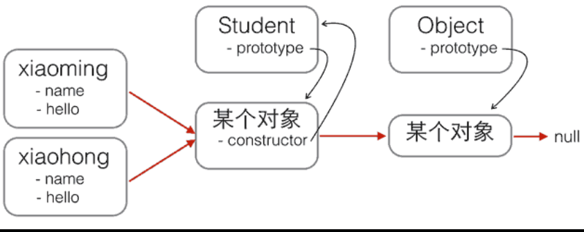
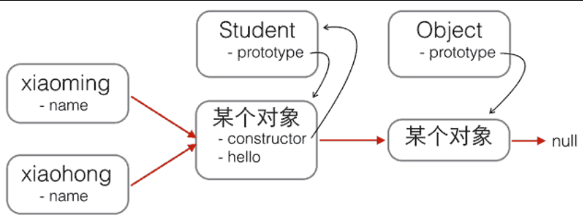
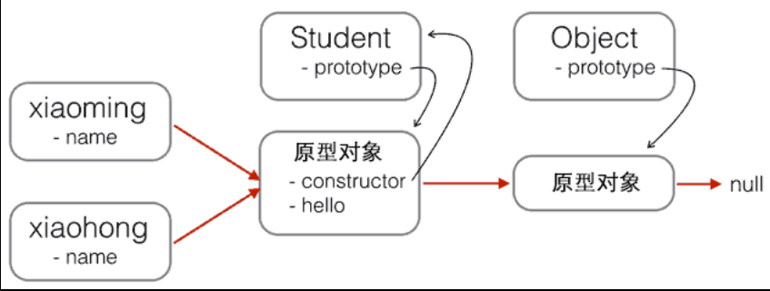
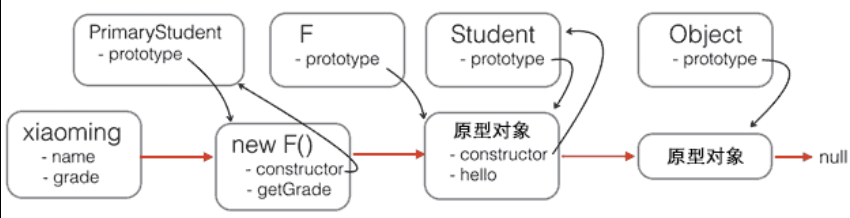
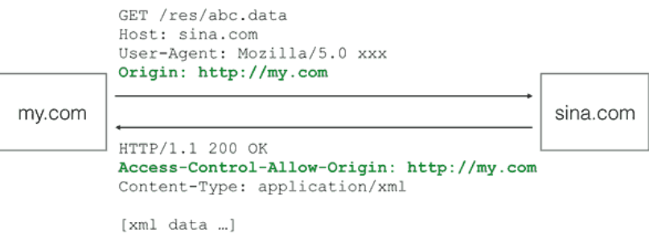
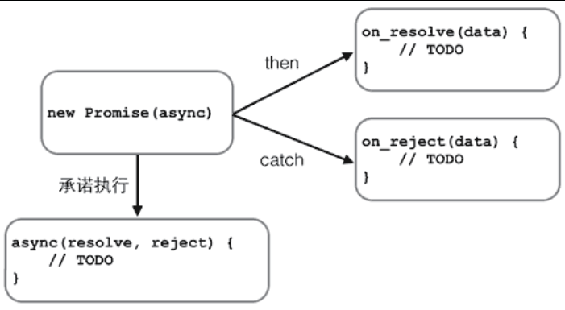
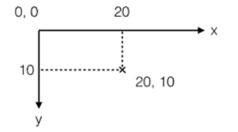

# js学习记录
***
## 快速入门

### 基本语法
> var if 注释等  

```javascript
var x = 1; // 赋值语句
if (2 > 1) {
    x = 1;
    y = 2;
    z = 3;
}

```

### 数据类型
```javascript
123; // 整数123
0.456; // 浮点数0.456
1.2345e3; // 科学计数法表示1.2345x1000，等同于1234.5
-99; // 负数
NaN; // NaN表示Not a Number，当无法计算结果时用NaN表示
Infinity; // Infinity表示无限大，当数值超过了JavaScript的Number所能表示的最大值时，就表示为Infinity

1 + 2; // 3
(1 + 2) * 5 / 2; // 7.5
2 / 0; // Infinity
0 / 0; // NaN
10 % 3; // 1
10.5 % 3; // 1.5
```

**比较**

```javascript
false == 0; // true
false === 0; // false

//第一种是==比较，它会自动转换数据类型再比较

//第二种是===比较，它不会自动转换数据类型，如果数据类型不一致，返回false，如果一致，再比较。

//由于JavaScript这个设计缺陷，不要使用==比较，始终坚持使用===比较。

//特殊！NAN，唯一能判断NaN的方法是通过isNaN()函数：
NaN === NaN; // false
isNaN(NaN); // true

//浮点数计算有精度问题,要计算差的绝对值才可以
Math.abs(1 / 3 - (1 - 2 / 3)) < 0.0000001; // true
```

**数组**

```javascript
//JavaScript的数组可以包括任意数据类型
var arr = [1, 2, 3.14, 'Hello', null, true];
arr[0]; // 返回索引为0的元素，即1
arr[5]; // 返回索引为5的元素，即true
arr[6]; // 索引超出了范围，返回undefined
````

**变量**（只能用var申明**一次**，可以赋值不同类型的变量）
> 变量在JavaScript中就是用一个变量名表示，变量名是大小写英文、数字、$和_的组合，且不能用数字开头。变量名也不能是JavaScript的关键字，如if、while等。申明一个变量用var语句
```javascript
var a; // 申明了变量a，此时a的值为undefined
var $b = 1; // 申明了变量$b，同时给$b赋值，此时$b的值为1
var s_007 = '007'; // s_007是一个字符串
var Answer = true; // Answer是一个布尔值true
var t = null; // t的值是null
```

**strict模式**
>不使用var定义的变量会被自动申明为全局变量，可能会导致冲突，可以用strict模式避免

```javascript
'use strict';
```

### 字符串
多行用反引号\`\`表示
```javascript
`这是一个
多行
字符串`;

console.log('多行\n字符串\n测试'）

var name = '小明';
var age = 20;
var message = `你好, ${name}, 你今年${age}岁了!`; // 里面表达式要用反引号
alert(message);
```
```javascript
var s = 'Hello, world!';

s[0]; // 'H'
s[6]; // ' '
s[7]; // 'w'
s[12]; // '!'
s[13]; // undefined 超出范围的索引不会报错，但一律返回undefined

//需要特别注意的是，字符串是不可变的，如果对字符串的某个索引赋值，不会有任何错误，但是，也没有任何效果：
var s = 'Test';
s[0] = 'X';
alert(s); // s仍然为'Test'
```
>JavaScript为字符串提供了一些常用方法，注意，调用这些方法本身**不会**改变原有字符串的内容，而是返回一个**新字符串**：
```javascript
//toUpperCase()把一个字符串全部变为大写：
var s = 'Hello';
s.toUpperCase(); // 返回'HELLO'

//toLowerCase()把一个字符串全部变为小写：
var s = 'Hello';
var lower = s.toLowerCase(); // 返回'hello'并赋值给变量lower
lower; // 'hello'

//indexOf()会搜索指定字符串出现的位置：
var s = 'hello, world';
s.indexOf('world'); // 返回7
s.indexOf('World'); // 没有找到指定的子串，返回-1

//substring()返回指定索引区间的子串：
var s = 'hello, world'
s.substring(0, 5); // 从索引0开始到5（不包括5），返回'hello'
s.substring(7); // 从索引7开始到结束，返回'world'
```
#### **split(字符串转数组)**
```javascript
var str="How are you doing today?";
var n=str.split();//输出结果How are you doing today?
var n=str.split("");//H,o,w, ,a,r,e, ,y,o,u, ,d,o,i,n,g, ,t,o,d,a,y,?
var n=str.split(" ",3);//使用limit参数，输出How,are,you
var n=str.split("o");//H,w are y,u d,ing t,day?
```

### 数组
```javascript
//直接给Array的length赋一个新的值会导致Array大小的变化：
var arr = [1, 2, 3];
arr.length; // 3
arr.length = 6;
arr; // arr变为[1, 2, 3, undefined, undefined, undefined]
arr.length = 2;
arr; // arr变为[1, 2]


//如果通过索引赋值时，索引超过了范围，同样会引起Array大小的变化：
var arr = [1, 2, 3];
arr[5] = 'x';
arr; // arr变为[1, 2, 3, undefined, undefined, 'x']
```
#### indexof
```javascript
//indexof
var arr = [10, 20, '30', 'xyz'];
arr.indexOf(10); // 元素10的索引为0
arr.indexOf(20); // 元素20的索引为1
arr.indexOf(30); // 元素30没有找到，返回-1
arr.indexOf('30'); // 元素'30'的索引为2
```
#### slice
```javascript
//slice
var arr = ['A', 'B', 'C', 'D', 'E', 'F', 'G'];
arr.slice(0, 3); // 从索引0开始，到索引3结束，但不包括索引3: ['A', 'B', 'C']
arr.slice(3); // 从索引3开始到结束: ['D', 'E', 'F', 'G']

//如果不给slice()传递任何参数，它就会从头到尾截取所有元素。利用这一点，我们可以很容易地复制一个Array：
var arr = ['A', 'B', 'C', 'D', 'E', 'F', 'G'];
var aCopy = arr.slice();
aCopy; // ['A', 'B', 'C', 'D', 'E', 'F', 'G']
aCopy === arr; // false

```
#### splice(修改array万能方法)
```javascript
//splice
//splice()方法是修改Array的“万能方法”，它可以从指定的索引开始删除若干元素，然后再从该位置添加若干元素：
var arr = ['Microsoft', 'Apple', 'Yahoo', 'AOL', 'Excite', 'Oracle'];
// 从索引2开始删除3个元素,然后再添加两个元素:
arr.splice(2, 3, 'Google', 'Facebook'); // 返回删除的元素 ['Yahoo', 'AOL', 'Excite']
arr; // ['Microsoft', 'Apple', 'Google', 'Facebook', 'Oracle']
// 只删除,不添加:
arr.splice(2, 2); // ['Google', 'Facebook']
arr; // ['Microsoft', 'Apple', 'Oracle']
// 只添加,不删除:
arr.splice(2, 0, 'Google', 'Facebook'); // 返回[],因为没有删除任何元素
arr; // ['Microsoft', 'Apple', 'Google', 'Facebook', 'Oracle']
```
#### concat
```javascript
//concat concat()方法并没有修改当前Array，而是返回了一个新的Array。
var arr = ['A', 'B', 'C'];
var added = arr.concat([1, 2, 3]);
added; // ['A', 'B', 'C', 1, 2, 3]
arr; // ['A', 'B', 'C']
//自动拆开
var arr = ['A', 'B', 'C'];
arr.concat(1, 2, [3, 4]); // ['A', 'B', 'C', 1, 2, 3, 4]
```
#### join(连接，数组转字符串)
```javascript
//join join()方法是一个非常实用的方法，它把当前Array的每个元素都用指定的字符串连接起来，然后返回连接后的字符串：如果Array的元素不是字符串，将自动转换为字符串后再连接。
var arr = ['A', 'B', 'C', 1, 2, 3];
arr.join('-'); // 'A-B-C-1-2-3'
```

### 对象
```javascript
//由于JavaScript的对象是动态类型，你可以自由地给一个对象添加或删除属性：
var xiaoming = {
    name: '小明'
};
xiaoming.age; // undefined
xiaoming.age = 18; // 新增一个age属性
xiaoming.age; // 18
delete xiaoming.age; // 删除age属性
xiaoming.age; // undefined
delete xiaoming['name']; // 删除name属性
xiaoming.name; // undefined
delete xiaoming.school; // 删除一个不存在的school属性也不会报错

//如果我们要检测xiaoming是否拥有某一属性，可以用in操作符：
var xiaoming = {
    name: '小明',
    birth: 1990,
    school: 'No.1 Middle School',
    height: 1.70,
    weight: 65,
    score: null
};
'name' in xiaoming; // true
'grade' in xiaoming; // false

//但是用in判断的可能是继承得到的
'toString' in xiaoming; // true

//要判断一个属性是否是xiaoming自身拥有的，而不是继承得到的，可以用hasOwnProperty()方法：
var xiaoming = {
    name: '小明'
};
xiaoming.hasOwnProperty('name'); // true
xiaoming.hasOwnProperty('toString'); // false
```

### 条件判断
>JavaScript把null、undefined、0、NaN和空字符串''视为false，其他值一概视为true

### 循环
```javascript
//要过滤掉对象继承的属性，用hasOwnProperty()来实现：
var o = {
    name: 'Jack',
    age: 20,
    city: 'Beijing'
};
for (var key in o) {
    if (o.hasOwnProperty(key)) {
        console.log(key); // 'name', 'age', 'city'
    }
}
```
### Map和Set

```javascript
//初始化Map需要一个二维数组，或者直接初始化一个空Map。Map具有以下方法：
var m = new Map(); // 空Map
m.set('Adam', 67); // 添加新的key-value
m.set('Bob', 59);
m.has('Adam'); // 是否存在key 'Adam': true
m.get('Adam'); // 67
m.delete('Adam'); // 删除key 'Adam'
m.get('Adam'); // undefined

//由于一个key只能对应一个value，所以，多次对一个key放入value，后面的值会把前面的值冲掉：
var m = new Map();
m.set('Adam', 67);
m.set('Adam', 88);
m.get('Adam'); // 88
```
**set中没有重复的key**
```javascript
//Set和Map类似，也是一组key的集合，但不存储value。由于key不能重复，所以，在Set中，没有重复的key。
var s1 = new Set(); // 空Set
var s2 = new Set([1, 2, 3]); // 含1, 2, 3
//重复元素在Set中自动被过滤：
var s = new Set([1, 2, 3, 3, '3']);
s; // Set {1, 2, 3, "3"}，注意数字3和字符串'3'是不同的元素。
s.add(4);
s; // Set {1, 2, 3, 4}
s.add(4);
s; // 仍然是 Set {1, 2, 3, 4}，重复添加无效

var s = new Set([1, 2, 3]);
s; // Set {1, 2, 3}
s.delete(3);
s; // Set {1, 2}
```

### iterable
>for...of
```javascript
//遍历
var a = ['A', 'B', 'C'];
var s = new Set(['A', 'B', 'C']);
var m = new Map([[1, 'x'], [2, 'y'], [3, 'z']]);
for (var x of a) { // 遍历Array
    console.log(x);
}
for (var x of s) { // 遍历Set
    console.log(x);
}
for (var x of m) { // 遍历Map
    console.log(x[0] + '=' + x[1]);
}


'use strict';
var a = ['A', 'B', 'C'];
a.forEach(function (element, index, array) {
    // element: 指向当前元素的值
    // index: 指向当前索引
    // array: 指向Array对象本身
    console.log(element + ', index = ' + index);
});
```

## 函数

### 函数的定义和调用

```javascript
//方法一
function abs(x) {
    if (x >= 0) {
        return x;
    } else {
        return -x;
    }
}

//方法二
var abs = function (x) {
    if (x >= 0) {
        return x;
    } else {
        return -x;
    }
};//结尾加一个;表示赋值语句结束

//由于JavaScript允许传入任意个参数而不影响调用，因此传入的参数比定义的参数多也没有问题，虽然函数内部并不需要这些参数：
abs(10, 'blablabla'); // 返回10
abs(-9, 'haha', 'hehe', null); // 返回9
abs(); // 返回NaN

//求和
let result = 0;
    rest.forEach(n => {
        result += n;
    })
    return result;
}
```

### **变量作用域结构解析（*解构赋值*）**
```javascript
//javascript函数可以相互嵌套
'use strict';
function foo() {
    var x = 1;
    function bar() {
        var x = 'A';
        console.log('x in bar() = ' + x); // 'A'
    }
    console.log('x in foo() = ' + x); // 1
    bar();
}

foo();//x in foo() = 1 x in bar() = A
//这说明JavaScript的函数在查找变量时从自身函数定义开始，从“内”向“外”查找。如果内部函数定义了与外部函数重名的变量，则内部函数的变量将“屏蔽”外部函数的变量。

//函数提前声明
'use strict';

function foo() {
    var x = 'Hello, ' + y;
    console.log(x);
    var y = 'Bob';
}

foo();

//将变量提升到最顶部，实际上的解释为
function foo() {
    var y; // 提升变量y的申明，此时y为undefined
    var x = 'Hello, ' + y;
    console.log(x);
    y = 'Bob';
}

//不在任何函数内定义的变量就具有全局作用域。实际上，JavaScript默认有一个全局对象window，全局作用域的变量实际上被绑定到window的一个属性：
'use strict';

window.alert('调用window.alert()');
// 把alert保存到另一个变量:
var old_alert = window.alert;
// 给alert赋一个新函数:
window.alert = function () {}

// 恢复alert:
window.alert = old_alert;
alert('又可以用alert()了!');

//全局变量由于会绑定到windows上，所以可能产生冲突，最好的方法是将所有变量绑定到一个全局变量上，例如：
// 唯一的全局变量MYAPP:
var MYAPP = 0;
//其他变量
MYAPP.name = 'myapp';
MYAPP.version = 1.0;

//其他函数
MYAPP.foo = function(){
	return 'foo'
}
//把自己的代码全部放入唯一的名字空间MYAPP中，会大大减少全局变量冲突的可能。

//解构赋值
'use strict';

// 如果浏览器支持解构赋值就不会报错:
var [x, y, z] = ['hello', 'JavaScript', 'ES6'];//多个变量要用[...]括起来。
'use strict';
// x, y, z分别被赋值为数组对应元素:
console.log('x = ' + x + ', y = ' + y + ', z = ' + z);
x = hello, y = JavaScript, z = ES6

//如果数组本身还有嵌套，也可以通过下面的形式进行解构赋值，注意嵌套层次和位置要保持一致：
let [x, [y, z]] = ['hello', ['JavaScript', 'ES6']];
x; // 'hello'
y; // 'JavaScript'
z; // 'ES6'
//还可以忽略某些元素
let [, , z] = ['hello', 'JavaScript', 'ES6']; // 忽略前两个元素，只对z赋值第三个元素
z; // 'ES6'

//从某个对象中取出若干属性
'use strict';

var person = {
    name: '小明',
    age: 20,
    gender: 'male',
    passport: 'G-12345678',
    school: 'No.4 middle school'
};
var {name, age, passport} = person;

```
```javascript
//对一个对象进行解构赋值时，同样可以直接对嵌套的对象属性进行赋值，只要保证对应的层次是一致的：

var person = {
    name: '小明',
    age: 20,
    gender: 'male',
    passport: 'G-12345678',
    school: 'No.4 middle school',
    address: {
        city: 'Beijing',
        street: 'No.1 Road',
        zipcode: '100001'
    }
};
var {name, address: {city, zip}} = person;
name; // '小明'
city; // 'Beijing'
zip; // undefined, 因为属性名是zipcode而不是zip
// 注意: address不是变量，而是为了让city和zip获得嵌套的address对象的属性:
address; // Uncaught ReferenceError: address is not defined

//使用解构赋值对对象属性进行赋值时，如果对应的属性不存在，变量将被赋值为undefined，这和引用一个不存在的属性获得undefined是一致的。如果要使用的变量名和属性名不一致，可以用下面的语法获取：

var person = {
    name: '小明',
    age: 20,
    gender: 'male',
    passport: 'G-12345678',
    school: 'No.4 middle school'
};

// 把passport属性赋值给变量id:
let {name, passport:id} = person;
name; // '小明'
id; // 'G-12345678'
// 注意: passport不是变量，而是为了让变量id获得passport属性:
passport; // Uncaught ReferenceError: passport is not defined

//有些时候，如果变量已经被声明了，再次赋值的时候，正确的写法也会报语法错误：

// 声明变量:
var x, y;
// 解构赋值:
{x, y} = { name: '小明', x: 100, y: 200};
// 语法错误: Uncaught SyntaxError: Unexpected token =
//这是因为JavaScript引擎把{开头的语句当作了块处理，于是=不再合法。解决方法是用小括号括起来：

({x, y} = { name: '小明', x: 100, y: 200});
```

### 方法
>绑定到对象上的函数称为方法
```javascript
var xiaoming = {
    name: '小明',
    birth: 1990,
    age: function () {
        var y = new Date().getFullYear();
        return y - this.birth;//在一个方法内部，this是一个特殊变量，它始终指向当前对象，也就是xiaoming这个变量。所以，this.birth可以拿到xiaoming的birth属性。
    }
};

xiaoming.age; // function xiaoming.age()
xiaoming.age(); // 今年调用是25,明年调用就变成26了

//在strict条件下，在内部建立新函数的时候this指向内部一层。在外部先用一个that捕获this
//用var that = this;，你就可以放心地在方法内部定义其他函数，而不是把所有语句都堆到一个方法中。
'use strict';

var xiaoming = {
    name: '小明',
    birth: 1990,
    age: function () {
        var that = this; // 在方法内部一开始就捕获this
        function getAgeFromBirth() {
            var y = new Date().getFullYear();
            return y - that.birth; // 用that而不是this
        }
        return getAgeFromBirth();
    }
};

xiaoming.age(); // 25

//要指定函数的this指向哪个对象，可以用函数本身的apply方法，它接收两个参数，第一个参数就是需要绑定的this变量，第二个参数是Array，表示函数本身的参数。
function getAge() {
    var y = new Date().getFullYear();
    return y - this.birth;
}

var xiaoming = {
    name: '小明',
    birth: 1990,
    age: getAge
};

xiaoming.age(); // 25
getAge.apply(xiaoming, []); // 25, this指向xiaoming, 参数为空

//与apply类似的是call，apply传入的是数组，call是按顺序传入参数。
//对普通函数调用，我们通常把this绑定为null。
Math.max.apply(null, [3, 5, 4]); // 5
Math.max.call(null, 3, 5, 4); // 5

//利用apply()，我们还可以动态改变函数的行为。
//JavaScript的所有对象都是动态的，即使内置的函数，我们也可以重新指向新的函数。
//现在假定我们想统计一下代码一共调用了多少次parseInt()，可以把所有的调用都找出来，然后手动加上count += 1，不过这样做太傻了。最佳方案是用我们自己的函数替换掉默认的parseInt()：
'use strict';

var count = 0;
var oldParseInt = parseInt; // 保存原函数

window.parseInt = function () {
    count += 1;
    return oldParseInt.apply(null, arguments); // 调用原函数
};
// 测试:
parseInt('10');
parseInt('20');
parseInt('30');
console.log('count = ' + count); // 3

```

### 高阶函数
>函数内可以接收以另一个函数作为参数

#### Map/Reduce

##### Map

```javascript
//由于map()方法定义在JavaScript的Array中，我们调用Array的map()方法，传入我们自己的函数，就得到了一个新的Array作为结果：
'use strict';

function pow(x) {
    return x * x;
}
var arr = [1, 2, 3, 4, 5, 6, 7, 8, 9];
var results = arr.map(pow); // [1, 4, 9, 16, 25, 36, 49, 64, 81]
console.log(results);

//map可以计算任何抽象函数
var arr = [1, 2, 3, 4, 5, 6, 7, 8, 9];
arr.map(String); // ['1', '2', '3', '4', '5', '6', '7', '8', '9']
```

##### Reduce
```javascript
//再看reduce的用法。Array的reduce()把一个函数作用在这个Array的[x1, x2, x3...]上，这个函数必须接收两个参数，reduce()把结果继续和序列的下一个元素做累积计算，其效果就是：
[x1, x2, x3, x4].reduce(f) = f(f(f(x1, x2), x3), x4)

//比如对一个函数的求和
var arr = [1, 3, 5, 7, 9];
arr.reduce(function (x, y) {
    return x + y;
}); // 25

//求积
'use strict';
//两种写法
function product(arr) {
    return arr.reduce((x,y)=>{return x*y});
}
function product(arr) {
    return arr.reduce(function (x,y){
        return x*y;
    });
}
// 测试:
if (product([1, 2, 3, 4]) === 24 && product([0, 1, 2]) === 0 && product([99, 88, 77, 66]) === 44274384) {
    console.log('测试通过!');
}
else {
    console.log('测试失败!');
}

//要把[1, 3, 5, 7, 9]变换成整数13579，reduce()也能派上用场：
var arr = [1, 3, 5, 7, 9];
arr.reduce(function (x, y) {
    return x * 10 + y;
}); // 13579
//如果我们继续改进这个例子，想办法把一个字符串13579先变成Array——[1, 3, 5, 7, 9]，再利用reduce()就可以写出一个把字符串转换为Number的函数。

//练习：不要使用JavaScript内置的parseInt()函数，利用map和reduce操作实现一个string2int()函数：
function string2int(s) {
    function str2array(s){//将字符串转变为数组
        var a = [];
        for (ch of s){
            a.push(ch);
        }
        return a;
    }
    charArray = str2array(s);
    intArray = charArray.map(function (ch){return ch-'0';});//与0比较
    return intArray.reduce(function (x,y){return x*10 + y;});//计算结果
}
//或者使用split进行分割
return s.split("").map((s)=>{return s-0}).reduce((x,y)=>{return x*10+y});

//请把用户输入的不规范的英文名字，变为首字母大写，其他小写的规范名字。输入：['adam', 'LISA', 'barT']，输出：['Adam', 'Lisa', 'Bart']。
//一一对应，使用map
function normalize(arr) {
    function norm(s){//将首字母变成大写，利用数组第一位变大写
        s1=s[0];
        s2=s.substring(1);
        return s1.toUpperCase()+s2.toLowerCase();
    }
    return arr.map(norm);
}
//小明希望利用map()把字符串变成整数，他写的代码很简洁：
'use strict';

var arr = ['1', '2', '3'];
var r;
r=arr.map(parseInt)//1,NaN,NaN
//原因：由于map()接收的回调函数可以有3个参数：callback(currentValue, index, array)，通常我们仅需要第一个参数，而忽略了传入的后面两个参数。不幸的是，parseInt(string, radix)没有忽略第二个参数，导致实际执行的函数分别是：
//parseInt('1', 0); // 1, 按十进制转换
//parseInt('2', 1); // NaN, 没有一进制
//parseInt('3', 2); // NaN, 按二进制转换不允许出现3
//可以改为r = arr.map(Number);，因为Number(value)函数仅接收一个参数。
```

#### Filter(过滤，去重)
>用于把array的某些元素过滤掉，然后返回剩下的元素，true保留，false丢弃
```javascript
//例如，在一个Array中，删掉偶数，只保留奇数，可以这么写：
var arr = [1, 2, 4, 5, 6, 9, 10, 15];
var r = arr.filter(function (x) {
    return x % 2 !== 0;
});
r; // [1, 5, 9, 15]

//把一个Array中的空字符串删掉，可以这么写：
var arr = ['A', '', 'B', null, undefined, 'C', '  '];
var r = arr.filter(function (s) {
    return s && s.trim(); // 注意：IE9以下的版本没有trim()方法
});
r; // ['A', 'B', 'C']

//回调函数
//filter()接收的回调函数，其实可以有多个参数。通常我们仅使用第一个参数，表示Array的某个元素。回调函数还可以接收另外两个参数，表示元素的位置和数组本身：
var arr = ['A', 'B', 'C'];
var r = arr.filter(function (element, index, self) {
    console.log(element); // 依次打印'A', 'B', 'C'
    console.log(index); // 依次打印0, 1, 2
    console.log(self); // self就是变量arr
    return true;
});

//利用filter，可以巧妙地去除Array的重复元素：
'use strict';
var
    r,
    arr = ['apple', 'strawberry', 'banana', 'pear', 'apple', 'orange', 'orange', 'strawberry'];
r = arr.filter(function (element, index, self) {
    return self.indexOf(element) === index;//去除重复元素依靠的是indexOf总是返回第一个元素的位置，后续的重复元素位置与indexOf返回的位置不相等，因此被filter滤掉了。
});

//筛选素数
'use strict';

function get_primes(arr) {
    return arr.filter(function(x){
            var a = x;
            var c = 0;
            for (var b = 2; b < a; b++) {
                if (a % b !== 0) {
                    c++;
                };
            };
            if(c === (a - 2)) {//如果相等说明，公约数只有a和1，是质数，所以保留
                return true;
            }else {
                return false;
            }
        });
        
  	//另一种解法
  	return arr.filter((value, index, array) => {
    // return 素数
    for (let i = 2; i <= Math.floor(value / 2); i++) {
        if (value % i === 0) {
            return false
        }
    }
    return value !== 1 // 1 不是素数
 }
 // 测试:
var
    x,
    r,
    arr = [];
for (x = 1; x < 100; x++) {
    arr.push(x);
}
r = get_primes(arr);
if (r.toString() === [2, 3, 5, 7, 11, 13, 17, 19, 23, 29, 31, 37, 41, 43, 47, 53, 59, 61, 67, 71, 73, 79, 83, 89, 97].toString()) {
    console.log('测试通过!');
} else {
    console.log('测试失败: ' + r.toString());
}
```

#### sort
>先转换成字符串再进行得比较，所以会有坑
>对于两个元素x和y，如果认为x < y，则返回-1，如果认为x == y，则返回0，如果认为x > y，则返回1
>sort()方法会直接对Array进行修改，它返回的结果仍是当前Array：
>1.sort 函数默认按 ASCII 排序，很多语言都是这样
>2.sort 函数的底层是用 TimSort 算法实现的，这个算法是工业级算法，Python，JAVA 的 sort 函数底层都是这个
>3.**不是冒泡排序！不是冒泡排序！** **不是冒泡排序！楼下涉及到冒泡排序实现的都是错的！**别被下面的教程误导！冒泡排序是最简单也是效率最低的算法，除了考试业内没几个人用！
>4.新人学习没有必要纠结为什么这样，你先接受了，有一定的基础再研究为什么，要不然就是钻到牛角尖里了
```javascript
// 看上去正常的结果:
['Google', 'Apple', 'Microsoft'].sort(); // ['Apple', 'Google', 'Microsoft'];

// apple排在了最后:
['Google', 'apple', 'Microsoft'].sort(); // ['Google', 'Microsoft", 'apple']

// 无法理解的结果:
[10, 20, 1, 2].sort(); // [1, 10, 2, 20]
//第二个排序把apple排在了最后，是因为字符串根据ASCII码进行排序，而小写字母a的ASCII码在大写字母之后。
//第三个排序结果是什么鬼？简单的数字排序都能错？
//这是因为Array的sort()方法默认把所有元素先转换为String再排序，结果'10'排在了'2'的前面，因为字符'1'比字符'2'的ASCII码小。

//但是可以自定义，对于数字的排序写法
'use strict';
var arr = [10, 20, 1, 2];
arr.sort(function (x, y) {
    if (x < y) {
        return -1;
    }
    if (x > y) {
        return 1;
    }
    return 0;
});
console.log(arr); // [1, 2, 10, 20]
//如果要倒叙
var arr = [10, 20, 1, 2];
arr.sort(function (x, y) {
    if (x < y) {
        return 1;//这个地方改变
    }
    if (x > y) {
        return -1;
    }
    return 0;
}); // [20, 10, 2, 1]

//如果要忽略大小写，直接用首字母来排序。可以自己定义
var arr = ['Google', 'apple', 'Microsoft'];
arr.sort(function(a,b){
	x1 = a.toUpperCase();
    x2 = b.toUpperCase();
	if(x1<x2){
		return -1;
	}
	else if(x1>x2)
		return 1;
	return 0;
});// ['apple', 'Google', 'Microsoft']

var a1 = ['B', 'A', 'C'];
var a2 = a1.sort();
a1; // ['A', 'B', 'C']
a2; // ['A', 'B', 'C']
a1 === a2; // true, a1和a2是同一对象
```
#### Array
>对于数组，除了map()、reduce、filter()、sort()这些方法可以传入一个函数外，Array对象还提供了很多非常实用的高阶函数。

##### every
```javascript
//every()方法可以判断数组的所有元素是否满足测试条件。
//例如，给定一个包含若干字符串的数组，判断所有字符串是否满足指定的测试条件：
'use strict';
var arr = ['Apple', 'pear', 'orange'];
console.log(arr.every(function (s) {
    return s.length > 0;
})); // true, 因为每个元素都满足s.length>0
console.log(arr.every(function (s) {
    return s.toLowerCase() === s;
})); // false, 因为不是每个元素都全部是小写
```

##### find
```javascript
//find()方法用于查找符合条件的第一个元素，如果找到了，返回这个元素，否则，返回undefined：
'use strict';
var arr = ['Apple', 'pear', 'orange'];
console.log(arr.find(function (s) {
    return s.toLowerCase() === s;
})); // 'pear', 因为pear全部是小写

console.log(arr.find(function (s) {
    return s.toUpperCase() === s;
})); // undefined, 因为没有全部是大写的元素
```

##### findIndex
```javascript
//findIndex()和find()类似，也是查找符合条件的第一个元素，不同之处在于findIndex()会返回这个元素的索引，如果没有找到，返回-1：
'use strict';
var arr = ['Apple', 'pear', 'orange'];
console.log(arr.findIndex(function (s) {
    return s.toLowerCase() === s;
})); // 1, 因为'pear'的索引是1

console.log(arr.findIndex(function (s) {
    return s.toUpperCase() === s;
})); // -1

```

##### forEach
```javascript
//forEach()和map()类似，它也把每个元素依次作用于传入的函数，但不会返回新的数组。forEach()常用于遍历数组，因此，传入的函数不需要返回值：
'use strict';
var arr = ['Apple', 'pear', 'orange'];
arr.forEach(console.log); // 依次打印每个元素

```

### 闭包
>高阶函数除了可以接受函数作为参数外，还可以把函数作为结果值返回。
>返回闭包时牢记的一点就是：返回函数不要引用任何循环变量，或者后续会发生变化的变量。(会取最后一次变换之后的值)
```javascript
//我们来实现一个对Array的求和。通常情况下，求和的函数是这样定义的：
function sum(arr) {
    return arr.reduce(function (x, y) {
        return x + y;
    });
}
sum([1, 2, 3, 4, 5]); // 15

//但是，如果不需要立刻求和，而是在后面的代码中，根据需要再计算怎么办？可以不返回求和的结果，而是返回求和的函数！
function lazy_sum(arr) {
    var sum = function () {
        return arr.reduce(function (x, y) {
            return x + y;
        });
    }
    return sum;
}

//当我们调用lazy_sum()时，返回的并不是求和结果，而是求和函数：
var f = lazy_sum([1, 2, 3, 4, 5]); // function sum()
//调用函数f时，才真正计算求和的结果：
f(); // 15

//请再注意一点，当我们调用lazy_sum()时，每次调用都会返回一个新的函数，即使传入相同的参数：
var f1 = lazy_sum([1, 2, 3, 4, 5]);
var f2 = lazy_sum([1, 2, 3, 4, 5]);
f1 === f2; // false  f1()和f2()的调用结果互不影响。

//如果一定要引用循环变量怎么办？方法是再创建一个函数，用该函数的参数绑定循环变量当前的值，无论该循环变量后续如何更改，已绑定到函数参数的值不变：
function count() {
    var arr = [];
    for (var i=1; i<=3; i++) {
        arr.push((function (n) {
            return function () {
                return n * n;//这样绑定的n后续不会发生变化
            }
        })(i));
    }
    return arr;
}

var results = count();
var f1 = results[0];
var f2 = results[1];
var f3 = results[2];

f1(); // 1
f2(); // 4
f3(); // 9

//理论上讲，创建一个匿名函数并立刻执行可以这么写：
function (x) { return x * x } (3);
//但是由于JavaScript语法解析的问题，会报SyntaxError错误，因此需要用括号把整个函数定义括起来：
(function (x) { return x * x }) (3);
//通常，一个立即执行的匿名函数可以把函数体拆开，一般这么写：
(function (x) {
    return x * x;
})(3);

//在没有class机制，只有函数的语言里，借助闭包，同样可以封装一个私有变量。我们用JavaScript创建一个计数器：
'use strict';
function create_counter(initial) {
    var x = initial || 0;
    return {
        inc: function () {
            x += 1;
            return x;
        }
    }
}
//使用
var c1 = create_counter();
c1.inc(); // 1
c1.inc(); // 2
c1.inc(); // 3

var c2 = create_counter(10);
c2.inc(); // 11
c2.inc(); // 12
c2.inc(); // 13

//在返回的对象中，实现了一个闭包，该闭包携带了局部变量x，并且，从外部代码根本无法访问到变量x。换句话说，闭包就是携带状态的函数，并且它的状态可以完全对外隐藏起来。

//闭包还可以把多参数的函数变成单参数的函数。例如，要计算xy可以用Math.pow(x, y)函数，不过考虑到经常计算x2或x3，我们可以利用闭包创建新的函数pow2和pow3：
'use strict';

function make_pow(n) {
    return function (x) {
        return Math.pow(x, n);
    }
}
// 创建两个新函数:
var pow2 = make_pow(2);
var pow3 = make_pow(3);

console.log(pow2(5)); // 25
console.log(pow3(7)); // 343

```
#### 闭包自定义次数
```javascript
'use strict';

// 定义数字0:
var zero = function (f) {
    return function (x) {
        return x;
    }
};

// 定义数字1:
var one = function (f) {
    return function (x) {
        return f(x);
    }
};

// 定义加法:
function add(n, m) {
    return function (f) {
        return function (x) {
            return m(f)(n(f)(x));
        }
    }
}
// 计算数字2 = 1 + 1:
var two = add(one, one);

// 计算数字3 = 1 + 2:
var three = add(one, two);

// 计算数字5 = 2 + 3:
var five = add(two, three);

// 你说它是3就是3，你说它是5就是5，你怎么证明？

// 呵呵，看这里:

// 给3传一个函数,会打印3次:
(three(function () {
    console.log('print 3 times');
}))();

// 给5传一个函数,会打印5次:
(five(function () {
    console.log('print 5 times');
}))();

// 继续接着玩一会...
zero(f)(x) = x;
one(f)(x) = f(x);
two(f)(x) = one(f)(one(f)(x)) = one(f)(f(x)) = f(f(x));
three(f)(x) = two(f)(one(f)(x)) = two(f)(f(x)) = f(f(f(x)));
...
five(f)(x) = f(f(f(f(f(x)))));
```

### 箭头函数
```javascript
//x => x * x 相当于 function (x) {	return x * x;}

//两种定义方式
var fn = x => x * x;//1

x => {//2
    if (x > 0) {
        return x * x;
    }
    else {
        return - x * x;
    }
}

//如果参数不是一个，就需要用括号()括起来：
// 两个参数:
(x, y) => x * x + y * y

// 无参数:
() => 3.14

// 可变参数:
(x, y, ...rest) => {
    var i, sum = x + y;
    for (i=0; i<rest.length; i++) {
        sum += rest[i];
    }
    return sum;
}

//如果要返回一个对象，就要注意，如果是单表达式，这么写的话会报错：
// SyntaxError:
x => { foo: x }
//因为和函数体的{ ... }有语法冲突，所以要改为：
// ok:
x => ({ foo: x })

```
#### **this(面试，js中this的指向)**
>箭头函数看上去是匿名函数的一种简写，但实际上，箭头函数和匿名函数有个明显的区别：箭头函数内部的this是词法作用域，由上下文确定。
>this指向 https://juejin.cn/post/6844903746984476686
>
>箭头函数：https://www.open-open.com/lib/view/open1482063707519.html

```javascript
//回顾前面的例子，由于JavaScript函数对this绑定的错误处理，下面的例子无法得到预期结果：
var obj = {
    birth: 1990,
    getAge: function () {
        var b = this.birth; // 1990
        var fn = function () {
            return new Date().getFullYear() - this.birth; // this指向window或undefined
        };
        return fn();
    }
};
//现在，箭头函数完全修复了this的指向，this总是指向词法作用域，也就是外层调用者obj：
var obj = {
    birth: 1990,
    getAge: function () {
        var b = this.birth; // 1990
        var fn = () => new Date().getFullYear() - this.birth; // this指向obj对象
        return fn();
    }
};
obj.getAge(); // 25

//由于this在箭头函数中已经按照词法作用域绑定了，所以，用call()或者apply()调用箭头函数时，无法对this进行绑定，即传入的第一个参数被忽略：
var obj = {
    birth: 1990,
    getAge: function (year) {
        var b = this.birth; // 1990
        var fn = (y) => y - this.birth; // this.birth仍是1990
        return fn.call({birth:2000}, year);
    }
};
obj.getAge(2015); // 25

//箭头函数简化sort
'use strict'
var arr = [10, 20, 1, 2];
arr.sort((x, y) => {
    return x-y;//x>y的话就是1，x<y是-1，相等为0
});
console.log(arr); // [1, 2, 10, 20]
```

### generator
>由function*定义，除了return还可以用yield返回多次
>generator还有另一个巨大的好处，就是把异步回调代码变成“同步”代码。这个好处要等到后面学了AJAX以后才能体会到

```javascript
function* foo(x) {
    yield x + 1;
    yield x + 2;
    return x + 3;
}

//要编写一个产生斐波那契数列的函数，可以这么写：
function fib(max) {
    var
        t,
        a = 0,
        b = 1,
        arr = [0, 1];
    while (arr.length < max) {
        [a, b] = [b, a + b];
        arr.push(b);
    }
    return arr;
}

// 测试:
fib(5); // [0, 1, 1, 2, 3]
fib(10); // [0, 1, 1, 2, 3, 5, 8, 13, 21, 34]

//函数只能返回一次，所以必须返回一个Array。但是，如果换成generator，就可以一次返回一个数，不断返回多次。用generator改写如下：
function* fib(max) {
    var
        t,
        a = 0,
        b = 1,
        n = 0;
    while (n < max) {
        yield a;
        [a, b] = [b, a + b];
        n ++;
    }
    return;
}

//直接调用试试：
fib(5); // fib {[[GeneratorStatus]]: "suspended", [[GeneratorReceiver]]: Window}
//直接调用一个generator和调用函数不一样，fib(5)仅仅是创建了一个generator对象，还没有去执行它。调用generator对象有两个方法，一是不断地调用generator对象的next()方法：

var f = fib(5);
f.next(); // {value: 0, done: false}
f.next(); // {value: 1, done: false}
f.next(); // {value: 1, done: false}
f.next(); // {value: 2, done: false}
f.next(); // {value: 3, done: false}
f.next(); // {value: undefined, done: true}
//next()方法会执行generator的代码，然后，每次遇到yield x;就返回一个对象{value: x, done: true/false}，然后“暂停”。返回的value就是yield的返回值，done表示这个generator是否已经执行结束了。如果done为true，则value就是return的返回值。当执行到done为true时，这个generator对象就已经全部执行完毕，不要再继续调用next()了。

//第二个方法是直接用for ... of循环迭代generator对象，这种方式不需要我们自己判断done：
'use strict'

function* fib(max) {
    var
        t,
        a = 0,
        b = 1,
        n = 0;
    while (n < max) {
        yield a;
        [a, b] = [b, a + b];
        n ++;
    }
    return;
}
for (var x of fib(10)) {
    console.log(x); // 依次输出0, 1, 1, 2, 3, ...
}

//记录状态
function* next_id() {
let seqNo = 1;                // 从 1 开始自增采号
    while(true) {               //  不限制自增变量的大小
        yield seqNo++;      // 自增后暂停
    }
    return; // 可以省略，function 会作隐式返回，即：return undefined;
}
// 测试:
var
    x,
    pass = true,
    g = next_id();
for (x = 1; x < 100; x ++) {
    if (g.next().value !== x) {
        pass = false;
        console.log('测试失败!');
        break;
    }
}
if (pass) {
    console.log('测试通过!');
}
```

## 标准对象
>1. 不要包装对象（不要new），尤其是string
>2. 不要使用new Number()、new Boolean()、new String()创建包装对象；
>3. 用parseInt()或parseFloat()来转换任意类型到number；
>4. 用String()来转换任意类型到string，或者直接调用某个对象的toString()方法；
>5. 通常不必把任意类型转换为boolean再判断，因为可以直接写if (myVar) {...}；
>6. typeof操作符可以判断出number、boolean、string、function和undefined；
>7. 判断Array要使用Array.isArray(arr)；
>8. 判断null请使用myVar === null；
>9. 判断某个全局变量是否存在用typeof window.myVar === 'undefined'；
>10. 函数内部判断某个变量是否存在用typeof myVar === 'undefined'。
>任何对象都有toString()方法吗？null和undefined就没有！确实如此，这两个特殊值要除外，虽然null还伪装成了object类型。

```javascript
//但是某些对象还是和其他对象不太一样。为了区分对象的类型，我们用typeof操作符获取对象的类型，它总是返回一个字符串：
typeof 123; // 'number'
typeof NaN; // 'number'
typeof 'str'; // 'string'
typeof true; // 'boolean'
typeof undefined; // 'undefined'
typeof Math.abs; // 'function'
typeof null; // 'object'
typeof []; // 'object'
typeof {}; // 'object'

//包装对象
var n = new Number(123); // 123,生成了新的包装类型
var b = new Boolean(true); // true,生成了新的包装类型
var s = new String('str'); // 'str',生成了新的包装类型
//虽然包装对象看上去和原来的值一模一样，显示出来也是一模一样，但他们的类型已经变为object了！所以，包装对象和原始值用===比较会返回false：
typeof new Number(123); // 'object'
new Number(123) === 123; // false

typeof new Boolean(true); // 'object'
new Boolean(true) === true; // false

typeof new String('str'); // 'object'
new String('str') === 'str'; // false

//更细心的同学指出，number对象调用toString()报SyntaxError：

123.toString(); // SyntaxError
//遇到这种情况，要特殊处理一下：

123..toString(); // '123', 注意是两个点！
(123).toString(); // '123'
```

### Date
```javascript
//注意，当前时间是浏览器从本机操作系统获取的时间，所以不一定准确，因为用户可以把当前时间设定为任何值。
var now = new Date();
now; // Wed Jun 24 2015 19:49:22 GMT+0800 (CST)
now.getFullYear(); // 2015, 年份
now.getMonth(); // 5, 月份，注意月份范围是0~11，5表示六月
now.getDate(); // 24, 表示24号
now.getDay(); // 3, 表示星期三
now.getHours(); // 19, 24小时制
now.getMinutes(); // 49, 分钟
now.getSeconds(); // 22, 秒
now.getMilliseconds(); // 875, 毫秒数
now.getTime(); // 1435146562875, 以number形式表示的时间戳

//如果要创建一个指定日期和时间的Date对象，可以用：
var d = new Date(2015, 5, 19, 20, 15, 30, 123);//JavaScript的月份范围用整数表示是0~11，0表示一月，1表示二月……，所以要表示6月，我们传入的是5！
d; // Fri Jun 19 2015 20:15:30 GMT+0800 (CST)

//第二种创建一个指定日期和时间的方法是解析一个符合ISO 8601格式的字符串：
var d = Date.parse('2015-06-24T19:49:22.875+08:00');
d; // 1435146562875

//Date对象表示的时间总是按浏览器所在时区显示的，不过我们既可以显示本地时间，也可以显示调整后的UTC时间：

var d = new Date(1435146562875);
d.toLocaleString(); // '2015/6/24 下午7:49:22'，本地时间（北京时区+8:00），显示的字符串与操作系统设定的格式有关
d.toUTCString(); // 'Wed, 24 Jun 2015 11:49:22 GMT'，UTC时间，与本地时间相差8小时
```

### **RegExp(正则表达式)**

#### 基础
>* 正则的设计思想是用一种描述性的语言来给字符串定义一个规则，凡是符合规则的字符串，我们就认为它“匹配”了，否则，该字符串就是不合法的。
>* \d可以匹配一个数字，\w可以匹配一个字母或数字，\s表示一个空格
>* .匹配任意字符
>* 匹配变长字符，\*表示任意多个，+表示至少一个，？表示0或1个，{n}表示n个，{n,m}表示n到m个。

判断一个字符串是否是合法的Email的方法是：
1. 创建一个匹配Email的正则表达式；
2. 用该正则表达式去匹配用户的输入来判断是否合法。  

在正则表达式中，如果直接给出字符，就是精确匹配。用\d可以匹配一个数字，\w可以匹配一个字母或数字，所以：
* '00\d'可以匹配'007'，但无法匹配'00A'；
* '\d\d\d'可以匹配'010'；
* '\w\w'可以匹配'js'；  

**.** 可以匹配任意字符，所以：

* 'js.'可以匹配'jsp'、'jss'、'js!'等等。  

要匹配变长的字符，在正则表达式中，用\*表示任意个字符（包括0个），用+表示至少一个字符，用?表示0个或1个字符，用{n}表示n个字符，用{n,m}表示n-m个字符：  

来看一个复杂的例子：**\d{3}\s+\d{3,8}** 
我们来从左到右解读一下：
1. \d{3}表示匹配3个数字，例如'010'；
2. \s可以匹配一个空格（也包括Tab等空白符），所以\s+表示至少有一个空格，例如匹配' '，'\t\t'等；
3. \d{3,8}表示3-8个数字，例如'1234567'。

综合起来，上面的正则表达式可以匹配以任意个空格隔开的带区号的电话号码。  

如果要匹配'010-12345'这样的号码呢？由于'-'是特殊字符，在正则表达式中，要用'\'转义，所以，上面的正则是\d{3}\-\d{3,8}。   

但是，仍然无法匹配'010 - 12345'，因为带有空格。所以我们需要更复杂的匹配方式。  

#### 进阶
>要做更精确地匹配，可以用[]表示范围。
>A|B可以匹配A或B，所以(J|j)ava(S|s)cript可以匹配'JavaScript'、'Javascript'、'javaScript'或者'javascript'。
>^表示行的开头，^\d表示必须以数字开头。
>$表示行的结束，\d$表示必须以数字结束。

**要做更精确地匹配，可以用[]表示范围，比如：**  
* [0-9a-zA-Z\\_]可以匹配一个数字、字母或者下划线；
* [0-9a-zA-Z\\_]+可以匹配至少由一个数字、字母或者下划线组成的字符串，比如'a100'，'0_Z'，'js2015'等等；
* [a-zA-Z\\\_\\$] [0-9a-zA-Z\\_\\$]*可以匹配由字母或下划线、$开头，后接任意个由一个数字、字母或者下划线、$组成的字符串，也就是JavaScript允许的变量名；
* [a-zA-Z\\\_\\$] [0-9a-zA-Z\\_\\$]{0, 19}更精确地限制了变量的长度是1-20个字符（前面1个字符+后面最多19个字符）。  

**A|B可以匹配A或B，所以(J|j)ava(S|s)cript可以匹配'JavaScript'、'Javascript'、'javaScript'或者'javascript'。 **

**^表示行的开头，^\d表示必须以数字开头。  **

**$表示行的结束，\d$表示必须以数字结束。**

#### js中正则的使用

##### 创建及测试
```javascript

//第一种方式是直接通过/正则表达式/写出来，第二种方式是通过new RegExp('正则表达式')创建一个RegExp对象。
//两种写法是一样的：
var re1 = /ABC\-001/;
var re2 = new RegExp('ABC\\-001');//由于转义的问题，两个\\只显示一个

re1; // /ABC\-001/
re2; // /ABC\-001/

//测试
var re = /^\d{3}\-\d{3,8}$/;
re.test('010-12345'); // true
re.test('010-1234x'); // false
re.test('010 12345'); // false

```

##### 切分字符串
>用正则表达式切分字符串比用固定的字符更灵活

```javascript
//正常的切割，无法识别连续空格
'a b   c'.split(' '); // ['a', 'b', '', '', 'c']
//使用正则表达式,
'a b   c'.split(/\s+/); // ['a', 'b', 'c']，意思是用空格做切分，\s是空格
//无论多少个空格都可以正常分割。加入,试试：
'a,b, c  d'.split(/[\s\,]+/); // ['a', 'b', 'c', 'd']
//再加入;试试：
'a,b;; c  d'.split(/[\s\,\;]+/); // ['a', 'b', 'c', 'd']
```

##### 分组
>除了简单地判断是否匹配之外，正则表达式还有提取子串的强大功能。用()表示的就是要提取的分组（Group）。

```javascript
//分组示例
//^(\d{3})-(\d{3,8})$分别定义了两个组，可以直接从匹配的字符串中提取出区号和本地号码：
var re = /^(\d{3})-(\d{3,8})$/;
re.exec('010-12345'); // ['010-12345', '010', '12345']
re.exec('010 12345'); // null
//如果正则表达式中定义了组，就可以在RegExp对象上用exec()方法提取出子串来。exec()方法在匹配失败时返回null。

var re = /^(0[0-9]|1[0-9]|2[0-3]|[0-9])\:(0[0-9]|1[0-9]|2[0-9]|3[0-9]|4[0-9]|5[0-9]|[0-9])\:(0[0-9]|1[0-9]|2[0-9]|3[0-9]|4[0-9]|5[0-9]|[0-9])$/;// /^([0-2][0-9]|[0-9])\:([0-5][0-9]|[0-9])\:([0-5][0-9]|[0-9])$/
re.exec('19:05:30'); // ['19:05:30', '19', '05', '30']

//但是有些时候，用正则表达式也无法做到完全验证，比如识别日期：
var re = /^(0[1-9]|1[0-2]|[0-9])-(0[1-9]|1[0-9]|2[0-9]|3[0-1]|[0-9])$/;//对于'2-30'，'4-31'这样的非法日期，用正则还是识别不了，或者说写出来非常困难，这时就需要程序配合识别了。
```

##### 贪婪匹配
>需要特别指出的是，正则匹配默认是贪婪匹配，也就是匹配尽可能多的字符。
>在匹配后面加？使得类似\d+采用非贪婪匹配

```javascript
//匹配出数字后面的0
var re = /^(\d+)(0*)$/;
re.exec('102300'); // ['102300', '102300', '']

//由于\d+采用贪婪匹配，直接把后面的0全部匹配了，结果0*只能匹配空字符串了。
//必须让\d+采用非贪婪匹配（也就是尽可能少匹配），才能把后面的0匹配出来，加个?就可以让\d+采用非贪婪匹配：
var re = /^(\d+?)(0*)$/;
re.exec('102300'); // ['102300', '1023', '00']
```

##### 全局搜索、多行匹配
>g表示全局匹配
>多行匹配参考：https://zh.javascript.info/regexp-multiline-mode

```javascript
var r1 = /test/g;
// 等价于:
var r2 = new RegExp('test', 'g');
//全局匹配可以多次执行exec()方法来搜索一个匹配的字符串。当我们指定g标志后，每次运行exec()，正则表达式本身会更新lastIndex属性，表示上次匹配到的最后索引：
var s = 'JavaScript, VBScript, JScript and ECMAScript';
var re=/[a-zA-Z]+Script/g;

// 使用全局匹配:
re.exec(s); // ['JavaScript']
re.lastIndex; // 10

re.exec(s); // ['VBScript']
re.lastIndex; // 20

re.exec(s); // ['JScript']
re.lastIndex; // 29

re.exec(s); // ['ECMAScript']
re.lastIndex; // 44

re.exec(s); // null，直到结束仍没有匹配到
//全局匹配类似搜索，因此不能使用/^...$/，那样只会最多匹配一次。
//正则表达式还可以指定i标志，表示忽略大小写，m标志，表示执行多行匹配。

```

##### 测试
```javascript
//验证邮箱地址
var re = /^[\w\.]+@\w+\.(com|org)$/;//任意各字符和点@任意个字符.com或者org

//验证带名字的
var re = /^<([\w\s]+)>\s+([\w\.]+@\w+\.org)$/;
// 测试:
var r = re.exec('<Tom Paris> tom@voyager.org');
if (r === null || r.toString() !== ['<Tom Paris> tom@voyager.org', 'Tom Paris', 'tom@voyager.org'].toString()) {
    console.log('测试失败!');
}
else {
    console.log('测试成功!');
}
```

### JSON
>在JSON中，一共就这么几种数据类型：
>* number：和JavaScript的number完全一致；
>* boolean：就是JavaScript的true或false；
>* string：就是JavaScript的string；
>* null：就是JavaScript的null；
>* array：就是JavaScript的Array表示方式——[]；
>* object：就是JavaScript的{ ... }表示方式。
>
>如果我们收到一个JSON格式的字符串，只需要把它反序列化成一个JavaScript对象，就可以在JavaScript中直接使用这个对象了

#### 序列化

```javascript
//按缩进输出
'use strict';

var xiaoming = {
    name: '小明',
    age: 14,
    gender: true,
    height: 1.65,
    grade: null,
    'middle-school': '\"W3C\" Middle School',
    skills: ['JavaScript', 'Java', 'Python', 'Lisp']
};
var s = JSON.stringify(xiaoming,null,' ');
console.log(s);

//结果
{
 "name": "小明",
 "age": 14,
 "gender": true,
 "height": 1.65,
 "grade": null,
 "middle-school": "\"W3C\" Middle School",
 "skills": [
  "JavaScript",
  "Java",
  "Python",
  "Lisp"
 ]
}

//第二个参数用于控制如何筛选对象的键值，如果我们只想输出指定的属性，可以传入Array：
JSON.stringify(xiaoming, ['name', 'skills'], '  ');
//结果
{
  "name": "小明",
  "skills": [
    "JavaScript",
    "Java",
    "Python",
    "Lisp"
  ]
}
//还可以传入一个函数，这样对象的每个键值对都会被函数先处理：
function convert(key, value) {
    if (typeof value === 'string') {
        return value.toUpperCase();
    }
    return value;
}

JSON.stringify(xiaoming, convert, '  ');
//结果
{
  "name": "小明",
  "age": 14,
  "gender": true,
  "height": 1.65,
  "grade": null,
  "middle-school": "\"W3C\" MIDDLE SCHOOL",
  "skills": [
    "JAVASCRIPT",
    "JAVA",
    "PYTHON",
    "LISP"
  ]
}

//如果我们还想要精确控制如何序列化小明，可以给xiaoming定义一个toJSON()的方法，直接返回JSON应该序列化的数据：
var xiaoming = {
    name: '小明',
    age: 14,
    gender: true,
    height: 1.65,
    grade: null,
    'middle-school': '\"W3C\" Middle School',
    skills: ['JavaScript', 'Java', 'Python', 'Lisp'],
    toJSON: function () {
        return { // 只输出name和age，并且改变了key：
            'Name': this.name,
            'Age': this.age
        };
    }
};

JSON.stringify(xiaoming); // '{"Name":"小明","Age":14}'
```

#### 反序列化
>拿到一个JSON格式的字符串，我们直接用JSON.parse()把它变成一个JavaScript对象

```javascript
JSON.parse('[1,2,3,true]'); // [1, 2, 3, true]
JSON.parse('{"name":"小明","age":14}'); // Object {name: '小明', age: 14}
JSON.parse('true'); // true
JSON.parse('123.45'); // 123.45

//JSON.parse()还可以接收一个函数，用来转换解析出的属性：
var obj = JSON.parse('{"name":"小明","age":14}', function (key, value) {
    if (key === 'name') {
        return value + '同学';
    }
    return value;
});
console.log(JSON.stringify(obj)); // {name: '小明同学', age: 14}
```

## 面向对象编程
```javascript
// 原型对象:
var Student = {
    name: 'Robot',
    height: 1.2,
    run: function () {
        console.log(this.name + ' is running...');
    }
};

function createStudent(name) {
    // 基于Student原型创建一个新对象:
    var s = Object.create(Student);
    // 初始化新对象:
    s.name = name;
    return s;
}

var xiaoming = createStudent('小明');
xiaoming.run(); // 小明 is running...
xiaoming.__proto__ === Student; // true
```

### 创建对象
>当我们用obj.xxx访问一个对象的属性时，JavaScript引擎先在当前对象上查找该属性，如果没有找到，就到其原型对象上找，如果还没有找到，就一直上溯到Object.prototype对象，最后，如果还没有找到，就只能返回undefined。

```javascript
//创建一个array对象
var arr = [1, 2, 3];
//其原型链是:arr ----> Array.prototype ----> Object.prototype ----> null
//Array.prototype定义了indexOf()、shift()等方法，因此你可以在所有的Array对象上直接调用这些方法。

//当我们创建一个函数时：
function foo() {
    return 0;
}
//函数也是一个对象，它的原型链是：foo ----> Function.prototype ----> Object.prototype ----> null
//由于Function.prototype定义了apply()等方法，因此，所有函数都可以调用apply()方法。
```

#### 构造函数
>除了直接用{ ... }创建一个对象外，JavaScript还可以用一种构造函数的方法来创建对象。它的用法是，先定义一个构造函数：

```javascript
function Student(name) {
    this.name = name;
    this.hello = function () {
        alert('Hello, ' + this.name + '!');
    }
}

var xiaoming = new Student('小明');//new了一个对象，通过函数
xiaoming.name; // '小明'
xiaoming.hello(); // Hello, 小明!
//注意，如果不写new，这就是一个普通函数，它返回undefined。但是，如果写了new，它就变成了一个构造函数，它绑定的this指向新创建的对象，并默认返回this，也就是说，不需要在最后写return this;。

//新创建的xiaoming的原型链是：
xiaoming ----> Student.prototype ----> Object.prototype ----> null
//也就是说，xiaoming的原型指向函数Student的原型。如果你又创建了xiaohong、xiaojun，那么这些对象的原型与xiaoming是一样的：

xiaoming ↘
xiaohong -→ Student.prototype ----> Object.prototype ----> null
xiaojun  ↗

//用new Student()创建的对象还从原型上获得了一个constructor属性，它指向函数Student本身：
xiaoming.constructor === Student.prototype.constructor; // true
Student.prototype.constructor === Student; // true

Object.getPrototypeOf(xiaoming) === Student.prototype; // true
xiaoming instanceof Student; // true
```



**红色箭头是原型链。注意，Student.prototype指向的对象就是xiaoming、xiaohong的原型对象，这个原型对象自己还有个属性constructor，指向Student函数本身。**

```javascript
//有个小问题
xiaoming.name; // '小明'
xiaohong.name; // '小红'
xiaoming.hello; // function: Student.hello()
xiaohong.hello; // function: Student.hello()
xiaoming.hello === xiaohong.hello; // false

//按照上面的方法hello是不共享的，如果我们通过new Student()创建了很多对象，这些对象的hello函数实际上只需要共享同一个函数就可以了，这样可以节省很多内存。
```
**就像这样**



```javascript
function Student(name) {
    this.name = name;
}
//原型中指向就可以
Student.prototype.hello = function () {
    alert('Hello, ' + this.name + '!');
};
```

#### 忘记写new怎么办
>在strict模式下，this.name = name将报错，因为this绑定为undefined，在非strict模式下，this.name = name不报错，因为this绑定为window，于是无意间创建了全局变量name，并且返回undefined，这个结果更糟糕。
>为了区分普通函数和构造函数，按照约定，构造函数首字母应当大写，而普通函数首字母应当小写，这样，一些语法检查工具如jslint将可以帮你检测到漏写的new。

```javascript
//可以编写一个createStudent()函数，在内部封装new操作
function Student(props) {
    this.name = props.name || '匿名'; // 默认值为'匿名'
    this.grade = props.grade || 1; // 默认值为1
}

Student.prototype.hello = function () {
    alert('Hello, ' + this.name + '!');
};

function createStudent(props) {
    return new Student(props || {})
}
//这个createStudent()函数有几个巨大的优点：一是不需要new来调用，二是参数非常灵活，可以不传，也可以这么传：
var xiaoming = createStudent({
    name: '小明'
});

xiaoming.grade; // 1
//如果创建的对象有很多属性，我们只需要传递需要的某些属性，剩下的属性可以用默认值。由于参数是一个Object，我们无需记忆参数的顺序。如果恰好从JSON拿到了一个对象，就可以直接创建出xiaoming。
```

### 原型继承（包装一个inherit函数）
>1. 定义新的构造函数，并在内部用call()调用希望“继承”的构造函数，并绑定this；
>2. 借助中间函数F实现原型链继承，最好通过封装的inherits函数完成；
>3. 继续在新的构造函数的原型上定义新方法。

在传统的基于Class的语言如Java、C++中，继承的本质是扩展一个已有的Class，并生成新的Subclass。  

由于这类语言严格区分类和实例，继承实际上是类型的扩展。但是，JavaScript由于采用原型继承，我们无法直接扩展一个Class，因为根本不存在Class这种类型。  

但是方法还是有的，先回顾Student的构造函数：
```javascript
function Student(props) {
    this.name = props.name || 'Unnamed';
}

Student.prototype.hello = function () {
    alert('Hello, ' + this.name + '!');
}
```
以及Student的原型链：



现在，我们要基于Student扩展出PrimaryStudent，可以先定义出PrimaryStudent：

```javascript
function PrimaryStudent(props) {
    // 调用Student构造函数，绑定this变量:
    Student.call(this, props);
    this.grade = props.grade || 1;
}
```

但是，调用了Student构造函数不等于继承了Student，PrimaryStudent创建的对象的原型是：

```javascript
new PrimaryStudent() ----> PrimaryStudent.prototype ----> Object.prototype ----> null
```

必须想办法把原型链修改为：

```javascript
new PrimaryStudent() ----> PrimaryStudent.prototype ----> Student.prototype ----> Object.prototype ----> null
```

我们必须借助一个中间对象来实现正确的原型链，这个中间对象的原型要指向Student.prototype。为了实现这一点，参考道爷（就是发明JSON的那个道格拉斯）的代码，中间对象可以用一个空函数F来实现：
```javascript
// PrimaryStudent构造函数:
function PrimaryStudent(props) {
    Student.call(this, props);
    this.grade = props.grade || 1;
}

// 空函数F:
function F() {
}

// 把F的原型指向Student.prototype:
F.prototype = Student.prototype;

// 把PrimaryStudent的原型指向一个新的F对象，F对象的原型正好指向Student.prototype:
PrimaryStudent.prototype = new F();

// 把PrimaryStudent原型的构造函数修复为PrimaryStudent:
PrimaryStudent.prototype.constructor = PrimaryStudent;

// 继续在PrimaryStudent原型（就是new F()对象）上定义方法：
PrimaryStudent.prototype.getGrade = function () {
    return this.grade;
};

// 创建xiaoming:
var xiaoming = new PrimaryStudent({
    name: '小明',
    grade: 2
});
xiaoming.name; // '小明'
xiaoming.grade; // 2

// 验证原型:
xiaoming.__proto__ === PrimaryStudent.prototype; // true
xiaoming.__proto__.__proto__ === Student.prototype; // true

// 验证继承关系:
xiaoming instanceof PrimaryStudent; // true
xiaoming instanceof Student; // true
```
用一张图来表示新的原型链：


```javascript
//可以用一个inherits封装
function inherits(Child, Parent) {
    var F = function () {};
    F.prototype = Parent.prototype;
    Child.prototype = new F();
    Child.prototype.constructor = Child;
}

//这个inherits()函数可以复用：
function Student(props) {
    this.name = props.name || 'Unnamed';
}

Student.prototype.hello = function () {
    alert('Hello, ' + this.name + '!');
}

function PrimaryStudent(props) {
    Student.call(this, props);
    this.grade = props.grade || 1;
}

// 实现原型继承链:
inherits(PrimaryStudent, Student);

// 绑定其他方法到PrimaryStudent原型:
PrimaryStudent.prototype.getGrade = function () {
    return this.grade;
};
```

### class继承（ES6新标准）
>新的关键字class从ES6开始正式被引入到JavaScript中。class的目的就是让定义类更简单。

```javascript
//用新的class关键字来编写Student，可以这样写：
class Student {
    constructor(name) {
        this.name = name;
    }

    hello() {
        alert('Hello, ' + this.name + '!');
    }
}
```
比较一下就可以发现，class的定义包含了构造函数constructor和定义在原型对象上的函数hello()（注意没有function关键字），这样就避免了Student.prototype.hello = function () {...}这样分散的代码。  

用class定义对象的另一个巨大的好处是继承更方便了。想一想我们从Student派生一个PrimaryStudent需要编写的代码量。现在，原型继承的中间对象，原型对象的构造函数等等都不需要考虑了，直接通过extends来实现：  

```javascript
class PrimaryStudent extends Student {
    constructor(name, grade) {
        super(name); // 记得用super调用父类的构造方法!
        this.grade = grade;
    }

    myGrade() {
        alert('I am at grade ' + this.grade);
    }
}
```

注意PrimaryStudent的定义也是class关键字实现的，而extends则表示原型链对象来自Student。子类的构造函数可能会与父类不太相同，例如，PrimaryStudent需要name和grade两个参数，并且需要通过super(name)来调用父类的构造函数，否则父类的name属性无法正常初始化。

PrimaryStudent已经自动获得了父类Student的hello方法，我们又在子类中定义了新的myGrade方法。

## 浏览器
>* IE 6~11：国内用得最多的IE浏览器，历来对W3C标准支持差。从IE10开始支持ES6标准；
>* Chrome：Google出品的基于Webkit内核浏览器，内置了非常强悍的JavaScript引擎——V8。由于Chrome一经安装就时刻保持自升级，所以不用管它的版本，最新版早就支持ES6了；
>* Safari：Apple的Mac系统自带的基于Webkit内核的浏览器，从OS X 10.7 Lion自带的6.1版本开始支持ES6，目前最新的OS X 10.11 El Capitan自带的Safari版本是9.x，早已支持ES6；
>* Firefox：Mozilla自己研制的Gecko内核和JavaScript引擎OdinMonkey。早期的Firefox按版本发布，后来终于聪明地学习Chrome的做法进行自升级，时刻保持最新；
>* 移动设备上目前iOS和Android两大阵营分别主要使用Apple的Safari和Google的Chrome，由于两者都是Webkit核心，结果HTML5首先在手机上全面普及（桌面绝对是Microsoft拖了后腿），对JavaScript的标准支持也很好，最新版本均支持ES6。

### 浏览器对象

#### window
>* window对象不但充当全局作用域，而且表示浏览器窗口。
>* window对象有innerWidth和innerHeight属性，可以获取浏览器窗口的内部宽度和高度。内部宽高是指除去菜单栏、工具栏、边框等占位元素后，用于显示网页的净宽高。
>* 兼容性：IE<=8不支持。

#### navigator
>navigator对象表示浏览器的信息，最常用的属性包括：
>* navigator.appName：浏览器名称；
>* navigator.appVersion：浏览器版本；
>* navigator.language：浏览器设置的语言；
>* navigator.platform：操作系统类型；
>* navigator.userAgent：浏览器设定的User-Agent字符串。

请注意，navigator的信息可以很容易地被用户修改，所以JavaScript读取的值不一定是正确的。很多初学者为了针对不同浏览器编写不同的代码，喜欢用if判断浏览器版本，例如：
```javascript
var width;
if (getIEVersion(navigator.userAgent) < 9) {
    width = document.body.clientWidth;
} else {
    width = window.innerWidth;
}
```

但这样既可能判断不准确，也很难维护代码。正确的方法是充分利用JavaScript对不存在属性返回undefined的特性，直接用短路运算符||计算：

```javascript
var width = window.innerWidth || document.body.clientWidth;
```

#### screen
>* screen对象表示屏幕的信息，常用的属性有：
>* screen.width：屏幕宽度，以像素为单位；
>* screen.height：屏幕高度，以像素为单位；
>* screen.colorDepth：返回颜色位数，如8、16、24。

#### location

```javascript
//location对象表示当前页面的URL信息。例如，一个完整的URL：
//http://www.example.com:8080/path/index.html?a=1&b=2#TOP
//可以用location.href获取。要获得URL各个部分的值，可以这么写：

location.protocol; // 'http'
location.host; // 'www.example.com'
location.port; // '8080'
location.pathname; // '/path/index.html'
location.search; // '?a=1&b=2'
location.hash; // 'TOP'

//要加载一个新页面，可以调用location.assign()。如果要重新加载当前页面，调用location.reload()方法非常方便。
```

#### document
>* document对象表示当前页面。由于HTML在浏览器中以DOM形式表示为树形结构，
>*  document对象就是整个DOM树的根节点。
>*  document的title属性是从HTML文档中的<title>xxx</title>读取的，但是可以动态改变：

要查找DOM树的某个节点，需要从document对象开始查找。最常用的查找是根据ID和Tag Name。

我们先准备HTML数据：
```html
<dl id="drink-menu" style="border:solid 1px #ccc;padding:6px;">
    <dt>摩卡</dt>
    <dd>热摩卡咖啡</dd>
    <dt>酸奶</dt>
    <dd>北京老酸奶</dd>
    <dt>果汁</dt>
    <dd>鲜榨苹果汁</dd>
</dl>
```
用document对象提供的getElementById()和getElementsByTagName()可以按ID获得一个DOM节点和按Tag名称获得一组DOM节点：

```javascript
'use strict';
var menu = document.getElementById('drink-menu');
var drinks = document.getElementsByTagName('dt');
var i, s;

s = '提供的饮料有:';
for (i=0; i<drinks.length; i++) {
    s = s + drinks[i].innerHTML + ',';
}
console.log(s);//提供的饮料有:摩卡,酸奶,果汁,
```

document对象还有一个cookie属性，可以获取当前页面的Cookie。

Cookie是由服务器发送的key-value标示符。因为HTTP协议是无状态的，但是服务器要区分到底是哪个用户发过来的请求，就可以用Cookie来区分。当一个用户成功登录后，服务器发送一个Cookie给浏览器，例如user=ABC123XYZ(加密的字符串)...，此后，浏览器访问该网站时，会在请求头附上这个Cookie，服务器根据Cookie即可区分出用户。

Cookie还可以存储网站的一些设置，例如，页面显示的语言等等。

JavaScript可以通过document.cookie读取到当前页面的Cookie：
```javascript
document.cookie; // 'v=123; remember=true; prefer=zh'
```
由于JavaScript能读取到页面的Cookie，而用户的登录信息通常也存在Cookie中，这就造成了巨大的安全隐患，这是因为在HTML页面中引入第三方的JavaScript代码是允许的：
```html
<!-- 当前页面在www.example.com -->
<html>
    <head>
        <script src="http://www.foo.com/jquery.js"></script>
    </head>
    ...
</html>
```
如果引入的第三方的JavaScript中存在恶意代码，则www.foo.com网站将直接获取到www.example.com网站的用户登录信息。

为了解决这个问题，服务器在设置Cookie时可以使用httpOnly，设定了httpOnly的Cookie将不能被JavaScript读取。这个行为由浏览器实现，主流浏览器均支持httpOnly选项，IE从IE6 SP1开始支持。

为了确保安全，服务器端在设置Cookie时，应该始终坚持使用httpOnly。

#### history

history对象保存了浏览器的历史记录，JavaScript可以调用history对象的back()或forward ()，相当于用户点击了浏览器的“后退”或“前进”按钮。  

这个对象属于历史遗留对象，对于现代Web页面来说，由于大量使用AJAX和页面交互，简单粗暴地调用history.back()可能会让用户感到非常愤怒。  

新手开始设计Web页面时喜欢在登录页登录成功时调用history.back()，试图回到登录前的页面。这是一种错误的方法。  

任何情况，你都不应该使用history这个对象了。

### 操作DOM
>* 更新：更新该DOM节点的内容，相当于更新了该DOM节点表示的HTML的内容；
>* 遍历：遍历该DOM节点下的子节点，以便进行进一步操作；
>* 添加：在该DOM节点下新增一个子节点，相当于动态增加了一个HTML节点；
>* 删除：将该节点从HTML中删除，相当于删掉了该DOM节点的内容以及它包含的所有子节点。

在操作一个DOM节点前，我们需要通过各种方式先拿到这个DOM节点。最常用的方法是document.getElementById()和document.getElementsByTagName()，以及CSS选择器document.getElementsByClassName()。  

由于ID在HTML文档中是唯一的，所以document.getElementById()可以直接定位唯一的一个DOM节点。document.getElementsByTagName()和document.getElementsByClassName()总是返回一组DOM节点。要精确地选择DOM，可以先定位父节点，再从父节点开始选择，以缩小范围。  

```javascript
// 返回ID为'test'的节点：
var test = document.getElementById('test');

// 先定位ID为'test-table'的节点，再返回其内部所有tr节点：
var trs = document.getElementById('test-table').getElementsByTagName('tr');

// 先定位ID为'test-div'的节点，再返回其内部所有class包含red的节点：
var reds = document.getElementById('test-div').getElementsByClassName('red');

// 获取节点test下的所有直属子节点:
var cs = test.children;

// 获取节点test下第一个、最后一个子节点：
var first = test.firstElementChild;
var last = test.lastElementChild;
```
第二种方法是使用querySelector()和querySelectorAll()，需要了解selector语法，然后使用条件来获取节点，更加方便：
```javascript
// 通过querySelector获取ID为q1的节点：
var q1 = document.querySelector('#q1');

// 通过querySelectorAll获取q1节点内的符合条件的所有节点：
var ps = q1.querySelectorAll('div.highlighted > p');
```

严格地讲，我们这里的DOM节点是指Element，但是DOM节点实际上是Node，在HTML中，Node包括Element、Comment、CDATA_SECTION等很多种，以及根节点Document类型，但是，绝大多数时候我们只关心Element，也就是实际控制页面结构的Node，其他类型的Node忽略即可。根节点Document已经自动绑定为全局变量document。  

练习：
```html
<!-- HTML结构 -->
<div id="test-div">
<div class="c-red">
    <p id="test-p">JavaScript</p>
    <p>Java</p>
  </div>
  <div class="c-red c-green">
    <p>Python</p>
    <p>Ruby</p>
    <p>Swift</p>
  </div>
  <div class="c-green">
    <p>Scheme</p>
    <p>Haskell</p>
  </div>
</div>
```
```javascript
//请选择出指定条件的节点：

'use strict';

// 测试:
if (!js || js.innerText !== 'JavaScript') {
    alert('选择JavaScript失败!');
} else if (!arr || arr.length !== 3 || !arr[0] || !arr[1] || !arr[2] || arr[0].innerText !== 'Python' || arr[1].innerText !== 'Ruby' || arr[2].innerText !== 'Swift') {
    console.log('选择Python,Ruby,Swift失败!');
} else if (!haskell || haskell.innerText !== 'Haskell') {
    console.log('选择Haskell失败!');
} else {
    console.log('测试通过!');
}
```

#### 更新DOM
>一种是修改innerHTML属性，这个方式非常强大，不但可以修改一个DOM节点的文本内容，还可以直接通过HTML片段修改DOM节点内部的子树：
>第二种是修改innerText或textContent属性，这样可以自动对字符串进行HTML编码，保证无法设置任何HTML标签：

```javascript
//第一种
// 获取<p id="p-id">...</p>
var p = document.getElementById('p-id');
// 设置文本为abc:
p.innerHTML = 'ABC'; // <p id="p-id">ABC</p>
// 设置HTML:
p.innerHTML = 'ABC <span style="color:red">RED</span> XYZ';
// <p>...</p>的内部结构已修改

//第二种
// 获取<p id="p-id">...</p>
var p = document.getElementById('p-id');
// 设置文本:
p.innerText = '<script>alert("Hi")</script>';
// HTML被自动编码，无法设置一个<script>节点:
// <p id="p-id">&lt;script&gt;alert("Hi")&lt;/script&gt;</p>
```

修改CSS也是经常需要的操作。DOM节点的style属性对应所有的CSS，可以直接获取或设置。因为CSS允许font-size这样的名称，但它并非JavaScript有效的属性名，所以需要在JavaScript中改写为驼峰式命名fontSize：

```javascript
// 获取<p id="p-id">...</p>
var p = document.getElementById('p-id');
// 设置CSS:
p.style.color = '#ff0000';
p.style.fontSize = '20px';
p.style.paddingTop = '2em';
```

#### 插入DOM

当我们获得了某个DOM节点，想在这个DOM节点内插入新的DOM，应该如何做？  

如果这个DOM节点是空的，例如，<div></div>，那么，直接使用innerHTML = '<span>child</span>'就可以修改DOM节点的内容，相当于“插入”了新的DOM节点。  

如果这个DOM节点不是空的，那就不能这么做，因为innerHTML会直接替换掉原来的所有子节点。  

有两个办法可以插入新的节点。一个是使用appendChild，把一个子节点添加到父节点的最后一个子节点。例如：  
```html
<!-- HTML结构 -->
<p id="js">JavaScript</p>
<div id="list">
    <p id="java">Java</p>
    <p id="python">Python</p>
    <p id="scheme">Scheme</p>
</div>

把<p id="js">JavaScript</p>添加到<div id="list">的最后一项：   
```
```javascript
var
    js = document.getElementById('js'),
    list = document.getElementById('list');
list.appendChild(js);
```
现在，HTML结构变成了这样：
```html
<!-- HTML结构 -->
<div id="list">
    <p id="java">Java</p>
    <p id="python">Python</p>
    <p id="scheme">Scheme</p>
    <p id="js">JavaScript</p>
</div>
```
因为我们插入的js节点已经存在于当前的文档树，因此这个节点首先会从原先的位置删除，再插入到新的位置。

更多的时候我们会从零创建一个新的节点，然后插入到指定位置：

```javascript
var
    list = document.getElementById('list'),
    haskell = document.createElement('p');
haskell.id = 'haskell';
haskell.innerText = 'Haskell';
list.appendChild(haskell);
```
这样我们就动态添加了一个新的节点：
```html
<!-- HTML结构 -->
<div id="list">
    <p id="java">Java</p>
    <p id="python">Python</p>
    <p id="scheme">Scheme</p>
    <p id="haskell">Haskell</p>
</div>
```
动态创建一个节点然后添加到DOM树中，可以实现很多功能。举个例子，下面的代码动态创建了一个\<style>节点，然后把它添加到\<head>节点的末尾，这样就动态地给文档添加了新的CSS定义：
```javascript
var d = document.createElement('style');
d.setAttribute('type', 'text/css');
d.innerHTML = 'p { color: red }';
document.getElementsByTagName('head')[0].appendChild(d);
```

##### insertBefore
>如果我们要把子节点插入到指定的位置怎么办？可以使用parentElement.insertBefore(newElement, referenceElement);，子节点会插入到referenceElement之前。

还是以上面的HTML为例，假定我们要把Haskell插入到Python之前：
```html
<!-- HTML结构 -->
<div id="list">
    <p id="java">Java</p>
    <p id="python">Python</p>
    <p id="scheme">Scheme</p>
</div>
```
可以这么写：
```javascript
var
    list = document.getElementById('list'),
    ref = document.getElementById('python'),
    haskell = document.createElement('p');
haskell.id = 'haskell';
haskell.innerText = 'Haskell';
list.insertBefore(haskell, ref);
```
可见，使用insertBefore重点是要拿到一个“参考子节点”的引用。很多时候，需要循环一个父节点的所有子节点，可以通过迭代children属性实现：
```javascript
var
    i, c,
    list = document.getElementById('list');
for (i = 0; i < list.children.length; i++) {
    c = list.children[i]; // 拿到第i个子节点
}
```
```javascript
//按字符串顺序重排DOM节点
<!-- HTML结构 -->
<ol id="test-list">
    <li class="lang">Scheme</li>
    <li class="lang">JavaScript</li>
    <li class="lang">Python</li>
    <li class="lang">Ruby</li>
    <li class="lang">Haskell</li>
</ol>

// sort list:
var 
  list = document.getElementById('test-list');
  arr = [];
for(var i = 0; i < list.children.length; i++) {
  arr.push(list.children[i].innerText);
}
arr.sort();
for(var i = 0; i < arr.length; i++) {
  list.children[i].innerText = arr[i];
}
// 测试:
;(function () {
    var
        arr, i,
        t = document.getElementById('test-list');
    if (t && t.children && t.children.length === 5) {
        arr = [];
        for (i=0; i<t.children.length; i++) {
            arr.push(t.children[i].innerText);
        }
        if (arr.toString() === ['Haskell', 'JavaScript', 'Python', 'Ruby', 'Scheme'].toString()) {
            console.log('测试通过!');
        }
        else {
            console.log('测试失败: ' + arr.toString());
        }
    }
    else {
        console.log('测试失败!');
    }
})();
```
#### 删除DOM
>要删除一个节点，首先要获得该节点本身以及它的父节点，然后，调用父节点的removeChild把自己删掉：

```javascript
// 拿到待删除节点:
var self = document.getElementById('to-be-removed');
// 拿到父节点:
var parent = self.parentElement;
// 删除:
var removed = parent.removeChild(self);
removed === self; // true
```
注意到删除后的节点虽然不在文档树中了，但其实它还在内存中，可以随时再次被添加到别的位置。

当你遍历一个父节点的子节点并进行删除操作时，要注意，children属性是一个只读属性，并且它在子节点变化时会实时更新。   

例如，对于如下HTML结构：  
```html
<div id="parent">
    <p>First</p>
    <p>Second</p>
</div>
```
当我们用如下代码删除子节点时：
```javascript
var parent = document.getElementById('parent');
parent.removeChild(parent.children[0]);
parent.removeChild(parent.children[1]); // <-- 浏览器报错，因为时刻都在变化
```
浏览器报错：parent.children[1]不是一个有效的节点。原因就在于，当\<p>First\</p>节点被删除后，parent.children的节点数量已经从2变为了1，索引[1]已经不存在了。

因此，删除多个节点时，要注意children属性时刻都在变化。  

### 操作表单

用JavaScript操作表单和操作DOM是类似的，因为表单本身也是DOM树。

不过表单的输入框、下拉框等可以接收用户输入，所以用JavaScript来操作表单，可以获得用户输入的内容，或者对一个输入框设置新的内容。

HTML表单的输入控件主要有以下几种：
* 文本框，对应的\<input type="text">，用于输入文本；
* 口令框，对应的\<input type="password">，用于输入口令；
* 单选框，对应的\<input type="radio">，用于选择一项；
* 复选框，对应的\<input type="checkbox">，用于选择多项；
* 下拉框，对应的\<select>，用于选择一项；
* 隐藏文本，对应的\<input type="hidden">，用户不可见，但表单提交时会把隐藏文本发送到服务器。

#### 获取值
如果我们获得了一个\<input>节点的引用，就可以直接调用value获得对应的用户输入值：
```javascript
// <input type="text" id="email">
var input = document.getElementById('email');
input.value; // '用户输入的值'
```
这种方式可以应用于text、password、hidden以及select。但是，对于单选框和复选框，value属性返回的永远是HTML预设的值，而我们需要获得的实际是用户是否“勾上了”选项，所以应该用checked判断：
```javascript
// <label><input type="radio" name="weekday" id="monday" value="1"> Monday</label>
// <label><input type="radio" name="weekday" id="tuesday" value="2"> Tuesday</label>
var mon = document.getElementById('monday');
var tue = document.getElementById('tuesday');
mon.value; // '1'
tue.value; // '2'
mon.checked; // true或者false
tue.checked; // true或者false
```
#### 设置值

设置值和获取值类似，对于text、password、hidden以及select，直接设置value就可以：
```javascript
// <input type="text" id="email">
var input = document.getElementById('email');
input.value = 'test@example.com'; // 文本框的内容已更新
```
对于单选框和复选框，设置checked为true或false即可。

#### HTML5控件
HTML5新增了大量标准控件，常用的包括date、datetime、datetime-local、color等，它们都使用\<input>标签：
```html
<input type="date" value="2021-12-02">

<input type="datetime-local" value="2021-12-02T20:21:12">

<input type="color" value="#ff0000">
```
不支持HTML5的浏览器无法识别新的控件，会把它们当做type="text"来显示。支持HTML5的浏览器将获得格式化的字符串。例如，type="date"类型的input的value将保证是一个有效的YYYY-MM-DD格式的日期，或者空字符串。

#### 提交表单
最后，JavaScript可以以两种方式来处理表单的提交（AJAX方式在后面章节介绍）。

方式一是通过\<form>元素的submit()方法提交一个表单，例如，响应一个\<button>的click事件，在JavaScript代码中提交表单：
```html
<!-- HTML -->
<form id="test-form">
    <input type="text" name="test">
    <button type="button" onclick="doSubmitForm()">Submit</button>
</form>
<script>
function doSubmitForm() {
    var form = document.getElementById('test-form');
    // 可以在此修改form的input...
    // 提交form:
    form.submit();
}
</script>
```
这种方式的缺点是扰乱了浏览器对form的正常提交。浏览器默认点击\<button type="submit">时提交表单，或者用户在最后一个输入框按回车键。因此，第二种方式是响应\<form>本身的onsubmit事件，在提交form时作修改：

```html
<!-- HTML -->
<form id="test-form" onsubmit="return checkForm()">
    <input type="text" name="test">
    <button type="submit">Submit</button>
</form>

<script>
function checkForm() {
    var form = document.getElementById('test-form');
    // 可以在此修改form的input...
    // 继续下一步:
    return true;
}
</script>
```
注意要return true来告诉浏览器继续提交，如果return false，浏览器将不会继续提交form，这种情况通常对应用户输入有误，提示用户错误信息后终止提交form。

在检查和修改\<input>时，要充分利用\<input type="hidden">来传递数据。

例如，很多登录表单希望用户输入用户名和口令，但是，安全考虑，提交表单时不传输明文口令，而是口令的MD5。普通JavaScript开发人员会直接修改\<input>：

```html
<!-- HTML -->
<form id="login-form" method="post" onsubmit="return checkForm()">
    <input type="text" id="username" name="username">
    <input type="password" id="password" name="password">
    <button type="submit">Submit</button>
</form>

<script>
function checkForm() {
    var pwd = document.getElementById('password');
    // 把用户输入的明文变为MD5:
    pwd.value = toMD5(pwd.value);
    // 继续下一步:
    return true;
}
</script>
```
这个做法看上去没啥问题，但用户输入了口令提交时，口令框的显示会突然从几个*变成32个*（因为MD5有32个字符）。
要想不改变用户的输入，可以利用\<input type="hidden">实现：

```html
<!-- HTML -->
<form id="login-form" method="post" onsubmit="return checkForm()">
    <input type="text" id="username" name="username">
    <input type="password" id="input-password"><!--不会提交，没有name-->
    <input type="hidden" id="md5-password" name="password">
    <button type="submit">Submit</button>
</form>

<script>
function checkForm() {
    var input_pwd = document.getElementById('input-password');
    var md5_pwd = document.getElementById('md5-password');
    // 把用户输入的明文变为MD5:
    md5_pwd.value = toMD5(input_pwd.value);
    // 继续下一步:
    return true;
}
</script>
```
注意到id为md5-password的\<input>标记了name="password"，而用户输入的id为input-password的\<input>没有name属性。没有name属性的\<input>的数据不会被提交。

利用JavaScript检查用户注册信息是否正确，在以下情况不满足时报错并阻止提交表单：

* 用户名必须是3-10位英文字母或数字；
* 口令必须是6-20位；
* 两次输入口令必须一致。
```html
<!-- HTML结构 -->
<form id="test-register" action="#" target="_blank" onsubmit="return checkRegisterForm()">
    <p id="test-error" style="color:red"></p>
    <p>
        用户名: <input type="text" id="username" name="username">
    </p>
    <p>
        口令: <input type="password" id="password" name="password">
    </p>
    <p>
        重复口令: <input type="password" id="password-2">
    </p>
    <p>
        <button type="submit">提交</button> <button type="reset">重置</button>
    </p>
</form>
```

```javascript
'use strict';
var checkRegisterForm = function () {
    var 
        username = document.getElementById('username');
        pwd = document.getElementById('password');
        pwd2 = document.getElementById('password-2');
        reg1 = /\w{3,10}/;
        reg2 = /[0-9a-zA-Z\_]{6,20}/;
        if(!reg1.test(username.value)) {
          alert('请输入3-10位英文字母或数字');
          return false;
        }
        if(!reg2.test(pwd.value)) {
          alert('口令必须是6-20位');
          return false;
        }
        if(pwd.value !== pwd2.value) {
          alert('两次输入口令必须一致');
          return false;
        }
        return true;
}
// 测试:
;(function () {
    window.testFormHandler = checkRegisterForm;
    var form = document.getElementById('test-register');
    if (form.dispatchEvent) {
        var event = new Event('submit', {
    		bubbles: true,
    		cancelable: true
  		});
        form.dispatchEvent(event);
    } else {
        form.fireEvent('onsubmit');
    }
})();
```

### 操作文件

在HTML表单中，可以上传文件的唯一控件就是\<input type="file">。

注意：当一个表单包含\<input type="file">时，表单的enctype必须指定为multipart/form-data，method必须指定为post，浏览器才能正确编码并以multipart/form-data格式发送表单的数据。

出于安全考虑，浏览器只允许用户点击\<input type="file">来选择本地文件，用JavaScript对\<input type="file">的value赋值是没有任何效果的。当用户选择了上传某个文件后，JavaScript也无法获得该文件的真实路径：

通常，上传的文件都由后台服务器处理，JavaScript可以在提交表单时对文件扩展名做检查，以便防止用户上传无效格式的文件：  
```javascript
var f = document.getElementById('test-file-upload');
var filename = f.value; // 'C:\fakepath\test.png'
if (!filename || !(filename.endsWith('.jpg') || filename.endsWith('.png') || filename.endsWith('.gif'))) {
    alert('Can only upload image file.');
    return false;
}
```

#### File API
由于JavaScript对用户上传的文件操作非常有限，尤其是无法读取文件内容，使得很多需要操作文件的网页不得不用Flash这样的第三方插件来实现。

随着HTML5的普及，新增的File API允许JavaScript读取文件内容，获得更多的文件信息。

HTML5的File API提供了File和FileReader两个主要对象，可以获得文件信息并读取文件。

下面的例子演示了如何读取用户选取的图片文件，并在一个\<div>中预览图像：
```javascript
var
    fileInput = document.getElementById('test-image-file'),
    info = document.getElementById('test-file-info'),
    preview = document.getElementById('test-image-preview');
// 监听change事件:
fileInput.addEventListener('change', function () { // 清除背景图片:
    preview.style.backgroundImage = '';
    // 检查文件是否选择:
    if (!fileInput.value) {
        info.innerHTML = '没有选择文件';
        return;
    }
    // 获取File引用:
    var file = fileInput.files[0];
    // 获取File信息:
    info.innerHTML = '文件: ' + file.name + '<br>' +
                     '大小: ' + file.size + '<br>' +
                     '修改: ' + file.lastModified;
    if (file.type !== 'image/jpeg' && file.type !== 'image/png' && file.type !== 'image/gif') {
        alert('不是有效的图片文件!');
        return;
    }
    // 读取文件:
    var reader = new FileReader();
    reader.onload = function(e) {
        var
            data = e.target.result; // 'data:image/jpeg;base64,/9j/4AAQSk...(base64编码)...'            
        preview.style.backgroundImage = 'url(' + data + ')';
    };
    // 以DataURL的形式读取文件:
    reader.readAsDataURL(file);
});
```
##### 回调
上面的代码还演示了JavaScript的一个重要的特性就是单线程执行模式。在JavaScript中，浏览器的JavaScript执行引擎在执行JavaScript代码时，总是以单线程模式执行，也就是说，任何时候，JavaScript代码都不可能同时有多于1个线程在执行。

你可能会问，单线程模式执行的JavaScript，如何处理多任务？

在JavaScript中，执行多任务实际上都是异步调用，比如上面的代码：
```javascript
reader.readAsDataURL(file);
```
就会发起一个异步操作来读取文件内容。因为是异步操作，所以我们在JavaScript代码中就不知道什么时候操作结束，因此需要先设置一个回调函数：
```javascript
reader.onload = function(e) {
    // 当文件读取完成后，自动调用此函数:
};
```
当文件读取完成后，JavaScript引擎将自动调用我们设置的回调函数。执行回调函数时，文件已经读取完毕，所以我们可以在回调函数内部安全地获得文件内容。

### AJAX
>AJAX不是JavaScript的规范，它只是一个哥们“发明”的缩写：Asynchronous JavaScript and XML，意思就是用JavaScript执行异步网络请求。

用JavaScript写一个完整的AJAX代码并不复杂，但是需要注意：AJAX请求是异步执行的，也就是说，要通过回调函数获得响应。

在现代浏览器上写AJAX主要依靠XMLHttpRequest对象：
```javascript
'use strict';
function success(text) {
    var textarea = document.getElementById('test-response-text');
    textarea.value = text;
}

function fail(code) {
    var textarea = document.getElementById('test-response-text');
    textarea.value = 'Error code: ' + code;
}

//var request = new XMLHttpRequest(); // 新建XMLHttpRequest对象

var request;
if (window.XMLHttpRequest) {
    request = new XMLHttpRequest();
} else {
    request = new ActiveXObject('Microsoft.XMLHTTP');//低版本IE
}
request.onreadystatechange = function () { // 状态发生变化时，函数被回调
    if (request.readyState === 4) { // 成功完成
        // 判断响应结果:
        if (request.status === 200) {
            // 成功，通过responseText拿到响应的文本:
            return success(request.responseText);
        } else {
            // 失败，根据响应码判断失败原因:
            return fail(request.status);
        }
    } else {
        // HTTP请求还在继续...
    }
}

// 发送请求:
request.open('GET', '/api/categories');
request.send();//最后调用send()方法才真正发送请求。GET请求不需要参数，POST请求需要把body部分以字符串或者FormData对象传进去。

alert('请求已发送，请等待响应...');

//XMLHttpRequest对象的open()方法有3个参数，第一个参数指定是GET还是POST，第二个参数指定URL地址，第三个参数指定是否使用异步，默认是true，所以不用写。

//注意，千万不要把第三个参数指定为false，否则浏览器将停止响应，直到AJAX请求完成。如果这个请求耗时10秒，那么10秒内你会发现浏览器处于“假死”状态。
```
#### 安全限制
上面代码的URL使用的是相对路径。如果你把它改为'http://www.sina.com.cn/'， 再运行，肯定报错。在Chrome的控制台里，还可以看到错误信息。

这是因为浏览器的同源策略导致的。默认情况下，JavaScript在发送AJAX请求时，URL的域名必须和当前页面完全一致。

完全一致的意思是，域名要相同（www.example.com和example.com不同）， 协议要相同（http和https不同），端口号要相同（默认是:80端口，它和:8080就不同）。有的浏览器口子松一点，允许端口不同，大多数浏览器都会严格遵守这个限制。

那是不是用JavaScript无法请求外域（就是其他网站）的URL了呢？方法还是有的，大概有这么几种：

一是通过Flash插件发送HTTP请求，这种方式可以绕过浏览器的安全限制，但必须安装Flash，并且跟Flash交互。不过Flash用起来麻烦，而且现在用得也越来越少了。

二是通过在同源域名下架设一个代理服务器来转发，JavaScript负责把请求发送到代理服务器：
```javascript
'/proxy?url=http://www.sina.com.cn'
```
代理服务器再把结果返回，这样就遵守了浏览器的同源策略。这种方式麻烦之处在于需要服务器端额外做开发。

第三种方式称为JSONP，它有个限制，只能用GET请求，并且要求返回JavaScript。这种方式跨域实际上是利用了浏览器允许跨域引用JavaScript资源：
```html
<html>
<head>
    <script src="http://example.com/abc.js"></script>
    ...
</head>
<body>
...
</body>
</html>
```
JSONP通常以函数调用的形式返回，例如，返回JavaScript内容如下：
```javascript
foo('data');
```
这样一来，我们如果在页面中先准备好foo()函数，然后给页面动态加一个\<script>节点，相当于动态读取外域的JavaScript资源，最后就等着接收回调了。

以163的股票查询URL为例，对于URLhttp://api.money.126.net/data/feed/0000001,1399001?callback=refreshPrice， 你将得到如下返回：
```javascript
refreshPrice({"0000001":{"code": "0000001", ... });
```
因此我们需要首先在页面中准备好回调函数：
```javascript
function refreshPrice(data) {
    var p = document.getElementById('test-jsonp');
    p.innerHTML = '当前价格：' +
        data['0000001'].name +': ' + 
        data['0000001'].price + '；' +
        data['1399001'].name + ': ' +
        data['1399001'].price;
}
//最后用getPrice()函数触发：
function getPrice() {
    var
        js = document.createElement('script'),
        head = document.getElementsByTagName('head')[0];
    js.src = 'http://api.money.126.net/data/feed/0000001,1399001?callback=refreshPrice';
    head.appendChild(js);
}
```
就完成了跨域加载数据。

#### CORS
如果浏览器支持HTML5，那么就可以一劳永逸地使用新的跨域策略：CORS了。

CORS全称Cross-Origin Resource Sharing，是HTML5规范定义的如何跨域访问资源。

了解CORS前，我们先搞明白概念：

Origin表示本域，也就是浏览器当前页面的域。当JavaScript向外域（如sina.com）发起请求后，浏览器收到响应后，首先检查Access-Control-Allow-Origin是否包含本域，如果是，则此次跨域请求成功，如果不是，则请求失败，JavaScript将无法获取到响应的任何数据。

用一个图来表示就是：



假设本域是my.com，外域是sina.com，只要响应头Access-Control-Allow-Origin为http://my.com， 或者是*，本次请求就可以成功。

可见，跨域能否成功，取决于对方服务器是否愿意给你设置一个正确的Access-Control-Allow-Origin，决定权始终在对方手中。

上面这种跨域请求，称之为“简单请求”。简单请求包括GET、HEAD和POST（POST的Content-Type类型 仅限application/x-www-form-urlencoded、multipart/form-data和text/plain），并且不能出现任何自定义头（例如，X-Custom: 12345），通常能满足90%的需求。

无论你是否需要用JavaScript通过CORS跨域请求资源，你都要了解CORS的原理。最新的浏览器全面支持HTML5。在引用外域资源时，除了JavaScript和CSS外，都要验证CORS。例如，当你引用了某个第三方CDN上的字体文件时：

```css
/* CSS */
@font-face {
  font-family: 'FontAwesome';
  src: url('http://cdn.com/fonts/fontawesome.ttf') format('truetype');
}
```
如果该CDN服务商未正确设置Access-Control-Allow-Origin，那么浏览器无法加载字体资源。

对于PUT、DELETE以及其他类型如application/json的POST请求，在发送AJAX请求之前，浏览器会先发送一个OPTIONS请求（称为preflighted请求）到这个URL上，询问目标服务器是否接受：
```javascript
OPTIONS /path/to/resource HTTP/1.1
Host: bar.com
Origin: http://my.com
Access-Control-Request-Method: POST
```
服务器必须响应并明确指出允许的Method：
```javascript
HTTP/1.1 200 OK
Access-Control-Allow-Origin: http://my.com
Access-Control-Allow-Methods: POST, GET, PUT, OPTIONS
Access-Control-Max-Age: 86400
```
浏览器确认服务器响应的Access-Control-Allow-Methods头确实包含将要发送的AJAX请求的Method，才会继续发送AJAX，否则，抛出一个错误。

由于以POST、PUT方式传送JSON格式的数据在REST中很常见，所以要跨域正确处理POST和PUT请求，服务器端必须正确响应OPTIONS请求。

```html
<!--天气请求-->
<!DOCTYPE html>
<html lang="en">
<head>
    <meta charset="UTF-8">
    <meta name="viewport" content="width=device-width, initial-scale=1.0">
    <meta http-equiv="X-UA-Compatible" content="ie=edge">
    <title>简单的天气查询</title>
</head>
<body>
        <p>输入当前城市:<input type="text" id="city"></p>
        <button type="submit" onclick="getWeather()">查询</button>
        <p id="weatherInfo"></p>
    <script>
        function getWeather(){
            let url = 'https://www.apiopen.top/weatherApi?city=';
            let city = document.getElementById('city');
            // 获取要查询的城市
            let newURL = url + city.value; 
            console.log(newURL);
            var xhr = new XMLHttpRequest();
            xhr.onreadystatechange = function(){//回调函数
                if(xhr.readyState === 4){
                    if(xhr.status === 200){
                        return success(xhr.responseText);
                    }else{
                        alert('失败！')
                    }
                }
            }
            xhr.open('GET',newURL);
            xhr.send();
        }

        function success(data){//成功函数
            let weather = document.getElementById('weatherInfo');
            let weatherInfo = JSON.parse(data);
            if(weatherInfo.code ===  200){
                weather.innerHTML = '查询成功' + '<br>'+
                                     '当前城市：'+weatherInfo.data.city+ '<br>'+
                                     '当前温度：'+weatherInfo.data.wendu+'<br>'+
                                     '气温：'+'最'+weatherInfo.data.forecast[0].high +'，最'+weatherInfo.data.forecast[0].low+'<br>'+
                                     '天气：'+weatherInfo.data.forecast[0].type+'<br>'+
                                     '风向：'+weatherInfo.data.forecast[0].fengxiang + weatherInfo.data.forecast[0].fengli+'<br>' +
                                     '注意：'+weatherInfo.data.ganmao
            }else{
                weather.innerText  = weatherInfo.msg;
            }
        }
    </script>
</body>
</html>
```

### Promise
在JavaScript的世界中，所有代码都是单线程执行的。

由于这个“缺陷”，导致JavaScript的所有网络操作，浏览器事件，都必须是异步执行。异步执行可以用回调函数实现：

```javascript
function callback() {
    console.log('Done');
}
console.log('before setTimeout()');
setTimeout(callback, 1000); // 1秒钟后调用callback函数
console.log('after setTimeout()');
//输出结果
//before setTimeout()
//after setTimeout()
//(等待1秒后)
//Done
```

可见，异步操作会在将来的某个时间点触发一个函数调用。

AJAX就是典型的异步操作。以上一节的代码为例：
```javascript
request.onreadystatechange = function () {
    if (request.readyState === 4) {
        if (request.status === 200) {
            return success(request.responseText);
        } else {
            return fail(request.status);
        }
    }
}
```
把回调函数success(request.responseText)和fail(request.status)写到一个AJAX操作里很正常，但是不好看，而且不利于代码复用。

有没有更好的写法？比如写成这样：
```javascript
var ajax = ajaxGet('http://...');
ajax.ifSuccess(success)
    .ifFail(fail);
```
这种链式写法的好处在于，先统一执行AJAX逻辑，不关心如何处理结果，然后，根据结果是成功还是失败，在将来的某个时候调用success函数或fail函数。

古人云：“君子一诺千金”，这种“承诺将来会执行”的对象在JavaScript中称为Promise对象。

我们先看一个最简单的Promise例子：生成一个0-2之间的随机数，如果小于1，则等待一段时间后返回成功，否则返回失败：
```javascript
function test(resolve, reject) {
    var timeOut = Math.random() * 2;
    log('set timeout to: ' + timeOut + ' seconds.');
    setTimeout(function () {
        if (timeOut < 1) {
            log('call resolve()...');
            resolve('200 OK');
        }
        else {
            log('call reject()...');
            reject('timeout in ' + timeOut + ' seconds.');
        }
    }, timeOut * 1000);
}
//这个test()函数有两个参数，这两个参数都是函数，如果执行成功，我们将调用resolve('200 OK')，如果执行失败，我们将调用reject('timeout in ' + timeOut + ' seconds.')。可以看出，test()函数只关心自身的逻辑，并不关心具体的resolve和reject将如何处理结果。
//有了执行函数，我们就可以用一个Promise对象来执行它，并在将来某个时刻获得成功或失败的结果：
var p1 = new Promise(test);
var p2 = p1.then(function (result) {
    console.log('成功：' + result);
});
var p3 = p2.catch(function (reason) {
    console.log('失败：' + reason);
});
```
变量p1是一个Promise对象，它负责执行test函数。由于test函数在内部是异步执行的，当test函数执行成功时，我们告诉Promise对象：
```javascript
// 如果成功，执行这个函数：
p1.then(function (result) {
    console.log('成功：' + result);
});
```
当test函数执行失败时，我们告诉Promise对象：
```javascript
p2.catch(function (reason) {
    console.log('失败：' + reason);
});
```
Promise对象可以串联起来，所以上述代码可以简化为：
```javascript
new Promise(test).then(function (result) {
    console.log('成功：' + result);
}).catch(function (reason) {
    console.log('失败：' + reason);
});
```
实际测试一下，看看Promise是如何异步执行的：
```javascript
'use strict';

// 清除log:
var logging = document.getElementById('test-promise-log');
while (logging.children.length > 1) {
    logging.removeChild(logging.children[logging.children.length - 1]);
}

// 输出log到页面:
function log(s) {
    var p = document.createElement('p');
    p.innerHTML = s;
    logging.appendChild(p);
}
new Promise(function (resolve, reject) {
    log('start new Promise...');
    var timeOut = Math.random() * 2;
    log('set timeout to: ' + timeOut + ' seconds.');
    setTimeout(function () {
        if (timeOut < 1) {
            log('call resolve()...');
            resolve('200 OK');
        }
        else {
            log('call reject()...');
            reject('timeout in ' + timeOut + ' seconds.');
        }
    }, timeOut * 1000);
}).then(function (r) {
    log('Done: ' + r);
}).catch(function (reason) {
    log('Failed: ' + reason);
});
```
可见Promise最大的好处是在异步执行的流程中，把执行代码和处理结果的代码清晰地分离了：



Promise还可以做更多的事情，比如，有若干个异步任务，需要先做任务1，如果成功后再做任务2，任何任务失败则不再继续并执行错误处理函数。

要串行执行这样的异步任务，不用Promise需要写一层一层的嵌套代码。有了Promise，我们只需要简单地写：
```javascript
job1.then(job2).then(job3).catch(handleError);
//其中，job1、job2和job3都是Promise对象。
```
下面的例子演示了如何串行执行一系列需要异步计算获得结果的任务：
```javascript
'use strict';

var logging = document.getElementById('test-promise2-log');
while (logging.children.length > 1) {
    logging.removeChild(logging.children[logging.children.length - 1]);
}

function log(s) {
    var p = document.createElement('p');
    p.innerHTML = s;
    logging.appendChild(p);
}

// 0.5秒后返回input*input的计算结果:
function multiply(input) {
    return new Promise(function (resolve, reject) {
        log('calculating ' + input + ' x ' + input + '...');
        setTimeout(resolve, 500, input * input);
    });
}

// 0.5秒后返回input+input的计算结果:
function add(input) {
    return new Promise(function (resolve, reject) {
        log('calculating ' + input + ' + ' + input + '...');
        setTimeout(resolve, 500, input + input);
    });
}

var p = new Promise(function (resolve, reject) {
    log('start new Promise...');
    resolve(123);
});

p.then(multiply)
 .then(add)
 .then(multiply)
 .then(add)
 .then(function (result) {
    log('Got value: ' + result);
});
```
setTimeout可以看成一个模拟网络等异步执行的函数。现在，我们把上一节的AJAX异步执行函数转换为Promise对象，看看用Promise如何简化异步处理：
```javascript
'use strict';

// ajax函数将返回Promise对象:
function ajax(method, url, data) {
    var request = new XMLHttpRequest();
    return new Promise(function (resolve, reject) {
        request.onreadystatechange = function () {
            if (request.readyState === 4) {
                if (request.status === 200) {
                    resolve(request.responseText);
                } else {
                    reject(request.status);
                }
            }
        };
        request.open(method, url);
        request.send(data);
    });
}
var log = document.getElementById('test-promise-ajax-result');
var p = ajax('GET', '/api/categories');
p.then(function (text) { // 如果AJAX成功，获得响应内容
    log.innerText = text;
}).catch(function (status) { // 如果AJAX失败，获得响应代码
    log.innerText = 'ERROR: ' + status;
});
```

除了串行执行若干异步任务外，Promise还可以并行执行异步任务。

试想一个页面聊天系统，我们需要从两个不同的URL分别获得用户的个人信息和好友列表，这两个任务是可以并行执行的，用Promise.all()实现如下：
```javascript
var p1 = new Promise(function (resolve, reject) {
    setTimeout(resolve, 500, 'P1');
});
var p2 = new Promise(function (resolve, reject) {
    setTimeout(resolve, 600, 'P2');
});
// 同时执行p1和p2，并在它们都完成后执行then:
Promise.all([p1, p2]).then(function (results) {
    console.log(results); // 获得一个Array: ['P1', 'P2']
});
```
有些时候，多个异步任务是为了容错。比如，同时向两个URL读取用户的个人信息，只需要获得先返回的结果即可。这种情况下，用Promise.race()实现：
```javascript
var p1 = new Promise(function (resolve, reject) {
    setTimeout(resolve, 500, 'P1');
});
var p2 = new Promise(function (resolve, reject) {
    setTimeout(resolve, 600, 'P2');
});
Promise.race([p1, p2]).then(function (result) {
    console.log(result); // 'P1'
});
```
由于p1执行较快，Promise的then()将获得结果'P1'。p2仍在继续执行，但执行结果将被丢弃。

如果我们组合使用Promise，就可以把很多异步任务以并行和串行的方式组合起来执行

### Canvas

一个Canvas定义了一个指定尺寸的矩形框，在这个范围内我们可以随意绘制：
```html
<canvas id="test-canvas" width="300" height="200"></canvas>
```
由于浏览器对HTML5标准支持不一致，所以，通常在\<canvas>内部添加一些说明性HTML代码，如果浏览器支持Canvas，它将忽略\<canvas>内部的HTML，如果浏览器不支持Canvas，它将显示\<canvas>内部的HTML：
```html
<canvas id="test-stock" width="300" height="200">
    <p>Current Price: 25.51</p>
</canvas>
```
getContext('2d')方法让我们拿到一个CanvasRenderingContext2D对象，所有的绘图操作都需要通过这个对象完成。
```javascript
var ctx = canvas.getContext('2d');
```
如果需要绘制3D怎么办？HTML5还有一个WebGL规范，允许在Canvas中绘制3D图形：
```javascript
gl = canvas.getContext("webgl");
```
本节我们只专注于绘制2D图形。

#### 绘制形状
我们可以在Canvas上绘制各种形状。在绘制前，我们需要先了解一下Canvas的坐标系统：



Canvas的坐标以左上角为原点，水平向右为X轴，垂直向下为Y轴，以像素为单位，所以每个点都是非负整数。

CanvasRenderingContext2D对象有若干方法来绘制图形：
```javascript
'use strict';

var
    canvas = document.getElementById('test-shape-canvas'),
    ctx = canvas.getContext('2d');
    ctx.clearRect(0, 0, 200, 200); // 擦除(0,0)位置大小为200x200的矩形，擦除的意思是把该区域变为透明
ctx.fillStyle = '#dddddd'; // 设置颜色
ctx.fillRect(10, 10, 130, 130); // 把(10,10)位置大小为130x130的矩形涂色
// 利用Path绘制复杂路径:
var path=new Path2D();
path.arc(75, 75, 50, 0, Math.PI*2, true);
path.moveTo(110,75);
path.arc(75, 75, 35, 0, Math.PI, false);
path.moveTo(65, 65);
path.arc(60, 65, 5, 0, Math.PI*2, true);
path.moveTo(95, 65);
path.arc(90, 65, 5, 0, Math.PI*2, true);
ctx.strokeStyle = '#0000ff';
ctx.stroke(path);
```
#### 绘制文本
>绘制文本就是在指定的位置输出文本，可以设置文本的字体、样式、阴影等，与CSS完全一致：

```javascript
'use strict';

var
    canvas = document.getElementById('test-text-canvas'),
    ctx = canvas.getContext('2d');
    ctx.clearRect(0, 0, canvas.width, canvas.height);
ctx.shadowOffsetX = 2;
ctx.shadowOffsetY = 2;
ctx.shadowBlur = 2;
ctx.shadowColor = '#666666';
ctx.font = '24px Arial';
ctx.fillStyle = '#333333';
ctx.fillText('带阴影的文字', 20, 40);
```
Canvas除了能绘制基本的形状和文本，还可以实现动画、缩放、各种滤镜和像素转换等高级操作。如果要实现非常复杂的操作，考虑以下优化方案：
* 通过创建一个不可见的Canvas来绘图，然后将最终绘制结果复制到页面的可见Canvas中；
* 尽量使用整数坐标而不是浮点数；
* 可以创建多个重叠的Canvas绘制不同的层，而不是在一个Canvas中绘制非常复杂的图；
* 背景图片如果不变可以直接用标签并放到最底层。

## JQuery
>* 消除浏览器差异：你不需要自己写冗长的代码来针对不同的浏览器来绑定事件，编写AJAX等代码；
>* 简洁的操作DOM的方法：写$('#test')肯定比document.getElementById('test')来得简洁；
>* 轻松实现动画、修改CSS等各种操作。

使用jQuery只需要在页面的\<head>引入jQuery文件即可：
```javascript
<html>
<head>
    <script src="//code.jquery.com/jquery-1.11.3.min.js"></script>
	...
</head>
<body>
    ...
</body>
</html>
```
$是著名的jQuery符号。实际上，jQuery把所有功能全部封装在一个全局变量jQuery中，而$也是一个合法的变量名，它是变量jQuery的别名：
```javascript
window.jQuery; // jQuery(selector, context)
window.$; // jQuery(selector, context)
$ === jQuery; // true
typeof($); // 'function'
```
$本质上就是一个函数，但是函数也是对象，于是$除了可以直接调用外，也可以有很多其他属性。

注意，你看到的$函数名可能不是jQuery(selector, context)，因为很多JavaScript压缩工具可以对函数名和参数改名，所以压缩过的jQuery源码$函数可能变成a(b, c)。

绝大多数时候，我们都直接用$（因为写起来更简单嘛）。但是，如果$这个变量不幸地被占用了，而且还不能改，那我们就只能让jQuery把$变量交出来，然后就只能使用jQuery这个变量：
```javascript
$; // jQuery(selector, context)
jQuery.noConflict();//// 在占用$之前，先在内部保存了原来的$,调用jQuery.noConflict()时会把原来保存的变量还原
$; // undefined
jQuery; // jQuery(selector, context)
```
这种黑魔法的原理是jQuery在占用$之前，先在内部保存了原来的$,调用jQuery.noConflict()时会把原来保存的变量还原。

### 选择器
>选择器是jQuery的核心。一个选择器写出来类似$('#dom-id')。

#### 基本选择器
为什么jQuery要发明选择器？回顾一下DOM操作中我们经常使用的代码：
```javascript
// 按ID查找：
var a = document.getElementById('dom-id');

// 按tag查找：
var divs = document.getElementsByTagName('div');

// 查找<p class="red">：
var ps = document.getElementsByTagName('p');
// 过滤出class="red":
// TODO:

// 查找<table class="green">里面的所有<tr>：
var table = ...
for (var i=0; i<table.children; i++) {
    // TODO: 过滤出<tr>
}
```
jQuery的选择器就是帮助我们快速定位到一个或多个DOM节点。

##### 按ID查找
如果某个DOM节点有id属性，利用jQuery查找如下：
```javascript
// 查找<div id="abc">:
var div = $('#abc');
```
注意，#abc以#开头。返回的对象是jQuery对象。

什么是jQuery对象？jQuery对象类似数组，它的每个元素都是一个引用了DOM节点的对象。

以上面的查找为例，如果id为abc的\<div>存在，返回的jQuery对象如下：

```javascript
[<div id="abc">...</div>]
```
如果id为abc的\<div>不存在，返回的jQuery对象如下：
```javascript
[]
```
总之jQuery的选择器不会返回undefined或者null，这样的好处是你不必在下一行判断if (div === undefined)。

jQuery对象和DOM对象之间可以互相转化：

```javascript
var div = $('#abc'); // jQuery对象
var divDom = div.get(0); // 假设存在div，获取第1个DOM元素
var another = $(divDom); // 重新把DOM包装为jQuery对象
```
通常情况下你不需要获取DOM对象，直接使用jQuery对象更加方便。如果你拿到了一个DOM对象，那可以简单地调用$(aDomObject)把它变成jQuery对象，这样就可以方便地使用jQuery的API了。

##### 按tag查找
按tag查找只需要写上tag名称就可以了：
```javascript
var ps = $('p'); // 返回所有<p>节点
ps.length; // 数一数页面有多少个<p>节点
```

##### 按class查找
按class查找注意在class名称前加一个.：
```javascript
var a = $('.red'); // 所有节点包含`class="red"`都将返回
// 例如:
// <div class="red">...</div>
// <p class="green red">...</p>
```
通常很多节点有多个class，我们可以查找同时包含red和green的节点：
```javascript
var a = $('.red.green'); // 注意没有空格！
// 符合条件的节点：
// <div class="red green">...</div>
// <div class="blue green red">...</div>
```

##### 按属性查找
一个DOM节点除了id和class外还可以有很多属性，很多时候按属性查找会非常方便，比如在一个表单中按属性来查找：
```javascript
var email = $('[name=email]'); // 找出<??? name="email">
var passwordInput = $('[type=password]'); // 找出<??? type="password">
var a = $('[items="A B"]'); // 找出<??? items="A B">
```
当属性的值包含空格等特殊字符时，需要用双引号括起来。

按属性查找还可以使用前缀查找或者后缀查找：

```javascript
var icons = $('[name^=icon]'); // 找出所有name属性值以icon开头的DOM
// 例如: name="icon-1", name="icon-2"
var names = $('[name$=with]'); // 找出所有name属性值以with结尾的DOM
// 例如: name="startswith", name="endswith"
```
这个方法尤其适合通过class属性查找，且不受class包含多个名称的影响：
```javascript
var icons = $('[class^="icon-"]'); // 找出所有class包含至少一个以`icon-`开头的DOM
// 例如: class="icon-clock", class="abc icon-home"
```
##### 组合查找
组合查找就是把上述简单选择器组合起来使用。如果我们查找$('[name=email]')，很可能把表单外的\<div name="email">也找出来，但我们只希望查找\<input>，就可以这么写：
```javascript
var emailInput = $('input[name=email]'); // 不会找出<div name="email">
```
同样的，根据tag和class来组合查找也很常见：
```javascript
var tr = $('tr.red'); // 找出<tr class="red ...">...</tr>
```

##### 多项选择器
多项选择器就是把多个选择器用,组合起来一块选：
```javascript
$('p,div'); // 把<p>和<div>都选出来
$('p.red,p.green'); // 把<p class="red">和<p class="green">都选出来
```
要注意的是，选出来的元素是按照它们在HTML中出现的顺序排列的，而且不会有重复元素。例如，\<p class="red green">不会被上面的$('p.red,p.green')选择两次。

#### 层级选择器
如果两个DOM元素具有层级关系，就可以用$('ancestor descendant')来选择，层级之间用空格隔开。例如：
```html
<!-- HTML结构 -->
<div class="testing">
    <ul class="lang">
        <li class="lang-javascript">JavaScript</li>
        <li class="lang-python">Python</li>
        <li class="lang-lua">Lua</li>
    </ul>
</div>
```
要选出JavaScript，可以用层级选择器：
```javascript
$('ul.lang li.lang-javascript'); // [<li class="lang-javascript">JavaScript</li>]
$('div.testing li.lang-javascript'); // [<li class="lang-javascript">JavaScript</li>]
```
因为\<div>和\<ul>都是\<li>的祖先节点，所以上面两种方式都可以选出相应的\<li>节点。

要选择所有的\<li>节点，用：
```javascript
$('ul.lang li');
```
这种层级选择器相比单个的选择器好处在于，它缩小了选择范围，因为首先要定位父节点，才能选择相应的子节点，这样避免了页面其他不相关的元素。

例如：
```javascript
$('form[name=upload] input');
```
就把选择范围限定在name属性为upload的表单里。如果页面有很多表单，其他表单的\<input>不会被选择。

多层选择也是允许的：
```javascript
$('form.test p input'); // 在form表单选择被<p>包含的<input>
```
##### 子选择器
子选择器$('parent>child')类似层级选择器，但是限定了层级关系必须是父子关系，就是\<child>节点必须是\<parent>节点的直属子节点。还是以上面的例子：
```javascript
$('ul.lang>li.lang-javascript'); // 可以选出[<li class="lang-javascript">JavaScript</li>]
$('div.testing>li.lang-javascript'); // [], 无法选出，因为<div>和<li>不构成父子关系
```
##### 过滤器（Filter）
过滤器一般不单独使用，它通常附加在选择器上，帮助我们更精确地定位元素。观察过滤器的效果：
```javascript
$('ul.lang li'); // 选出JavaScript、Python和Lua 3个节点

$('ul.lang li:first-child'); // 仅选出JavaScript
$('ul.lang li:last-child'); // 仅选出Lua
$('ul.lang li:nth-child(2)'); // 选出第N个元素，N从1开始
$('ul.lang li:nth-child(even)'); // 选出序号为偶数的元素
$('ul.lang li:nth-child(odd)'); // 选出序号为奇数的元素
```

##### 表单相关
针对表单元素，jQuery还有一组特殊的选择器：
* :input：可以选择\<input>，\<textarea>，\<select>和\<button>；
* :file：可以选择\<input type="file">，和input[type=file]一样；
* :checkbox：可以选择复选框，和input[type=checkbox]一样；
* :radio：可以选择单选框，和input[type=radio]一样；
* :focus：可以选择当前输入焦点的元素，例如把光标放到一个\<input>上，用$('input:focus')就可以选出；
* :checked：选择当前勾上的单选框和复选框，用这个选择器可以立刻获得用户选择的项目，如$('input[type=radio]:checked')；
* :enabled：可以选择可以正常输入的\<input>、\<select> 等，也就是没有灰掉的输入；
* :disabled：和:enabled正好相反，选择那些不能输入的。 

此外，jQuery还有很多有用的选择器，例如，选出可见的或隐藏的元素：
```javascript
$('div:visible'); // 所有可见的div
$('div:hidden'); // 所有隐藏的div
```

```html

<!-- HTML结构 -->

<div class="test-selector">
    <ul class="test-lang">
        <li class="lang-javascript">JavaScript</li>
        <li class="lang-python">Python</li>
        <li class="lang-lua">Lua</li>
    </ul>
    <ol class="test-lang">
        <li class="lang-swift">Swift</li>
        <li class="lang-java">Java</li>
        <li class="lang-c">C</li>
    </ol>
</div>
```
```javascript
'use strict';
var selected = null;
// 分别选择所有语言，所有动态语言，所有静态语言，JavaScript，Lua，C等:
selected = $('[class^=lang]');
selected = $('ul.test-lang>li');
selected = $('ol>li');
selected = $('ul>li.lang-javascript');
selected = $('ul>li.lang-lua');
selected = $('ol>li.lang-c');
// 高亮结果:
if (!(selected instanceof jQuery)) {
    return console.log('不是有效的jQuery对象!');
}
$('#test-jquery').find('*').css('background-color', '');
selected.css('background-color', '#ffd351');
```

#### 查找和过滤
##### 查找
通常情况下选择器可以直接定位到我们想要的元素，但是，当我们拿到一个jQuery对象后，还可以以这个对象为基准，进行查找和过滤。

最常见的查找是在某个节点的所有子节点中查找，使用find()方法，它本身又接收一个任意的选择器。例如如下的HTML结构：
```html
<!-- HTML结构 -->
<ul class="lang">
    <li class="js dy">JavaScript</li>
    <li class="dy">Python</li>
    <li id="swift">Swift</li>
    <li class="dy">Scheme</li>
    <li name="haskell">Haskell</li>
</ul>
```
用find()查找：
```javascript
var ul = $('ul.lang'); // 获得<ul>
var dy = ul.find('.dy'); // 获得JavaScript, Python, Scheme
var swf = ul.find('#swift'); // 获得Swift
var hsk = ul.find('[name=haskell]'); // 获得Haskell
```
如果要从当前节点开始向上查找，使用parent()方法：
```javascript
var swf = $('#swift'); // 获得Swift
var parent = swf.parent(); // 获得Swift的上层节点<ul>
var a = swf.parent('.red'); // 获得Swift的上层节点<ul>，同时传入过滤条件。如果ul不符合条件，返回空jQuery对象
```
对于位于同一层级的节点，可以通过next()和prev()方法，例如：

当我们已经拿到Swift节点后：
```javascript
var swift = $('#swift');

swift.next(); // Scheme
swift.next('[name=haskell]'); // 空的jQuery对象，因为Swift的下一个元素Scheme不符合条件[name=haskell]

swift.prev(); // Python
swift.prev('.dy'); // Python，因为Python同时符合过滤器条件.dy
```
##### 过滤
和函数式编程的map、filter类似，jQuery对象也有类似的方法。

filter()方法可以过滤掉不符合选择器条件的节点：
```javascript
var langs = $('ul.lang li'); // 拿到JavaScript, Python, Swift, Scheme和Haskell
var a = langs.filter('.dy'); // 拿到JavaScript, Python, Scheme
```
或者传入一个函数，要特别注意函数内部的this被绑定为DOM对象，不是jQuery对象：
```javascript
var langs = $('ul.lang li'); // 拿到JavaScript, Python, Swift, Scheme和Haskell
langs.filter(function () {
    return this.innerHTML.indexOf('S') === 0; // 返回S开头的节点
}); // 拿到Swift, Scheme
```
map()方法把一个jQuery对象包含的若干DOM节点转化为其他对象：
```javascript
var langs = $('ul.lang li'); // 拿到JavaScript, Python, Swift, Scheme和Haskell
var arr = langs.map(function () {
    return this.innerHTML;
}).get(); // 用get()拿到包含string的Array：['JavaScript', 'Python', 'Swift', 'Scheme', 'Haskell']
```
此外，一个jQuery对象如果包含了不止一个DOM节点，first()、last()和slice()方法可以返回一个新的jQuery对象，把不需要的DOM节点去掉：
```javascript
var langs = $('ul.lang li'); // 拿到JavaScript, Python, Swift, Scheme和Haskell
var js = langs.first(); // JavaScript，相当于$('ul.lang li:first-child')
var haskell = langs.last(); // Haskell, 相当于$('ul.lang li:last-child')
var sub = langs.slice(2, 4); // Swift, Scheme, 参数和数组的slice()方法一致
```
```html
<form id="test-form" action="#0" onsubmit="return false;">
    <p><label>Name: <input name="name"></label></p>
    <p><label>Email: <input name="email"></label></p>
    <p><label>Password: <input name="password" type="password"></label></p>
    <p>Gender: <label><input name="gender" type="radio" value="m" checked> Male</label> <label><input name="gender" type="radio" value="f"> Female</label></p>
    <p><label>City: <select name="city">
    	<option value="BJ" selected>Beijing</option>
    	<option value="SH">Shanghai</option>
    	<option value="CD">Chengdu</option>
    	<option value="XM">Xiamen</option>
    </select></label></p>
    <p><button type="submit">Submit</button></p>
</form>
```
```javascript
//将表单里的数据用jquery用json表示
'use strict';
var json = null;
var data = {};
$('#test-form label [name]').map(function(){
    if(this.type !== 'radio' || this.checked){
        data[this.name] = this.value;
    }
});
json = JSON.stringify(data);
// 显示结果:
if (typeof(json) === 'string') {
console.log(json);//{"name":"hmiaomiao","email":"201906062108@zjut.edu.cn","password":"resa","gender":"m","city":"BJ"}
}
else {
    console.log('json变量不是string!');
}
```
### 操作DOM
#### 修改DOM
##### 修改Text和HTML
jQuery对象的text()和html()方法分别获取节点的文本和原始HTML文本，例如，如下的HTML结构：
```html
<!-- HTML结构 -->
<ul id="test-ul">
    <li class="js">JavaScript</li>
    <li name="book">Java &amp; JavaScript</li>
</ul>
```
分别获取文本和HTML：
```javascript
$('#test-ul li[name=book]').text(); // 'Java & JavaScript'
$('#test-ul li[name=book]').html(); // 'Java &amp; JavaScript'
```
如何设置文本或HTML？jQuery的API设计非常巧妙：无参数调用text()是获取文本，传入参数就变成设置文本，HTML也是类似操作，自己动手试试：
```javascript
'use strict';
var j1 = $('#test-ul li.js');
var j2 = $('#test-ul li[name=book]');
j1.html('<span style="color: red">JavaScript</span>');
j2.text('JavaScript & ECMAScript');
```
一个jQuery对象可以包含0个或任意个DOM对象，它的方法实际上会作用在对应的每个DOM节点上。在上面的例子中试试：
```javascript
$('#test-ul li').text('JS'); // 是不是两个节点都变成了JS？
```
所以jQuery对象的另一个好处是我们可以执行一个操作，作用在对应的一组DOM节点上。即使选择器没有返回任何DOM节点，调用jQuery对象的方法仍然不会报错：
```javascript
// 如果不存在id为not-exist的节点：
$('#not-exist').text('Hello'); // 代码不报错，没有节点被设置为'Hello'
```
这意味着jQuery帮你免去了许多if语句。
##### 修改CSS
jQuery对象有“批量操作”的特点，这用于修改CSS实在是太方便了。考虑下面的HTML结构：
```html
<!-- HTML结构 -->
<ul id="test-css">
    <li class="lang dy"><span>JavaScript</span></li>
    <li class="lang"><span>Java</span></li>
    <li class="lang dy"><span>Python</span></li>
    <li class="lang"><span>Swift</span></li>
    <li class="lang dy"><span>Scheme</span></li>
</ul>
```
要高亮显示动态语言，调用jQuery对象的css('name', 'value')方法，我们用一行语句实现：
```javascript
'use strict';
$('#test-css li.dy>span').css('background-color', '#ffd351').css('color', 'red');
```
注意，jQuery对象的所有方法都返回一个jQuery对象（可能是新的也可能是自身），这样我们可以进行链式调用，非常方便。

jQuery对象的css()方法可以这么用：
```javascript
var div = $('#test-div');
div.css('color'); // '#000033', 获取CSS属性
div.css('color', '#336699'); // 设置CSS属性
div.css('color', ''); // 清除CSS属性
```
为了和JavaScript保持一致，CSS属性可以用'background-color'和'backgroundColor'两种格式。

css()方法将作用于DOM节点的style属性，具有最高优先级。如果要修改class属性，可以用jQuery提供的下列方法：
```javascript
var div = $('#test-div');
div.hasClass('highlight'); // false， class是否包含highlight
div.addClass('highlight'); // 添加highlight这个class
div.removeClass('highlight'); // 删除highlight这个class
```
##### 显示和隐藏DOM
要隐藏一个DOM，我们可以设置CSS的display属性为none，利用css()方法就可以实现。不过，要显示这个DOM就需要恢复原有的display属性，这就得先记下来原有的display属性到底是block还是inline还是别的值。

考虑到显示和隐藏DOM元素使用非常普遍，jQuery直接提供show()和hide()方法，我们不用关心它是如何修改display属性的，总之它能正常工作：
```javascript
var a = $('a[target=_blank]');
a.hide(); // 隐藏
a.show(); // 显示
```
注意，隐藏DOM节点并未改变DOM树的结构，它只影响DOM节点的显示。这和删除DOM节点是不同的。

##### 获取DOM信息
利用jQuery对象的若干方法，我们直接可以获取DOM的高宽等信息，而无需针对不同浏览器编写特定代码：
```javascript
// 浏览器可视窗口大小:
$(window).width(); // 800
$(window).height(); // 600

// HTML文档大小:
$(document).width(); // 800
$(document).height(); // 3500

// 某个div的大小:
var div = $('#test-div');
div.width(); // 600
div.height(); // 300
div.width(400); // 设置CSS属性 width: 400px，是否生效要看CSS是否有效
div.height('200px'); // 设置CSS属性 height: 200px，是否生效要看CSS是否有效
```
attr()和removeAttr()方法用于操作DOM节点的属性：
```javascript
// <div id="test-div" name="Test" start="1">...</div>
var div = $('#test-div');
div.attr('data'); // undefined, 属性不存在
div.attr('name'); // 'Test'
div.attr('name', 'Hello'); // div的name属性变为'Hello'
div.removeAttr('name'); // 删除name属性
div.attr('name'); // undefined
```
prop()方法和attr()类似，但是HTML5规定有一种属性在DOM节点中可以没有值，只有出现与不出现两种，例如：
```html
<input id="test-radio" type="radio" name="test" checked value="1">
等价于：
<input id="test-radio" type="radio" name="test" checked="checked" value="1">
```
attr()和prop()对于属性checked处理有所不同：
```javascript
var radio = $('#test-radio');
radio.attr('checked'); // 'checked'
radio.prop('checked'); // true
```
prop()返回值更合理一些。不过，用is()方法判断更好：
```javascript
var radio = $('#test-radio');
radio.is(':checked'); // true
//类似的属性还有selected，处理时最好用is(':selected')。
```
##### 操作表单
对于表单元素，jQuery对象统一提供val()方法获取和设置对应的value属性：
```javascript
/*
    <input id="test-input" name="email" value="test">
    <select id="test-select" name="city">
        <option value="BJ" selected>Beijing</option>
        <option value="SH">Shanghai</option>
        <option value="SZ">Shenzhen</option>
    </select>
    <textarea id="test-textarea">Hello</textarea>
*/
var
    input = $('#test-input'),
    select = $('#test-select'),
    textarea = $('#test-textarea');

input.val(); // 'test'
input.val('abc@example.com'); // 文本框的内容已变为abc@example.com

select.val(); // 'BJ'
select.val('SH'); // 选择框已变为Shanghai

textarea.val(); // 'Hello'
textarea.val('Hi'); // 文本区域已更新为'Hi'
```
可见，一个val()就统一了各种输入框的取值和赋值的问题。
#### 修改DOM结构
直接使用浏览器提供的API对DOM结构进行修改，不但代码复杂，而且要针对浏览器写不同的代码。

有了jQuery，我们就专注于操作jQuery对象本身，底层的DOM操作由jQuery完成就可以了，这样一来，修改DOM也大大简化了。
##### 添加DOM
要添加新的DOM节点，除了通过jQuery的html()这种暴力方法外，还可以用append()方法，例如：
```html
<div id="test-div">
    <ul>
        <li><span>JavaScript</span></li>
        <li><span>Python</span></li>
        <li><span>Swift</span></li>
    </ul>
</div>
```
如何向列表新增一个语言？首先要拿到\<ul>节点：
```javascript
var ul = $('#test-div>ul');
```
然后，调用append()传入HTML片段：
```javascript
ul.append('<li><span>Haskell</span></li>');
```
除了接受字符串，append()还可以传入原始的DOM对象，jQuery对象和函数对象：
```javascript
// 创建DOM对象:
var ps = document.createElement('li');
ps.innerHTML = '<span>Pascal</span>';
// 添加DOM对象:
ul.append(ps);

// 添加jQuery对象:
ul.append($('#scheme'));

// 添加函数对象:
ul.append(function (index, html) {
    return '<li><span>Language - ' + index + '</span></li>';//要返回对象
});
```
传入函数时，要求返回一个字符串、DOM对象或者jQuery对象。因为jQuery的append()可能作用于一组DOM节点，只有传入函数才能针对每个DOM生成不同的子节点。

append()把DOM添加到最后，prepend()则把DOM添加到最前。

另外注意，如果要添加的DOM节点已经存在于HTML文档中，它会首先从文档移除，然后再添加，也就是说，用append()，你可以移动一个DOM节点。

如果要把新节点插入到指定位置，例如，JavaScript和Python之间，那么，可以先定位到JavaScript，然后用after()方法：
```javascript
var js = $('#test-div>ul>li:first-child');
js.after('<li><span>Lua</span></li>');
```
也就是说，同级节点可以用after()或者before()方法。

##### 删除节点
要删除DOM节点，拿到jQuery对象后直接调用remove()方法就可以了。如果jQuery对象包含若干DOM节点，实际上可以一次删除多个DOM节点：
```javascript
var li = $('#test-div>ul>li');
li.remove(); // 所有<li>全被删除
```

```html
除了列出的3种语言外，请再添加Pascal、Lua和Ruby，然后按字母顺序排序节点：
<!-- HTML结构 -->
<div id="test-div">
    <ul>
        <li><span>JavaScript</span></li>
        <li><span>Python</span></li>
        <li><span>Swift</span></li>
    </ul>
</div>
<script>
'use strict';
var ul = $('#test-div>ul');
ul.append("<li><span>Pascal</span></li>");
ul.append("<li><span>Lua</span></li>");
ul.append("<li><span>Ruby</span></li>");
var li = ul.find("li");//找出后代中所有li标签
li.sort((x, y) => {
    return $(x).text() < $(y).text() ? -1 : 1;
});
ul.append(li);
// 测试:
;(function () {
    var s = $('#test-div>ul>li').map(function () {
        return $(this).text();
    }).get().join(',');
    if (s === 'JavaScript,Lua,Pascal,Python,Ruby,Swift') {
        console.log('测试通过!');
    } else {
        console.log('测试失败: ' + s);
    }
})();
</script> 
```
### 事件
因为JavaScript在浏览器中以单线程模式运行，页面加载后，一旦页面上所有的JavaScript代码被执行完后，就只能依赖触发事件来执行JavaScript代码。

浏览器在接收到用户的鼠标或键盘输入后，会自动在对应的DOM节点上触发相应的事件。如果该节点已经绑定了对应的JavaScript处理函数，该函数就会自动调用。

由于不同的浏览器绑定事件的代码都不太一样，所以用jQuery来写代码，就屏蔽了不同浏览器的差异，我们总是编写相同的代码。

个例子，假设要在用户点击了超链接时弹出提示框，我们用jQuery这样绑定一个click事件：
```javascript
/* HTML:
 *
 * <a id="test-link" href="#0">点我试试</a>
 *
 */

// 获取超链接的jQuery对象:
var a = $('#test-link');
a.on('click', function () {
    alert('Hello!');
});
```
on方法用来绑定一个事件，我们需要传入事件名称和对应的处理函数。

另一种更简化的写法是直接调用click()方法：
```javascript
a.click(function () {
    alert('Hello!');
});
```
两者完全等价。我们通常用后面的写法。

jQuery能够绑定的事件主要包括：
* 鼠标事件
	* click: 鼠标单击时触发；
	* dblclick：鼠标双击时触发；
	* mouseenter：鼠标进入时触发；
	* mouseleave：鼠标移出时触发；
	* mousemove：鼠标在DOM内部移动时触发；
	* hover：鼠标进入和退出时触发两个函数，相当于mouseenter加上mouseleave。
* 键盘事件
	* keydown：键盘按下时触发；
	* keyup：键盘松开时触发；
	* keypress：按一次键后触发。
* 其他事件
	* focus：当DOM获得焦点时触发；
	* blur：当DOM失去焦点时触发；
	* change：当<input>、<select>或<textarea>的内容改变时触发；
	* submit：当<form>提交时触发；
	* ready：当页面被载入并且DOM树完成初始化后触发。

其中，ready仅作用于document对象。由于ready事件在DOM完成初始化后触发，且只触发一次，所以非常适合用来写其他的初始化代码。假设我们想给一个\<form>表单绑定submit事件，下面的代码没有预期的效果：
```html
<html>
<head>
    <script>
        // 代码有误:
        $('#testForm').on('submit', function () {
            alert('submit!');
        });
    </script>
</head>
<body>
    <form id="testForm">
        ...
    </form>
</body>
```
因为JavaScript在此执行的时候，\<form>尚未载入浏览器，所以$('#testForm)返回[]，并没有绑定事件到任何DOM上。

所以我们自己的初始化代码必须放到document对象的ready事件中，保证DOM已完成初始化：
```html
<html>
<head>
    <script>
        $(document).on('ready', function () {
            $('#testForm).on('submit', function () {
                alert('submit!');
            });
        });
    </script>
</head>
<body>
    <form id="testForm">
        ...
    </form>
</body>
```
这样写就没有问题了。因为相关代码会在DOM树初始化后再执行。

由于ready事件使用非常普遍，所以可以这样简化：
```javascript
$(document).ready(function () {
    // on('submit', function)也可以简化:
    $('#testForm).submit(function () {
        alert('submit!');
    });
});
```
甚至还可以再简化为：
```javascript
$(function () {
    // init...
});
```
上面的这种写法最为常见。如果你遇到$(function () {...})的形式，牢记这是document对象的ready事件处理函数。

完全可以反复绑定事件处理函数，它们会依次执行：
```javascript
$(function () {
    console.log('init A...');
});
$(function () {
    console.log('init B...');
});
$(function () {
    console.log('init C...');
});
```
#### 事件参数
有些事件，如mousemove和keypress，我们需要获取鼠标位置和按键的值，否则监听这些事件就没什么意义了。所有事件都会传入Event对象作为参数，可以从Event对象上获取到更多的信息：
```js
$(function () {
    $('#testMouseMoveDiv').mousemove(function (e) {
        $('#testMouseMoveSpan').text('pageX = ' + e.pageX + ', pageY = ' + e.pageY);
    });
});
```
#### 取消绑定
一个已被绑定的事件可以解除绑定，通过off('click', function)实现：
```js
function hello() {
    alert('hello!');
}

a.click(hello); // 绑定事件

// 10秒钟后解除绑定:
setTimeout(function () {
    a.off('click', hello);
}, 10000);
```
需要特别注意的是，下面这种写法是无效的：
```js
// 绑定事件:
a.click(function () {
    alert('hello!');
});

// 解除绑定:
a.off('click', function () {
    alert('hello!');
});
```
这是因为两个匿名函数虽然长得一模一样，但是它们是两个不同的函数对象，off('click', function () {...})无法移除已绑定的第一个匿名函数。

为了实现移除效果，可以使用off('click')一次性移除已绑定的click事件的所有处理函数。

同理，无参数调用off()一次性移除已绑定的所有类型的事件处理函数。
#### 事件触发条件
一个需要注意的问题是，事件的触发总是由用户操作引发的。例如，我们监控文本框的内容改动：
```js
var input = $('#test-input');
input.change(function () {
    console.log('changed...');
});
```
当用户在文本框中输入时，就会触发change事件。但是，如果用JavaScript代码去改动文本框的值，将不会触发change事件：
```js
var input = $('#test-input');
input.val('change it!'); // 无法触发change事件
```
有些时候，我们希望用代码触发change事件，可以直接调用无参数的change()方法来触发该事件：
```js
var input = $('#test-input');
input.val('change it!');
input.change(); // 触发change事件
```
input.change()相当于input.trigger('change')，它是trigger()方法的简写。

为什么我们希望手动触发一个事件呢？如果不这么做，很多时候，我们就得写两份一模一样的代码。

#### 浏览器安全限制
在浏览器中，有些JavaScript代码只有在用户触发下才能执行，例如，window.open()函数：
```js
// 无法弹出新窗口，将被浏览器屏蔽:
$(function () {
    window.open('/');
});
```
这些“敏感代码”只能由用户操作来触发：
```js
var button1 = $('#testPopupButton1');
var button2 = $('#testPopupButton2');

function popupTestWindow() {
    window.open('/');
}

button1.click(function () {
    popupTestWindow();
});

button2.click(function () {
    // 不立刻执行popupTestWindow()，3秒后执行:
    setTimeout(popupTestWindow, 3000);//会被拦截
});
//当用户点击button1时，click事件被触发，由于popupTestWindow()在click事件处理函数内执行，这是浏览器允许的，而button2的click事件并未立刻执行popupTestWindow()，延迟执行的popupTestWindow()将被浏览器拦截。
```
#### 练习
```html
<!-- HTML结构 -->
<form id="test-form" action="test">
    <legend>请选择想要学习的编程语言：</legend>
    <fieldset>
        <p><label class="selectAll"><input type="checkbox"> <span class="selectAll">全选</span><span class="deselectAll">全不选</span></label> <a href="#0" class="invertSelect">反选</a></p>
        <p><label><input type="checkbox" name="lang" value="javascript"> JavaScript</label></p>
        <p><label><input type="checkbox" name="lang" value="python"> Python</label></p>
        <p><label><input type="checkbox" name="lang" value="ruby"> Ruby</label></p>
        <p><label><input type="checkbox" name="lang" value="haskell"> Haskell</label></p>
        <p><label><input type="checkbox" name="lang" value="scheme"> Scheme</label></p>
		<p><button type="submit">Submit</button></p>
    </fieldset>
</form>
```
绑定合适的事件处理函数，实现以下逻辑：

当用户勾上“全选”时，自动选中所有语言，并把“全选”变成“全不选”；

当用户去掉“全不选”时，自动不选中所有语言；

当用户点击“反选”时，自动把所有语言状态反转（选中的变为未选，未选的变为选中）；

当用户把所有语言都手动勾上时，“全选”被自动勾上，并变为“全不选”；

当用户手动去掉选中至少一种语言时，“全不选”自动被去掉选中，并变为“全选”。
```js
'use strict';
var
    form = $('#test-form'),
    langs = form.find('[name=lang]'),
    selectAll = form.find('label.selectAll :checkbox'),
    selectAllLabel = form.find('label.selectAll span.selectAll'),
    deselectAllLabel = form.find('label.selectAll span.deselectAll'),
    invertSelect = form.find('a.invertSelect');
    // 重置初始化状态:
form.find('*').show().off();
form.find(':checkbox').prop('checked', false).off();
deselectAllLabel.hide();
// 拦截form提交事件:
form.off().submit(function (e) {
    e.preventDefault();
    alert(form.serialize());
});

$(function(){
    var deselectAllSpan = $('label.selectAll span.deselectAll');//label span deselectAll
    deselectAllSpan.hide();
})
$(function(){
    var langs = $('input[name=lang]'),
        select = $('label.selectAll :checkbox'),
        selectAll = $('span.selectAll'),
        deselectAll = $('span.deselectAll'),
        invertSelect = $('a.invertSelect');
    select.change(function(){//绑定全选事件
        if (select.prop('checked')){//如果选择全选
            langs.prop('checked',true);
            selectAll.hide();
            deselectAll.show();
        }
        else{ //如果选择全不选
            langs.prop('checked',false);
            selectAll.show();
            deselectAll.hide();
        }
    })
    langs.change(function(){ //判断五个选项状态 使用change事件监听
        var judge=false;
        for(let i=0;i<langs.length;i++){
            if ($(langs[i]).prop('checked')){judge=true;}
            else {judge=false;break;}
        }
        if(judge===true){//如果全部选择 也勾选上全选选项
            select.prop('checked',true);
            select.change();
        }
        else{//如果有一个没有选择 就去掉全选选项 并且更改呈现内容
            select.prop('checked',false);
            selectAll.show();
            deselectAll.hide();
        }
    })
    invertSelect.click(function(){
        for(let i=0;i<langs.length;i++){
            if ($(langs[i]).prop('checked')){$(langs[i]).prop('checked',false);}
            else {$(langs[i]).prop('checked',true);}
        }
        langs.change();
    });
})
```
### 动画
用JavaScript实现动画，原理非常简单：我们只需要以固定的时间间隔（例如，0.1秒），每次把DOM元素的CSS样式修改一点（例如，高宽各增加10%），看起来就像动画了。

但是要用JavaScript手动实现动画效果，需要编写非常复杂的代码。如果想要把动画效果用函数封装起来便于复用，那考虑的事情就更多了。

使用jQuery实现动画，代码已经简单得不能再简化了：只需要一行代码！

让我们先来看看jQuery内置的几种动画样式：
#### show / hide
直接以无参数形式调用show()和hide()，会显示和隐藏DOM元素。但是，只要传递一个时间参数进去，就变成了动画：
```js
var div = $('#test-show-hide');
div.hide(3000); // 在3秒钟内逐渐消失
```
时间以毫秒为单位，但也可以是'slow'，'fast'这些字符串：
```js
var div = $('#test-show-hide');
div.show('slow'); // 在0.6秒钟内逐渐显示
```
toggle()方法则根据当前状态决定是show()还是hide()。

```js
//在执行删除操作时，给用户显示一个动画比直接调用remove()要更好。请在表格删除一行的时候添加一个淡出的动画效果：
'use strict';

function deleteFirstTR() {
    var tr = $('#test-table>tbody>tr:visible').first();
    tr.hide(1000, function(){tr.remove();});
}

deleteFirstTR();
```


#### slideUp / slideDown
你可能已经看出来了，show()和hide()是从左上角逐渐展开或收缩的，而slideUp()和slideDown()则是在垂直方向逐渐展开或收缩的。

slideUp()把一个可见的DOM元素收起来，效果跟拉上窗帘似的，slideDown()相反，而slideToggle()则根据元素是否可见来决定下一步动作：
```js
var div = $('#test-slide');
div.slideUp(3000); // 在3秒钟内逐渐向上消失
```
#### fadeIn / fadeOut
fadeIn()和fadeOut()的动画效果是淡入淡出，也就是通过不断设置DOM元素的opacity属性来实现，而fadeToggle()则根据元素是否可见来决定下一步动作：
```js
var div = $('#test-fade');
div.fadeOut('slow'); // 在0.6秒内淡出
```
#### 自定义动画
如果上述动画效果还不能满足你的要求，那就祭出最后大招：animate()，它可以实现任意动画效果，我们需要传入的参数就是DOM元素最终的CSS状态和时间，jQuery在时间段内不断调整CSS直到达到我们设定的值：
```js
var div = $('#test-animate');
div.animate({
    opacity: 0.25,
    width: '256px',
    height: '256px'
}, 3000); // 在3秒钟内CSS过渡到设定值
```
animate()还可以再传入一个函数，当动画结束时，该函数将被调用：
```js
var div = $('#test-animate');
div.animate({
    opacity: 0.25,
    width: '256px',
    height: '256px'
}, 3000, function () {
    console.log('动画已结束');
    // 恢复至初始状态:
    $(this).css('opacity', '1.0').css('width', '128px').css('height', '128px');
});
```
#### 串行动画
jQuery的动画效果还可以串行执行，通过delay()方法还可以实现暂停，这样，我们可以实现更复杂的动画效果，而代码却相当简单：
```js
var div = $('#test-animates');
// 动画效果：slideDown - 暂停 - 放大 - 暂停 - 缩小
div.slideDown(2000)
   .delay(1000)
   .animate({
       width: '256px',
       height: '256px'
   }, 2000)
   .delay(1000)
   .animate({
       width: '128px',
       height: '128px'
   }, 2000);
}
```
因为动画需要执行一段时间，所以jQuery必须不断返回新的Promise对象才能后续执行操作。简单地把动画封装在函数中是不够的。
#### 为什么有的动画没有效果
你可能会遇到，有的动画如slideUp()根本没有效果。这是因为jQuery动画的原理是逐渐改变CSS的值，如height从100px逐渐变为0。但是很多不是block性质的DOM元素，对它们设置height根本就不起作用，所以动画也就没有效果。

此外，jQuery也没有实现对background-color的动画效果，用animate()设置background-color也没有效果。这种情况下可以使用CSS3的transition实现动画效果。

### AJAX
>用jQuery的相关对象来处理AJAX，不但不需要考虑浏览器问题，代码也能大大简化。

jQuery在全局对象jQuery（也就是$）绑定了ajax()函数，可以处理AJAX请求。ajax(url, settings)函数需要接收一个URL和一个可选的settings对象，常用的选项如下：
* async：是否异步执行AJAX请求，默认为true，千万不要指定为false；
* method：发送的Method，缺省为'GET'，可指定为'POST'、'PUT'等；
* contentType：发送POST请求的格式，默认值为'application/x-www-form-urlencoded; charset=UTF-8'，也可以指定为text/plain、application/json；
* data：发送的数据，可以是字符串、数组或object。如果是GET请求，data将被转换成query附加到URL上，如果是POST请求，根据contentType把data序列化成合适的格式；
* headers：发送的额外的HTTP头，必须是一个object；
* dataType：接收的数据格式，可以指定为'html'、'xml'、'json'、'text'等，缺省情况下根据响应的Content-Type猜测。

下面的例子发送一个GET请求，并返回一个JSON格式的数据：
```js
var jqxhr = $.ajax('/api/categories', {
    dataType: 'json'
});
// 请求已经发送了
```
不过，如何用回调函数处理返回的数据和出错时的响应呢？

还记得Promise对象吗？jQuery的jqXHR对象类似一个Promise对象，我们可以用链式写法来处理各种回调：
```js
'use strict';

function ajaxLog(s) {
    var txt = $('#test-response-text');
    txt.val(txt.val() + '\n' + s);
}

$('#test-response-text').val('');
var jqxhr = $.ajax('/api/categories', {
    dataType: 'json'
}).done(function (data) {
    ajaxLog('成功, 收到的数据: ' + JSON.stringify(data));
}).fail(function (xhr, status) {
    ajaxLog('失败: ' + xhr.status + ', 原因: ' + status);
}).always(function () {
    ajaxLog('请求完成: 无论成功或失败都会调用');
});
```

#### Get
对常用的AJAX操作，jQuery提供了一些辅助方法。由于GET请求最常见，所以jQuery提供了get()方法，可以这么写：
```js
var jqxhr = $.get('/path/to/resource', {
    name: 'Bob Lee',
    check: 1
});
```
第二个参数如果是object，jQuery自动把它变成query string然后加到URL后面，实际的URL是：
```js
/path/to/resource?name=Bob%20Lee&check=1
```
这样我们就不用关心如何用URL编码并构造一个query string了。
#### post
post()和get()类似，但是传入的第二个参数默认被序列化为application/x-www-form-urlencoded：
```js
var jqxhr = $.post('/path/to/resource', {
    name: 'Bob Lee',
    check: 1
});
```