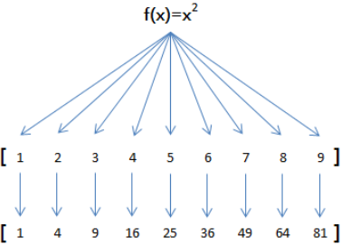

# js学习记录
***
## 快速入门

### 基本语法
> var if 注释等  

```javascript
var x = 1; // 赋值语句
if (2 > 1) {
    x = 1;
    y = 2;
    z = 3;
}

```

### 数据类型
```javascript
123; // 整数123
0.456; // 浮点数0.456
1.2345e3; // 科学计数法表示1.2345x1000，等同于1234.5
-99; // 负数
NaN; // NaN表示Not a Number，当无法计算结果时用NaN表示
Infinity; // Infinity表示无限大，当数值超过了JavaScript的Number所能表示的最大值时，就表示为Infinity

1 + 2; // 3
(1 + 2) * 5 / 2; // 7.5
2 / 0; // Infinity
0 / 0; // NaN
10 % 3; // 1
10.5 % 3; // 1.5
```

**比较**

```javascript
false == 0; // true
false === 0; // false

//第一种是==比较，它会自动转换数据类型再比较

//第二种是===比较，它不会自动转换数据类型，如果数据类型不一致，返回false，如果一致，再比较。

//由于JavaScript这个设计缺陷，不要使用==比较，始终坚持使用===比较。

//特殊！NAN，唯一能判断NaN的方法是通过isNaN()函数：
NaN === NaN; // false
isNaN(NaN); // true

//浮点数计算有精度问题,要计算差的绝对值才可以
Math.abs(1 / 3 - (1 - 2 / 3)) < 0.0000001; // true
```

**数组**

```javascript
//JavaScript的数组可以包括任意数据类型
var arr = [1, 2, 3.14, 'Hello', null, true];
arr[0]; // 返回索引为0的元素，即1
arr[5]; // 返回索引为5的元素，即true
arr[6]; // 索引超出了范围，返回undefined
````

**变量**（只能用var申明**一次**，可以赋值不同类型的变量）
> 变量在JavaScript中就是用一个变量名表示，变量名是大小写英文、数字、$和_的组合，且不能用数字开头。变量名也不能是JavaScript的关键字，如if、while等。申明一个变量用var语句
```javascript
var a; // 申明了变量a，此时a的值为undefined
var $b = 1; // 申明了变量$b，同时给$b赋值，此时$b的值为1
var s_007 = '007'; // s_007是一个字符串
var Answer = true; // Answer是一个布尔值true
var t = null; // t的值是null
```

**strict模式**
>不使用var定义的变量会被自动申明为全局变量，可能会导致冲突，可以用strict模式避免

```javascript
'use strict';
```

### 字符串
多行用反引号\`\`表示
```javascript
`这是一个
多行
字符串`;

console.log('多行\n字符串\n测试'）

var name = '小明';
var age = 20;
var message = `你好, ${name}, 你今年${age}岁了!`; // 里面表达式要用反引号
alert(message);
```
```javascript
var s = 'Hello, world!';

s[0]; // 'H'
s[6]; // ' '
s[7]; // 'w'
s[12]; // '!'
s[13]; // undefined 超出范围的索引不会报错，但一律返回undefined

//需要特别注意的是，字符串是不可变的，如果对字符串的某个索引赋值，不会有任何错误，但是，也没有任何效果：
var s = 'Test';
s[0] = 'X';
alert(s); // s仍然为'Test'
```
>JavaScript为字符串提供了一些常用方法，注意，调用这些方法本身**不会**改变原有字符串的内容，而是返回一个**新字符串**：
```javascript
//toUpperCase()把一个字符串全部变为大写：
var s = 'Hello';
s.toUpperCase(); // 返回'HELLO'

//toLowerCase()把一个字符串全部变为小写：
var s = 'Hello';
var lower = s.toLowerCase(); // 返回'hello'并赋值给变量lower
lower; // 'hello'

//indexOf()会搜索指定字符串出现的位置：
var s = 'hello, world';
s.indexOf('world'); // 返回7
s.indexOf('World'); // 没有找到指定的子串，返回-1

//substring()返回指定索引区间的子串：
var s = 'hello, world'
s.substring(0, 5); // 从索引0开始到5（不包括5），返回'hello'
s.substring(7); // 从索引7开始到结束，返回'world'
```
#### **split(字符串转数组)**
```javascript
var str="How are you doing today?";
var n=str.split();//输出结果How are you doing today?
var n=str.split("");//H,o,w, ,a,r,e, ,y,o,u, ,d,o,i,n,g, ,t,o,d,a,y,?
var n=str.split(" ",3);//使用limit参数，输出How,are,you
var n=str.split("o");//H,w are y,u d,ing t,day?
```

### 数组
```javascript
//直接给Array的length赋一个新的值会导致Array大小的变化：
var arr = [1, 2, 3];
arr.length; // 3
arr.length = 6;
arr; // arr变为[1, 2, 3, undefined, undefined, undefined]
arr.length = 2;
arr; // arr变为[1, 2]


//如果通过索引赋值时，索引超过了范围，同样会引起Array大小的变化：
var arr = [1, 2, 3];
arr[5] = 'x';
arr; // arr变为[1, 2, 3, undefined, undefined, 'x']
```
#### indexof
```javascript
//indexof
var arr = [10, 20, '30', 'xyz'];
arr.indexOf(10); // 元素10的索引为0
arr.indexOf(20); // 元素20的索引为1
arr.indexOf(30); // 元素30没有找到，返回-1
arr.indexOf('30'); // 元素'30'的索引为2
```
#### slice
```javascript
//slice
var arr = ['A', 'B', 'C', 'D', 'E', 'F', 'G'];
arr.slice(0, 3); // 从索引0开始，到索引3结束，但不包括索引3: ['A', 'B', 'C']
arr.slice(3); // 从索引3开始到结束: ['D', 'E', 'F', 'G']

//如果不给slice()传递任何参数，它就会从头到尾截取所有元素。利用这一点，我们可以很容易地复制一个Array：
var arr = ['A', 'B', 'C', 'D', 'E', 'F', 'G'];
var aCopy = arr.slice();
aCopy; // ['A', 'B', 'C', 'D', 'E', 'F', 'G']
aCopy === arr; // false

```
#### splice(修改array万能方法)
```javascript
//splice
//splice()方法是修改Array的“万能方法”，它可以从指定的索引开始删除若干元素，然后再从该位置添加若干元素：
var arr = ['Microsoft', 'Apple', 'Yahoo', 'AOL', 'Excite', 'Oracle'];
// 从索引2开始删除3个元素,然后再添加两个元素:
arr.splice(2, 3, 'Google', 'Facebook'); // 返回删除的元素 ['Yahoo', 'AOL', 'Excite']
arr; // ['Microsoft', 'Apple', 'Google', 'Facebook', 'Oracle']
// 只删除,不添加:
arr.splice(2, 2); // ['Google', 'Facebook']
arr; // ['Microsoft', 'Apple', 'Oracle']
// 只添加,不删除:
arr.splice(2, 0, 'Google', 'Facebook'); // 返回[],因为没有删除任何元素
arr; // ['Microsoft', 'Apple', 'Google', 'Facebook', 'Oracle']
```
#### concat
```javascript
//concat concat()方法并没有修改当前Array，而是返回了一个新的Array。
var arr = ['A', 'B', 'C'];
var added = arr.concat([1, 2, 3]);
added; // ['A', 'B', 'C', 1, 2, 3]
arr; // ['A', 'B', 'C']
//自动拆开
var arr = ['A', 'B', 'C'];
arr.concat(1, 2, [3, 4]); // ['A', 'B', 'C', 1, 2, 3, 4]
```
#### join(连接，数组转字符串)
```javascript
//join join()方法是一个非常实用的方法，它把当前Array的每个元素都用指定的字符串连接起来，然后返回连接后的字符串：如果Array的元素不是字符串，将自动转换为字符串后再连接。
var arr = ['A', 'B', 'C', 1, 2, 3];
arr.join('-'); // 'A-B-C-1-2-3'
```

### 对象
```javascript
//由于JavaScript的对象是动态类型，你可以自由地给一个对象添加或删除属性：
var xiaoming = {
    name: '小明'
};
xiaoming.age; // undefined
xiaoming.age = 18; // 新增一个age属性
xiaoming.age; // 18
delete xiaoming.age; // 删除age属性
xiaoming.age; // undefined
delete xiaoming['name']; // 删除name属性
xiaoming.name; // undefined
delete xiaoming.school; // 删除一个不存在的school属性也不会报错

//如果我们要检测xiaoming是否拥有某一属性，可以用in操作符：
var xiaoming = {
    name: '小明',
    birth: 1990,
    school: 'No.1 Middle School',
    height: 1.70,
    weight: 65,
    score: null
};
'name' in xiaoming; // true
'grade' in xiaoming; // false

//但是用in判断的可能是继承得到的
'toString' in xiaoming; // true

//要判断一个属性是否是xiaoming自身拥有的，而不是继承得到的，可以用hasOwnProperty()方法：
var xiaoming = {
    name: '小明'
};
xiaoming.hasOwnProperty('name'); // true
xiaoming.hasOwnProperty('toString'); // false
```

### 条件判断
>JavaScript把null、undefined、0、NaN和空字符串''视为false，其他值一概视为true

### 循环
```javascript
//要过滤掉对象继承的属性，用hasOwnProperty()来实现：
var o = {
    name: 'Jack',
    age: 20,
    city: 'Beijing'
};
for (var key in o) {
    if (o.hasOwnProperty(key)) {
        console.log(key); // 'name', 'age', 'city'
    }
}
```
### Map和Set

```javascript
//初始化Map需要一个二维数组，或者直接初始化一个空Map。Map具有以下方法：
var m = new Map(); // 空Map
m.set('Adam', 67); // 添加新的key-value
m.set('Bob', 59);
m.has('Adam'); // 是否存在key 'Adam': true
m.get('Adam'); // 67
m.delete('Adam'); // 删除key 'Adam'
m.get('Adam'); // undefined

//由于一个key只能对应一个value，所以，多次对一个key放入value，后面的值会把前面的值冲掉：
var m = new Map();
m.set('Adam', 67);
m.set('Adam', 88);
m.get('Adam'); // 88
```
**set中没有重复的key**
```javascript
//Set和Map类似，也是一组key的集合，但不存储value。由于key不能重复，所以，在Set中，没有重复的key。
var s1 = new Set(); // 空Set
var s2 = new Set([1, 2, 3]); // 含1, 2, 3
//重复元素在Set中自动被过滤：
var s = new Set([1, 2, 3, 3, '3']);
s; // Set {1, 2, 3, "3"}，注意数字3和字符串'3'是不同的元素。
s.add(4);
s; // Set {1, 2, 3, 4}
s.add(4);
s; // 仍然是 Set {1, 2, 3, 4}，重复添加无效

var s = new Set([1, 2, 3]);
s; // Set {1, 2, 3}
s.delete(3);
s; // Set {1, 2}
```

### iterable
>for...of
```javascript
//遍历
var a = ['A', 'B', 'C'];
var s = new Set(['A', 'B', 'C']);
var m = new Map([[1, 'x'], [2, 'y'], [3, 'z']]);
for (var x of a) { // 遍历Array
    console.log(x);
}
for (var x of s) { // 遍历Set
    console.log(x);
}
for (var x of m) { // 遍历Map
    console.log(x[0] + '=' + x[1]);
}


'use strict';
var a = ['A', 'B', 'C'];
a.forEach(function (element, index, array) {
    // element: 指向当前元素的值
    // index: 指向当前索引
    // array: 指向Array对象本身
    console.log(element + ', index = ' + index);
});
```

## 函数

### 函数的定义和调用

```javascript
//方法一
function abs(x) {
    if (x >= 0) {
        return x;
    } else {
        return -x;
    }
}

//方法二
var abs = function (x) {
    if (x >= 0) {
        return x;
    } else {
        return -x;
    }
};//结尾加一个;表示赋值语句结束

//由于JavaScript允许传入任意个参数而不影响调用，因此传入的参数比定义的参数多也没有问题，虽然函数内部并不需要这些参数：
abs(10, 'blablabla'); // 返回10
abs(-9, 'haha', 'hehe', null); // 返回9
abs(); // 返回NaN

//求和
let result = 0;
    rest.forEach(n => {
        result += n;
    })
    return result;
}
```

### **变量作用域结构解析（*解构赋值*）**
```javascript
//javascript函数可以相互嵌套
'use strict';
function foo() {
    var x = 1;
    function bar() {
        var x = 'A';
        console.log('x in bar() = ' + x); // 'A'
    }
    console.log('x in foo() = ' + x); // 1
    bar();
}

foo();//x in foo() = 1 x in bar() = A
//这说明JavaScript的函数在查找变量时从自身函数定义开始，从“内”向“外”查找。如果内部函数定义了与外部函数重名的变量，则内部函数的变量将“屏蔽”外部函数的变量。

//函数提前声明
'use strict';

function foo() {
    var x = 'Hello, ' + y;
    console.log(x);
    var y = 'Bob';
}

foo();

//将变量提升到最顶部，实际上的解释为
function foo() {
    var y; // 提升变量y的申明，此时y为undefined
    var x = 'Hello, ' + y;
    console.log(x);
    y = 'Bob';
}

//不在任何函数内定义的变量就具有全局作用域。实际上，JavaScript默认有一个全局对象window，全局作用域的变量实际上被绑定到window的一个属性：
'use strict';

window.alert('调用window.alert()');
// 把alert保存到另一个变量:
var old_alert = window.alert;
// 给alert赋一个新函数:
window.alert = function () {}

// 恢复alert:
window.alert = old_alert;
alert('又可以用alert()了!');

//全局变量由于会绑定到windows上，所以可能产生冲突，最好的方法是将所有变量绑定到一个全局变量上，例如：
// 唯一的全局变量MYAPP:
var MYAPP = 0;
//其他变量
MYAPP.name = 'myapp';
MYAPP.version = 1.0;

//其他函数
MYAPP.foo = function(){
	return 'foo'
}
//把自己的代码全部放入唯一的名字空间MYAPP中，会大大减少全局变量冲突的可能。

//解构赋值
'use strict';

// 如果浏览器支持解构赋值就不会报错:
var [x, y, z] = ['hello', 'JavaScript', 'ES6'];//多个变量要用[...]括起来。
'use strict';
// x, y, z分别被赋值为数组对应元素:
console.log('x = ' + x + ', y = ' + y + ', z = ' + z);
x = hello, y = JavaScript, z = ES6

//如果数组本身还有嵌套，也可以通过下面的形式进行解构赋值，注意嵌套层次和位置要保持一致：
let [x, [y, z]] = ['hello', ['JavaScript', 'ES6']];
x; // 'hello'
y; // 'JavaScript'
z; // 'ES6'
//还可以忽略某些元素
let [, , z] = ['hello', 'JavaScript', 'ES6']; // 忽略前两个元素，只对z赋值第三个元素
z; // 'ES6'

//从某个对象中取出若干属性
'use strict';

var person = {
    name: '小明',
    age: 20,
    gender: 'male',
    passport: 'G-12345678',
    school: 'No.4 middle school'
};
var {name, age, passport} = person;

```
```javascript
//对一个对象进行解构赋值时，同样可以直接对嵌套的对象属性进行赋值，只要保证对应的层次是一致的：

var person = {
    name: '小明',
    age: 20,
    gender: 'male',
    passport: 'G-12345678',
    school: 'No.4 middle school',
    address: {
        city: 'Beijing',
        street: 'No.1 Road',
        zipcode: '100001'
    }
};
var {name, address: {city, zip}} = person;
name; // '小明'
city; // 'Beijing'
zip; // undefined, 因为属性名是zipcode而不是zip
// 注意: address不是变量，而是为了让city和zip获得嵌套的address对象的属性:
address; // Uncaught ReferenceError: address is not defined

//使用解构赋值对对象属性进行赋值时，如果对应的属性不存在，变量将被赋值为undefined，这和引用一个不存在的属性获得undefined是一致的。如果要使用的变量名和属性名不一致，可以用下面的语法获取：

var person = {
    name: '小明',
    age: 20,
    gender: 'male',
    passport: 'G-12345678',
    school: 'No.4 middle school'
};

// 把passport属性赋值给变量id:
let {name, passport:id} = person;
name; // '小明'
id; // 'G-12345678'
// 注意: passport不是变量，而是为了让变量id获得passport属性:
passport; // Uncaught ReferenceError: passport is not defined

//有些时候，如果变量已经被声明了，再次赋值的时候，正确的写法也会报语法错误：

// 声明变量:
var x, y;
// 解构赋值:
{x, y} = { name: '小明', x: 100, y: 200};
// 语法错误: Uncaught SyntaxError: Unexpected token =
//这是因为JavaScript引擎把{开头的语句当作了块处理，于是=不再合法。解决方法是用小括号括起来：

({x, y} = { name: '小明', x: 100, y: 200});
```

### 方法
>绑定到对象上的函数称为方法
```javascript
var xiaoming = {
    name: '小明',
    birth: 1990,
    age: function () {
        var y = new Date().getFullYear();
        return y - this.birth;//在一个方法内部，this是一个特殊变量，它始终指向当前对象，也就是xiaoming这个变量。所以，this.birth可以拿到xiaoming的birth属性。
    }
};

xiaoming.age; // function xiaoming.age()
xiaoming.age(); // 今年调用是25,明年调用就变成26了

//在strict条件下，在内部建立新函数的时候this指向内部一层。在外部先用一个that捕获this
//用var that = this;，你就可以放心地在方法内部定义其他函数，而不是把所有语句都堆到一个方法中。
'use strict';

var xiaoming = {
    name: '小明',
    birth: 1990,
    age: function () {
        var that = this; // 在方法内部一开始就捕获this
        function getAgeFromBirth() {
            var y = new Date().getFullYear();
            return y - that.birth; // 用that而不是this
        }
        return getAgeFromBirth();
    }
};

xiaoming.age(); // 25

//要指定函数的this指向哪个对象，可以用函数本身的apply方法，它接收两个参数，第一个参数就是需要绑定的this变量，第二个参数是Array，表示函数本身的参数。
function getAge() {
    var y = new Date().getFullYear();
    return y - this.birth;
}

var xiaoming = {
    name: '小明',
    birth: 1990,
    age: getAge
};

xiaoming.age(); // 25
getAge.apply(xiaoming, []); // 25, this指向xiaoming, 参数为空

//与apply类似的是call，apply传入的是数组，call是按顺序传入参数。
//对普通函数调用，我们通常把this绑定为null。
Math.max.apply(null, [3, 5, 4]); // 5
Math.max.call(null, 3, 5, 4); // 5

//利用apply()，我们还可以动态改变函数的行为。
//JavaScript的所有对象都是动态的，即使内置的函数，我们也可以重新指向新的函数。
//现在假定我们想统计一下代码一共调用了多少次parseInt()，可以把所有的调用都找出来，然后手动加上count += 1，不过这样做太傻了。最佳方案是用我们自己的函数替换掉默认的parseInt()：
'use strict';

var count = 0;
var oldParseInt = parseInt; // 保存原函数

window.parseInt = function () {
    count += 1;
    return oldParseInt.apply(null, arguments); // 调用原函数
};
// 测试:
parseInt('10');
parseInt('20');
parseInt('30');
console.log('count = ' + count); // 3

```

### 高阶函数
>函数内可以接收以另一个函数作为参数

#### Map/Reduce

##### Map

```javascript
//由于map()方法定义在JavaScript的Array中，我们调用Array的map()方法，传入我们自己的函数，就得到了一个新的Array作为结果：
'use strict';

function pow(x) {
    return x * x;
}
var arr = [1, 2, 3, 4, 5, 6, 7, 8, 9];
var results = arr.map(pow); // [1, 4, 9, 16, 25, 36, 49, 64, 81]
console.log(results);

//map可以计算任何抽象函数
var arr = [1, 2, 3, 4, 5, 6, 7, 8, 9];
arr.map(String); // ['1', '2', '3', '4', '5', '6', '7', '8', '9']
```

##### Reduce
```javascript
//再看reduce的用法。Array的reduce()把一个函数作用在这个Array的[x1, x2, x3...]上，这个函数必须接收两个参数，reduce()把结果继续和序列的下一个元素做累积计算，其效果就是：
[x1, x2, x3, x4].reduce(f) = f(f(f(x1, x2), x3), x4)

//比如对一个函数的求和
var arr = [1, 3, 5, 7, 9];
arr.reduce(function (x, y) {
    return x + y;
}); // 25

//求积
'use strict';
//两种写法
function product(arr) {
    return arr.reduce((x,y)=>{return x*y});
}
function product(arr) {
    return arr.reduce(function (x,y){
        return x*y;
    });
}
// 测试:
if (product([1, 2, 3, 4]) === 24 && product([0, 1, 2]) === 0 && product([99, 88, 77, 66]) === 44274384) {
    console.log('测试通过!');
}
else {
    console.log('测试失败!');
}

//要把[1, 3, 5, 7, 9]变换成整数13579，reduce()也能派上用场：
var arr = [1, 3, 5, 7, 9];
arr.reduce(function (x, y) {
    return x * 10 + y;
}); // 13579
//如果我们继续改进这个例子，想办法把一个字符串13579先变成Array——[1, 3, 5, 7, 9]，再利用reduce()就可以写出一个把字符串转换为Number的函数。

//练习：不要使用JavaScript内置的parseInt()函数，利用map和reduce操作实现一个string2int()函数：
function string2int(s) {
    function str2array(s){//将字符串转变为数组
        var a = [];
        for (ch of s){
            a.push(ch);
        }
        return a;
    }
    charArray = str2array(s);
    intArray = charArray.map(function (ch){return ch-'0';});//与0比较
    return intArray.reduce(function (x,y){return x*10 + y;});//计算结果
}
//或者使用split进行分割
return s.split("").map((s)=>{return s-0}).reduce((x,y)=>{return x*10+y});

//请把用户输入的不规范的英文名字，变为首字母大写，其他小写的规范名字。输入：['adam', 'LISA', 'barT']，输出：['Adam', 'Lisa', 'Bart']。
//一一对应，使用map
function normalize(arr) {
    function norm(s){//将首字母变成大写，利用数组第一位变大写
        s1=s[0];
        s2=s.substring(1);
        return s1.toUpperCase()+s2.toLowerCase();
    }
    return arr.map(norm);
}
//小明希望利用map()把字符串变成整数，他写的代码很简洁：
'use strict';

var arr = ['1', '2', '3'];
var r;
r=arr.map(parseInt)//1,NaN,NaN
//原因：由于map()接收的回调函数可以有3个参数：callback(currentValue, index, array)，通常我们仅需要第一个参数，而忽略了传入的后面两个参数。不幸的是，parseInt(string, radix)没有忽略第二个参数，导致实际执行的函数分别是：
//parseInt('1', 0); // 1, 按十进制转换
//parseInt('2', 1); // NaN, 没有一进制
//parseInt('3', 2); // NaN, 按二进制转换不允许出现3
//可以改为r = arr.map(Number);，因为Number(value)函数仅接收一个参数。
```

#### Filter(过滤，去重)
>用于把array的某些元素过滤掉，然后返回剩下的元素，true保留，false丢弃
```javascript
//例如，在一个Array中，删掉偶数，只保留奇数，可以这么写：
var arr = [1, 2, 4, 5, 6, 9, 10, 15];
var r = arr.filter(function (x) {
    return x % 2 !== 0;
});
r; // [1, 5, 9, 15]

//把一个Array中的空字符串删掉，可以这么写：
var arr = ['A', '', 'B', null, undefined, 'C', '  '];
var r = arr.filter(function (s) {
    return s && s.trim(); // 注意：IE9以下的版本没有trim()方法
});
r; // ['A', 'B', 'C']

//回调函数
//filter()接收的回调函数，其实可以有多个参数。通常我们仅使用第一个参数，表示Array的某个元素。回调函数还可以接收另外两个参数，表示元素的位置和数组本身：
var arr = ['A', 'B', 'C'];
var r = arr.filter(function (element, index, self) {
    console.log(element); // 依次打印'A', 'B', 'C'
    console.log(index); // 依次打印0, 1, 2
    console.log(self); // self就是变量arr
    return true;
});

//利用filter，可以巧妙地去除Array的重复元素：
'use strict';
var
    r,
    arr = ['apple', 'strawberry', 'banana', 'pear', 'apple', 'orange', 'orange', 'strawberry'];
r = arr.filter(function (element, index, self) {
    return self.indexOf(element) === index;//去除重复元素依靠的是indexOf总是返回第一个元素的位置，后续的重复元素位置与indexOf返回的位置不相等，因此被filter滤掉了。
});

//筛选素数
'use strict';

function get_primes(arr) {
    return arr.filter(function(x){
            var a = x;
            var c = 0;
            for (var b = 2; b < a; b++) {
                if (a % b !== 0) {
                    c++;
                };
            };
            if(c === (a - 2)) {//如果相等说明，公约数只有a和1，是质数，所以保留
                return true;
            }else {
                return false;
            }
        });
        
  	//另一种解法
  	return arr.filter((value, index, array) => {
    // return 素数
    for (let i = 2; i <= Math.floor(value / 2); i++) {
        if (value % i === 0) {
            return false
        }
    }
    return value !== 1 // 1 不是素数
 }
 // 测试:
var
    x,
    r,
    arr = [];
for (x = 1; x < 100; x++) {
    arr.push(x);
}
r = get_primes(arr);
if (r.toString() === [2, 3, 5, 7, 11, 13, 17, 19, 23, 29, 31, 37, 41, 43, 47, 53, 59, 61, 67, 71, 73, 79, 83, 89, 97].toString()) {
    console.log('测试通过!');
} else {
    console.log('测试失败: ' + r.toString());
}
```

#### sort
>先转换成字符串再进行得比较，所以会有坑
>对于两个元素x和y，如果认为x < y，则返回-1，如果认为x == y，则返回0，如果认为x > y，则返回1
>sort()方法会直接对Array进行修改，它返回的结果仍是当前Array：
>1.sort 函数默认按 ASCII 排序，很多语言都是这样
>2.sort 函数的底层是用 TimSort 算法实现的，这个算法是工业级算法，Python，JAVA 的 sort 函数底层都是这个
>3.**不是冒泡排序！不是冒泡排序！** **不是冒泡排序！楼下涉及到冒泡排序实现的都是错的！**别被下面的教程误导！冒泡排序是最简单也是效率最低的算法，除了考试业内没几个人用！
>4.新人学习没有必要纠结为什么这样，你先接受了，有一定的基础再研究为什么，要不然就是钻到牛角尖里了
```javascript
// 看上去正常的结果:
['Google', 'Apple', 'Microsoft'].sort(); // ['Apple', 'Google', 'Microsoft'];

// apple排在了最后:
['Google', 'apple', 'Microsoft'].sort(); // ['Google', 'Microsoft", 'apple']

// 无法理解的结果:
[10, 20, 1, 2].sort(); // [1, 10, 2, 20]
//第二个排序把apple排在了最后，是因为字符串根据ASCII码进行排序，而小写字母a的ASCII码在大写字母之后。
//第三个排序结果是什么鬼？简单的数字排序都能错？
//这是因为Array的sort()方法默认把所有元素先转换为String再排序，结果'10'排在了'2'的前面，因为字符'1'比字符'2'的ASCII码小。

//但是可以自定义，对于数字的排序写法
'use strict';
var arr = [10, 20, 1, 2];
arr.sort(function (x, y) {
    if (x < y) {
        return -1;
    }
    if (x > y) {
        return 1;
    }
    return 0;
});
console.log(arr); // [1, 2, 10, 20]
//如果要倒叙
var arr = [10, 20, 1, 2];
arr.sort(function (x, y) {
    if (x < y) {
        return 1;//这个地方改变
    }
    if (x > y) {
        return -1;
    }
    return 0;
}); // [20, 10, 2, 1]

//如果要忽略大小写，直接用首字母来排序。可以自己定义
var arr = ['Google', 'apple', 'Microsoft'];
arr.sort(function(a,b){
	x1 = a.toUpperCase();
    x2 = b.toUpperCase();
	if(x1<x2){
		return -1;
	}
	else if(x1>x2)
		return 1;
	return 0;
});// ['apple', 'Google', 'Microsoft']

var a1 = ['B', 'A', 'C'];
var a2 = a1.sort();
a1; // ['A', 'B', 'C']
a2; // ['A', 'B', 'C']
a1 === a2; // true, a1和a2是同一对象
```
#### Array
>对于数组，除了map()、reduce、filter()、sort()这些方法可以传入一个函数外，Array对象还提供了很多非常实用的高阶函数。

##### every
```javascript
//every()方法可以判断数组的所有元素是否满足测试条件。
//例如，给定一个包含若干字符串的数组，判断所有字符串是否满足指定的测试条件：
'use strict';
var arr = ['Apple', 'pear', 'orange'];
console.log(arr.every(function (s) {
    return s.length > 0;
})); // true, 因为每个元素都满足s.length>0
console.log(arr.every(function (s) {
    return s.toLowerCase() === s;
})); // false, 因为不是每个元素都全部是小写
```

##### find
```javascript
//find()方法用于查找符合条件的第一个元素，如果找到了，返回这个元素，否则，返回undefined：
'use strict';
var arr = ['Apple', 'pear', 'orange'];
console.log(arr.find(function (s) {
    return s.toLowerCase() === s;
})); // 'pear', 因为pear全部是小写

console.log(arr.find(function (s) {
    return s.toUpperCase() === s;
})); // undefined, 因为没有全部是大写的元素
```

##### findIndex
```javascript
//findIndex()和find()类似，也是查找符合条件的第一个元素，不同之处在于findIndex()会返回这个元素的索引，如果没有找到，返回-1：
'use strict';
var arr = ['Apple', 'pear', 'orange'];
console.log(arr.findIndex(function (s) {
    return s.toLowerCase() === s;
})); // 1, 因为'pear'的索引是1

console.log(arr.findIndex(function (s) {
    return s.toUpperCase() === s;
})); // -1

```

##### forEach
```javascript
//forEach()和map()类似，它也把每个元素依次作用于传入的函数，但不会返回新的数组。forEach()常用于遍历数组，因此，传入的函数不需要返回值：
'use strict';
var arr = ['Apple', 'pear', 'orange'];
arr.forEach(console.log); // 依次打印每个元素

```

### 闭包
>高阶函数除了可以接受函数作为参数外，还可以把函数作为结果值返回。
>返回闭包时牢记的一点就是：返回函数不要引用任何循环变量，或者后续会发生变化的变量。(会取最后一次变换之后的值)
```javascript
//我们来实现一个对Array的求和。通常情况下，求和的函数是这样定义的：
function sum(arr) {
    return arr.reduce(function (x, y) {
        return x + y;
    });
}
sum([1, 2, 3, 4, 5]); // 15

//但是，如果不需要立刻求和，而是在后面的代码中，根据需要再计算怎么办？可以不返回求和的结果，而是返回求和的函数！
function lazy_sum(arr) {
    var sum = function () {
        return arr.reduce(function (x, y) {
            return x + y;
        });
    }
    return sum;
}

//当我们调用lazy_sum()时，返回的并不是求和结果，而是求和函数：
var f = lazy_sum([1, 2, 3, 4, 5]); // function sum()
//调用函数f时，才真正计算求和的结果：
f(); // 15

//请再注意一点，当我们调用lazy_sum()时，每次调用都会返回一个新的函数，即使传入相同的参数：
var f1 = lazy_sum([1, 2, 3, 4, 5]);
var f2 = lazy_sum([1, 2, 3, 4, 5]);
f1 === f2; // false  f1()和f2()的调用结果互不影响。

//如果一定要引用循环变量怎么办？方法是再创建一个函数，用该函数的参数绑定循环变量当前的值，无论该循环变量后续如何更改，已绑定到函数参数的值不变：
function count() {
    var arr = [];
    for (var i=1; i<=3; i++) {
        arr.push((function (n) {
            return function () {
                return n * n;//这样绑定的n后续不会发生变化
            }
        })(i));
    }
    return arr;
}

var results = count();
var f1 = results[0];
var f2 = results[1];
var f3 = results[2];

f1(); // 1
f2(); // 4
f3(); // 9

//理论上讲，创建一个匿名函数并立刻执行可以这么写：
function (x) { return x * x } (3);
//但是由于JavaScript语法解析的问题，会报SyntaxError错误，因此需要用括号把整个函数定义括起来：
(function (x) { return x * x }) (3);
//通常，一个立即执行的匿名函数可以把函数体拆开，一般这么写：
(function (x) {
    return x * x;
})(3);

//在没有class机制，只有函数的语言里，借助闭包，同样可以封装一个私有变量。我们用JavaScript创建一个计数器：
'use strict';
function create_counter(initial) {
    var x = initial || 0;
    return {
        inc: function () {
            x += 1;
            return x;
        }
    }
}
//使用
var c1 = create_counter();
c1.inc(); // 1
c1.inc(); // 2
c1.inc(); // 3

var c2 = create_counter(10);
c2.inc(); // 11
c2.inc(); // 12
c2.inc(); // 13

//在返回的对象中，实现了一个闭包，该闭包携带了局部变量x，并且，从外部代码根本无法访问到变量x。换句话说，闭包就是携带状态的函数，并且它的状态可以完全对外隐藏起来。

//闭包还可以把多参数的函数变成单参数的函数。例如，要计算xy可以用Math.pow(x, y)函数，不过考虑到经常计算x2或x3，我们可以利用闭包创建新的函数pow2和pow3：
'use strict';

function make_pow(n) {
    return function (x) {
        return Math.pow(x, n);
    }
}
// 创建两个新函数:
var pow2 = make_pow(2);
var pow3 = make_pow(3);

console.log(pow2(5)); // 25
console.log(pow3(7)); // 343

```
#### 闭包自定义次数
```javascript
'use strict';

// 定义数字0:
var zero = function (f) {
    return function (x) {
        return x;
    }
};

// 定义数字1:
var one = function (f) {
    return function (x) {
        return f(x);
    }
};

// 定义加法:
function add(n, m) {
    return function (f) {
        return function (x) {
            return m(f)(n(f)(x));
        }
    }
}
// 计算数字2 = 1 + 1:
var two = add(one, one);

// 计算数字3 = 1 + 2:
var three = add(one, two);

// 计算数字5 = 2 + 3:
var five = add(two, three);

// 你说它是3就是3，你说它是5就是5，你怎么证明？

// 呵呵，看这里:

// 给3传一个函数,会打印3次:
(three(function () {
    console.log('print 3 times');
}))();

// 给5传一个函数,会打印5次:
(five(function () {
    console.log('print 5 times');
}))();

// 继续接着玩一会...
zero(f)(x) = x;
one(f)(x) = f(x);
two(f)(x) = one(f)(one(f)(x)) = one(f)(f(x)) = f(f(x));
three(f)(x) = two(f)(one(f)(x)) = two(f)(f(x)) = f(f(f(x)));
...
five(f)(x) = f(f(f(f(f(x)))));
```

### 箭头函数
```javascript
//x => x * x 相当于 function (x) {	return x * x;}

//两种定义方式
var fn = x => x * x;//1

x => {//2
    if (x > 0) {
        return x * x;
    }
    else {
        return - x * x;
    }
}

//如果参数不是一个，就需要用括号()括起来：
// 两个参数:
(x, y) => x * x + y * y

// 无参数:
() => 3.14

// 可变参数:
(x, y, ...rest) => {
    var i, sum = x + y;
    for (i=0; i<rest.length; i++) {
        sum += rest[i];
    }
    return sum;
}

//如果要返回一个对象，就要注意，如果是单表达式，这么写的话会报错：
// SyntaxError:
x => { foo: x }
//因为和函数体的{ ... }有语法冲突，所以要改为：
// ok:
x => ({ foo: x })

```
#### **this(面试，js中this的指向)**
>箭头函数看上去是匿名函数的一种简写，但实际上，箭头函数和匿名函数有个明显的区别：箭头函数内部的this是词法作用域，由上下文确定。
>this指向 https://juejin.cn/post/6844903746984476686
>
>箭头函数：https://www.open-open.com/lib/view/open1482063707519.html

```javascript
//回顾前面的例子，由于JavaScript函数对this绑定的错误处理，下面的例子无法得到预期结果：
var obj = {
    birth: 1990,
    getAge: function () {
        var b = this.birth; // 1990
        var fn = function () {
            return new Date().getFullYear() - this.birth; // this指向window或undefined
        };
        return fn();
    }
};
//现在，箭头函数完全修复了this的指向，this总是指向词法作用域，也就是外层调用者obj：
var obj = {
    birth: 1990,
    getAge: function () {
        var b = this.birth; // 1990
        var fn = () => new Date().getFullYear() - this.birth; // this指向obj对象
        return fn();
    }
};
obj.getAge(); // 25

//由于this在箭头函数中已经按照词法作用域绑定了，所以，用call()或者apply()调用箭头函数时，无法对this进行绑定，即传入的第一个参数被忽略：
var obj = {
    birth: 1990,
    getAge: function (year) {
        var b = this.birth; // 1990
        var fn = (y) => y - this.birth; // this.birth仍是1990
        return fn.call({birth:2000}, year);
    }
};
obj.getAge(2015); // 25

//箭头函数简化sort
'use strict'
var arr = [10, 20, 1, 2];
arr.sort((x, y) => {
    return x-y;//x>y的话就是1，x<y是-1，相等为0
});
console.log(arr); // [1, 2, 10, 20]
```

### generator
>由function*定义，除了return还可以用yield返回多次
>generator还有另一个巨大的好处，就是把异步回调代码变成“同步”代码。这个好处要等到后面学了AJAX以后才能体会到

```javascript
function* foo(x) {
    yield x + 1;
    yield x + 2;
    return x + 3;
}

//要编写一个产生斐波那契数列的函数，可以这么写：
function fib(max) {
    var
        t,
        a = 0,
        b = 1,
        arr = [0, 1];
    while (arr.length < max) {
        [a, b] = [b, a + b];
        arr.push(b);
    }
    return arr;
}

// 测试:
fib(5); // [0, 1, 1, 2, 3]
fib(10); // [0, 1, 1, 2, 3, 5, 8, 13, 21, 34]

//函数只能返回一次，所以必须返回一个Array。但是，如果换成generator，就可以一次返回一个数，不断返回多次。用generator改写如下：
function* fib(max) {
    var
        t,
        a = 0,
        b = 1,
        n = 0;
    while (n < max) {
        yield a;
        [a, b] = [b, a + b];
        n ++;
    }
    return;
}

//直接调用试试：
fib(5); // fib {[[GeneratorStatus]]: "suspended", [[GeneratorReceiver]]: Window}
//直接调用一个generator和调用函数不一样，fib(5)仅仅是创建了一个generator对象，还没有去执行它。调用generator对象有两个方法，一是不断地调用generator对象的next()方法：

var f = fib(5);
f.next(); // {value: 0, done: false}
f.next(); // {value: 1, done: false}
f.next(); // {value: 1, done: false}
f.next(); // {value: 2, done: false}
f.next(); // {value: 3, done: false}
f.next(); // {value: undefined, done: true}
//next()方法会执行generator的代码，然后，每次遇到yield x;就返回一个对象{value: x, done: true/false}，然后“暂停”。返回的value就是yield的返回值，done表示这个generator是否已经执行结束了。如果done为true，则value就是return的返回值。当执行到done为true时，这个generator对象就已经全部执行完毕，不要再继续调用next()了。

//第二个方法是直接用for ... of循环迭代generator对象，这种方式不需要我们自己判断done：
'use strict'

function* fib(max) {
    var
        t,
        a = 0,
        b = 1,
        n = 0;
    while (n < max) {
        yield a;
        [a, b] = [b, a + b];
        n ++;
    }
    return;
}
for (var x of fib(10)) {
    console.log(x); // 依次输出0, 1, 1, 2, 3, ...
}

//记录状态
function* next_id() {
let seqNo = 1;                // 从 1 开始自增采号
    while(true) {               //  不限制自增变量的大小
        yield seqNo++;      // 自增后暂停
    }
    return; // 可以省略，function 会作隐式返回，即：return undefined;
}
// 测试:
var
    x,
    pass = true,
    g = next_id();
for (x = 1; x < 100; x ++) {
    if (g.next().value !== x) {
        pass = false;
        console.log('测试失败!');
        break;
    }
}
if (pass) {
    console.log('测试通过!');
}
```

## 标准对象
>1. 不要包装对象（不要new），尤其是string
>2. 不要使用new Number()、new Boolean()、new String()创建包装对象；
>3. 用parseInt()或parseFloat()来转换任意类型到number；
>4. 用String()来转换任意类型到string，或者直接调用某个对象的toString()方法；
>5. 通常不必把任意类型转换为boolean再判断，因为可以直接写if (myVar) {...}；
>6. typeof操作符可以判断出number、boolean、string、function和undefined；
>7. 判断Array要使用Array.isArray(arr)；
>8. 判断null请使用myVar === null；
>9. 判断某个全局变量是否存在用typeof window.myVar === 'undefined'；
>10. 函数内部判断某个变量是否存在用typeof myVar === 'undefined'。
>任何对象都有toString()方法吗？null和undefined就没有！确实如此，这两个特殊值要除外，虽然null还伪装成了object类型。

```javascript
//但是某些对象还是和其他对象不太一样。为了区分对象的类型，我们用typeof操作符获取对象的类型，它总是返回一个字符串：
typeof 123; // 'number'
typeof NaN; // 'number'
typeof 'str'; // 'string'
typeof true; // 'boolean'
typeof undefined; // 'undefined'
typeof Math.abs; // 'function'
typeof null; // 'object'
typeof []; // 'object'
typeof {}; // 'object'

//包装对象
var n = new Number(123); // 123,生成了新的包装类型
var b = new Boolean(true); // true,生成了新的包装类型
var s = new String('str'); // 'str',生成了新的包装类型
//虽然包装对象看上去和原来的值一模一样，显示出来也是一模一样，但他们的类型已经变为object了！所以，包装对象和原始值用===比较会返回false：
typeof new Number(123); // 'object'
new Number(123) === 123; // false

typeof new Boolean(true); // 'object'
new Boolean(true) === true; // false

typeof new String('str'); // 'object'
new String('str') === 'str'; // false

//更细心的同学指出，number对象调用toString()报SyntaxError：

123.toString(); // SyntaxError
//遇到这种情况，要特殊处理一下：

123..toString(); // '123', 注意是两个点！
(123).toString(); // '123'
```

### Date
```javascript
//注意，当前时间是浏览器从本机操作系统获取的时间，所以不一定准确，因为用户可以把当前时间设定为任何值。
var now = new Date();
now; // Wed Jun 24 2015 19:49:22 GMT+0800 (CST)
now.getFullYear(); // 2015, 年份
now.getMonth(); // 5, 月份，注意月份范围是0~11，5表示六月
now.getDate(); // 24, 表示24号
now.getDay(); // 3, 表示星期三
now.getHours(); // 19, 24小时制
now.getMinutes(); // 49, 分钟
now.getSeconds(); // 22, 秒
now.getMilliseconds(); // 875, 毫秒数
now.getTime(); // 1435146562875, 以number形式表示的时间戳

//如果要创建一个指定日期和时间的Date对象，可以用：
var d = new Date(2015, 5, 19, 20, 15, 30, 123);//JavaScript的月份范围用整数表示是0~11，0表示一月，1表示二月……，所以要表示6月，我们传入的是5！
d; // Fri Jun 19 2015 20:15:30 GMT+0800 (CST)

//第二种创建一个指定日期和时间的方法是解析一个符合ISO 8601格式的字符串：
var d = Date.parse('2015-06-24T19:49:22.875+08:00');
d; // 1435146562875

//Date对象表示的时间总是按浏览器所在时区显示的，不过我们既可以显示本地时间，也可以显示调整后的UTC时间：

var d = new Date(1435146562875);
d.toLocaleString(); // '2015/6/24 下午7:49:22'，本地时间（北京时区+8:00），显示的字符串与操作系统设定的格式有关
d.toUTCString(); // 'Wed, 24 Jun 2015 11:49:22 GMT'，UTC时间，与本地时间相差8小时
```

### **RegExp(正则表达式)**

#### 基础
>* 正则的设计思想是用一种描述性的语言来给字符串定义一个规则，凡是符合规则的字符串，我们就认为它“匹配”了，否则，该字符串就是不合法的。
>* \d可以匹配一个数字，\w可以匹配一个字母或数字，\s表示一个空格
>* .匹配任意字符
>* 匹配变长字符，\*表示任意多个，+表示至少一个，？表示0或1个，{n}表示n个，{n,m}表示n到m个。

判断一个字符串是否是合法的Email的方法是：
1. 创建一个匹配Email的正则表达式；
2. 用该正则表达式去匹配用户的输入来判断是否合法。  

在正则表达式中，如果直接给出字符，就是精确匹配。用\d可以匹配一个数字，\w可以匹配一个字母或数字，所以：
* '00\d'可以匹配'007'，但无法匹配'00A'；
* '\d\d\d'可以匹配'010'；
* '\w\w'可以匹配'js'；  

**.** 可以匹配任意字符，所以：

* 'js.'可以匹配'jsp'、'jss'、'js!'等等。  

要匹配变长的字符，在正则表达式中，用\*表示任意个字符（包括0个），用+表示至少一个字符，用?表示0个或1个字符，用{n}表示n个字符，用{n,m}表示n-m个字符：  

来看一个复杂的例子：**\d{3}\s+\d{3,8}** 
我们来从左到右解读一下：
1. \d{3}表示匹配3个数字，例如'010'；
2. \s可以匹配一个空格（也包括Tab等空白符），所以\s+表示至少有一个空格，例如匹配' '，'\t\t'等；
3. \d{3,8}表示3-8个数字，例如'1234567'。

综合起来，上面的正则表达式可以匹配以任意个空格隔开的带区号的电话号码。  

如果要匹配'010-12345'这样的号码呢？由于'-'是特殊字符，在正则表达式中，要用'\'转义，所以，上面的正则是\d{3}\-\d{3,8}。   

但是，仍然无法匹配'010 - 12345'，因为带有空格。所以我们需要更复杂的匹配方式。  

#### 进阶
>要做更精确地匹配，可以用[]表示范围。
>A|B可以匹配A或B，所以(J|j)ava(S|s)cript可以匹配'JavaScript'、'Javascript'、'javaScript'或者'javascript'。
>^表示行的开头，^\d表示必须以数字开头。
>$表示行的结束，\d$表示必须以数字结束。

**要做更精确地匹配，可以用[]表示范围，比如：**  
* [0-9a-zA-Z\\_]可以匹配一个数字、字母或者下划线；
* [0-9a-zA-Z\\_]+可以匹配至少由一个数字、字母或者下划线组成的字符串，比如'a100'，'0_Z'，'js2015'等等；
* [a-zA-Z\\\_\\$] [0-9a-zA-Z\\_\\$]*可以匹配由字母或下划线、$开头，后接任意个由一个数字、字母或者下划线、$组成的字符串，也就是JavaScript允许的变量名；
* [a-zA-Z\\\_\\$] [0-9a-zA-Z\\_\\$]{0, 19}更精确地限制了变量的长度是1-20个字符（前面1个字符+后面最多19个字符）。  

**A|B可以匹配A或B，所以(J|j)ava(S|s)cript可以匹配'JavaScript'、'Javascript'、'javaScript'或者'javascript'。 **

**^表示行的开头，^\d表示必须以数字开头。  **

**$表示行的结束，\d$表示必须以数字结束。**

#### js中正则的使用

##### 创建及测试
```javascript

//第一种方式是直接通过/正则表达式/写出来，第二种方式是通过new RegExp('正则表达式')创建一个RegExp对象。
//两种写法是一样的：
var re1 = /ABC\-001/;
var re2 = new RegExp('ABC\\-001');//由于转义的问题，两个\\只显示一个

re1; // /ABC\-001/
re2; // /ABC\-001/

//测试
var re = /^\d{3}\-\d{3,8}$/;
re.test('010-12345'); // true
re.test('010-1234x'); // false
re.test('010 12345'); // false

```

##### 切分字符串
>用正则表达式切分字符串比用固定的字符更灵活

```javascript
//正常的切割，无法识别连续空格
'a b   c'.split(' '); // ['a', 'b', '', '', 'c']
//使用正则表达式,
'a b   c'.split(/\s+/); // ['a', 'b', 'c']，意思是用空格做切分，\s是空格
//无论多少个空格都可以正常分割。加入,试试：
'a,b, c  d'.split(/[\s\,]+/); // ['a', 'b', 'c', 'd']
//再加入;试试：
'a,b;; c  d'.split(/[\s\,\;]+/); // ['a', 'b', 'c', 'd']
```

##### 分组
>除了简单地判断是否匹配之外，正则表达式还有提取子串的强大功能。用()表示的就是要提取的分组（Group）。

```javascript
//分组示例
//^(\d{3})-(\d{3,8})$分别定义了两个组，可以直接从匹配的字符串中提取出区号和本地号码：
var re = /^(\d{3})-(\d{3,8})$/;
re.exec('010-12345'); // ['010-12345', '010', '12345']
re.exec('010 12345'); // null
//如果正则表达式中定义了组，就可以在RegExp对象上用exec()方法提取出子串来。exec()方法在匹配失败时返回null。

var re = /^(0[0-9]|1[0-9]|2[0-3]|[0-9])\:(0[0-9]|1[0-9]|2[0-9]|3[0-9]|4[0-9]|5[0-9]|[0-9])\:(0[0-9]|1[0-9]|2[0-9]|3[0-9]|4[0-9]|5[0-9]|[0-9])$/;// /^([0-2][0-9]|[0-9])\:([0-5][0-9]|[0-9])\:([0-5][0-9]|[0-9])$/
re.exec('19:05:30'); // ['19:05:30', '19', '05', '30']

//但是有些时候，用正则表达式也无法做到完全验证，比如识别日期：
var re = /^(0[1-9]|1[0-2]|[0-9])-(0[1-9]|1[0-9]|2[0-9]|3[0-1]|[0-9])$/;//对于'2-30'，'4-31'这样的非法日期，用正则还是识别不了，或者说写出来非常困难，这时就需要程序配合识别了。
```

##### 贪婪匹配
>需要特别指出的是，正则匹配默认是贪婪匹配，也就是匹配尽可能多的字符。
>在匹配后面加？使得类似\d+采用非贪婪匹配

```javascript
//匹配出数字后面的0
var re = /^(\d+)(0*)$/;
re.exec('102300'); // ['102300', '102300', '']

//由于\d+采用贪婪匹配，直接把后面的0全部匹配了，结果0*只能匹配空字符串了。
//必须让\d+采用非贪婪匹配（也就是尽可能少匹配），才能把后面的0匹配出来，加个?就可以让\d+采用非贪婪匹配：
var re = /^(\d+?)(0*)$/;
re.exec('102300'); // ['102300', '1023', '00']
```

##### 全局搜索、多行匹配
>g表示全局匹配
>多行匹配参考：https://zh.javascript.info/regexp-multiline-mode

```javascript
var r1 = /test/g;
// 等价于:
var r2 = new RegExp('test', 'g');
//全局匹配可以多次执行exec()方法来搜索一个匹配的字符串。当我们指定g标志后，每次运行exec()，正则表达式本身会更新lastIndex属性，表示上次匹配到的最后索引：
var s = 'JavaScript, VBScript, JScript and ECMAScript';
var re=/[a-zA-Z]+Script/g;

// 使用全局匹配:
re.exec(s); // ['JavaScript']
re.lastIndex; // 10

re.exec(s); // ['VBScript']
re.lastIndex; // 20

re.exec(s); // ['JScript']
re.lastIndex; // 29

re.exec(s); // ['ECMAScript']
re.lastIndex; // 44

re.exec(s); // null，直到结束仍没有匹配到
//全局匹配类似搜索，因此不能使用/^...$/，那样只会最多匹配一次。
//正则表达式还可以指定i标志，表示忽略大小写，m标志，表示执行多行匹配。

```

##### 测试
```javascript
//验证邮箱地址
var re = /^[\w\.]+@\w+\.(com|org)$/;//任意各字符和点@任意个字符.com或者org

//验证带名字的
var re = /^<([\w\s]+)>\s+([\w\.]+@\w+\.org)$/;
// 测试:
var r = re.exec('<Tom Paris> tom@voyager.org');
if (r === null || r.toString() !== ['<Tom Paris> tom@voyager.org', 'Tom Paris', 'tom@voyager.org'].toString()) {
    console.log('测试失败!');
}
else {
    console.log('测试成功!');
}
```

### JSON
>在JSON中，一共就这么几种数据类型：
>* number：和JavaScript的number完全一致；
>* boolean：就是JavaScript的true或false；
>* string：就是JavaScript的string；
>* null：就是JavaScript的null；
>* array：就是JavaScript的Array表示方式——[]；
>* object：就是JavaScript的{ ... }表示方式。
>
>如果我们收到一个JSON格式的字符串，只需要把它反序列化成一个JavaScript对象，就可以在JavaScript中直接使用这个对象了

#### 序列化

```javascript
//按缩进输出
'use strict';

var xiaoming = {
    name: '小明',
    age: 14,
    gender: true,
    height: 1.65,
    grade: null,
    'middle-school': '\"W3C\" Middle School',
    skills: ['JavaScript', 'Java', 'Python', 'Lisp']
};
var s = JSON.stringify(xiaoming,null,' ');
console.log(s);

//结果
{
 "name": "小明",
 "age": 14,
 "gender": true,
 "height": 1.65,
 "grade": null,
 "middle-school": "\"W3C\" Middle School",
 "skills": [
  "JavaScript",
  "Java",
  "Python",
  "Lisp"
 ]
}

//第二个参数用于控制如何筛选对象的键值，如果我们只想输出指定的属性，可以传入Array：
JSON.stringify(xiaoming, ['name', 'skills'], '  ');
//结果
{
  "name": "小明",
  "skills": [
    "JavaScript",
    "Java",
    "Python",
    "Lisp"
  ]
}
//还可以传入一个函数，这样对象的每个键值对都会被函数先处理：
function convert(key, value) {
    if (typeof value === 'string') {
        return value.toUpperCase();
    }
    return value;
}

JSON.stringify(xiaoming, convert, '  ');
//结果
{
  "name": "小明",
  "age": 14,
  "gender": true,
  "height": 1.65,
  "grade": null,
  "middle-school": "\"W3C\" MIDDLE SCHOOL",
  "skills": [
    "JAVASCRIPT",
    "JAVA",
    "PYTHON",
    "LISP"
  ]
}

//如果我们还想要精确控制如何序列化小明，可以给xiaoming定义一个toJSON()的方法，直接返回JSON应该序列化的数据：
var xiaoming = {
    name: '小明',
    age: 14,
    gender: true,
    height: 1.65,
    grade: null,
    'middle-school': '\"W3C\" Middle School',
    skills: ['JavaScript', 'Java', 'Python', 'Lisp'],
    toJSON: function () {
        return { // 只输出name和age，并且改变了key：
            'Name': this.name,
            'Age': this.age
        };
    }
};

JSON.stringify(xiaoming); // '{"Name":"小明","Age":14}'
```

#### 反序列化
>拿到一个JSON格式的字符串，我们直接用JSON.parse()把它变成一个JavaScript对象

```javascript
JSON.parse('[1,2,3,true]'); // [1, 2, 3, true]
JSON.parse('{"name":"小明","age":14}'); // Object {name: '小明', age: 14}
JSON.parse('true'); // true
JSON.parse('123.45'); // 123.45

//JSON.parse()还可以接收一个函数，用来转换解析出的属性：
var obj = JSON.parse('{"name":"小明","age":14}', function (key, value) {
    if (key === 'name') {
        return value + '同学';
    }
    return value;
});
console.log(JSON.stringify(obj)); // {name: '小明同学', age: 14}
```

## 面向对象编程
```javascript
// 原型对象:
var Student = {
    name: 'Robot',
    height: 1.2,
    run: function () {
        console.log(this.name + ' is running...');
    }
};

function createStudent(name) {
    // 基于Student原型创建一个新对象:
    var s = Object.create(Student);
    // 初始化新对象:
    s.name = name;
    return s;
}

var xiaoming = createStudent('小明');
xiaoming.run(); // 小明 is running...
xiaoming.__proto__ === Student; // true
```

### 创建对象

