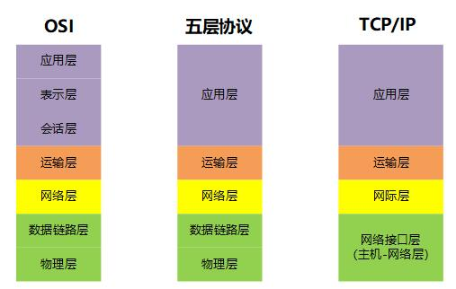
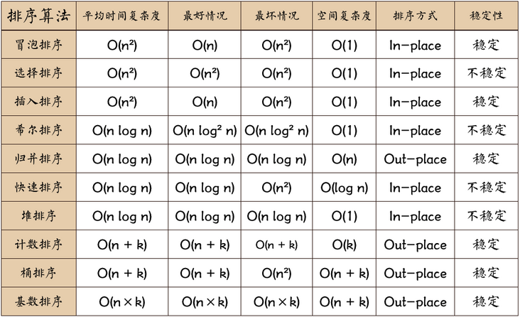

本系统是一个生产管理ERP系统，它能够帮助企业建立一个规范准确即时的生产数据库，同时实现轻松、规范、细致的生产业务、库存业务一体化管理工作。进而提高管理效率、及时掌握准确、全面的生产动态，有效控制生产过程。
技术/框架：Junit、EasyMock、PowerMock、JProfiler、JMeter、Selenium IDE
责任描述：
1.参与测试需求分析、测试方案、测试计划的评审
2.主要负责登录模块的静态测试和功能测试、物料消耗模块的性能测试
3.分析测试结果，编写测试报告


## 滴滴笔试

### Chrome V8中对象的命名属性有三种不同的存储方式（对象内属性，快属性，慢属性）
不包含对象外属性

- 对象内属性是直接存储到对象本身的，提供最快的查找速度。
- 快属性比对象内属性多了一次寻址时间：先查找出 properties 属性所指向的对象 properties ，之后可以直接根据偏移量查找的
- 慢属性比起前面两种，会存储属性的完整结构（前面两种的属性结构会在隐藏类里概括），速度最慢。


### 在RSA密钥系统中，若p=11，q=23，e=3，以下哪个可以是d的值 ,并给出计算过程：
A:437	B:147	C:367	D:587

首先，根据RSA密钥生成的公式，计算出N和ϕ(N)：

`N = p * q = 11 * 23 = 253`
`ϕ(N) = (p-1) * (q-1) = 10 * 22 = 220`

然后，根据e和ϕ(N)计算出d：

`d * e ≡ 1 (mod ϕ(N))`

这里使用扩展欧几里得算法求解d，具体步骤如下：

- 初始化`r0 = ϕ(N)`，r1 = e，s0 = 1，s1 = 0，t0 = 0，t1 = 1。

- 计算商`q = r0 / r1`，余数`r = r0 % r1`，然后更新r0 = r1，r1 = r，s0 = s1，s1 = s0 - q * s1，t0 = t1，t1 = t0 - q * t1。

- 重复执行第二步，直到余数r为0。

- 最终d的值为t0，如果t0为负数，加上ϕ(N)即可。

根据上述算法，我们可以求得：
```math
r0 = ϕ(N) = 220
r1 = e = 3
s0 = 1
s1 = 0
t0 = 0
t1 = 1

q = 73，r = 1
r0 = r1 = 3，r1 = r = 1
s0 = s1 = 0，s1 = s0 - q * s1 = 1
t0 = t1 = 1，t1 = t0 - q * t1 = -73

q = 3，r = 0
d = t0 + k * ϕ(N) = 147
```

因此，选项B: 147 可以是d的值。

### 以下关于自定义属性说法不正确的是
A自定义属性中不能使用纯数字
B自定义属性名称中不能有特殊字符
`Cdata-后必须有一个字符，如果使用多个单词连接时用+连接`
D自定义属性用data-开头


- 以data- 开头
- data-后面必须至少有一个字符，多个单词使用 - 连接
- 名称最好使用小写，然后用-连接。取值时候用小驼峰取出
- 名称中不要有特殊字符
- 最好不要用纯数字

### PV操作是一种实现进程互斥与同步的有效方法。P操作可能导致: ( )
`A进程阻塞`
B进程就绪
C进程结束
D新进程创建

```
PV操作是经典的进程同步工具，用于实现进程之间的互斥与同步。其中，P操作（即申请资源操作）可能导致进程阻塞，因为如果进程请求的资源已被其他进程占用，该进程就需要等待资源被释放后才能继续执行。而V操作（即释放资源操作）则不会导致进程阻塞。

B选项进程就绪是不正确的，因为P操作是用于请求访问临界资源的，如果该资源已经被其他进程占用，则当前进程需要等待，因此P操作可能导致当前进程阻塞。

C选项进程结束也不正确，因为P操作只是用于请求访问临界资源的，它本身并不能导致进程结束。

D选项新进程创建也不正确，因为P操作并不涉及创建新进程的操作，它只是用于进程间的同步和互斥。
```


### CSS 把“word"定义为任何非空白符字符组成的串，并由某种空白字符包围，以下声明中，可以控制单词间字母间距的是()
A font-weight
B letter-spacing
C font-size
D word-spacing

```
答案是B letter-spacing。

letter-spacing 属性定义字符间的间距，包括单词内部字符和单词之间字符的间距。而 word-spacing 属性只能控制单词之间的间距。

font-weight 控制字体粗细，font-size 控制字体大小。
```


### 关于 typescript 中 interface 和 type 的区别，描述不正确的是 ( )
Ainterface 可以声明基本类型别名，联合类型，元组等类型
B都允许拓展
Ctype 可以声明基本类型别名，联合类型，元组等类型
D都可以描述一个对象或者函数

```
以上说法都是正确的，没有描述不正确的。在 TypeScript 中，interface 和 type 都用来声明类型。它们的主要区别在于：interface 可以被 extends 和 implements，而 type 不行；type 可以声明联合类型，而 interface 不行。另外，interface 一般用来定义对象的形状，而 type 一般用来定义类型别名。
```


### 情景分析:企业的物资供应管理工作较为复杂和繁琐。一个完整的企业物资供应管理系统应包含多个管理子系统，其中仓库管理是核心。在明确了系统设计目标、开发设计思想、系统功能分析和模块设计之后，进入到数据库设计阶段。以下分析描述正确的是:(
A 在需求分析的基础上可以规划出库存实体、入库实体、采购实体、部门需求实体、出库实体等，并设计ERD.
B 概念结构设计应早于逻辑结构设计。
C 进行数据库需求分析，构建DFD。
D 应先进行数据库逻辑结构的设计，在推导出ERD

```
正确的选项是：

A 在需求分析的基础上可以规划出库存实体、入库实体、采购实体、部门需求实体、出库实体等，并设计ERD。
B 概念结构设计应早于逻辑结构设计。
C 进行数据库需求分析，构建DFD。

解析：

在设计企业物资供应管理系统的数据库时，应该首先进行数据库需求分析，确定需要包含哪些实体和关系，进而构建出数据流程图（DFD）。在此基础上，可以规划出每个实体对应的表结构，设计出ERD（实体-关系图），并进一步进行逻辑结构的设计。概念结构设计应该早于逻辑结构设计，因为前者是确定系统需求和范围的基础，而后者是具体实现的方式。
```


### 以下关于javascript中sse说法不正确的是
A sse使用http协议，现有的服务器软件都支持
B sse默认支持传送二进制数据
C sse属于轻量级的，使用相对简单
D sse与webSocket作用相似，都是建立浏览器与服务器之间的通信渠道，然后服务器向浏览器推送信信

```
关于JavaScript中SSE（Server-Sent Events）的说法不正确的是：B sse默认支持传送二进制数据。

SSE协议是基于HTTP协议的，它可以实现服务器主动向客户端推送数据，从而实现服务端与客户端之间的实时通信。SSE支持发送文本数据，而不支持发送二进制数据。因此，选项B说法不正确。

其他选项说法正确：A、C、D都是SSE的特点和应用场景。
```

### 通过vim编辑C程序test.c时,下列等价于:wq指令的是(
A :w
B :e!
C zz
D :q

```
选项A ":w" 会将文件保存但不退出 vim，因此不等价于 ":wq"。

选项B ":e!" 会重新加载文件但不退出 vim，因此也不等价于 ":wq"。

选项C "zz" 会将当前行置于屏幕中间，但不会保存文件也不会退出 vim，因此也不等价于 ":wq"。

因此，选项D ":q" 是等价于 ":wq" 的。它会将文件保存并退出 vim。
```

### 系统管理员编写网络配置脚本程序/etc/netconfig.sh,希望Linux系统每次启动时自动执行,需要把该脚本程序加入的文件是()
A /etc/yp.conf
B /etc/profile
C /etc/fstab
D /etc/rc.d/rc.local

正确答案是D。将/etc/netconfig.sh加入到/etc/rc.d/rc.local中，使其每次开机时自动执行。

### 在Linux系统中挂起的进程可以通过作业ID号继续执行,作业ID的最小值是()
在Linux系统中，作业ID（Job ID）是由Shell进程自动分配的一个整数，用于标识在Shell进程中运行的作业。通常情况下，作业ID的最小值为1。因此，答案为1。

### TCP/IP参考模型的网络接口层对应OSI参考模型的是
A 数据链路层
B 物理层
C 传输层
D 网络层

TCP/IP参考模型的网络接口层对应OSI参考模型的数据链路层。



### fcntl函数中fd设置为 () 时，会在被调用后立即返回
F_BLOCK
O_BLOCK
O_NONBLOCK
F_NONBLOCK

fcntl函数中fd设置为O_NONBLOCK时，会在被调用后立即返回。

### 下列选项中，最好时间复杂度与最坏时间复杂度相同的是
A 简单选择排序
B 冒泡排序
C 直接插入排序
D 快速排序



### 编程1
题目描述:
给你一个由正整数组成的集合，你需要从中删掉尽可能少的数使得该集合的众数出现次数不超过给定的参数k。最终你需要输出至少需要删除几个数

输入描述：
第一行有两个正整数n，k(1<=k<=n<=100000)，代表集合大小。
第二行有n个正整数，范围在1到1000000000之间，代表给出的集合。

输出描述：
输出一个非负整数，即至少需要从集合中删除几个数才能使得集合中众数的出现次数不超过k。

样例输入：
51
1 3 2 21
样例输出：
2

以下是一种可能的Java实现，使用了HashMap来统计每个数字出现的次数，并找到出现次数最多的数字。然后，我们迭代所有数字，并计算删除它们后众数出现的次数，找到需要删除的最少数字的数量。
### 编程2
题目描述:
小明正在进行积木的分销。他一共有N个积木，他要将它们分装到M个小包装内，每个小包装内至少有一个。如果一个小包装内含x个积木，那么这个小包装将会被定价为X2。小明想要控制一下价格，不希望价格太贵或者太便宜他想要知道是否存在一种分装方案，使得分装后的M个小包装定价之和恰好为P。如果有多种方案，输出字典序最小的那一个。对于两种不同方案{a1,a2....am)与(b,,b2...,bm)，若对于1sist的i均有a:=b;，且at+1<bt+1，那么认为方案a的字典序小于方案b
注意: 当t=0时，没有合法的i存在，1sist只是限制i的范围。例如，对于M=3,N=4的情况下，网,1.2)的字典序小于{2,1,1}(对应t=0的情况)、{1,2,1(对应t=1的情况)。

输入描述:
第一行三个正整数N,M,P，含义如题面
对于所有数据，1<=M<=N<=12;0<=P<=10^9
输出描述:
若不存在任何方案，输出-1，否则输出M个数表示每个小包装内应分的的积木数量。

样例输入:
4 3 6
样例输出:
1 1 2

```java
//这道题可以使用动态规划来解决，具体思路如下：
//
//首先，我们定义状态f[i][j][k]表示前i个积木，分成j个小包装，总价值为k的方案是否存在。由于M<=N<=12，k的范围在0~10^9之间，所以我们需要用一个哈希表来优化空间复杂度，同时也需要进行去重操作，以确保字典序最小。
//
//其次，我们需要考虑状态转移方程。对于每个状态f[i][j][k]，我们需要将第i个积木分到其中一个小包装里，此时就会有两种情况：
//
//第i个积木单独分成一个新的小包装，那么f[i][j][k] = f[i - 1][j - 1][k - i * i]。
//第i个积木加入已有的某个小包装，那么f[i][j][k] = f[i - 1][j][k - j * j]。
//最后，我们需要遍历所有的状态，找到满足要求的方案中字典序最小的一个，输出即可。
```

## 数字浙江笔试
### 获取li
```html
<ul id="test">
    <li>Glen</li>
    <li>Tane</li>
    <li>John</li>
    <li>Ralph</li>
</ul>
```
```js
window.onload = function(){
    var obj_lis = document.getElementById("test").getElementsByTagName("li");
    for(i=0;i<obj_lis.length;i++){
        obj_lis[i].onclick = function(){
            alert(this.innerHTML);
        }
    }
}
```

## funplus笔试
### console.log(["1","2","3"].map(parseInt));
返回值是[ 1, NaN, NaN ]
原因：map的回调是会给三个参数的，element,index,array
所以是
```js
parseInt('1', 0); // OK - gives 1
parseInt('2', 1); // FAIL - 1 isn't a legal radix
parseInt('3', 2); // FAIL - 3 isn't legal in base 2
```
可以这么写
```js
['1','2','3'].map(function(num) { return parseInt(num, 10); });//基数radix为10
```
旧浏览器将导致 parseInt("010") 为 8，因为旧版本的 ECMAScript（比 ECMAScript 5 旧）当字符串以 "0" 开头时使用八进制基数 (8) 作为默认值。从 ECMAScript 5 开始，默认值为十进制基数 (10)。


### 移动端适配尺寸以及刘海屏问题

### 前端优化方法（尽可能多）

### 使用JSON自带函数进行深拷贝有什么问题？简单封装一下可以解决这些问题的深拷贝方法

### MVC和MVVM的方法，区别，优劣

### 数组会改变原数组的方法有哪些