### 准备
#### 自我介绍
面试官你好，我叫黄益妙，来自浙江工业大学软件工程专业的23届应届生。

作为一名软件工程的学生，我熟悉并掌握了多种前端技术，包括HTML、CSS、JavaScript等。我也具备一些比较流行的的前端框架和库的开发经验，例如bootstrap、jquery和Vue.js等。同时，我也理解前后端交互的机制以及协作工具如git的使用，并曾经和同学一起开发过一个大型车位管理系统的项目。在校期间我多次获得了学习奖学金和社会实践奖学金，积极参加竞赛，在电子商务大赛，服务外包大赛，网络安全大赛中都获得了省级以上的奖项。

我热爱学习和不断提升自己的技能，因此我经常关注前端技术的最新动态，在掘金、v2ex、github等社区阅读相关的博客和书籍。我也喜欢和其他开发者进行交流，分享我的经验和知识，偶尔在开源社区为一些开源项目提交pr，并且愿意在工作中协同团队中的其他成员，以实现最佳的开发效果。

如果给我机会成为杭州银行信息技术部的一员，我将竭尽全力为公司贡献我的技能和才华，并与团队协同工作，创造出优质的应用程序。谢谢！

#### 自身优势
我的优势大概就是持久，相对有计划性。
持久方面大概概括来说就是：持续性地练习、总结和改进，我相信我可以让一切变好。
然后计划性的话，我每天会根据相应的日程和学习任务安排，在晚上把下一天的时间安排好，然后每周末会制定下一周每天的大概任务，然后日任务的话就是根据周任务进行相对的拓展，我觉得这一步是非常有必要的，这些工作看似是多花了时间，实际上是在后续执行过程中为我们节省了大量的时间，就好比像把一个复杂的任务进行细化，相对来说会更有条理，也更有动力去完成这样一个任务。

技术能力、业务能力、沟通能力、架构能力，风险管理，编码技能，管理能力等技能，都是通过不断地练习、总结和改进才能不断提高的。而我的具体方法是通过看书，然后学习之后在自己的知识库对相应的知识点进行总结，后续也是在计划开始打造自己专属的个人博客这样，对外输出然后得到反馈也会让我得到更快的进步。

其实就目前来说，我可能跟那些名校毕业的，或者说是有很多段实习的同学来说，起点上还是有些差距的。意识到这个差距之后，我倒是能沉得下心来，去规划一些想做的事情，去长期的做一些事情。所以，我会以年为单位去做一些事情，以月为单位去做一些事情。

对于一个前端工程师来说，编码方面肯定是重中之重的，这不必说，我计划中的对应的练习包括：

* 阅读开源软件代码，再造个精简的轮子（最近是在计划阅读vuejs设计和实现
* 练习 TDD、重构、测试、代码规范等 （之前是看过一本名叫clean code的书，里面就是详细阐释了在业务交付时间有限的情况下好代码和烂代码产生的巨大的差异，然后里面也是对代码规范进行了对应的规定吧，平时编码我也会注意这方面）
* 练习架构（这个是真的一个长期的过程了，需要在项目中不断积累经验）

其次，我觉得对于前端工程师来说，审美也是非常有必要提升的，我有关注很多设计师相关的平台和公众号，经常会去翻阅提升自己的审美水平，然后乐器的话也是有在练习口琴的。

#### 希望加入什么样的团队
对于自身而言：
1. 开心：工作环境良好、团队氛围舒适、人际关心融洽、工作内容及节奏可匹配和胜任等。
2. 成长：工作有所挑战、可以弥补自己的某些短板、可以锻炼更广阔的视野和灵活的思维等。
3. 发挥所长：自己的能力和价值可以得到体现和发挥、可以有机会成为某种权威、可以在擅长的细分领域得到积累等。
4. 希望有相对好的收入

然后是对于团队协作和项目规范来说：（因为一个项目前期规范的程度是和项目易维护程度是呈正比的，对于我来说，是会把时间花在啊规范上面的）

- 统一的项目结构：可能根据不同的类别会有几个，如响应式项目，非响应式项目
- 编码规范
- 高质量的第三方组件库；以及团队自己开发的组件/代码片段
- 丰富的文档，包括 
    - 可在线查看的公共的文档 
        - 第三方组件库；以及团队自己开发的组件/代码片段的文档以及demo
        - 前端工具的介绍
        - 项目开发过程中遇到的问题的描述与总结
    - 具体项目的文档 
        - 项目如何启动
        - 项目文件结构描述
        - 项目的开发和发布
- 工具化 
    - 项目结构由命令行生成
    - 新建页面，模块等由命令行生成
    - 功能完成后，用工具进行验证编码风格是否满足规范
    - 发布流程：资源压缩，合并等
- 维护团队前端技能树。列出我们知道的所有的前端的技术点。并标出团队对技能的熟悉情况。不断的去覆盖它。

#### 项目介绍
这个项目是一个智能开发商车位销售平台，我担任的是项目的一部分开发工作，负责用户模块的整体前后端代码开发，以及最终的软件测试。该项目主要使用了Spring框架实现前后端分离，Ajax实现数据异步传输，Json实现前后端数据交互，使用MySQL作为数据库，SpringMVC和MyBatis作为后端开发框架。

在项目开发过程中，我负责了整体逻辑的构建，包括用例、类、方法流程等的设计。在数据库的搭建方面，我负责了数据库的设计和优化SQL代码，以确保数据存储和访问的效率和准确性。

在用户模块的开发方面，我负责了整个模块的前后端代码开发，包括前端页面的设计和开发，后端业务逻辑的实现和数据传输的实现。同时，我还负责了最终的软件测试，包括单元测试和集成测试，以确保整个系统的功能和性能符合要求。

同时，我们组员在协同开发过程之中使用git来进行项目协同和版本控制，大大挺高了开发效率和减少开发成本。

总体来说，这个项目的目标是为开发商提供一个高效、智能的车位销售平台，使其能够更好地管理和销售车位，并为用户提供更好的购买体验。我在这个项目中的工作，是为实现这个目标做出了贡献。

##### 难点
>一开始没搞懂
>去网上看了个答案
>一试发现这个广为流传的答案是有坑的
>于是自己看 issue
>发现还有一个小细节
>然后解决了
>谁知道还是在某种 edge case有问题
>于是自己看规范看源码，搞定
>后来发现自己用的第三方库上也有此问题，GitHub上提交pr 被合并

回答：
在我参与的这个车位管理的项目，我负责的用户模块中，有一个业务需求是用户与开发商进行车位购买的时候，等待开发商确认后会拟定一份电子合同，而用户需要在这份合同上签字，并且签字的内容是可以让开发商查看的。当时在实现这个签字功能的时候，一开始是在stackoverflow上寻找解决办法，发现广为流传的方法是通过canvas进行绘图，通过在canvas监听鼠标的点击移动事件动态绘制线条和文本来完成签名，但是在回答里并没有给出如何把数据传递给后台，于是就去学习了一下canvas相关的操作，最后把绘制好的图像通过图片流的形式传递给后台的controller中进行操作，因为按照我们的业务流程这个签名签完之后是要跳转到合同查看的那个页面的，所以在后台的controller中接到这个数据流之后的想法就是把它转换成图片然后保存到对应的路径下之后也能查看，但是这样做的后果就是在当前这次服务中没有办法实时查看，因为图片是保存在本地了，在服务器上并没有保存，除非就是重新启动一次服务器，后来的解决方法就是不仅要把图片保存到本地，在跳转到合同查看那个页面时同时也要把图片的数据流传过去，保证实时可以查看，最终就是通过这样解决了这个签字的的问题。

1. 性能问题
   在我参与的企业网站开发项目中，我们使用了一些复杂的UI组件和动画效果，导致网站加载速度变慢。为了解决这个问题，我们使用了Webpack进行代码分割，只加载当前页面所需要的代码，减少了网站的加载时间。同时，我们使用了CDN来加速网站静态资源的加载。此外，我们还对图片进行了优化，使用了懒加载和预加载等技术来提高网站性能。

 |  	 | 懒加载	| 预加载|
 |  ---- | ----  | ---- |
 |  定义	| 延迟加载、按需加载	|提前加载、不需要也提前加载|
 |  目的	|更好更快地加载页面首屏内容，网页性能优化	|让用户无需等待，获得直接预览的良好体验|
 | 缺点	|需要监听图片是否显示，耗费浏览器性能	|占用较多的后台资源，可能一次性加载较多的图片|
 |  应用场景|	电商搜索产品时图片展示	|观看漫画时，每次切换的下一张图片提前加载|

2. 跨域问题
   在我参与的电子商务平台开发项目中，我们前后端分离，前端使用Vue.js作为框架，后端使用Node.js和MongoDB。在前端向后端发送请求时，由于跨域问题，导致请求被浏览器拦截。为了解决这个问题，我们使用了Vue.js提供的代理模式，在开发模式下将前端请求代理到后端。在生产环境下，我们使用了Nginx反向代理来解决跨域问题。

3. 数据库设计问题
   在我参与的微信小程序开发项目中，我们使用了小程序云开发提供的数据库服务。在设计数据库时，我们遇到了一些问题，例如数据结构不合理、查询性能较差等。为了解决这个问题，我们对数据进行了重新设计，使用了适当的索引来提高查询性能。我们还对数据库进行了数据分片，将数据存储在多个集合中，以减少单个集合中的数据量。

以上是我在项目中遇到的一些难点以及解决方法。在实际项目中，我们会遇到各种各样的问题，关键在于能够快速找到问题所在，并采取有效的解决方案。这需要我们具备良好的沟通能力、团队协作能力以及快速学习和解决问题的能力。

1. 前后端数据交互问题：由于是前后端分离的开发模式，需要使用Ajax和Json实现数据交互。在实现过程中，需要考虑如何处理前端发送的请求并返回正确的响应，以及如何在前端页面正确地解析后端返回的数据。
2. 大规模数据存储问题：由于项目需要存储大量的数据，如车位信息、用户信息等，需要考虑如何设计和优化数据库，以确保数据的存储和访问的效率和准确性。
3. 多人协作问题：由于项目需要多人协作开发，需要考虑如何合理地分配任务、协同开发以及如何处理代码冲突等问题，以确保项目能够高效地进行。
针对这些问题，我通过学习相关知识和与团队成员沟通协作，最终解决了这些问题。比如，在前后端数据交互方面，我通过学习相关的技术和与后端开发人员的沟通，成功地实现了数据的正确传输和解析；在数据库设计和优化方面，我使用了相关的工具和技术，如SQL语句的优化等，来提高数据库的性能和准确性；在多人协作方面，我使用了Git等版本控制工具来协同开发和解决代码冲突等问题。


#### SQL优化
1、对查询进行优化，应尽量避免全表扫描；
2、应尽量避免在where子句中对字段进行null值判断；
3、应尽量避免在where子句中使用!=或<>操作符；
4、“in”和“not in”也要慎用，否则会导致全表扫描。
5、对于一些比较复杂，重用度比较高的逻辑会建立触发器来简化代码

#### 加班
进行前端工作是一个非常细致的过程，在我以往的项目经验来看，每一个项目都有一些重要的节点，这需要整个团队都付出额外的努力和时间，对此我表示十分地理解，因为这是我们需要做的核心工作。在我看来，如果加班是必要的，那我愿意投入额外的时间，并推动工作的发展，如果加班是因为其他的情况导致一些工作效率低下造成的，那我会做的是找出效率低下的原因，并找到自己和团队能够改善的方法

作为一个前端工程师，我认为加班是必要的，但是不能成为常态。在项目紧急的情况下，必须要进行加班来满足项目的进度和质量要求，但同时需要合理安排工作和生活，保持身体和心理的健康。如果加班成为常态，可能说明问题出在项目的规划和管理上，需要重新评估项目的进度和资源分配。

在加班时，我认为需要有效地利用时间，合理安排任务，避免无效的加班。同时需要与团队成员充分沟通，合理分配任务，减少因个人原因引起的加班。最后，在加班结束后，需要适当地休息和放松，保持健康的生活方式。

#### bunjs性能
- 不同于 Node.js 和 Deno，Bun 使用了 JavaScriptCore 引擎，其启动和执行速度比 V8 引擎要快一些；
- 使用了新兴的系统编程语言 Zig，主要通过手动内存管理对内存进行更细粒度的控制、无隐藏的控制流来提升程序的性能；
- 在前两点的前提下，重新实现了诸如 JSX/TypeScript 转编器、SQLite 客户端、HTTP 客户端、WebSocket 客户端等类库。

#### core-js简介
core-js是**完全模块化的javascript标准库**。 包含ECMA-262至今为止大部分特性的polyfill，如promises、symbols、collections、iterators、typed arrays、etc，以及一些跨平台的WHATWG / W3C特性的polyfill，如WHATWG URL。 它可以直接全部注入到全局环境里面，帮助开发者模拟一个包含众多新特性的运行环境，这样开发者仅需简单引入core-js，仍然使用最新特性的ES写法编码即可；也可以不直接注入到全局对象里面，这样对全局对象不会造成污染，但是需要开发者单独引入core-js的相关module，并可能还需要通过手工调用module完成编码，没法直接使用最新ES的写法。它是一个完全模块化的库，所有的polyfill实现，都有一个单独的module文件，既可以一劳永逸地把所有polyfill全部引入，也可以根据需要，在自己项目的每个文件，单独引入需要的core-js的modules文件。

### 恒生一面

#### 自我介绍

#### 项目经历，以及怎么实现
   1. 项目的背景是什么
   2. 当前项目的目的是什么
   3. 在开发过程中，我的角色是什么
   4. 在开发过程中遇到什么难题
   5. 遇到这些问题都是怎么解决的
   6. 项目完成后取得了哪些成果

#### 项目中的难点以及怎么解决
   * 业务/技术
   * 翻页需求（SQL和前端适配）
通过传入参数，限制页数和每页的数量
```xml
   <select id="selectOrder" parameterType="java.util.Map" resultType="com.bean.Order">
        select `order`.* from `order`,`parking_space`,`residential_quarters`
    <where>
        `order`.parking_space_id=`parking_space`.id and
        `parking_space`.residential_quarters_id = `residential_quarters`.id and
        `residential_quarters`.developer_id=#{did}
        <if test="search != null and search !=''">
            and `order`.`state` like concat('%', #{search}, '%')
            or `order`.`order_time` like concat('%', #{search}, '%')
            or `order`.`order_id` = #{search}
        </if>
    </where>
    LIMIT ${(pageNum-1)*pageSize},${pageSize*pageNum};
    </select>
```
   * 跟被人协作时 git问题等等
   * youtube上那个展开

#### 使用什么框架，vue的生命周期以及其对应构造函数

#### 跟他人协调，以及遇到的困难。

#### 闭包

闭包是指一个函数可以访问并操作在其定义外部的变量，即使这个函数在外部变量的作用域之外被调用，也能访问到这些变量。这是因为在JavaScript中，每个函数都会创建一个自己的作用域，包括函数中定义的局部变量和函数的参数，以及在函数定义时在外部作用域中定义的变量。

当一个函数内部引用了在外部作用域中定义的变量时，JavaScript会自动创建一个闭包来保存这个变量的引用。闭包是由函数和其对应的作用域组成的，它可以在函数外部访问并操作在函数定义时存在的作用域中的变量。这种机制可以让JavaScript中的函数具有更大的灵活性和可重用性。

例如，以下代码演示了如何创建和使用闭包：

function createCounter() {
  var count = 0;
  function counter() {
    count++;
    console.log(count);
  }
  return counter;
}

var myCounter = createCounter();
myCounter(); // 输出 1
myCounter(); // 输出 2

在这个例子中，createCounter 函数返回一个内部函数 counter。counter 内部引用了在外部作用域中定义的 count 变量。当 myCounter 被调用时，count 变量的值被增加，并输出到控制台。由于 myCounter 是 createCounter 返回的 counter 函数，它可以访问并操作 createCounter 定义时存在的作用域中的变量，也就是闭包的概念。

#### this关键字

在JavaScript中，this 关键字指向当前函数的执行上下文，它的值在每个函数调用时动态计算，具体取决于函数被调用时的调用方式以及执行上下文的类型。 this 的值在运行时确定，而不是在函数定义时确定。

this 的值在 JavaScript 中有四种调用方式：

1. 默认绑定：当一个函数独立调用时，this 指向全局对象，即 window 对象。

2. 隐式绑定：当一个函数作为对象的方法调用时，this 指向调用该方法的对象。

3. 显式绑定：通过 call()、apply() 或者 bind() 方法将一个函数绑定到指定对象上，并且 this 指向指定对象。

4. new 绑定：通过 new 关键字创建一个新的实例对象时，this 指向这个新对象。


另外，作用域是指一个变量的可访问范围。在 JavaScript 中，有函数作用域和块级作用域两种作用域。函数作用域指的是在函数内部定义的变量只在该函数内部可见，而在函数外部无法访问。块级作用域是指在代码块内定义的变量只在该代码块内可见。

当一个函数被调用时，它会创建一个新的执行上下文，这个执行上下文包含了当前函数的作用域以及 this 的值。函数内部可以访问当前作用域和上层作用域中定义的变量，但是不能访问函数外部的作用域中定义的变量。在 JavaScript 中，作用域链用来描述一个函数在执行时如何访问变量的，它是由当前函数的作用域以及上层作用域构成的。

总结一下，this 关键字用于确定当前函数的执行上下文，作用域用于确定一个变量的可访问范围。在 JavaScript 中，要理解好 this 和作用域，可以帮助我们写出更加清晰和可维护的代码。

#### 有什么要问面试官的
   * 觉得我怎么样
   * 总共几轮面试
   * 团队用的技术栈
   * 团队的人员架构
   * 团队协作工具/开发工具/流程工具是什么，如何沉淀文档
   * 未来团队计划补充到多少人

### 杭州银行（总行信息技术部-前端）
#### 自我介绍
#### 关注前端的哪些事件
#### 介绍一下core-js
>core-js是完全模块化的javascript标准库。 包含ECMA-262至今为止大部分特性的polyfill，如promises、symbols、collections、iterators、typed arrays、etc，以及一些跨平台的WHATWG / W3C特性的polyfill，如WHATWG URL。 **它可以直接全部注入到全局环境里面，帮助开发者模拟一个包含众多新特性的运行环境，这样开发者仅需简单引入core-js，仍然使用最新特性的ES写法编码即可；**也可以不直接注入到全局对象里面，这样对全局对象不会造成污染，但是需要开发者单独引入core-js的相关module，并可能还需要通过手工调用module完成编码，没法直接使用最新ES的写法。它是一个完全模块化的库，所有的polyfill实现，都有一个单独的module文件，既可以一劳永逸地把所有polyfill全部引入，也可以根据需要，在自己项目的每个文件，单独引入需要的core-js的modules文件。

#### 介绍项目
#### vue生命周期
* beforeCreate: 实例刚被创建，数据观测和事件机制未初始化，此时无法访问到 data、methods、computed 等属性和方法。
* created: 实例已经创建完成，此时已经完成了数据观测和事件机制的初始化，可以访问到 data、methods、computed 等属性和方法。
* beforeMount: 模板编译完成，但未挂载到 DOM 上。
* mounted: 模板编译完成，已经挂载到 DOM 上，此时可以访问到渲染后的 DOM。
* beforeUpdate: 数据更新前，DOM 尚未重新渲染。
* updated: 数据更新后，DOM 已经重新渲染。
* beforeDestroy: 实例销毁前，此时实例仍然可用。
* destroyed: 实例已经销毁，此时实例中的所有东西都已被清理掉。
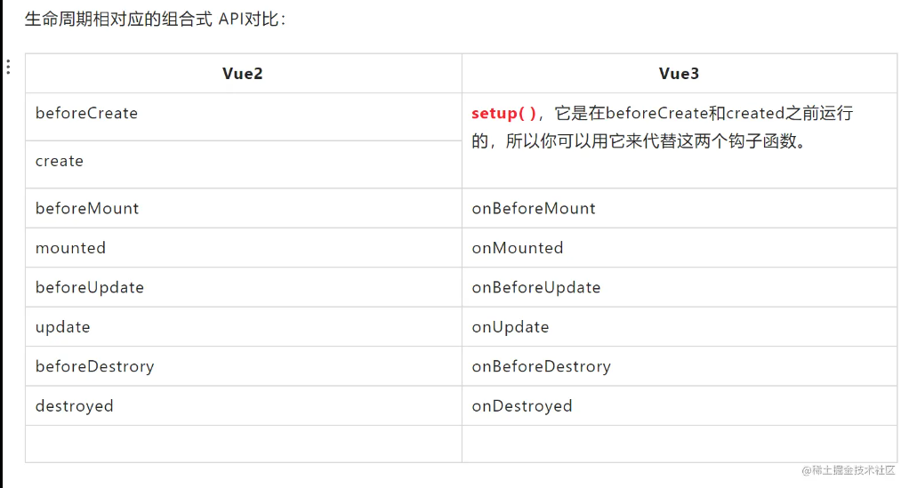

#### js类型
>值类型(基本类型)：字符串（String）、数字(Number)、布尔(Boolean)、空（Null）、未定义（Undefined）、Symbol。
>引用数据类型（对象类型）：对象(Object)、数组(Array)、函数(Function)，还有两个特殊的对象：正则（RegExp）和日期（Date）。
>注：Symbol 是 ES6 引入了一种新的原始数据类型，表示独一无二的值。

#### 哈希表

数组的特点是：寻址容易，插入和删除困难；

而链表的特点是：寻址困难，插入和删除容易。

应用：

1、Hash主要用于信息安全领域中加密算法，它把一些不同长度的信息转化成杂乱的128位的编码,这些编码值叫做Hash值. 也可以说，Hash就是找到一种数据内容和数据存放地址之间的映射关系。

2、查找：哈希表，又称为散列，是一种更加快捷的查找技术。我们之前的查找，都是这样一种思路：集合中拿出来一个元素，看看是否与我们要找的相等，如果不等，缩小范围，继续查找。而哈希表是完全另外一种思路：当我知道key值以后，我就可以直接计算出这个元素在集合中的位置，根本不需要一次又一次的查找！

举一个例子，假如我的数组A中，第i个元素里面装的key就是i，那么数字3肯定是在第3个位置，数字10肯定是在第10个位置。哈希表就是利用利用这种基本的思想，建立一个从key到位置的函数，然后进行直接计算查找。

3、Hash表在海量数据处理中有着广泛应用。

#### 数据结构有哪些

https://hit-alibaba.github.io/interview/basic/algo/Hash-Table.html

* 数组（Array）
* 队列（Queue）
* 链表（Linked List）
* 栈（Stack）
* 树（Tree）
* 散列表（Hash）
* 堆（Heap）
* 图（Graph）

##### 数组(Array)
数组是最简单、使用最频繁的一种数据结构。它一种线性表数据结构，用一组连续的内存空间来存储一组相同类型的数据。

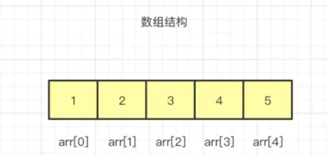

##### 队列(Quene)

队列也是一种非常基础的数据结构，其特点是先入先出，也就是我们常听到的FIFO（First in First Out），即操作数据是从两端进行的。

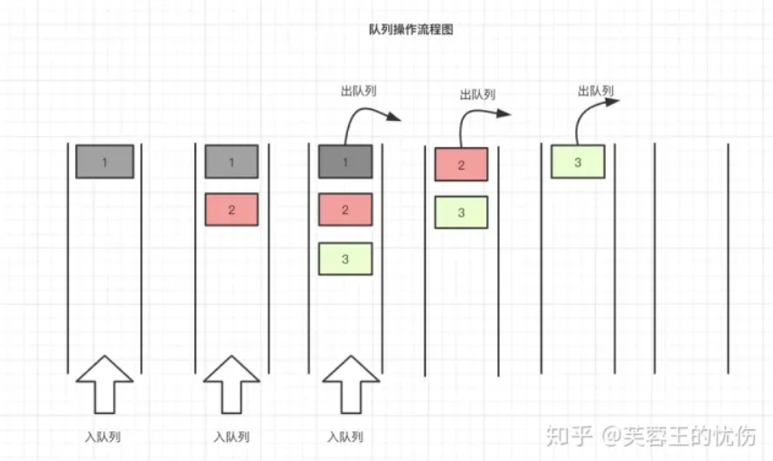

##### 链表(Linked List)

链表是一种物理存储单元上非连续，非顺序的存储结构。链表有一系列节点组成，所谓节点就是指链表中的每一个元素，每个节点包含两个数据，一个是存储元素的数据域（值），另一个是存储下一个节点地址的指针域。

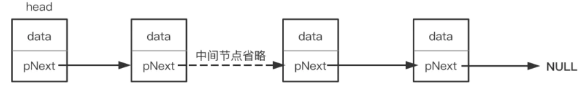

通俗点说，链表数据一般都是分散存储于内存中 的，无须存储在连续空间内。这样大家可能还不能直观的感受链表的非连续，我再画一张图：

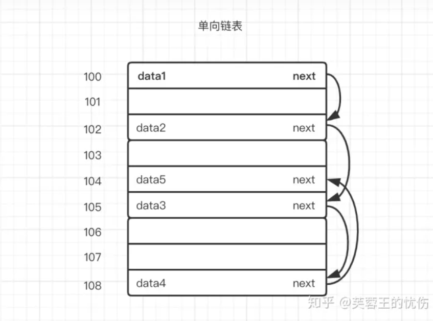

假设上图中100-108是一块内存中连续地址的内存分布，假设101、103、106、107这几个内存地址都已经存储数据了，那剩下的100、102、104、105、108是不是就浪费呢，答案是否定的，我们可以使用链表的方式存储数据。

##### 栈(Stack)

栈也是一种数据呈线性排列的数据结构，和上面的队列相反，栈的特点先进后出、后进先出，就是常说的LIFO（Last in First Out）。

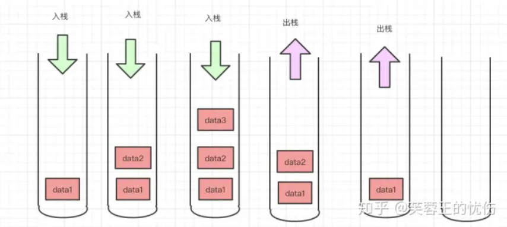

##### 树(Tree)

树形结构是一种层级式的数据结构，由顶点（节点）和连接它们的边组成。
数的结构特点是：

- 每个节点有零个或多个子节点；
- 没有父节点的节点称为根节点；
- 每一个非根节点有且只有一个父节点；
- 除了根节点外，每个子节点可以分为多个不相交的子树。

我们平时用到最多的就是二叉树，我也以二叉树来为例，先看一下树结构：

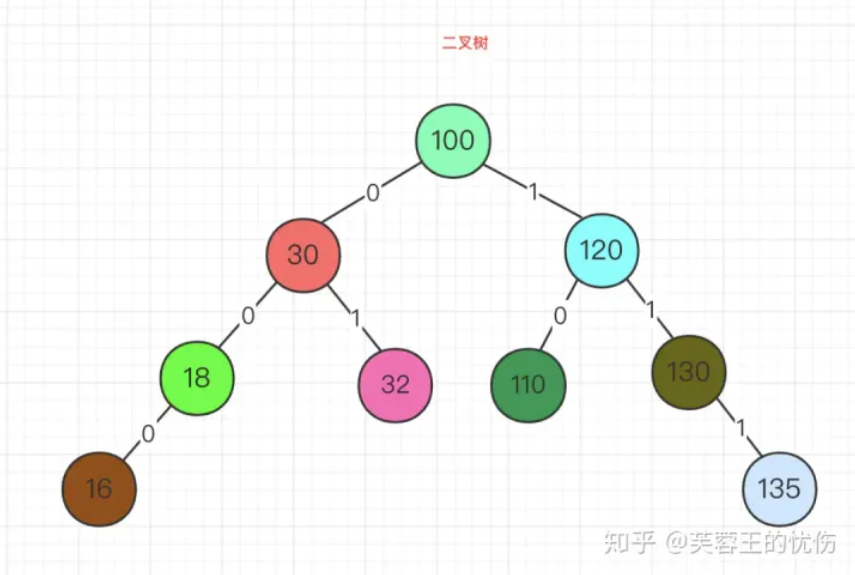

二叉树有几下特点：

- 每个结点最多有两颗子树，结点的度最大为2。
- 左子树和右子树是有顺序的，次序不能颠倒。
- 即使某结点只有一个子树，也要区分左右子树。
- 个结点的值均大于其左子树上任意一个结点的值。比如 点的值。结点100大于其左子树上的30，18和16。
- 每个结点的值均小于其右子树上任意 一个结点的值。比如结点 100 小于其右子树上的 120、130 和 135。

##### 散列表(Hash)

散列表又叫哈希表，存储的是由键(key)和值(value)组 成的数据，根据键直接访问存储在内存存储位置的数据结构。

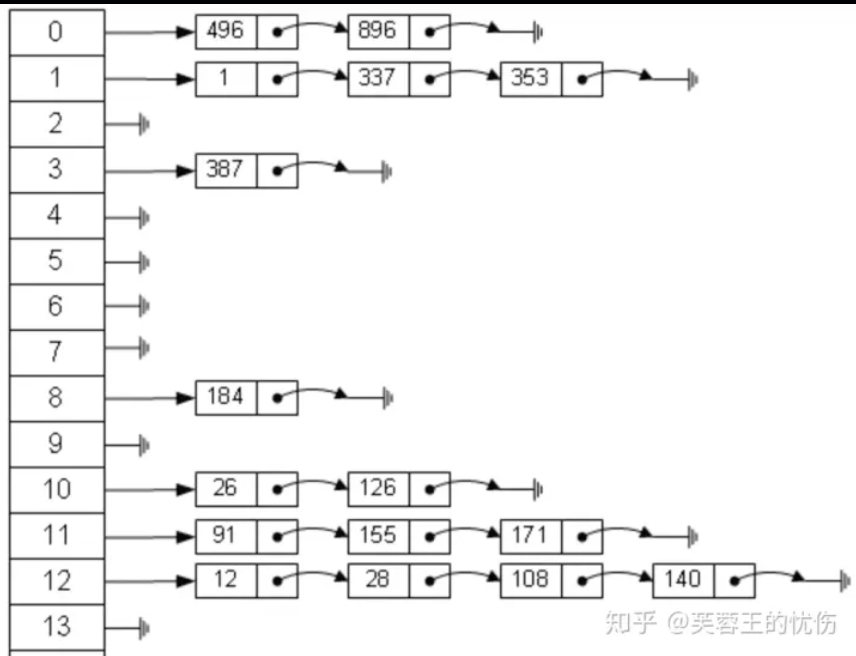

从图中可以看出，左边很明显是个数组，数组的每个成员包括一个指针，指向一个链表的头，当然这个链表可能为空，也可能元素很多。我们根据元素的一些特征把元素分配到不同的链表中去，也是根据这些特征，找到正确的链表，再从链表中找出这个元素。**哈希表查找数据的公式为：记录的存储位置=f(key)**这里的对应关系 f 成为散列函数，又称为哈希 (hash函数)，而散列表就是把Key通过一个固定的算法函数既所谓的哈希函数转换成一个整型数字，然后就将该数字对数组长度进行取余，取余结果就当作数组的下标，将value存储在以该数字为下标的数组空间里，这种存储空间可以充分利用数组的查找优势来查找元素，所以查找的速度很快。我们将在后面详细讲解哈希表数据结构。

##### 堆(Heap)

堆比较特殊，是一种图的树形结构。被用于实现“优先队列”(priority queues)，优先队列是一种数据结构，可以自由添加数据，但取出数据时要从最小值开始按顺 序取出。在堆的树形结构中，各个顶点被称为“结点”(node)，数据就存储在这些结点中。
只要满足下面两个特点的树形结构就是堆：

- 堆是一个完全二叉树（所谓完全二叉树就是除了最后一层其他层的节点个数都是满的）。
- 堆中每一个节点的值都必须大于等于或者小于其子树中每一个节点的值。

下面我们看一下堆的结构：

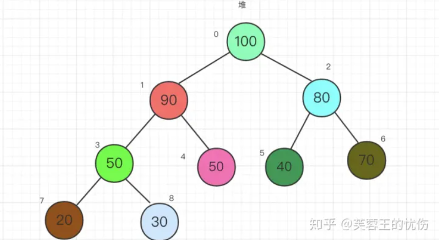

上面其实叫大顶堆，如果每一个节点小于子树中每个节点的值，那就叫小顶堆。

##### 图(Graph)

图是相对复杂的一种数据结构，由顶点和连接每对顶点的边所构成的图形就是图。
我们先来看图：

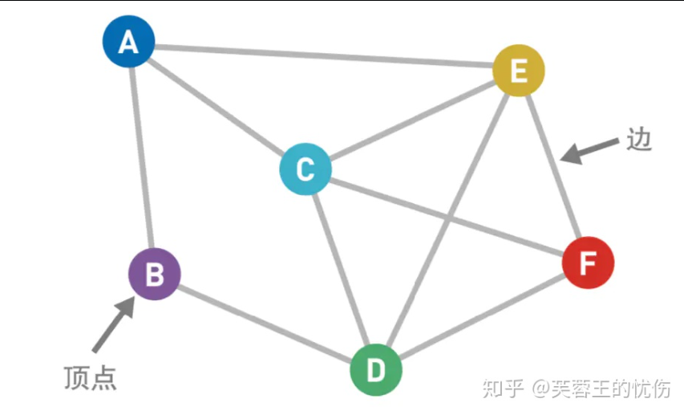

上图中的圆圈叫作“顶点”(Vertex，也叫“结点”)，连接顶点的线叫作“边”（Edge）。也就是说，由顶点和连接每对顶点的边所构成的图形就是图。 图按照顶点指向的方向可分为无向图和有向图，像我上面的就叫无向图。 图在存储数据上有着比较复杂和高效的算法，分别有邻接矩阵 、邻接表、十字链表、邻接多重表、边集数组等存储结构。常见的图遍历算法就是广度优先算法和深度优先算法。


#### 原子性
>数据库管理系统中事务(transaction)的四个特性（分析时根据首字母缩写依次解释）：原子性（Atomicity）、一致性（Consistency）、隔离性（Isolation）、持久性（Durability）
>所谓事务，它是一个操作序列，这些操作要么都执行，要么都不执行，它是一个不可分割的工作单位。（执行单个逻辑功能的一组指令或操作称为事务）
>1. 原子
>>原子性是指事务是一个不可再分割的工作单元，事务中的操作要么都发生，要么都不发生。
>>可采用“A向B转账”这个例子来说明解释
>>在DBMS中，默认情况下一条SQL就是一个单独事务，事务是自动提交的。只有显式的使用start transaction开启一个事务，才能将一个代码块放在事务中执行。
>2. 一致性
>>一致性是指在事务开始之前和事务结束以后，数据库的完整性约束没有被破坏。这是说数据库事务不能破坏关系数据的完整性以及业务逻辑上的一致性。
>>如A给B转账，不论转账的事务操作是否成功，其两者的存款总额不变（这是业务逻辑的一致性，至于数据库关系约束的完整性就更好理解了）。
>>保障机制（也从两方面着手）：数据库层面会在一个事务执行之前和之后，数据会符合你设置的约束（唯一约束，外键约束,check约束等)和触发器设置；此外，数据库的内部数据结构（如 B 树索引或双向链表）都必须是正确的。业务的一致性一般由开发人员进行保证，亦可转移至数据库层面。
>3. 隔离性
>>多个事务并发访问时，事务之间是隔离的，一个事务不应该影响其它事务运行效果。
>>在并发环境中，当不同的事务同时操纵相同的数据时，每个事务都有各自的完整数据空间。由并发事务所做的修改必须与任何其他并发事务所做的修改隔离。事务查看数据更新时，数据所处的状态要么是另一事务修改它之前的状态，要么是另一事务修改它之后的状态，事务不会查看到中间状态的数据。
>>事务最复杂问题都是由事务隔离性引起的。完全的隔离性是不现实的，完全的隔离性要求数据库同一时间只执行一条事务，这样会严重影响性能。
>>关于隔离性中的事务隔离等级（事务之间影响），参见相应博文
>4. 持久性
>>这是最好理解的一个特性：持久性，意味着在事务完成以后，该事务所对数据库所作的更改便持久的保存在数据库之中，并不会被回滚。（完成的事务是系统永久的部分，对系统的影响是永久性的，该修改即使出现致命的系统故障也将一直保持）
>>write ahead logging：SQL Server中使用了WAL（Write-Ahead Logging）技术来保证事务日志的ACID特性，在数据写入到数据库之前，先写入到日志，再将日志记录变更到存储器中。

#### 数据库建立索引要在哪些建立
索引的作用相当于图书的目录，可以根据目录中的页码快速找到所需的内容。
>1. 在经常搜索的列上创建索引，能够加快搜索的速度；
>2. 在作为主键的列上创建索引，需要强制该列的唯一性和组织表中数据的排列结构；
>3. 在经常被用在连接的列上(主要是外键)建立索引，可以加快连接速度。
>4. 在经常使用WHERE子句的列上建立索引，加快条件的判断速度。当增加索引时，会提高检索性能，加快条件的判断速度，但是会降低修改性能。
>
>参考：https://cloud.tencent.com/developer/article/1769263

#### 为什么要选择杭州银行
我非常感谢您提出这个问题。我选择杭州银行，主要是基于以下几点原因：

首先，杭州银行是一家具有良好声誉和潜力的金融机构，其稳定的发展和创新的精神吸引了我。随着金融科技的快速发展，杭州银行也在不断地推出新的数字化服务，这些服务为客户提供了更高效、便捷、安全的银行服务，同时也带动了金融科技的发展。作为一名前端开发人员，我希望能够参与这个领域的创新，并为银行的数字化转型贡献自己的力量。

其次，我对杭州这个城市也有着浓厚的兴趣。作为一个有着丰富历史和文化底蕴的城市，杭州有着许多美丽的景点和富有活力的社区。在这个城市工作和生活，我相信可以感受到它的多元化和包容性，并且拥有更多的机会与人们进行交流和互动。

最后，我相信杭州银行可以为我提供一个良好的职业发展平台。作为一家金融机构，杭州银行有着完善的组织架构和职业发展路径，它也注重培养员工的技能和知识，为员工提供了广泛的培训和晋升机会。我希望能够成为杭州银行信息技术部的一员，与公司一起成长和发展，创造更多的价值。
#### v2 v3 的差别
>(https://worktile.com/kb/ask/19553.html)
>vue2和vue3的区别有以下8点：1、双向数据绑定原理不同；2、是否支持碎片；3、API类型不同；4、定义数据变量和方法不同；5、生命周期钩子函数不同；6、父子传参不同；7、指令与插槽不同；8、main.js文件不同。
>
>1. 双向数据绑定原理不同
>>vue2：vue2的双向数据绑定是利用ES5的一个APIObject.definePropert() 对数据进行劫持，结合发布订阅模式的方式来实现的。
>>vue3：vue3中使用了ES6的Proxy API对数据代理。相比vue2.x，使用proxy的优势如下：
>>
>>* defineProperty只能监听某个属性，不能对全对象监听
>>* 可以省去for in，闭包等内容来提升效率(直接绑定整个对象即可)
>>* 可以监听数组，不用再去单独的对数组做特异性操作vue3.x可以检测到数组内部数据的变化。
>
>2. 是否支持碎片
>>vue2：vue2不支持碎片。
>>vue3：vue3支持碎片（Fragments），就是说可以拥有多个根节点。
>
>3. API类型不同
>>vue2：vue2使用选项类型api，选项型api在代码里分割了不同的属性：data,computed,methods等。
>>vue3：vue3使用合成型api，新的合成型api能让我们使用方法来分割，相比于旧的api使用属性来分组，这样代码会更加简便和整洁。
>
>4. 定义数据变量和方法不同
>>vue2：vue2是把数据放入data中，在vue2中定义数据变量是data(){}，创建的方法要在methods:{}中。
>>vue3：，vue3就需要使用一个新的setup()方法，此方法在组件初始化构造的时候触发。使用以下三个步骤来建立反应性数据： 
>>* 从vue引入reactive；
>>* 使用reactive() 方法来声明数据为响应性数据；
>>* 使用setup()方法来返回我们的响应性数据，从而template可以获取这些响应性数据。
>
>5. 生命周期钩子函数不同
>>vue2：vue2中的生命周期：
>>* beforeCreate 组件创建之前
>>* created 组件创建之后
>>* beforeMount 组价挂载到页面之前执行
>>* mounted 组件挂载到页面之后执行
>>* beforeUpdate 组件更新之前
>>* updated 组件更新之后
>
>>vue3：vue3中的生命周期：
>>* setup 开始创建组件
>>* onBeforeMount 组价挂载到页面之前执行
>>* onMounted 组件挂载到页面之后执行
>>* onBeforeUpdate 组件更新之前
>>* onUpdated 组件更新之后
>
>>而且vue3.x 生命周期在调用前需要先进行引入。除了这些钩子函数外，vue3.x还增加了onRenderTracked 和onRenderTriggered函数。
>
>6. 父子传参不同
>>vue2：父传子，用props,子传父用事件 Emitting Events。在vue2中，会调用this$emit然后传入事件名和对象。
>>vue3：父传子，用props,子传父用事件 Emitting Events。在vue3中的setup()中的第二个参数content对象中就有emit，那么我们只要在setup()接收第二个参数中使用分解对象法取出emit就可以在setup方法中随意使用了。
>
>7. 指令与插槽不同
>>vue2：vue2中使用slot可以直接使用slot；v-for与v-if在vue2中优先级高的是v-for指令，而且不建议一起使用。
>>vue3：vue3中必须使用v-slot的形式；vue3中v-for与v-if,只会把当前v-if当做v-for中的一个判断语句，不会相互冲突；vue3中移除keyCode作为v-on的修饰符，当然也不支持config.keyCodes；vue3中移除v-on.native修饰符；vue3中移除过滤器filter。
>
>8. main.js文件不同
>>vue2：vue2中我们可以使用pototype(原型)的形式去进行操作，引入的是构造函数。
>>vue3：vue3中需要使 用结构的形式进行操作，引入的是工厂函数；vue3中app组件中可以没有根标签。


### 华电电话面
#### const和let的区别
https://www.freecodecamp.org/chinese/news/javascript-var-let-and-const/
* var声明是全局作用域或函数作用域，而let和const是块作用域。
* var变量可以在其范围内更新和重新声明； let变量可以被更新但不能重新声明； const变量既不能更新也不能重新声明。
* 它们都被提升到其作用域的顶端。但是，虽然使用变量undefined初始化了var变量，但未初始化let和const变量。
* 尽管可以在不初始化的情况下声明var和let，但是在声明期间必须初始化const。

#### GET 和 POST 的区别。
- 从缓存的角度，GET 请求会被浏览器主动缓存下来，留下历史记录，而 POST 默认不会。
- 从编码的角度，GET 只能进行 URL 编码，只能接收 ASCII 字符，而 POST 没有限制。
- 从参数的角度，GET 一般放在 URL 中，因此不安全，POST 放在请求体中，更适合传输敏感信息。
- 从幂等性的角度，GET 是幂等的，而 POST 不是。(幂等表示执行相同的操作，结果也是相同的)
- 从 TCP 的角度，GET 请求会把请求报文一次性发出去，而 POST 会分为两个 TCP 数据包，首先发 header 部分，如果服务器响应 100(continue)， 然后发 body 部分。(火狐浏览器除外，它的 POST 请求只发一个 TCP 包)

#### cookie和session的区别
https://www.51cto.com/article/679219.html

- 作用范围不同，Cookie 保存在客户端(浏览器)，Session 保存在服务器端。
- 存取方式的不同，Cookie只能保存 ASCII，Session可以存任意数据类型，比如UserId等。
- 有效期不同，Cookie可设置为长时间保持，比如默认登录功能功能，Session一般有效时间较短，客户端关闭或者Session超时都会失效。
- 隐私策略不同，Cookie存储在客户端，信息容易被窃取;Session存储在服务端，相对安全一些。
- 存储大小不同， 单个Cookie 保存的数据不能超过 4K，Session可存储数据远高于Cookie。


#### css id和name，什么时候用id，什么时候用name
https://www.jianshu.com/p/246ad0659e2a
#### 数据库：编号 时间 钱，编写一条sql找最多。

### 泰隆银行一面（视频）
#### 自我介绍
#### 项目的角色
#### 为什么要做这个项目
#### 数据库设计（表）
#### 遇到的难点
#### 前端的适配问题

### 肖邦一面（电话面）
#### 1. js的数据类型和数据类型的判断方法
- 基本数据类型
	- number
	- String
	- boolean
	- Null
	- Undefined
	- BigInt（ES6新增）
	- Symbol（ES6新增）
- 引用数据类型
	- Object
	- Array
	- Function
	- Date

##### 判断方法
- typeof
	- typeof方法可以准确判断除了null之外的所有的基本数据类型**（注：typeof null // "object" 是javascript这门语言的历史遗留问题，需要记忆）**，其他的六种数据类型都可以准确判断，所以我们可以用**（typeof 变量 === “undefined”）**来判断一个变量是否被声明，但是引用数据类型typeof只能判断出函数类型，其他引用类型都返回‘object’。所以通常用typeof来判断**基本数据类型**
- instanceof
	- instanceof 运算符是用来判断一个对象是否在其原型链原型构造函数的属性，所以在比较对象（引用类型）时才有意义，不能判断值类型，但是引用类型可以，值得注意的是arr和obj在instanceof Object的时候的值都是true，这就导致判断是对象时不准确，**因为instanceof 是用于检测构造函数（右边）的 prototype 属性是否出现在某个实例对象（左边）的原型链上。**
- constructor
	- undefined和null没有constructor属性，所以判断时代码可能会报错--这很致命，会导致代码运行不下去，所以只有在确定待判断的值不是undefined和null才能使用
	- 由于constructor属性是可以变更的，也会导致检测出的结果不正确
- Object.prototype.toString.call();（通用完美的解决方法）
	- Object.prototype.toString.call()方法，它的返回值是"[ object , 类型]"（注：返回值前面是小写字母，后面是大写字母开头的类型），可以识别出javascript这门语言中所有的数据类型


#### 2. 判断一个值是否为数组
在数组身上有一种isArray方法可以判断是否为数组类型数据，返回值是布尔类型（true || false）（在其他语言中arr2 = [1, 'abc', true]严格意义上不算数组，但是在javascript中属于数组 ）

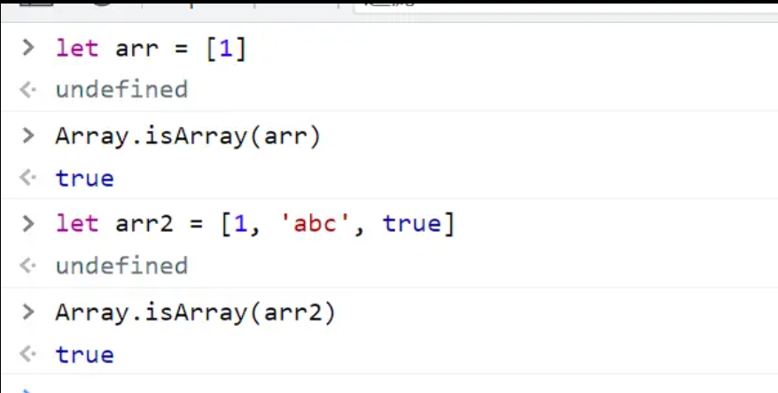

#### 3. 数组自带的map,find等，把知道的遍历数组的方法都列举一下
- foreach
	- https://juejin.cn/post/6957604908052938783
- for...in/for...of
	- for...in...会遍历私有属性、原型属性 for...of...走的是Symbol.Interator接口，数组本身自带
- map
	- 和forEach类似
	- 相同：不改变原数组
	- 区别：map会返回新数组；forEach无返回值（undifined）
- reduce
	- 回调函数第一次执行时， x 和y的取值有两种情况： 如果调用reduce()时提供了initialValue，x取值为initialValue，y取数组中的第一个值； 如果没有提供 initialValue，那么x取数组中的第一个值，y取数组中的第二个值。
- filter
	- 过滤
- every/some
	- some方法：对数组的每一项运行回调函数，有一项返回true，就返回true
	- every方法：对数组的每一项运行回调函数，每一项都返回true，才返回true
- find/findIndex/includes/indexOf/lastIndexOf
	- find:(返回第一个符合要求的元素值)
	- findIndex:(返回第一个符合要求的元素下标)
	- includes:是否包含，返回true/false
	- indexOf：有则返回第一个符合要求的元素下标，没有则返回-1
	- lastIndexOf：有则返回最后一个符合要求的元素下标，没有则返回-1


#### 4. 这些方法有什么区别
上文介绍
#### 5. var const let 区别
var会将变量提升到最开始声明，但不会赋值

const和let不会提升

##### 暂时性死区
let/const会被先创建出来，但未被绑定值，所以不能用。

好习惯：不要再let/const声明前使用变量，用了就触发暂时性死区。

```js
a = 100;//触发暂时性死区
let a = 20;
```
let声明的变量可以改变，值和类型都可以改变；const声明的常量不可以改变，这意味着，const一旦声明，就必须立即初始化，不能以后再赋值
**数组和对象等复合类型的变量，变量名不指向数据，而是指向数据所在的地址。const只保证变量名指向的地址不变，并不保证该地址的数据不变，所以将一个复合类型的变量声明为常量必须非常小心。**


#### 6. 箭头函数了解吗，和普通函数的区别
- 箭头函数与普通函数相比，缺少了caller，arguments，prototype
- 1. 声明方式不同，匿名函数
	- 声明一个普通函数需要使用关键字function来完成，并且使用function既可以声明成一个具名函数也可以声明成一个匿名函数
	- 声明一个箭头函数则只需要使用箭头就可以，无需使用关键字function，比普通函数声明更简洁。
	- 箭头函数只能声明成匿名函数，但可以通过表达式的方式让箭头函数具名
- 2. this指向不同
	- 首先第一个方面是 **普通函数的 this 指向**：针对于普通函数而言，`this` 指向调用方。
	- 然后是箭头函数：针对于箭头函数而言，不会修改 `this` 指向，即 **this 指向上层作用域中的 this** 
	- 最后是 `call、apply、bind` 这三个 `API`：它们都可以在 **普通函数** 中修改 `this` 指向，`this` 指向它们的第一个参数
- 3. 箭头函数没有原型prototype
- 4. 箭头函数不能当成一个构造函数

```js
function Person(name) {
  // this 指向实例对象
  this.name = name
}
const p = new Person('张三')
console.log(p); // Person {name: '张三'}


const Person2 = (name) => {
  // this 指向 window
  this.name = name
}
const p2 = new Person2('张三')
console.log(p2); // Uncaught TypeError: Person2 is not a constructor
```

- 5. 关于剩余参数： **使用 rest 参数替代 arguments 关键字** 来获取剩余参数


#### 7. promise清楚吗
作用：解决回调地狱
语法上：promise是一个构造函数
简单来说，promise对象用来封装一个异步操作并可以获取其结果
#### 8. 事件循环

#### 9. 深拷贝和浅拷贝区别
浅拷贝：新建一个指针指向该内存地址，修改的是同一个值
深拷贝：复制多一份内存地址，新建一个指针指向新的内存地址，修改的是各自的值
#### 10. 实现深拷贝的方法
拷贝出来的对象不影响原对象

```js
function deepclone(obj){
	//return JSON.parse(JSON.stringify(obj));//function、正则、事件对象等很多东西都不会复制
	if(typeof obj !== "object" || obj == null){
		return obj;
	}
	let res = obj instanceof Array ? [] : ();
	
	for(let key in obj){
		if(obj.hasOwnProperty(key)){
			res[key] = deepClone(obj[key]);//递归调用，清除循环引用
		}
	}
	return res;
}
```
#### 11. json.parse进行深拷贝有使用吗
//return JSON.parse(JSON.stringify(obj));//function、正则、事件对象等很多东西都不会复制
#### 12. 还有什么想问的吗
##### 前后端配比
前端：后端 => 1：1.5
##### 团队技术栈
vue


### 熙牛医疗
#### 自我介绍

#### 开源提交过代码，什么样的项目

#### 对前端的的理解
前端工程师的主要工作就是通过代码方式，增强系统的交互功能 ，同时结合后台开发技术，进行互联网的 Web 和 App 开发，致力于通过技术改善用户体验 。现在前端工程师的工作不仅仅只是网页制作，还有微网站、APP制作、游戏制作等，前端的技术也慢慢的从原来的 HTML+CSS+JavaScript 愈来愈丰富，如 jquery、Vue、React 等。

前端开发工程师在整个项目的开发和交付中扮演相当重要的角色，前端工程师是最贴近用户的程序员，主要负责实现页面交互，优化提升用户体验，如果后端是用来解决系统能不能用的问题，那么前端就用来解决系统好不好用的问题。
后端：业务逻辑
前端：交互
测试：站在用户的角度看问题
#### 为什么还会选择前端
兴趣
回馈相对直观 
跟java对比（做了一个利用pom本地文件内容检索的应用，前台界面是用java的swing来编写的，就是jetbrain的产品用的那个（idea,webstorm那些），虽然不影响使用啦，但看起来真的有点丑🤣）
像做的好看的编译器比如vscode，就是用electron做的，windows qq用electron做的重构版最近也要发布了，有点期待的。
然后就是前端的扩展性很高啊，新技术一直不断出现，，从jquery到react到vue，然后现在在所谓的大前端概念，用node写后台，在国外js的占有率是最高的，，还有最新的bun.js，说是性能是node的四倍以上，还有像之前元年宇宙比较火的时候跟着火的rust语言，反正就是可扩展性比较高。
#### 之前的的经历中遇到比较有挑战的问题

#### 代码协同应该如何去去解决

#### 生活中比较印象深刻的挑战

#### 通过怎么样的方式去调节

#### 学习前端相关的方面怎么学习的

#### 总结过es6和es5之间的区别吗

#### js数据类型

#### null和undefined区别
##### 什么是undefined
- 全局属性 `undefined` 表示原始值 `undefined`。它是一个 `JavaScript` 的原始数据类型。

- 一个没有被赋值的变量是 `undefined` 类型。

- 如果正在执行的变量没有分配值,则该 方法 或者 语句返回`undefined`。请查看下图:

- 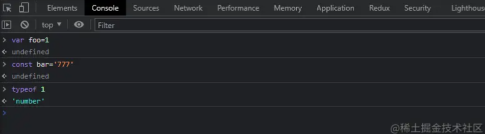

- 在上图中,声明变量返回的是 `undefined`,而 `typeof` 返回的是类型字符串。

- 如果一个函数没有返回值,那么该函数的返回结果是 `undefined`。

- 如果函数定义了有参数,但是没有函数调用参数,那么它也是 `undefined`。

- 为了证明以上的说法,请看下列代码:

```js
  function foo(x, y) {
    console.log(x); // 77
    console.log(y); // undefined
  }
  
  const bar = foo(77);
  console.log(bar); // undefined
```

##### 什么是null
- 值 null 特指对象的值未设置,它是 JavaScript 基本类型之一,在布尔值运算中被认为是 falsy。
- 值 null 是一个字面量,不像 undefined,它不是全局对象的一个属性,指示变量未指向任何对象,把 null 作为尚未创建的对象也许更好理解。从逻辑上讲,null 表示一个空对象指针,这也是给 typeof 传一个 null 会返回 "object"的原因
- 在获取 DOM 元素时,如果没有获取到,返回的是 null,原型链的最顶端也是 null,请看代码:
```js
console.log(document.querySelector("moment")); // null

function foo() {}
console.log(foo.__proto__.__proto__.__proto__); // null
console.log(Object.__proto__.__proto__.__proto__); // null
```

##### 重头戏
- 在 typeof 中分别对 undefined和null进行类型检查,请看以下代码:
```js
console.log(typeof undefined); // undefined
console.log(typeof null); // object
```
- `typeof undefined` 输出 "undefined"估计已经家喻户晓了吧,但是为什么 `typeof null` 输出的 "object",通过查阅资料得知,这是一个历史遗留问题,曾经有有一个 `ECMAScript` 的修复提案,但被拒绝了,这个似乎无法修复,因为它会破坏现有代码(此项目依靠该bug运行...)。
- 在 `JavaScript` 的第一个版本中,值存储在32位的单元中(相当于一条机器码),它由一个小型类型标记(1-3位)和值的实际数据组成。类型标记存储在单元的低位,其中:
	- 000: 对象,数据是对象的引用;
    - 1: 整型,数据是31位带符号的整数;
    - 010: 双精度,数据是双精度浮点数的引用;
    - 100:字符串,数据是字符串;
    - 110: 布尔值,数据是布尔值;
```
在 V8 引擎中,会把 JavaScript 热点代码编译成机器码,它是电脑CPU直接读取运行的机器码，运行速度最快，但是非常晦涩难懂，同时也比较难编写；机器码就是计算机可以直接执行，并且执行速度最快的代码；
```
- 而 `undefined` 和 `null` 是特殊的:
	- undefined:是整数 (-2)^30(超出整数的范围的数字);
	- null: 是机器代码 NULL 指针,或者说是一个对象类型标记加上一个为 0 的引用;
- 好了,绕了这么远,该回来了,还是这个问题,为什么 typeof null 返回的是 "object",这下子应该就很好理解了吧。
- 因为对象的类型标签是 0,由于 `null` 代表的是 空指针,在 `JavaScript` 中没有指针的概念,所以 `null` 32位全为 0 来表示。因此,`typeof null` 返回的是 "object"。
- 所以通过上面的总结, null 本质上是 0,请看以下代码示例:
```js
console.log(undefined + 1); // NaN
console.log(null + 1); // 1
```
- `null` 转化为 `number` 类型时,会转换为 0。
- `undefined` 转换为 `number` 类型时,会转换为 `NaN`。
- 那么使用上还有什么样的区别呢?继续上代码:
```js
function foo(x = 77, y = "moment") {
  console.log(x); // 77
  console.log(y); // null
}

foo(undefined, null);

const [x = 1, y = 2] = [undefined, null];
console.log(x); // 1
console.log(y); // null
```

#### 如果用全等判断是什么结果
```js
console.log(undefined == null);//true
console.log(undefined === null);//false
```

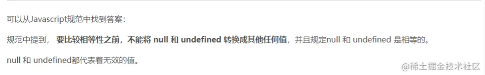

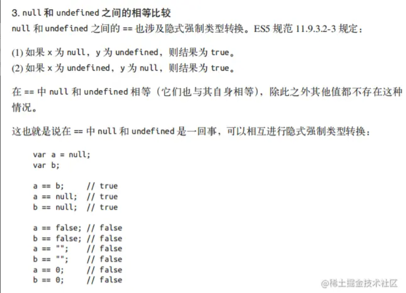

#### 数组的一些操作，假设有一个空的数组，给数组增加一个元素
https://juejin.cn/post/6844904004703485966
array.push() 方法
```js
const names = ['小智']
names.push('前端小智')
names // ["小智", "前端小智"]
```
#### 新增的元素前面再增加一个元素
array.unshift() 方法
```js
const names = ['小智']
names.unshift('前端小智')
names // ["前端小智", "小智"]
```

#### 数组里面有两个元素，在两个元素中间再假如一个元素

#### 数组合并
```js
let a = [1, 2, 3];
let b = [4, 5, 6];
let c = [7, 8, 9];

//1.concat() 合并多个数组，不影响原数组(会造成内存浪费)，不能处理嵌套数组。
const r = a.concat(b); 
console.log(a); // [1, 2, 3]
console.log(b); // [4, 5, 6]
console.log(r); // [1, 2, 3, 4, 5, 6]

//如果 a 数组有10000个元素, b 数组也有有10000个元素, 那么数组r就有20000个元素, 这种方式占用了2倍的内存。a = b = null;就会被垃圾回收机制回收。

//2.基于for循环 - push():没有concat的内存浪费，看上去土而且不好维护, 只能合并两个数组，会改变原数组，不能处理嵌套数组。
// for(let i in b) {
//     a.push(b[i]);
// }
// console.log(a); // [1, 2, 3, 4, 5, 6]
// console.log(b); // [4, 5, 6]

//3.apply:简洁高效，能实现多个数组合并, 会改变原数组, 并且能够实现深度嵌套。
// a.push.apply(a, b);
// console.log(a); // [1, 2, 3, 4, 5, 6]
// console.log(b); // [4, 5, 6]

//更优美的push:多个数组合并, 会改变原数组, 效率比较高
a.push(...b, ...c)
console.log(a); // [1, 2, 3, 4, 5, 6, 7, 8, 9]
console.log(b); // [4, 5, 6]
console.log(c); // [7, 8, 9];
```
**为什么 Array.concat 这么慢？**
合并拥有大小为 10 的数组 10000 次，`.concat` 的速度为 0.40 ops/sec（操作每秒），而 `.push` 的速度是 378 ops/sec。也就是说 `push` 比 `concat` 快了整整 945 倍！这种差异可能不是线性的，但在这种小规模数据量上已经很明显了。

这与它们的运行机制有很大的关系：在合并数组的时候，**`.concat` 创建了一个新的数组**，而 **.push 只是修改了第一个数组**。这些额外的操作（将第一个数组的元素添加到返回的数组里）就是拖慢了 `.concat` 速度的关键。

#### 数组的遍历

#### 对一个对象做属性遍历要怎么操作

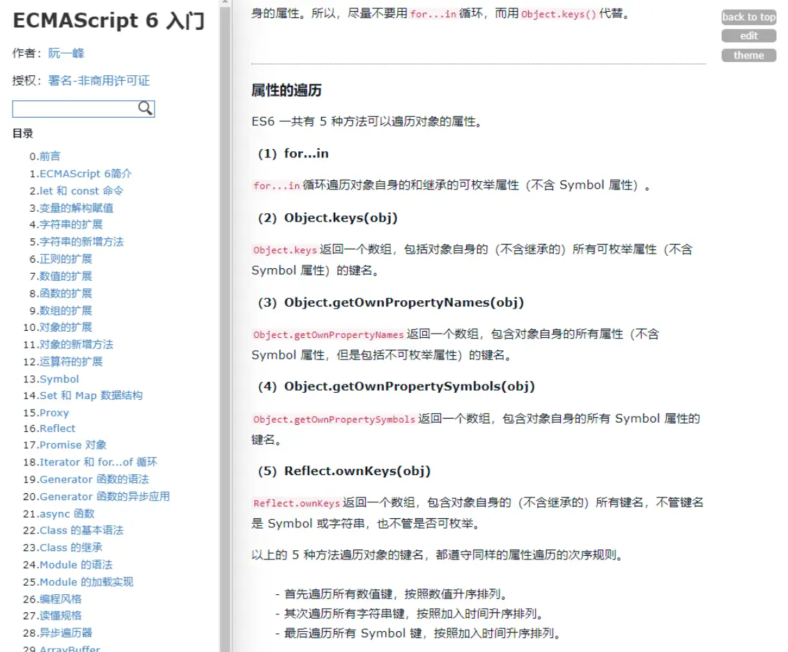

#### 递归应该怎么写

#### 原型链的理解

#### 闭包以及闭包的应用场景

#### css问题，容器的子元素在水平方向和垂直方向同时居中

#### http状态码
##### 状态码分类
- 1xx - 服务器收到请求。
- 2xx - 请求成功，如 200。
- 3xx - 重定向，如 302。
- 4xx - 客户端错误，如 404。
- 5xx - 服务端错误，如 500。

##### 常见状态码
- 200 - 成功。
- 301 - 永久重定向（配合 location，浏览器自动处理）。
- 302 - 临时重定向（配合 location，浏览器自动处理）。
- 304 - 资源未被修改。
- 403 - 没权限。
- 404 - 资源未找到。
- 500 - 服务器错误。
- 504 - 网关超时。


#### promise

#### promise是宏任务还是微任务
微任务，讲事件循环

#### 平时爱好
动漫，关注比较新的科技事件

#### 最近比较关注的科技事件


### 同花顺
#### 自我介绍
#### 项目介绍
#### 项目难点
#### vue的生命周期
#### vue自带函数
#### vue 的set
#### 数组有哪些操作
#### vue nexttick
#### promise
#### 希望加入什么样的团队
#### 自己的优势
#### es6印象最深的是
#### foreach和map的区别

map

- 和forEach类似
- 相同：不改变原数组
- 区别：map会返回新数组；forEach无返回值（undifined）

### 棕喜文化
#### jq和vue的区别
1. jQuery首先要获取到dom对象，然后对dom对象进行进行值的修改等操作 
2. Vue是首先把值和js对象进行绑定，然后修改js对象的值，Vue框架就会自动把dom的值就行更新。 
3. 可以简单的理解为Vue帮我们做了dom操作，我们以后用Vue就需要修改对象的值和做好元素和对 象的绑定，Vue这个框架就会自动帮我们做好dom的相关操作 
4. 这种dom元素跟随JS对象值的变化而变化叫做单向数据绑定，如果JS对象的值也跟随着dom元素的 值的变化而变化就叫做双向数据绑定


### 阿里电话面+笔试
#### 拍平数组
```js
const arr = [1,2,[3,4]];
console.log(arr.flat());//[1,2,3,4]

function flat(arr){
	const hasDeep = arr.some((item) => item instanceof Array);
	if(!hasDeep){
		return arr;
	}

	//return Array.prototype.concat.apply([],arr);//打散 参数[] 1 2 [3,4]，但是只能处理嵌套一层的情况
	
	const res = Array.prototype.concat.apply([],arr);
	return flat(res);//递归
}

function flat(arr){
	while(arr.some((item) => item instanceof Array)){
		arr = Array.prototype.concat.apply([],arr);
	}
	
	return arr;
}

let arr = [[0, 1], [2, 3], [4,[5,6,7]]]
const flat2 = function(arr){
   return arr.reduce((pre,cur)=>pre.concat(Array.isArray(cur)?flat2(cur):cur),[])
}
console.log(newArr(arr)); //[0, 1, 2, 3, 4, 5, 6, 7]
```

#### tree中找到对应name
```js
var tree = {
	id: 1,
	name: "中国",
	children: [
		{
			id: 2,
			name: "浙江",
			children:[
				{
					id: 3,
					name: '宁波'
				},
				{
					id: 5,
					name: '杭州',
					children: [
						{
							id: 6,
							name: '余杭区'
						}
					]
				},
			]
		},
		{
			id: 4,
			name: "北京"
		}
	]
}

function getTreeIdByName(tree, name) {
    // 检查当前节点的名称是否匹配
    if (tree.name === name) {
      return tree.id;
    }
    
    // 递归查找子节点
    for (let child of tree.children || []) {
      let result = getTreeIdByName(child, name);
      if (result !== null) {
        return result;
      }
    }
    
    // 没有找到对应名称
    return null;
}

var result = getTreeIdByName(tree，'余杭区');
console.log(result); // 6
```